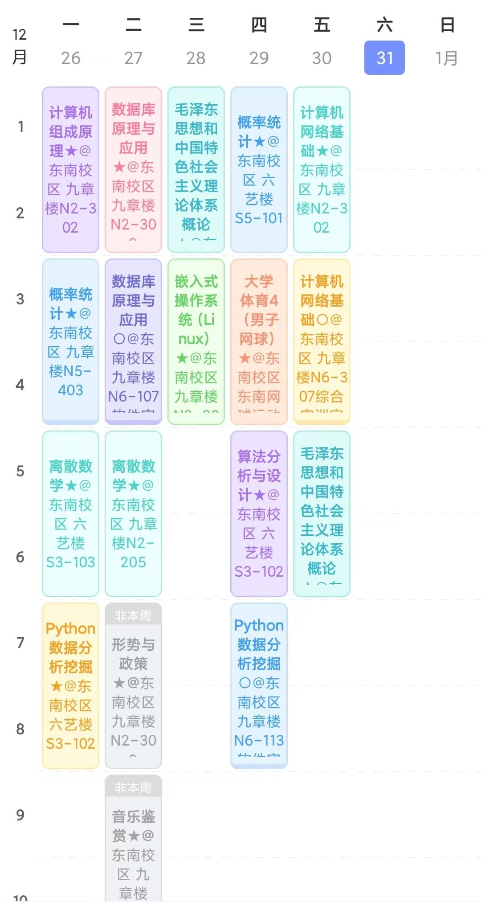

## 关于学习

2022年结束，还有一年半大学生活就要结束了。感觉时间过的很快，特别快。

上半年因为疫情是在加上的网课，大二下学期的课程是满的。如图：

主要课程是计网，计组，数据库，离散，概率，算法，Linux和python。全是比较重要的课程，以至于上完课有很多很多作业。
不过上半年还是做了挺多事情的。

首先是在一月底买了腾讯云的服务器，买了三年（2025年1月29号到期，222块钱），以及8块钱一年的域名 rxyl.xyz。域名快到期了。
是为了给大创项目做网站，当然，后来项目不出意外的黄了，服务器的钱也没有报销。
不过服务器还是蛮好玩的，主要是有个公网ip，很方便。
在上面搭过各种环境，运行过网站，rabbitmq，nginx等等，作为学习来用确实不错。
也搭过qq机器人，minecraft服务器，效果不错。

虽然这个项目黄了。但下半年又加了一个新的大创项目（希望不要再黄了）
前端还是那个人！后端还是我！

在三月多在github搭了现在用的博客，体验还算不错。
当初搭的时候，一个人摸索了快一个星期，butterfly主题折腾了好久，最后还是换掉了（emmmm，或许是有意义的吧

后面又折腾了一段时间qq机器人，用的nonebot框架（基于python的），而我的python又不是很好，所以只弄了些基础的功能。
最后python作业交的也是这个，然而只得了84分。

差点忘了暑假在干嘛，还好博客笔记都有记录。学了挺多，也忘得挺快。
下半年大三，一开始准备学学算法，发现还是太高估自己了。最后也算是中途搁置了。
后来去看了设计原则，是真的多。也只是草草地了解了下，想深入使用估计很难，得写过很多代码才可以吧。
后来还加了一个音游的开发组，算是为爱发电，不过被前端嫌弃菜了。不过慢慢完善吧，后面也打算学学前端。
看了去年的年终总结，还参加了蓝桥杯，是个最拉跨的省三。

## 关于兼职

下半年开学初，在学校打印店找了份兼职。10块一小时，明年再去就是12块一小时了。
认识了蛮多有趣的人，都很热爱生活吧。偶尔一起打打球，为此我还买了个羽毛球拍。
总共赚了1500左右，买了个850的屏幕，现在看起来买的是有点仓促了。

明年上半年，只有两门课。会有大把的空闲时间，应该是给我们考研考公复习准备的。
所以我打算去找个实习啥的，一周七天五天有空，应该可以找到吧。
其次就是vue，把前端学学，没有ui的网站真是太丑陋了。

## 其他

今年也算是很魔幻的一年，因为疫情吧。
今年很感谢[墨夏姐姐](https://www.sszsj.cc/)，很高兴能在去年的年末认识他。
也很高兴遇见打印店认识的朋友，算是我在大学里为数不多的社交了。

没啥其他的了，再见，2022。以后争取每年都有总结。
好像有点乱，不过无所谓了。

