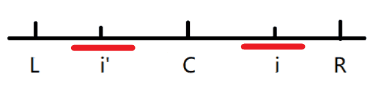

## 字符串匹配（模式匹配）

问题：
给定一个主串（以 S 代替）和模式串（以 P 代替），要求找出 P 在 S 中出现的位置，此即串的模式匹配问题。

### 暴力匹配（BF）

暴力匹配即将主串每个元素都作为起点和模式串相比较，直至后续与模式串全部匹配则成功找到。

~~~java
public class BF {
    /**
     * 暴力算法（Brute Force）
     */
    public static int BF(String S, String P) {
        char[] s = S.toCharArray();
        char[] p = P.toCharArray();
        // 遍历主串所有元素，从每个元素作为起点和模式串比较
        for (int i = 0; i < S.length(); i++) {
            int j;
            int temp = i;
            // 从当前i作为起点比较，不等则break，相等则判断下一个。直至判断长度与模式串长度相等。即匹配成功
            for (j = 0; j < P.length(); j++) {
                if (s[temp] != p[j]) {
                    break;
                }
                temp++;
            }
            if (j == P.length()) {
                return i;
            }
        }
        return -1;
    }
}
~~~

### KMP

KMP算法是一种改进的字符串匹配算法。
从暴力算法中可以看出，每次匹配失败时，都会从主串的下一个字符重新开始与模式串一一比较。即每次失败，模式串只右移了一位。
KMP算法的关键是**利用匹配失败后的信息，尽量减少模式串与主串的匹配次数以达到快速匹配的目的。** 即让模式串尽可能多的向右移。

匹配失败后，模式串该向右移多少位。将会记录在next数组中，**next数组只与模式串本身有关，与主串无关**。
下面来解释下next数组的含义以及求法。

匹配失败时，主串与模式串失败位置的字符不同，但是模式串这个字符前所有字符与主串这个字符前的字符串是匹配的。
如果模式串匹配失败字符串前的字串中，有与开头n个字符长度重复的公共元素。那么下一次比较从重复的地方开始即可。无需从模式串的起始开始，从而减少比较次数。
比如：
~~~text
主串：      abcdabcdabd
模式串：    abcdabd
~~~
当匹配到第七个元素时，主串c与模式串d不等。但d前有长度为2的重复公共元素（与开头开始的元素有2长度的重合）：ab
所以可以将模式串向右移4位，即使**得从头开始的重复子串后一个元素与匹配失败的元素比较。** 因为前面的元素是匹配过的重复元素。
~~~text
主串：      abcdabcdabd
模式串：        abcdabd
~~~

这个重复的公共元素长度叫 最大前缀后缀公共元素长度
对于字符串 abcdabd 来说。它的各个子串的前缀后缀的公共元素的最大长度如下表格所示：

| 字符           | a   | b   | c   | d   | a   | b   | d   |
|--------------|-----|-----|-----|-----|-----|-----|-----|
| 最大前缀后缀公共元素长度 | 0   | 0   | 0   | 0   | 1   | 2   | 0   |

next数组考虑的是除了当前字符串外的最长相同前缀后缀，所以去除当前字符，只看他前面的。
将上表得到的值整体往后移一位即可。
同时，模式串首位初值赋为-1。原因是标记开头，当开头不匹配时，模式串右移一位，而不是回到0位置，导致陷入循环。
字符串 abcdabd 的 next 数组：

| 字符           | a   | b   | c   | d   | a   | b   | d   |
|--------------|-----|-----|-----|-----|-----|-----|-----|
| 最大前缀后缀公共元素长度 | -1  | 0   | 0   | 0   | 0   | 1   | 2   |

next数组的实现：
~~~java
package PatternMatching;

public class KMP {
    public static int[] getNext(String P) {
        char[] p = P.toCharArray();
        int[] next = new int[P.length()];
        // 起始位置为-1
        next[0] = -1;
        int j = 0;
        int k = -1;
        while (j < p.length - 1) {
            // p[k]表示前缀，p[j]表示后缀
            if (k == -1 || p[k] == p[j]) {
                next[++j] = ++k;
            } else {
                // 不匹配，前缀则回到上一个最大重复的位置（next数组构造本身就用到了next数组的特性）
                k = next[k];
            }
        }
        return next;
    }
}
~~~

KMP中else部分，与求next数组中的else部分是一样的。
KMP实现：
~~~java
package PatternMatching;

public class KMP {
    public static int KMP(String S, String P) {
        char[] s = S.toCharArray();
        char[] p = P.toCharArray();
        int i = 0;
        int j = 0;
        int[] next = getNext(P);
        while (i < s.length && j < p.length) {
            if (j == -1 || s[i] == p[j]) {
                i++;
                j++;
            } else {
                j = next[j];
            }
        }
        return j == p.length ? i - j : -1;
    }
}
~~~

## 求字符串的最长回文子串

### 暴力（BF）

照例先暴力实现
时间复杂度 O(n^2)

~~~java
package LongestPalindromicSubstring;

public class BF {
    public static int BF(String str) {
        char[] string = str.toCharArray();
        int result = 0;
        for (int i = 0; i < str.length(); i++) {
            // 判断奇数长度回文
            int l = i - 1;
            int r = i + 1;
            while (l >= 0 && r < str.length() && string[l] == string[r]) {
                l--;
                r++;
            }
            result = Math.max(result, r - l - 1);
            // 判断偶数长度回文
            l = i;
            r = i + 1;
            while (l >= 0 && r < str.length() && string[l] == string[r]) {
                l--;
                r++;
            }
            result = Math.max(result, r - l - 1);
        }
        return result;
    }
}
~~~

### Manacher算法

Manacher算法，也叫马拉车算法 ~~（翻译的信达雅呢）~~
这个算法用于求字符串的最长回文子串。时间复杂度到了 O(n)

Manacher的核心就是回文半径的概念。
由于回文串的奇偶不一样，处理也不同。所以在处理之前，在每个字符前后添加一个相同字符。这样左右的回文串都会变成奇回文串。
比如 abba 通过处理变成 #a#b#b#a#

回文半径和回文直径：因为处理后回文字符串的长度一定是奇数，所以回文半径是包括回文中心在内的回文子串的一半的长度，回文直径则是回文半径的2倍减1。比如对于字符串 "aba"，在字符 'b' 处的回文半径就是2，回文直径就是3。
最右回文边界R：在遍历字符串时，每个字符遍历出的最长回文子串都会有个右边界，而R则是所有已知右边界中最靠右的位置，也就是说R的值是只增不减的。
回文中心C：取得当前R的第一次更新时的回文中心。由此可见R和C时伴生的。
半径数组：这个数组记录了原字符串中每一个字符对应的最长回文半径。

过程：从i=0遍历字符串
1. 当i>R 即i在R外，那直接暴力匹配以i为中心的回文子串
2. 当i<=R 即i在R内。分为
   1. i'的回文半径在R-L内，那么i的回文半径也和i'相同
   
   2. i'的回文半径在R-L上，i的回文半径和i'相同，但后面还要继续比较，i的回文半径可能会变大。
   3. i'的回文半径在R-L外，和上面一样，也需要往后比。(图就不放了，可以参考上面的图，但红线得划到L和R外)

Manacher算法实际是利用了回文的特性，即**回文中的回文不需要再重复比较**，由回文的特性可以跳过已经比较过的（即跳过半径数组中的长度）

Manacher实现：
~~~java
package LongestPalindromicSubstring;

public class Manacher {
    public static int Manacher(String str) {
        int len = str.length() * 2 + 1;
        char[] string = new char[len];
        char[] str1 = str.toCharArray();
        int index = 0;
        // 将字符串中添加特殊字符，让字符串只有奇回文
        for (int i = 0; i < len; i++) {
            string[i] = (i % 2) == 0 ? '#' : str1[index++];
        }
        // 记录回文半径的数组
        int[] p = new int[len];
        // r最右回文右边界，c对应的最左回文中心，maxn最大回文半径
        int r = -1;
        int c = -1;
        int maxn = Integer.MIN_VALUE;
        // 从左往右遍历
        for (int i = 0; i < len; i++) {
            // i>r 时，回文半径为1，否则回文半径就是 i对应i‘的回文半径 或者 i到r的距离
            p[i] = r > i ? Math.min(r - i, p[2 * c - i]) : 1;
            while (i + p[i] < len && i - p[i] > -1) {
                if (string[i + p[i]] == string[i - p[i]]) {
                    p[i]++;
                } else {
                    break;
                }
            }
            // 判断r和c是否可以更新
            if (i + p[i] > r) {
                r = i + p[i];
                c = i;
            }
            // 更新最大回文半径
            maxn = Math.max(maxn, p[i]);
        }
        return maxn - 1;
    }
}
~~~

## 总结

参考文章：

[字符串匹配KMP算法详解](https://www.cnblogs.com/zhangboy/p/7635627.html)
[四种最常见的字符串匹配算法概述](https://www.cnblogs.com/liuyangQAQ/p/12310720.html#:~:text=%E5%9B%9B%E7%A7%8D%E6%9C%80%E5%B8%B8%E8%A7%81%E7%9A%84%E5%AD%97%E7%AC%A6%E4%B8%B2%E5%8C%B9%E9%85%8D%E7%AE%97%E6%B3%95%E6%A6%82%E8%BF%B0%201%20BF%E7%AE%97%E6%B3%95%EF%BC%9A,BF%E7%AE%97%E6%B3%95%EF%BC%8C%E5%8D%B3%E6%9A%B4%E5%8A%9B%28Brute%20Force%29%E7%AE%97%E6%B3%95%EF%BC%8C%E6%98%AF%E6%99%AE%E9%80%9A%E7%9A%84%E6%A8%A1%E5%BC%8F%E5%8C%B9%E9%85%8D%E7%AE%97%E6%B3%95%EF%BC%8CBF%E7%AE%97%E6%B3%95%E7%9A%84%E6%80%9D%E6%83%B3%E5%B0%B1%E6%98%AF%E5%B0%86%E7%9B%AE%E6%A0%87%E4%B8%B2S%E7%9A%84%E7%AC%AC%E4%B8%80%E4%B8%AA%E5%AD%97%E7%AC%A6%E4%B8%8E%E6%A8%A1%E5%BC%8F%E4%B8%B2T%E7%9A%84%E7%AC%AC%E4%B8%80%E4%B8%AA%E5%AD%97%E7%AC%A6%E8%BF%9B%E8%A1%8C%E5%8C%B9%E9%85%8D%EF%BC%8C%E8%8B%A5%E7%9B%B8%E7%AD%89%EF%BC%8C%E5%88%99%E7%BB%A7%E7%BB%AD%E6%AF%94%E8%BE%83S%E7%9A%84%E7%AC%AC%E4%BA%8C%E4%B8%AA%E5%AD%97%E7%AC%A6%E5%92%8C%20T%E7%9A%84%E7%AC%AC%E4%BA%8C%E4%B8%AA%E5%AD%97%E7%AC%A6%EF%BC%9B%E8%8B%A5%E4%B8%8D%E7%9B%B8%E7%AD%89%EF%BC%8C%E5%88%99%E6%AF%94%E8%BE%83S%E7%9A%84%E7%AC%AC%E4%BA%8C%E4%B8%AA%E5%AD%97%E7%AC%A6%E5%92%8CT%E7%9A%84%E7%AC%AC%E4%B8%80%E4%B8%AA%E5%AD%97%E7%AC%A6%EF%BC%8C%E4%BE%9D%E6%AC%A1%E6%AF%94%E8%BE%83%E4%B8%8B%E5%8E%BB%EF%BC%8C%E7%9B%B4%E5%88%B0%E5%BE%97%E5%87%BA%E6%9C%80%E5%90%8E%E7%9A%84%E5%8C%B9%E9%85%8D%E7%BB%93%E6%9E%9C%E3%80%82%20BF%E7%AE%97%E6%B3%95%E6%98%AF%E4%B8%80%E7%A7%8D%E8%9B%AE%E5%8A%9B%E7%AE%97%E6%B3%95%E3%80%82)
[马拉车算法（Manacher's Algorithm）](https://www.jianshu.com/p/392172762e55)
[最长回文子串的五种求法(暴力、中点扩散、DP、hash+二分、Manacher)](https://blog.csdn.net/qq_43851311/article/details/113928303)