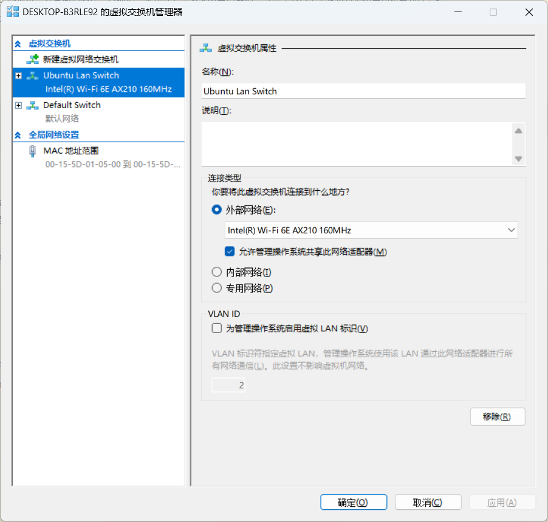
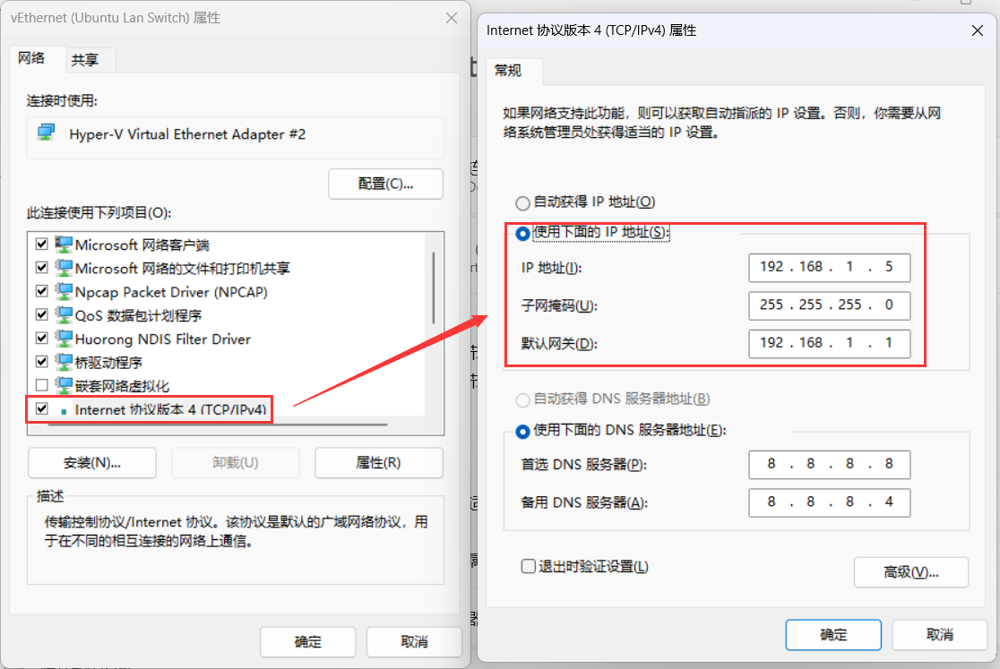

## 基础环境准备（可选）

### 虚拟机配置

基础环境这里选择 multipass 虚拟机。（但只是使用它创建虚拟机）
当然，如果有真实物理机，并且他们网络是直通的，那可以省去很多配置的麻烦。这里大部分关于虚拟机的配置应该都可以省略。
但很可惜，我并没有那么多机器或者云服务器。但好在我的电脑（windows11）内存有64G，足够我随意的折腾。

创建三台虚拟机（一主二从）

~~~shell
multipass launch --name=master --cpus=2 --m=4096MiB -d 20G 24.04
multipass launch --name=worker1 --cpus=2 --m=4096MiB -d 20G 24.04
multipass launch --name=worker2 --cpus=2 --m=4096MiB -d 20G 24.04
~~~

### 基础网络配置（固定ip配置）

这里我需要为每台虚拟机都设置一个固定ip，防止机器重启后ip会发生变化，导致需要频繁改一些配置。**Multipass 默认通过 NAT 网络 + DHCP 动态分配 IP**
将宿主机ip固定为192.168.1.5
master 节点的ip为 192.168.1.10
worker1 节点的ip为 192.168.1.11
worker2 节点的ip为 192.168.1.12

这里以 master 节点为例，展示配置过程。

首先打开**Hyper-V 管理器**，右侧**虚拟交换机管理器**，新建虚拟交换机。如下图：

保存之后，来到**网络适配器**，为刚创建的虚拟交换机设置一个固定的ip。

修改`/etc/netplan/50-cloud-init.yaml`：

~~~yaml
network:
  version: 2
  ethernets:
    eth0:
      dhcp4: no
      addresses: [ 192.168.1.10/24 ]
      routes:
        - to: default
          via: 192.168.1.1
      nameservers:
        addresses: [ 192.168.1.1 ]
~~~

应用更改并验证

~~~shell
# 应用更改
sudo netplan apply
# 应用更改
sudo netplan --debug apply
# 检查 IP 是否生效
ip a show eth0
# 测试网络连通性
ping 192.168.1.1
~~~

输出如下：

~~~shell
ubuntu@master:/etc/netplan$ ip a show eth0
2: eth0: <BROADCAST,MULTICAST,UP,LOWER_UP> mtu 1500 qdisc mq state UP group default qlen 1000
    link/ether 52:54:00:29:3e:e9 brd ff:ff:ff:ff:ff:ff
    inet 192.168.1.10/24 brd 192.168.1.255 scope global eth0
       valid_lft forever preferred_lft forever
    inet6 2409:8a20:2a0:6c60:5054:ff:fe29:3ee9/64 scope global dynamic mngtmpaddr noprefixroute
       valid_lft 198387sec preferred_lft 111987sec
    inet6 fe80::5054:ff:fe29:3ee9/64 scope link
       valid_lft forever preferred_lft forever
ubuntu@master:/etc/netplan$ ping 192.168.1.1
PING 192.168.1.1 (192.168.1.1) 56(84) bytes of data.
64 bytes from 192.168.1.1: icmp_seq=1 ttl=64 time=7.33 ms
64 bytes from 192.168.1.1: icmp_seq=2 ttl=64 time=3.45 ms
64 bytes from 192.168.1.1: icmp_seq=3 ttl=64 time=3.77 ms
64 bytes from 192.168.1.1: icmp_seq=4 ttl=64 time=4.16 ms
^C
--- 192.168.1.1 ping statistics ---
4 packets transmitted, 4 received, 0% packet loss, time 3006ms
rtt min/avg/max/mdev = 3.449/4.675/7.326/1.550 ms
~~~

### 配置ssh登录

这里配置ssh密码登录，以方便外部宿主机连接使用。（因为修改为固定ip后，multipass将无法连接到虚拟机）

设置密码：

~~~shell
sudo passwd ubuntu
~~~

修改`/etc/ssh/sshd_config`配置中的以下内容：

~~~
# 是否允许使用密码登录 SSH
PasswordAuthentication yes
# 是否允许使用公钥认证登录 SSH
PubkeyAuthentication yes
# 是否启用 PAM（Pluggable Authentication Modules，可插拔认证模块）
UsePAM no
~~~

> 注意：是否包含`Include /etc/ssh/sshd_config.d/*.conf`配置
> 它支持包含其他配置文件，从而实现配置的模块化和可维护性。**所有配置会合并，顺序按文件名排序加载，后加载的内容会覆盖前面的设置。**

重启 ssh 服务应用更改后，就可以在宿主机使用配好的固定ip进行ssh登录了：

~~~shell
sudo systemctl restart ssh
~~~

### 配置全局代理

Linux中，设置全系统代理（包括 GUI 图形界面 + CLI），需要修改`/etc/environment`文件；仅为 shell 用户（终端）设置代理，需要修改`/etc/profile`文件；为单用户设置代理，需要修改`~/.bashrc`文件。

`/etc/environment`文件添加：
~~~
http_proxy="http://192.168.1.5:7890"
https_proxy="http://192.168.1.5:7890"
all_proxy="socks5://192.168.1.5:7890"
no_proxy="localhost,127.0.0.1,::1"
~~~

重启应用更改。

`/etc/profile`或者`~/.bashrc`文件添加：
~~~
export http_proxy=http://192.168.1.5:7890
export https_proxy=http://192.168.1.5:7890
export all_proxy=socks5://192.168.1.5:7890
export no_proxy="localhost,127.0.0.1,::1"
~~~

`source /etc/profile`或者`source ~/.bashrc`应用更改。

**取消代理：`unset http_proxy https_proxy all_proxy`**

验证代理是否生效，可以使用`curl -v https://www.google.com`
会返回包含类似`Connected to 192.168.1.5 (192.168.1.5) port 7890`的内容，如下（上述命令返回过长，这里以本地服务为例）：
~~~
ubuntu@master:~$ curl -v http://192.168.1.5:8000/api/user/v1/helloworld/ubuntu
* Uses proxy env variable no_proxy == 'localhost,127.0.0.1,::1'
* Uses proxy env variable http_proxy == 'http://192.168.1.5:7890'
*   Trying 192.168.1.5:7890...
* Connected to 192.168.1.5 (192.168.1.5) port 7890
> GET http://192.168.1.5:8000/api/user/v1/helloworld/ubuntu HTTP/1.1
> Host: 192.168.1.5:8000
> User-Agent: curl/8.5.0
> Accept: */*
> Proxy-Connection: Keep-Alive
>
< HTTP/1.1 200 OK
< Content-Length: 26
< Connection: keep-alive
< Content-Type: application/json
< Date: Wed, 23 Apr 2025 15:34:03 GMT
< Keep-Alive: timeout=4
< Proxy-Connection: keep-alive
<
* Connection #0 to host 192.168.1.5 left intact
{"message":"Hello ubuntu"}
~~~

