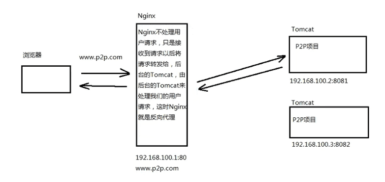

## 关于Nginx

Nginx是一个轻量的web服务器/反向代理服务器/电子邮件代理服务器，占用内存少，并发能力强。  
nginx是由c语言开发的。  

### 反向代理

反向代理（Reverse Proxy）方式是指以代理服务器来接受internet上的连接请求，然后将请求转发给内部网络上的服务器，并将从服务器上得到的结果返回给internet上请求连接的客户端，此时代理服务器对外就表现为一个反向代理服务器。  
  

反向代理隐藏了真正的服务端。

### 正向代理

是一个位于客户端和原始服务器(origin server)之间的服务器，为了从原始服务器取得内容，客户端向代理发送一个请求并指定目标(原始服务器)，然后代理向原始服务器转交请求并将获得的内容返回给客户端。客户端才能使用正向代理。  
比如vpn。  

## 环境搭建

### 安装

[nginx官网](http://nginx.org/)  
nginx安装需要相关的依赖库，否则配置和编译会出现错误。  
gcc编译器、openssl库、pcre库、zlib库  
一次安装命令：
`yum install gcc openssl-devel pcre pcre-devel zlib zlib-devel -y`

然后解压缩官网下载的nginx压缩包。  
配置安装目录
`./configure --prefix=/安装目录`
编译
`make`
安装
`make install`

### 普通启动

运行sbin目录下的nginx文件  
`./nginx`
nginx由master进程和worker进程组成。  
master进程读取配置文件，并维护worker进程，而worker进程则对请求进行实际处理。

启动成功后，访问80端口便会出现如下欢迎页面：

### 通过配置文件启动

-c 参数指定配置文件绝对路径
`./nginx -c nginx.conf配置文件绝对路径`

### 关闭

1. 优雅的关闭
找出进程号，执行下面的命令
`kill -QUIT 主pid`
pid是主进程号，即master process。其他worker process为子进程。  
这种关闭方式会使nginx不再接受新的请求，等待nginx处理完请求后再关闭。

2. 快速关闭
`kill -TERM 主pid`
直接关闭，比较暴力。  
或者直接kill。  

### 重启

一般用于修改配置，重启服务器。 
`./nginx -s reload`

### 其他

在启动命令后加 -t 会检查配置文件是否正确  
successful是正确，failed是失败。  
只能检查语法错误~~（废话）~~  

查看版本
~~~shell
# 查看nginx版本。
./nginx -v
# 查看nginx版本、编译器版本和配置参数
./nginx -V
~~~

## 配置文件

~~~conf
#配置worker进程运行用户，默认用户为nobody。nobody用户一般用于启动程序，没有密码。  
#user nobody;  
#配置工作进程数量，通常等于cpu数量或2倍于cpu数量。  
worker_processes 1;  
#配置全局错误日志及类型，[debug | info | notice | warn | error | crit]，默认为error。  
error_log logs/error.log;  
#error_log logs/error.log info;
#配置进程pid文件，记录pid号，每次启动都会更新。  
pid logs/nginx.pid  

#配置工作模式和连接数  
events{
    worker_connections 1024;  ##配置每个worker进程连接上限，上限65535。nginx支持总连接数等于 worker_connection * worker_processes
}

#配置http服务器，利用反向代理功能提供负载均衡支持  
http{
    #配置nginx支持哪些多媒体类型，可以在conf/mime.types查看支持哪些多媒体类型  
    include mime.types  
    #默认文件类型 流类型，可以理解支持任意类型  
    default_type application/octet-stream  
    #配置日志格式  
    #log_format  main  '$remote_addr - $remote_user [$time_local] "$request" '  
    #                  '$status $body_bytes_sent "$http_referer" '  
    #                  '"$http_user_agent" "$http_x_forwarded_for"';  
    #配置access.log日志及存放路径，并使用上面定义的main日志格式  
    #access_log  logs/access.log  main;  
    #开启高效文件传输模式  
    sendfile     on;    
    #防止网络阻塞  
    #tcp_nopush   on;  
    #长连接超时时间，单位秒
    #keepalive_timeout  0;
    keepalive_timeout  65;
    #开启gzip压缩输出
    #gzip  on;
    
    #配置虚拟主机，可以有多个server
    server{    
        #配置监听端口
        listen       80;
        #配置服务名
        server_name  localhost;
        #配置字符集
        #charset koi8-r;
        #配置本虚拟主机的访问日志
        #access_log  logs/host.access.log  main;
        #默认的匹配斜杠/（根路径）的请求，当访问路径中有/，会被该location匹配到并进行处理
        location / {
            #root是配置服务器的默认网站根目录的位置，默认为nginx安装目录下的html目录
            root   html;
            #配置首页文件的名称
            index  index.html index.htm;
        }
        
        #配置404页面
        #error_page  404              /404.html;
        
        #配置50x错误页面
        error_page   500 502 503 504  /50x.html;
        location = /50x.html {
            root   html;
        }

        #精确匹配，拦截各种请求。
        # proxy the PHP scripts to Apache listening on 127.0.0.1:80
        #
        #location ~ \.php$ {
        #    proxy_pass   http://127.0.0.1;
        #}

        # pass the PHP scripts to FastCGI server listening on 127.0.0.1:9000
        #
        #location ~ \.php$ {
        #    root           html;
        #    fastcgi_pass   127.0.0.1:9000;
        #    fastcgi_index  index.php;
        #    fastcgi_param  SCRIPT_FILENAME  /scripts$fastcgi_script_name;
        #    include        fastcgi_params;
        #}

        # deny access to .htaccess files, if Apache's document root
        # concurs with nginx's one
        #
        #location ~ /\.ht {
        #    deny  all;
        #}
    }
}
~~~

## 静态网站部署

修改配置文件  
~~~
location /项目名（请求根路径） {
    root  /项目根路径
    index index.html
}
~~~
重启nginx即可访问。  
> index.html 磁盘存放路径为 /项目根路径/项目名/index.html
> 访问的url为 ip:port/项目名/index.html

## 负载均衡

负载均衡通常指将请求均匀地分摊到集群的多个服务器节点上执行，这里均匀指在比较大的统计范围内是基本均匀的，并不是完全均匀的。  

### 硬件负载均衡

比如 F5、深信服、Array 等  
优点是有厂商专业技术团队提供支持，性能稳定。  
缺点是费用昂贵。  

### 软件负载均衡

比如 Nginx、LVS、HAProxy 等  
优点是开源免费，成本低。  

### nginx负载均衡

示例：www.example.com  
修改配置文件  
server中添加
~~~conf
location / {
    proxy_pass http://www.example.com;
}
~~~
server上添加
~~~conf
upstream www.example.com {
    server 127.0.0.1:8081
    server 127.0.0.1:8082
}
~~~

### nginx负载均衡策略

1. 轮询（默认）  
每个请求会按时间顺序逐一分配到不同的后端服务器。如果服务器down掉了，会自动剔除。一般后端服务器性能接近。
2. 权重  
通过权重值分发请求，值越大访问的比例越大，用于后端服务器性能不均的情况。  
参数 `weight=1`
3. 最少连接
请求会被转发到链接数最少的服务器上。  
在upstream中添加 `least conn;`
4. ip_hash
ip_hash也叫ip绑定，每个请求按访问ip的hash值分配，这样每个访问客户端会固定访问一个后端服务器，**可以解决session会话丢失的问题**。  
在upstream中添加 `ip hash;`

其他配置  
1. 参数 `backup` 标记该服务器为备用服务器。当主服务器停止时，请求会被转发到这里。  
2. 参数 `down` 标记该服务器停机。

## 静态代理

将所有静态资源访问改为访问nginx，而不是tomcat。因为nginx更擅长静态资源的处理，性能更好，效率更高。  

在配置文件中，配置静态资源所在目录
~~~conf
location ~.*/(css|js|img|images){
    root /web/static;
}
~~~

> 正则匹配目录，比匹配后缀会好一些。

