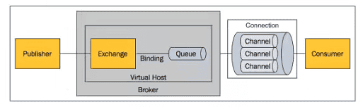

## 概述

### 什么是消息队列

消息（message）是指在应用之间传送的数据。可以是简单的纯文本字符串，也可以很复杂，包含嵌入对象。

消息队列（message queue）是一种应用间的通信方式，消息发送后立即返回，由消息系统来确保可靠传递。消息发布者只管把消息发布到MQ中而不管谁来取，消息使用者只管从MQ中取消息而不管谁发布。这样发布者和使用者都不需要知道对方的存在。

### 为什么使用消息队列

消息队列是一种应用之间的**异步协作机制**。

例如驿站收发快递。快递员并不需要知道收件人的具体信息，只用送到对应驿站即可；收件人也并需要不知道快递员具体信息，只需到驿站取即可。
但传统收发快递，快递员得等收件人接收后，再去送下一个快递。导致效率的降低。
再例如订单系统。下单后的逻辑可能包括：扣减库存、生成订单信息、发送短信通知、发红包。最开始这些逻辑是放在一起同步执行。但为了提高服务效率，有些不需要立即生效的操作可以拆分出来异步执行，如发短信通知、发红包等。
这种场景可以使用MQ，在主流程（扣减库存、生成订单）执行完毕后发送一条消息到MQ，由另外的线程拉取MQ的消息（或由MQ推送），执行相应的业务逻辑。

以上是用于业务解耦的情况，其他常见场景包括最终一致性、广播、错峰控流等。

### RabbitMQ特点

RabbitMQ是由Erlang语言开发的AMQP的开源实现。
AMQP（Advanced Message Queuing Protocol）：高级消息队列协议。是应用层协议的一个开放标准，为面向消息的中间件设计。基于此协议的客户端与消息中间件可传递消息，并不受客户端/中间件不同产品，不同的开发语言等条件的限制。
RabbitMQ最初起源于金融系统，用于在分布式系统中存储转发消息。在易用性、扩展性、高可用性等方面表现都不错。
特点：
1. 可靠性（Reliability）
使用持久化、传输确认、发布确认等机制来保证可靠性。
2. 灵活的路由（Flexible Routing）
在消息进入队列之前，通过Exchange来路由消息。对于典型的路由功能，RabbitMQ提供了一些内置的Exchange实现。对于复杂的路由功能，可以将多个Exchange绑定在一起，也可以通过插件机制实现自己的Exchange。
3. 消息集群（Clustering）
多个RabbitMQ服务器可以组成一个集群，形成一个逻辑Broker。
4. 高可用（Highly Availability Queues）
队列可以在集群中的机器上进行镜像，防止单点故障。
5. 多种协议（Multi-protocol）
RabbitMQ支持多种消息队列协议，如 STOMP、MQTT等。
6. 多语言客户端（Many Clients）
RabbitMQ支持很多常用语言，如Java、.net、Ruby等。
7. 管理界面（Management UI）
RabbitMQ提供了一个易用的用户界面，使用户可以监控和管理消息Broker的许多方面。
8. 跟踪机制（Tracing）
如果消息异常，RabbitMQ提供了消息跟踪机制，使用者可以赵卒发生了什么。

## RabbitMQ安装

### 安装

[RabbitMQ官网](https://www.rabbitmq.com/)
[Erlang官网](https://www.erlang.org/)
[Erlang和RabbitMQ版本对照](https://www.rabbitmq.com/which-erlang.html)

依赖包安装 `yum install gcc glibc-devel make ncurses-devel openssl-devel xmlto -y`
解压erlang源码包 `tar -zxvf otp_src_25.0.4.tar.gz`
创建erlang的安装目录 `mkdir /usr/local/erlang`
进入erlang的解压目录 `cd otp_src_25.0.4`
配置erlang的安装信息 `./configure --prefix=/usr/local/erlang --without-javac`
编译安装 `make && make install`
配置环境变量 `vim /etc/profile`
添加如下内容：
~~~
ERL_HOME=/usr/local/erlang
PATH=$ERL_HOME/bin:$PATH
export ERL_HOME PATH
~~~
更新环境变量 `source /etc/profile`
查看erlang版本 `erl -version`

如上图，即为安装成功。然后开始安装RabbitMQ。

安装RabbitMQ `rpm -ivh --nodeps rabbitmq-server-3.10.7-1.el8.noarch.rpm`

### RabbitMQ常用命令

#### 启动与关闭

启动 `rabbitmq-server start`
> 可能会出现错误，错误原因是/var/lib/rabbitmq/.erlang.cookie文件权限不够
> 解决方案：`chmod rabbitmq:rabbitmq/var.lib.rabbitmq/.erlang.cookie` `chmod 400 /var/lib/rabbitmq/.erlang.cookie`

停止服务 `rabbitmqctl stop`

#### 插件管理

添加插件 `rabbitmq-plugins enable {插件名}`
> RabbitMQ启动后可以使用浏览器进入管控台，但默认情况RabbitMQ不允许直接使用浏览器访问。默认访问端口 15672
> 因此需要添加插件 `rabbitmq-plugins enable rabbitmq_management`

删除插件 `rabbitmq-plugins disable {插件名}`

#### 用户管理

浏览器访问管控台：

默认用户密码均为 guest
但只能本机登录，否则报错`User can only log in via localhost`

添加用户 `rabbitmqctl add_user {username} {password}`
删除用户 `rabbitmqctl delete_user {username}`
修改密码 `rabbitmqctl change_password {username} {newpassword}`
设置用户角色 `rabbitmqctl set_user_tags {username} {tag}`

tag参数表示用户角色取值为：management、monitoring、policymaker、administrator
角色详解：

management：用户可以通过AMQP做的任何事外加
1. 列出自己可以通过AMQP登入的 virtual hosts
2. 查看自己的 virtual hosts 中的 queues、exchanges 和 bindings
3. 查看和关闭自己的 channels 和 connections
4. 查看有关自己的 virtual hosts 的“全局”的统计信息，包含其他用户在这些 virtual hosts 中的活动

policymaker：management 可以做的任何事外加
1. 查看、创建和删除自己的 virtual hosts 所属的 policies 和 parameters

monitoring：management 可以做的任何事外加
1. 列出所有的 virtual hosts ，包括他们不能登录的 virtual hosts
2. 查看其他用户的 connections 和 channels
3. 查看节点级别的数据如 clustering 和 memory 使用情况
4. 查看真正的关于所有 virtual hosts 的全局统计信息

administrator：policymaker 和 monitoring 可以做的任何事外加
1. 创建和删除 virtual hosts
2. 查看、创建和删除 users
3. 查看、创建和删除 permissions
4. 关闭其他用户的 connections

#### 权限管理

授权命令 `rabbitmqctl set permissions [-p vhostpath] {user} {conf} {write} {read}`
-p vhostpath:用于指定一个资源的命名空间，例如 -p / 表示根路径命名空间
user：用于指定要为哪个用户授权填写用户名
conf：一个正则表达式match 哪些配置资源能被该用户配置
write：一个正则表达式match 哪些配置资源能被该用户写
read：一个正则表达式match 哪些配置资源能被该用户读

查看指定命名空间下的用户权限 `rabbitmqctl list permissions [vhostpath]`

查看指定用户下的权限 `rabbitmqctl list user_permissions {username}`

#### vhost管理

vhost是RabbitMQ中的一个命名空间，可以限制消息存放位置，利用这个命名空间进行权限的控制。类似windows文件夹，在不同文件夹存放不同文件。

添加vhost `rabbitmqctl add vhost temp`
删除vhost `rabbitmqctl delete vhost {name}`

## 消息的发送和接收

### 消息发送和接收机制

所有的mq产品从模型抽象上来说都是一样的过程：
消费者订阅某个队列。生产者创建消息，然后发布到队列中，最后将消息发送到监听的消费者。

1. Message：
消息，消息是不具体的，它由消息头和消息体组成。消息体是不透明的，而消息头则由一系列可选属性组成，这些属性包括 routing-key （路由键）、 priority （相对于其他消息的优先权）、 delivery-mode （指出该消息可能需要持久性存储）等。
2. Publisher：
消息的生产者，也是一个向交换器发布消息的客户端程序。
3. Exchange：
交换机，用来接收生产者发送的消息并将这些消息路由给服务器中的队列。
4. Binging：
绑定，用于消息队列和交换器之间的关联。一个绑定就是基于路由键将交换器和消息队列连接起来的路由规则，所以可以将交换器理解成一个由绑定构成的路由表。
5. Queue：
消息队列，用来保存消息直到发送给消费者。他是消息的容器，也是消息的终点。一个消息可以投入一个或多个队列。消息一直在队列里面，等待消费者连接到这个队列将其取走。
6. Connection：
网络连接，比如一个TCP连接。
7. Channel：
信道，多路复用连接中的一条独立的双向数据流通道。信道是建立在真实的TCP连接内的虚拟连接，AMQP命令都是通过信道发送出去的，不管是发布消息、订阅队列还是接收消息，都是通过信道完成的。因为对于操作系统来说，建立和销毁TCP连接开销较大，所以引入信道的概念，以复用一条TCP连接。
8. Consumer：
信息的消费者，表示一个从消息队列中取得消息的客户端应用程序。
9. Virtual Host：
虚拟主机，表示一批交换器、消息队列和相关对象。虚拟主机是共享相同的身份认证和加密环境的独立服务器域。每个vhost本质是一个缩小版的RabbitMQ服务器，有自己的队列、交换器、绑定和权限机制。vhost是AMQP概念的基础，必须在连接时指定，RabbitMQ默认的vhost是/。
10. Broker：
表示消息队列服务器实体。

### AMQP中的消息路由

生产者将消息发布到Exchange上，消息最终到达队列并被消费者接收，而binding决定交换器的消息应该发送到哪个队列。

### Exchange类型

Exchange分发消息时根据类型的不同分发策略有区别，有四种类型：direct、fanout、topic、headers。
headers 匹配AMQP消息的 header 而不是路由键，此外 headers 交换器和 direct 交换器完全一致，但性能差很多。几乎用不到了。

1. direct
消息中的路由键如果和 Binding 中的 binding key 一致，交换器就将消息发送到对应的队列中。路由键与队列名完全一致。他是**完全匹配、单播模式**。
如果没有 binding key 与路由键一致，数据会丢失。

2. fanout
每个发到 fanout 类型交换器的消息都会分到所有绑定的队列上去。fanout 交换器不处理路由键，只是简单的将队列绑定到交换器上，每个发送到交换器的消息会被转发到与该交换器绑定的所有队列上。类似**广播**，fanout 类型转发消息是最快的。

3. topic
topic 交换器通过匹配模式分配消息的路由键属性，将路由键和某个模式进行匹配，此时队列需要绑定到一个模式上。他将路由键和绑定键的字符串切分成单词，这些单词之间用点隔开。它同样会识别两个通配符：'#'和'\*'。# 匹配0或多个单词，* 匹配一个单词。
它也是一种广播，但是是**有一定条件的广播**。

### Java发送和接收Queue

maven依赖
~~~xml
    <dependency>
      <groupId>com.rabbitmq</groupId>
      <artifactId>amqp-client</artifactId>
      <version>5.14.2</version>
    </dependency>
~~~

消息发送：
~~~java
package org.example.rabbitmq;

import com.rabbitmq.client.Channel;
import com.rabbitmq.client.Connection;
import com.rabbitmq.client.ConnectionFactory;

import java.io.IOException;
import java.nio.charset.StandardCharsets;
import java.util.concurrent.TimeoutException;

public class Send {
    public static void main(String[] args) {
        //创建连接工厂对象
        ConnectionFactory factory = new ConnectionFactory();
        //配置RabbitMQ的连接相关信息
        factory.setHost("0.0.0.0");
        factory.setPort(5672);
        factory.setUsername("root");
        factory.setPassword("root");
        Connection connection = null;//定义连接对象
        Channel channel = null;//定义通道对象
        try {
            connection = factory.newConnection();//实例化连接对象
            channel = connection.createChannel();// 实例化通道对象
            String message = "hello MQ!";
            //创建队列，名为myQueue
            /*
            参数1为 队列名
            参数2为 是否持久化队列
            参数3为 是否排外 如果排外则这个队列只允许一个消费者监听
            参数4为 是都自动删除队列 为true表示当队列中没有消息，也没有消费者连接时会自动删除这个队列
            参数5为 队列的一些属性设置，通常为null
            注意：
                1. 声明队列时，队列名称如果已经存在则放弃声明。如果不存在，则会声明一个新的队列
                2. 队列名可以取值任意，但是要与消息接收时完全一致
                3. 这行代码是可有可无的，但是一定要在发送消息前确认队列名称已经存在，否则会出现问题
             */
            channel.queueDeclare("myQueue", true, false, false, null);
            //发送消息到指定队列
            /*
            参数1为 交换机名称，为空不使用交换机
            参数2为 队列名或routing，当指定交换机名称后，这个值就是routingKey
            参数3为 消息属性 通常为空
            消息4为 具体的消息的字节数组
            注意：队列名必须与接收时完全一致
             */
            channel.basicPublish("", "myQueue", null, message.getBytes(StandardCharsets.UTF_8));
            System.out.println("成功发送消息：" + message);

        } catch (IOException | TimeoutException e) {
            e.printStackTrace();
        } finally {
            try {
                if (channel != null) {
                    channel.close();
                }
                if (connection != null) {
                    connection.close();
                }
            } catch (IOException | TimeoutException e) {
                e.printStackTrace();
            }
        }
    }
}
~~~

> 连接时，使用的端口号为 **5672** 。15672 是访问web时使用的。
> 另外，注意用户是否有连接权限，以及端口是否开放。

消息接收:
~~~java
package org.example.rabbitmq;

import com.rabbitmq.client.*;

import java.io.IOException;
import java.nio.charset.StandardCharsets;
import java.util.concurrent.TimeoutException;

public class Receive {
    public static void main(String[] args) {
        //创建连接工厂对象
        ConnectionFactory factory = new ConnectionFactory();
        //配置RabbitMQ的连接相关信息
        factory.setHost("0.0.0.0");
        factory.setPort(5672);
        factory.setUsername("root");
        factory.setPassword("root");
        Connection connection = null;//定义连接对象
        Channel channel = null;//定义通道对象
        try {
            connection = factory.newConnection();//实例化连接对象
            channel = connection.createChannel();// 实例化通道对象
            channel.queueDeclare("myQueue", true, false, false, null);
            //接收消息
            /*
            参数1为 当前消费者需要监听的队列名称 队列名必须要与发送时队列名完全一致
            参数2为 消息是否自动确认。true表示自动确认，接受完消息会自动将消息从队列中溢出
            参数3为 消息接收者的标签，用于当多个消费者同时监听一个队列时区分不同消费者，通常为空字符串
            参数4为 消息接收的回调方法，这个方法具体完成对消息的处理代码
            注意：使用了 basicConsume 方法后，会启动一个线程持续监听队列，如果队列中有新的数据进入，会自动接收消息
                因此不能关闭通道和连接对象
             */
            channel.basicConsume("myQueue", true, "", new DefaultConsumer(channel) {
                //消息的具体接收和处理方法
                @Override
                public void handleDelivery(String consumerTag, Envelope envelope, AMQP.BasicProperties properties, byte[] body) throws IOException {
                    String message = new String(body, StandardCharsets.UTF_8);
                    System.out.println("成功接收消息：" + message);
                }
            });
            //不能关闭通道和连接，关闭可能会造成接收时抛出异常或无法接收消息
            //channel.close();
            //connection.close();
        } catch (IOException | TimeoutException e) {
            e.printStackTrace();
        }
    }
}
~~~

### Java绑定Exchange发送和接收消息

AMQP协议中的核心思想是生产者和消费者解耦，生产者从不直接将消息发送给队列。生产者通常不知道是否一个消息会被发送到队列中，只是将消息发送到一个交换机。
由 Exchange 来接收，然后 Exchange 根据特定的策略转发到 Queue 进行存储。Exchange 类似一个交换机，将各个消息分发到对应的队列。

实际应用中只需要定义好 Exchange 的路由策略。
生产者只面向 Exchange 发布消息，消费者只面向 Queue 消费消息，Exchange 定义消息的路由，将各个层面的消息隔离开，降低了整体的耦合度。

#### direct-消息发送与接收

消息发送：
~~~java
package org.example.rabbitmq;

import com.rabbitmq.client.Channel;
import com.rabbitmq.client.Connection;
import com.rabbitmq.client.ConnectionFactory;

import java.io.IOException;
import java.nio.charset.StandardCharsets;
import java.util.concurrent.TimeoutException;

public class SendDirect {
    public static void main(String[] args) {
        ConnectionFactory factory = new ConnectionFactory();
        factory.setHost("0.0.0.0");
        factory.setPort(5672);
        factory.setUsername("root");
        factory.setPassword("root");

        Connection connection = null;
        Channel channel = null;
        try {
            connection = factory.newConnection();
            channel = connection.createChannel();
            String message = "hello direct MQ!";

            channel.queueDeclare("myDirectQueue", true, false, false, null);
            //声明一个交换机
            /*
            参数1为 交换机的名称
            参数2为 交换机的类型，取值 direct、fanout、topic、headers
            参数3为 是否为持久化的交换机
            注意：
                声明交换机时，如果这个交换机已经存在，则会放弃声明。如果不存在，则声明交换机
                这行代码是可有可无的，但是使用前必须确保这个交换机被声明
             */
            channel.exchangeDeclare("directExchange", "direct", true);
            //将队列绑定到交换机
            /*
            参数1为 队列的名称
            参数2为 交换机名称
            参数3为 消息的RoutingKey（BindingKey）
            注意：
                在进行队列和交换机的绑定时，必须确保交换机和队列已经成功声明
             */
            channel.queueBind("myDirectQueue", "directExchange", "directRoutingKey");
            //发送消息到指定队列
            /*
            参数1为 交换机名称
            参数2为 消息的RoutingKey 如果消息的RoutingKey和某个队列与交换机绑定的RoutingKey一致，那么这个消息就会发送到指定队列中
            注意：
                发送消息时必须确保交换机已经创建并且确保已经正确绑定到某个队列
             */
            channel.basicPublish("directExchange", "directRoutingKey", null, message.getBytes(StandardCharsets.UTF_8));
            System.out.println("成功发送消息：" + message);

        } catch (IOException | TimeoutException e) {
            e.printStackTrace();
        } finally {
            try {
                if (channel != null) {
                    channel.close();
                }
                if (connection != null) {
                    connection.close();
                }
            } catch (IOException | TimeoutException e) {
                e.printStackTrace();
            }
        }
    }
}
~~~

消息接收：
~~~java
package org.example.rabbitmq;

import com.rabbitmq.client.*;

import java.io.IOException;
import java.nio.charset.StandardCharsets;
import java.util.concurrent.TimeoutException;

public class ReceiveDirect {
    public static void main(String[] args) {
        ConnectionFactory factory = new ConnectionFactory();

        factory.setHost("0.0.0.0");
        factory.setPort(5672);
        factory.setUsername("root");
        factory.setPassword("root");
        Connection connection = null;
        Channel channel = null;
        try {
            connection = factory.newConnection();
            channel = connection.createChannel();
            
            channel.queueDeclare("myDirectQueue", true, false, false, null);
            channel.exchangeDeclare("directExchange", "direct", true);
            channel.queueBind("myDirectQueue", "directExchange", "directRoutingKey");
            /*
            监听某个队列并获取队列中的数据
            注意：
                当前被监听的队列必须已经存在并正确地绑定到了某个交换机中
             */
            channel.basicConsume("myDirectQueue", true, "", new DefaultConsumer(channel) {
                @Override
                public void handleDelivery(String consumerTag, Envelope envelope, AMQP.BasicProperties properties, byte[] body) throws IOException {
                    String message = new String(body, StandardCharsets.UTF_8);
                    System.out.println("成功接收消息：" + message);
                }
            });
        } catch (IOException | TimeoutException e) {
            e.printStackTrace();
        }
    }
}
~~~

#### fanout-消息发送与接收

类似电视调频道，需要先调到指定频道才能看想要的节目。
所以需要消费者先监听，才能接收到消息。

消息接收：
~~~java
package org.example.rabbitmq;

import com.rabbitmq.client.*;

import java.io.IOException;
import java.nio.charset.StandardCharsets;
import java.util.concurrent.TimeoutException;

public class ReceiveFanout {
    public static void main(String[] args) {
        ConnectionFactory factory = new ConnectionFactory();

        factory.setHost("0.0.0.0");
        factory.setPort(5672);
        factory.setUsername("root");
        factory.setPassword("root");
        Connection connection = null;
        Channel channel = null;
        try {
            connection = factory.newConnection();
            channel = connection.createChannel();
            /*
            由于 fanout 类型的交换机的消息是类似于广播的模式，它不需要绑定 RoutingKey
            而又可能会有很多个消费者来接收这个交换机中的数据，因此创建队列是要创建一个随机的队列名称

            没有参数的 queueDeclare方法会创建一个名字随机的队列
            这个队列的数据是非持久的，是排外的（同时最多只允许有一个消费者监听当前队列），会自动删除（当没有任何消费者监听队列时，这个队列会自动删除）

            getQueue方法用于获取这个随机的队列名
             */
            String queueName = channel.queueDeclare().getQueue();
            channel.exchangeDeclare("fanoutExchange", "fanout", true);
            //将这个随机的队列绑定到交换机中，由于是fanout类型的交换机，因此不需要指定RoutingKey进行绑定
            channel.queueBind(queueName, "fanoutExchange", "");
            /*
            监听某个队列并获取队列中的数据
            注意：
                当前被监听的队列必须已经存在并正确地绑定到了某个交换机中
             */
            channel.basicConsume(queueName, true, "", new DefaultConsumer(channel) {
                @Override
                public void handleDelivery(String consumerTag, Envelope envelope, AMQP.BasicProperties properties, byte[] body) throws IOException {
                    String message = new String(body, StandardCharsets.UTF_8);
                    System.out.println("成功接收消息：" + message);
                }
            });
        } catch (IOException | TimeoutException e) {
            e.printStackTrace();
        }
    }
}
~~~

消息发送：
~~~java
package org.example.rabbitmq;

import com.rabbitmq.client.Channel;
import com.rabbitmq.client.Connection;
import com.rabbitmq.client.ConnectionFactory;

import java.io.IOException;
import java.nio.charset.StandardCharsets;
import java.util.concurrent.TimeoutException;

public class SendFanout {
    public static void main(String[] args) {
        ConnectionFactory factory = new ConnectionFactory();
        factory.setHost("0.0.0.0");
        factory.setPort(5672);
        factory.setUsername("root");
        factory.setPassword("root");

        Connection connection = null;
        Channel channel = null;
        try {
            connection = factory.newConnection();
            channel = connection.createChannel();
            String message = "hello fanout MQ!";
            /*
            由于使用了fanout类型的交换机，因此消息接收方可能会有多个，不建议在消息发送时创建队列，以及绑定队列
            建议在消费者中创建队列并绑定交换机
            但是发送消息时至少应该确保交换机存在
             */
//            channel.queueDeclare("myDirectQueue", true, false, false, null);
//            channel.queueBind("myDirectQueue", "directExchange", "directRoutingKey");
            channel.exchangeDeclare("directExchange", "direct", true);
            channel.basicPublish("fanoutExchange", "", null, message.getBytes(StandardCharsets.UTF_8));
            System.out.println("成功发送消息：" + message);

        } catch (IOException | TimeoutException e) {
            e.printStackTrace();
        } finally {
            try {
                if (channel != null) {
                    channel.close();
                }
                if (connection != null) {
                    connection.close();
                }
            } catch (IOException | TimeoutException e) {
                e.printStackTrace();
            }
        }
    }
}
~~~

明确指定队列名称并进行了和交换机的绑定，可以保证fanout类型的消息不会丢失
但是这么写没有意义，因为消费者最终可能有很多，不能让所有消费者监听同一个队列

#### topic-消息发送与接收

接收消息：
~~~java
package org.example.rabbitmq;

import com.rabbitmq.client.*;

import java.io.IOException;
import java.nio.charset.StandardCharsets;
import java.util.concurrent.TimeoutException;

public class ReceiveTopic {
    public static void main(String[] args) {
        ConnectionFactory factory = new ConnectionFactory();

        factory.setHost("0.0.0.0");
        factory.setPort(5672);
        factory.setUsername("root");
        factory.setPassword("root");
        Connection connection = null;
        Channel channel = null;
        try {
            connection = factory.newConnection();
            channel = connection.createChannel();

            channel.queueDeclare("topicQueue",true,false,false,null);
            channel.exchangeDeclare("topicExchange", "topic", true);
            channel.queueBind("topicQueue", "topicExchange", "aa.*");
            channel.basicConsume("topicQueue", true, "", new DefaultConsumer(channel) {
                @Override
                public void handleDelivery(String consumerTag, Envelope envelope, AMQP.BasicProperties properties, byte[] body) throws IOException {
                    String message = new String(body, StandardCharsets.UTF_8);
                    System.out.println("成功接收消息：" + message);
                }
            });
        } catch (IOException | TimeoutException e) {
            e.printStackTrace();
        }
    }
}
~~~

发送消息：
~~~java
package org.example.rabbitmq;

import com.rabbitmq.client.Channel;
import com.rabbitmq.client.Connection;
import com.rabbitmq.client.ConnectionFactory;

import java.io.IOException;
import java.nio.charset.StandardCharsets;
import java.util.concurrent.TimeoutException;

public class SendTopic {
    public static void main(String[] args) {
        ConnectionFactory factory = new ConnectionFactory();
        factory.setHost("0.0.0.0");
        factory.setPort(5672);
        factory.setUsername("root");
        factory.setPassword("root");

        Connection connection = null;
        Channel channel = null;
        try {
            connection = factory.newConnection();
            channel = connection.createChannel();
            String message = "hello topic MQ!";

            channel.exchangeDeclare("topicExchange", "topic", true);
            channel.basicPublish("topicExchange", "aa.a", null, message.getBytes(StandardCharsets.UTF_8));
            System.out.println("成功发送消息：" + message);

        } catch (IOException | TimeoutException e) {
            e.printStackTrace();
        } finally {
            try {
                if (channel != null) {
                    channel.close();
                }
                if (connection != null) {
                    connection.close();
                }
            } catch (IOException | TimeoutException e) {
                e.printStackTrace();
            }
        }
    }
}
~~~

#### fanout与topic使用场景对比

topic 类型的交换机和 fanout 类型的交换机一样，都是一对多的交换机类型，都可以实现将一个消息同时发送给多个队列 

fanout 更适合于使用在一个功能不同的进程来获取数据
例如手机app中的消息推送，一个app可能会有很多用户安装，然后他们都会启动一个随机队列来接受自己的数据

topic 更适合不同功能模块来接收同一个消息
例如商城下单成功后需要发送消息到队列中
假如 RoutingKey 为 order.success 。物流系统监听 order.* ；发票系统监听 order.*

Topic 可以使用随机的队列名也可以使用明确的队列名，但如果功能比较重要，建议使用明确的队列名并要求持久化的队列。

#### 事务消息

事务消息和数据库的事务类似，只是MQ中的消息要保证消息是否全部发送成功，防止信息都是的一种策略。

RabbitMQ有两种方式来解决这个问题：
1. 通过AMQP提供的事务机制实现
2. 使用发送者确认模式实现（效率要高一些）

启用事务发送消息：
~~~java
package org.example.rabbitmq;

import com.rabbitmq.client.Channel;
import com.rabbitmq.client.Connection;
import com.rabbitmq.client.ConnectionFactory;

import java.io.IOException;
import java.nio.charset.StandardCharsets;
import java.util.concurrent.TimeoutException;

public class SendTransaction {
    public static void main(String[] args) {
        ConnectionFactory factory = new ConnectionFactory();
        factory.setHost("0.0.0.0");
        factory.setPort(5672);
        factory.setUsername("root");
        factory.setPassword("root");

        Connection connection = null;
        Channel channel = null;
        try {
            connection = factory.newConnection();
            channel = connection.createChannel();
            String message = "hello Transaction!";

            channel.queueDeclare("transactionQueue", true, false, false, null);
            channel.exchangeDeclare("transactionExchange", "direct", true);
            channel.queueBind("transactionQueue", "transactionExchange", "transactionRoutingKey");

            //启动一个事务，启动事务后所有写入到队列的消息必须显式地调用 txCommit 提交事务或txRollback 回滚事务
            channel.txSelect();
            channel.basicPublish("transactionExchange", "transactionRoutingKey", null, message.getBytes(StandardCharsets.UTF_8));
            channel.basicPublish("transactionExchange", "transactionRoutingKey", null, message.getBytes(StandardCharsets.UTF_8));
            //提交事务，如果调用 txSelect 启动了事务，必须显示调用事物的提交
            //否则消息不会真正写入队列，提交后会将内存中的消息写入队列并释放内存
            channel.txCommit();
            System.out.println("成功发送消息：" + message);

        } catch (IOException | TimeoutException e) {
            e.printStackTrace();
        } finally {
            try {
                if (channel != null) {
                    //回滚事务，放弃当前事务中所有没有提交的消息，释放内存
                    channel.txRollback();
                    channel.close();
                }
                if (connection != null) {
                    connection.close();
                }
            } catch (IOException | TimeoutException e) {
                e.printStackTrace();
            }
        }
    }
}
~~~

> 当消费者开启事务后，即使不做提交。依然可以获取队列中的消息并且消息从队列中移除
> **暂时 事务对接收者没有影响**

#### 发送者确认模式

Confirm 发送方确认模式使用和事务类似，也是通过设置 channel 进行发送方确认的，最终达到确保所有消息全部发送成功的目的。

代码大部分相同（加减几行的区别），就不单独贴代码块了。~~上面大段重复好难受~~

启用发送者确认模式
`channel.confirmSelect();`

方式一：
channel.waiForConfirms() 普通发送方确认模式
可以有一个参数，超时时间（毫秒值）

会阻塞线程等待服务返回响应，用于是否消息发送成功，如果服务器确认消息已经发送完成则返回true，都则返回false
可以给这个方法一个毫秒值用于确认我们的需要等待服务确认的时间
如果超过了指定时间以后则会抛出异常 InterruptedException 表示服务器出现了问题需要补发消息或将消息缓存到 redis 中，稍后利用定时任务补发
无论返回false还是抛出异常，消息都有可能发送成功或发送失败
如果要求这个消息一定要发送到队列，那么可以采用消息补发（重新发送）

方式二：
channel.waitForConfirmsOrDie() 批量确认模式
它会向服务中确认之前当前通道中发送的所有消息是否已经全部写入成功
这个方法没有返回值，如果服务器中有一条消息没有能够成功或向服务器发送确认时服务不可访问，都被认定为消息发送失败。可能有消息没有发送成功，需要进行消息补发
如果无法向服务器获取确认信息，那么方法会抛出 InterruptedException 异常，这时就需要补发
这个方法也可以指定超时时间，同上

> 批量消息确认的速度比普通消息确认要快，但是一旦出现需要补发的情况，不能确认具体是哪条消息没有发送完成，需要将本次所有消息全部补发

方式三：
channel.addConfirmListener() 异步确认模式

使用方法：
~~~java
            /*
            异步消息确认监听器，需要在发送消息前启动
             */
            channel.addConfirmListener(new ConfirmListener() {
                //消息确认以后的回调方法
                /*
                参数1 被确认的消息编号 从1开始自动递增标记当前是第几条消息
                参数2 当前消息是否同时确认了多个
                注意：如果参数2为true，则表示本次确认同时确认了多条消息；如果为false，则表示之确认了当前编号的消息
                 */
                @Override
                public void handleAck(long l, boolean b) throws IOException {

                }
                //消息没有确认的回调方法，执行消息补发之类的操作
                /*
                参数1 没有被确认的消息编号 从1开始自动递增标记当前是第几条消息
                参数2 当前消息是否同时没有确认了多个
                注意：如果参数2为true 则表示小于当前编号的所有消息可能都没有发送成功，需要补发；为false 则表示当前编号的消息没有发送成功，需要补发
                 */
                @Override
                public void handleNack(long l, boolean b) throws IOException {

                }
            });
~~~

#### 消费者确认模式

为保证消息从队列可靠地到达消费者，消费者可以在队列声明时指定 noAck 参数，为 false 时，RabbitMQ会等待消费者显式发回ack信号后才从内存（和磁盘，如果持久化的话）中移去消息。否则，RabbitMQ会在队列中的消息被消费后立即删除它。

手动确认主要使用以下方法：

basicAck() 用于肯定确认
basicRecover() 路由不成功的消息，使用recover重新发送到队列
basicReject() 拒收消息，可以设置是否放回到队列中。并且只能一次拒绝一条消息。批量拒绝消息使用 basicNack()
basicNack() 可以一次拒绝多条消息

~~~java
    //获取当前消息是否被接收过一次，false没被接受过，true被接收过，也可能处理完成，需要进行消息防重复处理
    envelope.isRedeliver();

    //获取消息的编号
    long deliveryTag = envelope.getDeliveryTag();
    //获取当前内部类的通道
    Channel c = this.getChannel();
    //手动确认这个消息，确认以后表示当前消息已经成功处理了，需要从队列中移除
    //这个方法应该在当前消息处理程序全部完成后执行
    //参数1 消息的序号
    //参数2 为是否确认多个，为true表示确认小等于当前编号的所有消息，false单个确认，确认当前消息
    //注意：如果启动事务，而消息确认模式为手动确认。那么必须要提交事务，否则即使调用确认调用方法，消息也不回从队列中移除
    c.basicAck(deliveryTag,true);
~~~

## springboot集成RabbitMQ

和上面单独使用Java进行收发消息的流程基本一致

maven依赖
~~~xml
        <dependency>
            <groupId>org.springframework.boot</groupId>
            <artifactId>spring-boot-starter-amqp</artifactId>
        </dependency>
~~~

配置文件
~~~
spring.rabbitmq.host=0.0.0.0
spring.rabbitmq.port=5672
spring.rabbitmq.username=root
spring.rabbitmq.password=root
~~~

配置类（用于声明队列和交换机，以及绑定队列和交换机）
~~~java
package com.example.springboottext.rabbitmq.config;

import org.springframework.amqp.core.*;
import org.springframework.context.annotation.Bean;
import org.springframework.context.annotation.Configuration;

@Configuration
public class RabbitMQConfig {

    //配置一个Direct类型的交换机
    @Bean
    public DirectExchange directExchange() {
        return new DirectExchange("bootDirectExchange", true, false);
    }

    //配置一个队列
    @Bean
    public Queue directQueue() {
        return new Queue("bootDirectQueue", true, false, false, null);
    }

    /**
     * 配置一个队列和交换机的绑定
     *
     * @param directQueue    需要绑定的队列对象，参数名必须要和某个@Bean的方法名完全相同以进行自动注入
     * @param directExchange 需要绑定的交换机对象，参数名必须要和某个@Bean的方法名完全相同以进行自动注入
     * @return
     */
    @Bean
    public Binding directBinding(Queue directQueue, DirectExchange directExchange) {
        //完成绑定
        // 参数1 需要绑定的队列
        // 参数2 需要绑定的交换机
        // 参数3 绑定时的RoutingKey
        return BindingBuilder.bind(directQueue).to(directExchange).with("RoutingKey");
    }

    //配置一个Fanout类型的交换机
    @Bean
    public FanoutExchange fanoutExchange() {
        return new FanoutExchange("fanoutExchange");
    }

    //配置一个Topic类型的交换机
    @Bean
    public TopicExchange topicExchange() {
        return new TopicExchange("topicExchange");
    }

}
~~~

Service类（发送消息）
~~~java
package com.example.springboottext.rabbitmq.service.impl;

import com.example.springboottext.rabbitmq.service.SendService;
import org.springframework.amqp.core.AmqpTemplate;
import org.springframework.stereotype.Service;

import javax.annotation.Resource;

@Service("sendService")
public class SendServiceImpl implements SendService {

    //注入amqp的模板类，里用这个对象来发送和接受消息
    @Resource
    private AmqpTemplate amqpTemplate;

    @Override
    public void sendMessage(String message) {

        /*
        发送消息
        参数1 交换机名
        参数2 RoutingKey
        参数3 具体消息
         */
        amqpTemplate.convertAndSend("bootDirectExchange", "RoutingKey", message);
    }

    @Override
    public void sendFanoutMessage(String message) {
        amqpTemplate.convertAndSend("fanoutExchange", "", message);
    }

    @Override
    public void sendTopicMessage(String message) {
        amqpTemplate.convertAndSend("topicExchange", "aa", message);
    }
}
~~~

Service类（接收消息）
~~~java
package com.example.springboottext.rabbitmq.service.impl;

import com.example.springboottext.rabbitmq.service.ReceiveService;
import org.springframework.amqp.core.AmqpTemplate;
import org.springframework.amqp.rabbit.annotation.Exchange;
import org.springframework.amqp.rabbit.annotation.Queue;
import org.springframework.amqp.rabbit.annotation.QueueBinding;
import org.springframework.amqp.rabbit.annotation.RabbitListener;
import org.springframework.stereotype.Service;

import javax.annotation.Resource;

@Service("receiveService")
public class ReceiveServiceImpl implements ReceiveService {

    @Resource
    private AmqpTemplate amqpTemplate;

    /**
     * 这个接收不是不间断的接收消息，每执行一次只能接收一次。如果有新消息，不会自动接收
     */
    @Override
    public void receive() {
        String bootDirectQueue = (String) amqpTemplate.receiveAndConvert("bootDirectQueue");
        System.out.println(bootDirectQueue);
    }

    /**
     * @param message 接收到的具体消息数据
     *                注意：如果当前监听方法正常结束Spring会自动确认消息，如果出现异常则不会确认消息
     *                因此在消息处理时，应该做好消息的防重复处理
     * @RabbitListener 注解用于标记当前方法是一个RabbitMQ的消息监听方法，作用是持续性的自动接收消息
     * 这个方法不需要手动调用，Spring会自动运行这个监听
     * queues 用于指定一个已经存在的队列名，用于进行队列的监听
     */
    @Override
    @RabbitListener(queues = "bootDirectQueue")
    public void directReceive(String message) {
        System.out.println(message);
    }

    @Override
    @RabbitListener(bindings = {
            //@QueueBinding 注解完成队列和交换机的绑定
            @QueueBinding(
                    value = @Queue(), //@Queue 创建一个队列（没有指定参数则表示创建一个随机队列
                    exchange = @Exchange(name = "fanoutExchange", type = "fanout") //@Exchange 创建一个交换机
            )})
    public void fanoutReceive01(String message) {
        System.out.println("01--" + message);
    }

    @Override
    @RabbitListener(bindings = {
            @QueueBinding(
                    value = @Queue(),
                    exchange = @Exchange(name = "fanoutExchange", type = "fanout")
            )})
    public void fanoutReceive02(String message) {
        System.out.println("02--" + message);
    }

    @Override
    @RabbitListener(bindings = {
            @QueueBinding(
                    value = @Queue("topic01"),
                    key = "aa",
                    exchange = @Exchange(name = "topicExchange", type = "topic"))
    })
    public void topicReceive01(String message) {
        System.out.println("01--" + message);
    }

    @Override
    @RabbitListener(bindings = {
            @QueueBinding(
                    value = @Queue("topic02"),
                    key = "aa.*",
                    exchange = @Exchange(name = "topicExchange", type = "topic"))
    })
    public void topicReceive02(String message) {
        System.out.println("02--" + message);
    }

    @Override
    @RabbitListener(bindings = {
            @QueueBinding(
                    value = @Queue("topic03"),
                    key = "aa.#",
                    exchange = @Exchange(name = "topicExchange", type = "topic"))
    })
    public void topicReceive03(String message) {
        System.out.println("03--" + message);
    }
}
~~~

## RabbitMQ集群

普通模式（默认）：
对于Queue来说，消息实体只存在于其中的一个节点A/B两个节点仅有相同的元数据，即队列结构。
交换机的所有元数据在所有节点上是一致的，而队列的完整信息只有在创建它的节点上，各个节点仅有相同的元数据，即队列结构。
当消息进入A节点的Queue中后，consumer从B节点拉取数据时，RabbitMQ会临时在A、B间进行消息传输，把A中的消息实体取出并经过B发送给consumer。
所以consumer应尽量连接每个节点，从中取消息。即对于同一个逻辑队列要在多个节点建立物理Queue，否则无论consumer连A或B，出口总在A，会产生瓶颈。
该模式存在一个问题就是当A节点故障后，B节点无法取到A节点中还未消费的消息实体。
如果做个消息持久化，那么等A节点恢复，然后才可被消费；如果没有做持久化，那就会丢失消息。
该模式非常适合非持久化队列，只有该队列是非持久化的，客户端才能重新连接到集群中的其他节点，并且重新创建队列。如果该队列是持久化的，那么唯一的办法就是将故障节点恢复起来。

镜像模式（高可用模式）：
把需要的队列做成镜像模式，存在于多个节点数据Rabbitmg的HA方案。
该模式解决了上述问题，其实质和普通模式的不同之处在于，消息实体会主动在镜像节点间同步，而不会在consumer取数据时临时拉取。
该模式带来的副作用也很明显，除了降低系统性能以外，如果镜像队列过多，加之有大量的消息进入，集群内部的网铬带宽将会被这种同步通讯大大消耗掉，所以在对可靠性要求较高的场合中适用。

### 配置集群

1. 配置cookie文件
Erlang Cookie 是保障不同节点可以互相通信的密钥，要保证集群中不同节点互相通信，必须共享相同的 Erlang Cookie，具体存放在 `/var/lib/rabbitmq/.erlang.cookie`
> 跨服务器拷贝 `scp /var/lib/rabbitmq/.erlang.cookie ip:/var/lib/rabbitmq`

2. 分别启动 RabbitMQ 服务
3. 将某个 RabbitMQ 加入到某个服务器节点
`rabbitmqctl stop_app`
`rabbitmqctl join_cluster rabbit@A`
`rabbitmqctl start_app`
A 为某个机器的 hostname；在 hostname 为B的机器中执行这些命令

查看集群状态：`rabbitmqctl cluster_status`

### springboot链接集群

配置
~~~properties
spring.rabbitmq.addresses=ip1:port,ip2:port
spring.rabbitmq.username=root
spring.rabbitmq.password=root
~~~

### 配置镜像模式

任意节点执行：`rabbitmqctl set_policy ha-all "^" '{"ha-mode":"all"}'`
~~~text
$ rabbitmqctl set_policy [-p Vhost] Name Pattern Definition [Priority]

-p Vhost: 可选参数，针对指定vhost下的queue进行设置
Name: policy的名称
Pattern: queue的匹配模式(正则表达式)
Definition: 镜像定义，包括三个部分ha-mode, ha-params, ha-sync-mode
    ha-mode: 指明镜像队列的模式，有效值为 all/exactly/nodes
        all: 表示在集群中所有的节点上进行镜像
        exactly: 表示在指定个数的节点上进行镜像，节点的个数由ha-params指定
        nodes: 表示在指定的节点上进行镜像，节点名称通过ha-params指定
    ha-params: ha-mode模式需要用到的参数
    ha-sync-mode: 进行队列中消息的同步方式，有效值为automatic和manual
priority: 可选参数，policy的优先级
~~~

也可在web管控台中 Admin 中的 Policies 中进行配置。