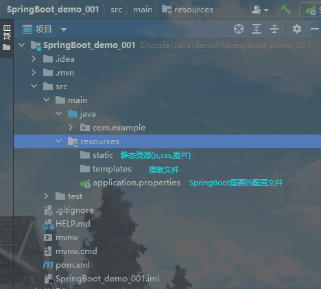

# 第一章 xml与JavaConfig

1. 为什么要使用springboot  
   因为Spring、SpringMVC需要使用大量的配置文件（xml文件）
   还需要配置各种对象，把使用的对象放到spring容器中才能使用对象
   需要了解其他框架的配置规则
   比较繁琐
2. SpringBoot相当于 不需要配置文件的Spring+SpringMVC。常用的框架和第三方库都已经配置好了，直接用。
3. SpringBoot开发效率高，使用更方便。

## @JavaConfig

javaConfig：使用java类作为xml配置文件的代替，是配置spring容器的纯Java方式。在这个Java类中可以创建Java对象，把对象放入sprig容器中（注入到容器）。  
使用两个注解：
1. @Configuration：放在一个类上，表示这个类作为配置文件使用。
2. @Bean：放在方法上，声明对象，把这个对象注入到容器。相当于<bean>

使用示例
~~~java
package org.example;

import org.springframework.context.annotation.Bean;
import org.springframework.context.annotation.Configuration;

/**
 * Configuration：表示当前类作为配置文件使用。是用来配置容器的
 * 位置：在类上
 * 
 * 这个类相当于beans.xml
 */
@Configuration
public class SpringConfig {

    /**
     * 创建方法，方法返回值为对象。方法上加入@bean注解
     * 方法返回值对象就注入到容器中
     *
     * @Bean: 把对象注入到Spring容器中。作用相当于<bean>
     * 位置：在方法上
     * 说明：@Bean，不指定对象名称，默认方法名是id
     */
    @Bean
    public Student createStudent() {
        Student s1 = new Student();
        s1.setName("张三");
        s1.setId(1);
        return s1;
    }

    @Bean(name = "student2")
    public Student createStudent2() {
        Student s2 = new Student();
        s2.setName("李四");
        s2.setId(2);
        return s2;
    }
}
~~~

## @ImportResource

@ImportResource：导入其他的xml配置文件，等于在xml `<import resources="其他配置文件"/>`  
使用示例
~~~java
@ImportResource(value = {"classpath:applicationContext.xml","classpath:beans.xml"})
public class SpringConfig {
}
~~~
value参数可以是数组，以导入多个xml配置文件  

## @PropertyResource

@PropertyResource： 读取properties属性配置文件可以实现外部化配置，在程序代码之外提供数据。  
步骤：
1. 在resources目录下，创建properties文件，使用key=value的格式提供数据
2. 在PropertyResource指定properties文件的位置
3. 使用@Value(value="${key}")

~~~java
@Configuration
@ImportResource(value = "classpath:applicationContext.xml")
@PropertySource(value = "classpath:config.properties")
@ComponentScan(basePackages = "org.example.vo")
public class SpringConfig {
}
~~~

# 第二章 SpringBoot

## 介绍

[Spring官网](https://spring.io/)
SpringBoot是Spring中的一个成员，可以简化Spring，SpringMVC的使用。核心还是IOC容器。

特点
* Create stand-alone Spring applications
    创建Spring应用
* Embed Tomcat, Jetty or Undertow directly (no need to deploy WAR files)
    内嵌的tomcat，jetty，undertow服务器（不用部署war包）
* Provide opinionated 'starter' dependencies to simplify your build configuration  
    提供了starter起步依赖，来简化应用的配置  
    比如使用MyBatis框架，需要在Spring项目中，配置MyBatis的对象SqlSessionFactory，Dao的代理对象  
    在SpringBoot项目中，在pom.xml中，加入一个mybatis-spring-boot-starter依赖
* Automatically configure Spring and 3rd party libraries whenever possible
    尽可能去配置spring和第三方库，自动配置（将spring和第三方库中的对象创建好，放入容器中，以便于使用）
* Provide production-ready features such as metrics, health checks, and externalized configuration
    提供了健康检查，统计，外部化配置
* Absolutely no code generation and no requirement for XML configuration
    不用生成代码，不用使用xml做配置

## 创建SpringBoot项目

使用Spring提供的初始化器，即向导创建SpringBoot应用

使用的地址：https://start.spring.io  
国内的地址：https://start.springboot.io
也可以直接访问网址，创建并下载。

SpringBoot的目录结构：

## 注解的使用

@SpringBootApplication
复合注解：由
@SpringBootConfiguration
@EnableAutoConfiguration
@ComponentScan
组成

1. @SpringBootConfiguration
部分源码：
~~~java
@Configuration
public @interface SpringBootConfiguration {
    @AliasFor(
        annotation = Configuration.class
    )
    boolean proxyBeanMethods() default true;
}
~~~
说明：使用了@SpringBootConfiguration注解标注的类，可以作为配置文件使用，可以使用BEAN声明对象，注入到容器。
2. @SpringBootConfiguration
启用自动配置，把java对象配置好，注入到spring容器中。例如：将MyBatis对象创建好，放入到容器中。
3. @ComponentScan
扫描器，找到注解，根据注解功能创建对象，给属性赋值等。
默认扫描的包：@ComponentScan所在的包和子包。

## SpringBoot的配置文件

配置文件名称：application
拓展名：properties(key=value);yml(ket:value)
使用application.properties或application.yml

application.properties示例：
~~~properties
#设置端口号
server.port=8080
#设置访问应用上下文路径，contextpath
server.servlet.context-path=/boot
~~~

application.yml示例：
~~~yaml
server:
  port: 8080
  servlet:
    context-path: /boot
~~~

注：properties与yml同时存在时，会使用properties。（一般只是用一个，不要两个一起用）

## 多环境配置

有开发环境，测试环境，上线环境。  
每个环节都有不同的配置信息，例如端口，上下文件，数据库url，用户名，密码等。

使用多环境配置文件，可以方便切换不同的配置。  
使用方式：创建多个配置文件，名称规则：application-环境名称.properties(yml)

创建开发环境的配置文件：application-dev.properties(application-dev.yml)
创建测试环境的配置文件：application-test.properties

在application.properties中指定使用哪个配置文件
~~~properties
#激活使用哪个配置文件
spring.profiles.active=dev
~~~

## 自定义配置

### @Value("${key}")

key来自application.properties
~~~properties
student.name=咕咕咕
student.age=20
~~~
注解加在属性定义上，便能读取配置中的数据。
~~~java
@Controller
public class SpringBoot {

    @Value("${student.name}")
    private String name;

    @RequestMapping(value = "/hello", produces = "application/json")
    @ResponseBody
    public String hello() {
        return "hello," + name;
    }
}
~~~

### @ConfigurationProperties(prefix="...")

将整个文件映射为一个对象，用于自定义配置项比较多的情况。
在类上加上
@Component
@ConfigurationProperties(prefix = "student")
注解，prefix内为属性名
~~~java
package com.example.vo;

import org.springframework.boot.context.properties.ConfigurationProperties;
import org.springframework.stereotype.Component;

@Component
@ConfigurationProperties(prefix = "student")
public class Student {
    private String name;
    private String age;

    public String getName() {
        return name;
    }

    public void setName(String name) {
        this.name = name;
    }

    public String getAge() {
        return age;
    }

    public void setAge(String age) {
        this.age = age;
    }

    @Override
    public String toString() {
        return "Student{" +
                "name='" + name + '\'' +
                ", age='" + age + '\'' +
                '}';
    }
}
~~~

在Controller中使用@Resource自动注入，从容其中拿到对象，进行赋值使用。

## SpringBoot中使用jsp(不推荐使用jsp，因为前后端要分离)

SpringBoot不推荐使用jsp，而是使用模板技术代替jsp  
SpringBoot原生不支持jsp，需要配置依赖项。  
1. 加入一个处理jsp的依赖，负责编译jsp文件。  
~~~xml
<dependency>
    <groupId>org.apache.tomcat.embed</groupId>
    <artifactId>tomcat-embed-jasper</artifactId>
</dependency>
~~~
2. 如果需要使用servlet，jsp，jstl的功能，还需要添加额外的依赖项。
~~~xml
<dependencys>
    <!--jstl的依赖-->
    <dependency>
        <groupId>javax.servlet</groupId>
        <artifactId>jstl</artifactId>
    </dependency>
    <!--servlet的依赖-->
    <dependency>
        <groupId>javax.servlet</groupId>
        <artifactId>javax.servlet-api</artifactId>
    </dependency>
    <!--jsp的依赖-->
    <dependency>
        <groupId>javax.servlet.jsp</groupId>
        <artifactId>javax.servlet.jsp-api</artifactId>
        <version>2.3.3</version>
    </dependency>
</dependencys>
~~~

3. 创建一个存放jsp的目录，一般叫webapp
    index.jsp
4. 需要在pom.xml指定jsp文件编译后的存放目录
    META-INF/resources
5. 创建Controller，访问jsp
6. 在application.properties文件中配置视图解析器

使用示例：
index.jsp
~~~jsp
<%@ page contextType="text/html;charset=UTF-8” language="java" %>
<html>
<head>
    <title>jsp文件</title>
</head>
<body>
<h3>使用jsp显示Controller中的数据 ${data}</h3>
</body>
</html>
~~~
Controller类
~~~java
package com.example;

import org.springfarmework.stereotype.Controller;

@Controller
public class JspController{
//    public String Jsp(HttpServletRequest request){
//        request.setAttribute("data","SpringBoot使用jsp");
//        //视图的逻辑名称
//        return "index";
//    }

    /**
     * 
     * @param model
     * @return
     */
    public String Jsp(Model model){
        //将数据放入到request作用域
        model.addAttribute("data","SpringBoot使用jsp");
        //视图的逻辑名称
        return "index";
    }
    
}
~~~
application.properties中添加
~~~properties
#配置视图解析器 前缀及后缀
#/ = src/main/webapp
spring.mvc.view.prefix=/
spring.mvc.view.suffix=.jsp
~~~
pom.xml文件中，指定jsp编译后存放的目录。
~~~xml
<resources>
    <resource>
        <!--jsp原来的目录-->
        <directory>src/main/webapp</directory>
        <!--指定编译后的存放目录-->
        <directory>META_INF/resources</directory>
        <!--指定处理的目录和文件-->
        <includes>
            <include>**/*.*</include>
        </includes>
    </resource>

</resources>
~~~

jsp正在被逐渐淘汰，因为它在页面中嵌入了java代码。使得前后端不能分离，从而加大了前端与后端的沟通成本，降低了开发效率。
比如下面的对话(来自网络)
> 后端：你写的页面有问题啊，不显示数据。
前端：不可能，我这边都是好的。
后端：你自己来看啊。
前端：你写的这是什么玩意？我给你的代码不是这样的。
后端：我得把你的代码加到 JSP 里啊。
前端：我又不懂 JSP 啊，你再把代码摘出来吧，我帮你看看问题。
后端：......

可以使用ajax技术，实现前后端分离。

## 使用容器
通过代码，从容器中获取对象。  
在main方法中SpringApplication.run()方法获取返回的String容器对象，再获取业务bean进行调用。

run()方法的源码：
~~~java
    public static ConfigurableApplicationContext run(Class<?> primarySource, String... args) {
        return run(new Class[]{primarySource}, args);
    }
~~~
ConfigurableApplicationContext：接口，是ApplicationContext的子接口

使用示例：
手动从容器中获取UserService对象，调用其中的sayHello方法。
~~~java
@SpringBootApplication
public class SpringBootDemo001Application {

    public static void main(String[] args) {
        //获取容器对象
        //ConfigurableApplicationContext ctx = SpringApplication.run(SpringBootDemo001Application.class, args);
        ApplicationContext ctx = SpringApplication.run(SpringBootDemo001Application.class, args);
        //从容器中获取对象
        UserService userService = (UserService) ctx.getBean("UserService");
        userService.sayHello("张三");
    }
}
~~~

## CommandLineRunner接口、ApplicationRunner接口

这两个接口都有一个run方法。执行时间在容器对象创建好后，自动执行run()方法。
可以完成自定义的在容器对象创建好的一些操作。

源码：
~~~java
@FunctionalInterface
public interface CommandLineRunner {
    void run(String... args) throws Exception;
}

@FunctionalInterface
public interface ApplicationRunner {
    void run(ApplicationArguments args) throws Exception;
}
~~~

他们在容器启动完成后执行。
我们只需要实现这个方法，就可以在容器启动后执行一些内容。比如读取配置文件，数据库连接之类。

使用示例：
~~~java
public class AfterRun implements CommandLineRunner {
    @Override
    public void run(String... args) throws Exception {
        //可做自定义操作
        System.out.println("在容器对象创建好，执行的方法");
    }
}
~~~

# 第三章 Web组件

拦截器、servlet、Filter

## 拦截器

拦截器是SpringMVC中的一种对象，能拦截对Controller的请求。
拦截器框架中由系统的拦截器，可以自定义拦截器。实现对请求的预先处理。

SpringMVC实现自定义拦截器：
1. 创建类实现SpringMVC框架的HandlerInterceptor接口
~~~java
public interface HandlerInterceptor {
    default boolean preHandle(HttpServletRequest request, HttpServletResponse response, Object handler) throws Exception {
        return true;
    }

    default void postHandle(HttpServletRequest request, HttpServletResponse response, Object handler, @Nullable ModelAndView modelAndView) throws Exception {
    }

    default void afterCompletion(HttpServletRequest request, HttpServletResponse response, Object handler, @Nullable Exception ex) throws Exception {
    }
}
~~~
2. 需在SpringMVC的配置文件中，声明拦截器
~~~xml
<mvc:interceptors>
    <mvc:interceptor>
        <mvc:mapping path="url"/>
        <bean class="拦截器的全限定名称"/>
    </mvc:interceptor>
</mvc:interceptors>
~~~

SpringBoot实现拦截器：
1. 自定义拦截器
~~~java
package com.example.web;

import org.springframework.web.servlet.HandlerInterceptor;

import javax.servlet.http.HttpServletRequest;
import javax.servlet.http.HttpServletResponse;

/**
 * 自定义的拦截器
 */
public class LoginInterceptor implements HandlerInterceptor {

    /**
     * @param request
     * @param response
     * @param handler  被拦截的控制器对象
     * @return boolean
     * true：请求被Controller处理
     * false：请求被拦截
     */
    @Override
    public boolean preHandle(HttpServletRequest request, HttpServletResponse response, Object handler) throws Exception {
        //判断是否通过拦截器的代码
        System.out.println("拦截器被执行");
        return true;
    }
}
~~~
2. 将拦截器对象注入容器
~~~java
package com.example.config;

import com.example.web.LoginInterceptor;
import org.springframework.context.annotation.Configuration;
import org.springframework.web.servlet.HandlerInterceptor;
import org.springframework.web.servlet.config.annotation.InterceptorRegistry;
import org.springframework.web.servlet.config.annotation.WebMvcConfigurer;

@Configuration
public class HandlerInterceptorConfig implements WebMvcConfigurer {

    //添加拦截器对象，注入到容器中
    @Override
    public void addInterceptors(InterceptorRegistry registry) {

        //创建拦截器对象
        HandlerInterceptor interceptor = new LoginInterceptor();
        //指定拦截的url请求
        String path[] = {"/user/**"};
        //指定不拦截的地址
        String excludePath[] = {"/user/login"};
        registry.addInterceptor(interceptor).addPathPatterns(path).excludePathPatterns(excludePath);
    }
}
~~~
3. 写Controller类进行测试
~~~java
package com.example.controller;

import org.springframework.stereotype.Controller;
import org.springframework.web.bind.annotation.RequestMapping;
import org.springframework.web.bind.annotation.ResponseBody;

@Controller
public class HandlerInterceptorController {

    @RequestMapping("/user/register")
    @ResponseBody
    public String userRegister(){
        return "访问/user/register";
    }

    @RequestMapping("/user/login")
    @ResponseBody
    public String userLogin(){
        return "访问/user/login";
    }
}
~~~

## Servlet

在SpringBoot中使用Servlet对象
使用步骤：
1. 创建Servlet类。创建类继承HttpServlet。
~~~java
package com.example.web;

import javax.servlet.ServletException;
import javax.servlet.http.HttpServlet;
import javax.servlet.http.HttpServletRequest;
import javax.servlet.http.HttpServletResponse;
import java.io.IOException;
import java.io.PrintWriter;

//创建Servlet类
public class Servlet extends HttpServlet {
    @Override
    protected void doGet(HttpServletRequest req, HttpServletResponse resp) throws ServletException, IOException {
        doPost(req, resp);
    }

    @Override
    protected void doPost(HttpServletRequest req, HttpServletResponse resp) throws ServletException, IOException {
        //使用HttpServletResponse输出数据，应答结果
        resp.setContentType("text/html;charset=utf-8");
        PrintWriter out = resp.getWriter();
        out.println("执行servlet");
        out.flush();
        out.close();
    }
}
~~~
2. 注册Servlet，让框架能找到Servlet。
~~~java
package com.example.config;

import com.example.web.Servlet;
import org.springframework.boot.web.servlet.ServletRegistrationBean;
import org.springframework.context.annotation.Bean;
import org.springframework.context.annotation.Configuration;

@Configuration
public class ServletConfig {
    //定义方法，注册Servlet对象
    @Bean
    public ServletRegistrationBean servletRegistrationBean(){
        //public ServletRegistrationBean(T servlet, String... urlMappings)
        //第一个参数是Servlet对象，第二个参数是url地址
        //ServletRegistrationBean bean = new ServletRegistrationBean(new Servlet(),"/servlet");

        //无参构造，单独设置参数
        ServletRegistrationBean bean = new ServletRegistrationBean();
        bean.setServlet(new Servlet());
        bean.addUrlMappings("/servlet_01","/servlet_02"); // <url-pattern>

        return bean;
    }
}
~~~

## Filter过滤器

Filter是Servlet规范中的过滤器，可以处理请求，对请求的参数、属性进行调整。常常在过滤器中处理字符编码
使用步骤：
1. 创建自定义的过滤器类
~~~java
package com.example.config;

import com.example.web.MyFilter;
import org.springframework.boot.web.servlet.FilterRegistrationBean;
import org.springframework.context.annotation.Bean;
import org.springframework.context.annotation.Configuration;

@Configuration
public class FilterConfig {

    @Bean
    public FilterRegistrationBean filterRegistration() {
        FilterRegistrationBean bean = new FilterRegistrationBean();
        bean.setFilter(new MyFilter());
        bean.addUrlPatterns("/user/*");
        return bean;
    }
}
~~~
2. 注册Filter过滤器对象
~~~java
package com.example.config;

import com.example.web.MyFilter;
import org.springframework.boot.web.servlet.FilterRegistrationBean;
import org.springframework.context.annotation.Bean;
import org.springframework.context.annotation.Configuration;

@Configuration
public class FilterConfig {

    @Bean
    public FilterRegistrationBean filterRegistration() {
        FilterRegistrationBean bean = new FilterRegistrationBean();
        bean.setFilter(new MyFilter());
        bean.addUrlPatterns("/user/*");
        return bean;
    }
}
~~~
3. 写Controller类进行测试
~~~java
package com.example.controller;

import org.springframework.stereotype.Controller;
import org.springframework.web.bind.annotation.RequestMapping;
import org.springframework.web.bind.annotation.ResponseBody;

@Controller
public class HandlerInterceptorController {

    @RequestMapping("/user/register")
    @ResponseBody
    public String userRegister(){
        return "访问/user/register";
    }

    @RequestMapping("/user/login")
    @ResponseBody
    public String userLogin(){
        return "访问/user/login";
    }

    @RequestMapping("/query")
    @ResponseBody
    public String query(){
        return "访问/query";
    }
}
~~~

## 字符集过滤器

CharacterEncodingFilter：解决post请求中乱码的问题
在SpringMVC框架，在web.xml中注册过滤器。配置它的属性

1. 使用系统提供的字符集过滤器类
过滤器的注册
~~~java
package com.example.config;

import org.springframework.boot.web.servlet.FilterRegistrationBean;
import org.springframework.context.annotation.Bean;
import org.springframework.context.annotation.Configuration;
import org.springframework.web.filter.CharacterEncodingFilter;

@Configuration
public class FilterConfig {

    @Bean
    public FilterRegistrationBean filterRegistration() {
        FilterRegistrationBean bean = new FilterRegistrationBean();
        //使用框架中的过滤器类
        CharacterEncodingFilter filter = new CharacterEncodingFilter();
        //指定使用的编码方式
        filter.setEncoding("utf-8");
        //指定request，response都使用encoding的值
        filter.setForceEncoding(true);

        bean.setFilter(filter);
        //指定过滤的url地址
        bean.addUrlPatterns("/*");

        return bean;
    }
}
~~~
同时需要关闭SpringBoot中默认配置的字符集过滤器，使自定义的过滤器起作用。
~~~properties
#SpringBoot中默认已经配置了Character Encoding Filter，默认编码ISO-8859-1
#设置enable=false 作用是关闭系统中配置好的过滤器，使用自定义的CharacterEncodingFilter
server.servlet.encoding.enabled=false
~~~
2. 直接修改application.properties配置
~~~properties
#让系统的CharacterEncodingFilter生效
server.servlet.encoding.enabled=true
#指定使用的编码方式
server.servlet.encoding.charset=UTF-8
#强制request、response都使用charset属性的值
server.servlet.encoding.force=true
~~~

# 第四章 ORM操作MySQL

ORM是“对象-关系-映射”的简称。（Object Relational Mapping，简称ORM）
orm其实就是将类对象的语法翻译成sql语句的一个引擎

使用MyBatis框架操作数据库，在SpringBoot框架集成MyBatis
使用步骤：
1. mybatis起步依赖：完成mybatis对象自动配置，对象放在容器中。
2. pom.xml指定把src/main/java目录中的xml文件包含到classpath中。
3. 创建实体类Student。
4. 创建Dao接口StudentDao，创建一个查询学生的方法。
5. 穿啊关键Dao接口对应的Mapper文件，xml文件，写sql语句。
6. 创建Service层对象，创建StudentService接口和他的实现类。调dao对象的方法，完成数据库的操作。
7. 创建Controller对象，访问Service。
8. 写application.properties文件
   配置数据库的连接信息

## 第一种方式：@Mapper

@Mapper：放在dao接口上，每个接口都需要使用这个注解。
~~~java
/**
 * @Mapper： 告诉MyBatis这是dao接口，创建此接口的代理对象
 *      位置：在类上
 */
@Mapper
public interface StudentDao {

    Student selectById(@Param("stuId") Integer id);
}
~~~

## 第二种方式：@MapperScan

@MapperScan：放在SpringBoot启动类上，在包下所有接口在编译后会生成相应的实现类。
~~~java
@SpringBootApplication
/**
 * @MapperScan：找到Dao接口和Mapper文件
 *      basePackages：Dao接口所在的包名
 */
@MapperScan(basePackages = {"com.example.dao"})
public class SpringBootDemo001Application implements CommandLineRunner {
    //..
}
~~~

## 第三种方式：Mapper文件和Dao接口分开管理

将mapper文件放在resources目录下

1. 在resources目录中创建子目录（自定义），例如mapper
2. 将mapper文件放在mapper目录
3. 在application文件中指定mapper文件的目录
~~~properties
#指定mapper文件的位置
mybatis.mapper-locations=classpath:mapper/*.xml
#指定mybatis的日志
mybatis.configuration.log-impl=org.apache.ibatis.logging.stdout.StdOutImpl
~~~
4. 在pom文件中指定resources目录中的文件，编译到目标目录中
~~~xml
<!--resources插件-->
<resources>
    <resource>
        <directory>src/main/resources</directory>
        <includes>
            <include>**/*.*</include>
        </includes>
    </resource>
</resources>
~~~

## 事务

Spring框架中的事务：
1. 管理事务的对象：事务管理器（接口，接口有很多实现类）
    例如：使用jdbc或mybatis访问数据库，使用的事务管理器：DataSourceTransactionManager
2. 声明式事务：在xml配置文件或使用注释说明事务控制的内容
    控制事务：隔离级别，传播行为，超时时间
3. 事务处理方式：
   1. spring框架中的@Transactional
   2. aspectj框架可以在xml配置文件中，声明事务控制的内容

SpringBoot中使用事务：
1. 在业务方法上加入@Transactional，加入注解后，方法有事务功能。
2. 明确的在启动类上，加入@EnableTransactionManager

# 第五章 接口的架构风格——RESTful

[API百度百科](https://baike.baidu.com/item/%E5%BA%94%E7%94%A8%E7%A8%8B%E5%BA%8F%E7%BC%96%E7%A8%8B%E6%8E%A5%E5%8F%A3/3350958?fromtitle=API&fromid=10154)
接口：应用程序接口（英语：Application Programming Interface，简称：API），又称为应用编程接口，就是软件系统不同组成部分衔接的约定。由于近年来软件的规模日益庞大，常常需要把复杂的系统划分成小的组成部分，编程接口的设计十分重要。程序设计的实践中，编程接口的设计首先要使软件系统的职责得到合理划分。良好的接口设计可以降低系统各部分的相互依赖，提高组成单元的内聚性，降低组成单元间的耦合程度，从而提高系统的维护性和扩展性。
接口：可以指访问servlet、controller的url，调用其他程序的 函数

架构风格：api的组织样式
    就是一个传统的：http://localhost:8080/dev/student/query?id=2

## REST  
[RESTful架构风格](https://baike.baidu.com/item/RESTful/4406165)
1. REST：(Representational State Transfer)表现层状态转移
    是一种接口的架构风格和设计的理念，不是标准。
    优点：更简洁，更有层次。
    表现层状态转移： 
    表现层就是视图层，显示资源的。通过视图页面、jsp等显示操作资源的结果。
    状态：资源变化
    转移：资源是可以变化的。资源能创建，new状态，资源创建后可以查询资源，可以被修改。
2. RESt中的要素：
    用RESt表示资源和对应资源的操作。在互联网中，表示一个资源或者一个操作。
    资源是用url表示的，在互联网中，使用的图片、视频、文本、网页等都是资源。
    对于资源：
   1. 查询资源：通过url找到资源
   2. 创建资源：添加资源
   3. 更新资源：更新资源，编辑
   4. 删除资源：删除
    资源使用url表示，通过名称表示资源
        在url中，使用名词表示资源，以及访问资源的信息，在url中，使用"/"分割对资源的信息
    使用http中的动作（请求方式），表示对资源的操作（CURD）
    * GET：查询资源——sql select
      处理单个资源：
      http://localhost:8080/dev/student/query/2
      处理多个资源：
      http://localhost:8080/dev/student/query/2/3
    * POST：创建资源——sql insert
      http://localhost:8080/dev/student/add
      在post请求中传递数据
    * PUT：更新资源——sql update
      http://localhost:8080/dev/student/query/2
      在post中传递数据
    * DELETE：删除资源——sql delete
      http://localhost:8080/dev/student/query/2
    需要分页、排序等参数，依然可以加在url后，比如：
    http://localhost:8080/dev/student/query/2?page=2&pageSize=10
3. REST即使用url表示资源，使用http动作操作资源。

## RESTful的注解

1. @PathVariable：从url中获取数据
2. @GetMapping：支持get请求方式，等同于@RequestMapping（method=RequestMethod.GET）
3. @PostMapping：支持post请求方式，等同于@RequestMapping（method=RequestMethod.POST）
4. @PutMapping：支持put请求方式，等同于@RequestMapping（method=RequestMethod.PUT）
5. @DeleteMapping：支持delete请求方式，等同于@RequestMapping（method=RequestMethod.DELETE）
6. @RestController：复合注解，是@Controller和@ResponseBody组合
    在类上使用，表示当前类的所有方法都加入了@ResponseBody

Postman：测试工具
可以用来测试get、post、put、delete等请求。

注意：**url请求地址加请求方式** 得是唯一的，否则会有歧义
@**GetMapping**("**/student/{stuId}**")

## 在页面中或ajax中，支持pub、delete请求

在SpringMVC中，有一个过滤器，支持post请求转为put、delete

过滤器：org.springframework.web.filter.HiddenHttpMethodFilter
作用：将请求中的post请求转为put、delete

使用步骤：
1. application.properties：开启使用HiddenHttpMethodMFilter过滤器
2. 在请求页面中，包含_method参数，他的值是put、delete，发起这个请求使用的post方式
~~~html
<form action="student/put" method="post">
    <input type="hidden" name="_method" value="put">
    <input type="submit" value="put请求方式">
</form>
<form action="student/delete" method="post">
    <input type="hidden" name="_method" value="delete">
    <input type="submit" value="delete请求方式">
</form>
~~~

# 第六章 SpringBoot集成Redis

Redis：一个NoSQL（not only）数据库，常用作缓存使用（cache）
Redis的数据类型：string、hash、set、zset、list

Redis是一个中间件：是一个独立的服务器。
Java中著名的客户端：Jedis、lettuce、Redisson

Spring、SpringBoot中有一个RedisTemplate（StringRedisTemplate），用于处理和redis的交互

## redis的使用

导入起步依赖
~~~xml
<!--redis起步依赖-->
<dependency>
    <groupId>org.springframework.boot</groupId>
    <artifactId>spring-boot-starter-data-redis</artifactId>
</dependency>
~~~
data-redis使用的是 lettuce客户端库
在程序中使用RedisTemplate类的方法 操作redis数据，实际就是调用的lettuce客户端中的方法

使用示例
~~~java
package com.example.controller;

import org.springframework.data.redis.core.RedisTemplate;
import org.springframework.data.redis.core.StringRedisTemplate;
import org.springframework.data.redis.core.ValueOperations;
import org.springframework.web.bind.annotation.GetMapping;
import org.springframework.web.bind.annotation.PathVariable;
import org.springframework.web.bind.annotation.PostMapping;
import org.springframework.web.bind.annotation.RestController;

import javax.annotation.Resource;

@RestController
public class RedisController {

    /**
     * 注入RedisTemplate
     * 
     * RedisTemplate 泛型
     * RedisTemplate<String,String>
     * RedisTemplate<Object,Object>
     * RedisTemplate
     * 
     * 注意：RedisTemplate对象的名称 redisTemplate
     */
    @Resource
    private RedisTemplate redisTemplate;

    @Resource
    private StringRedisTemplate stringRedisTemplate;

    //添加数据到redis
    @PostMapping("/redis/add")
    public String addToRedis(String name, String value) {
        //操作Redis中的String类型的数据，先获取ValueOperations对象
        ValueOperations valueOperations = redisTemplate.opsForValue();

        valueOperations.set(name, value);
        return "向redis添加String数据";
    }

    //从redis获取数据
    @GetMapping("/redis/getKey")
    public String getData(String key) {
        ValueOperations valueOperations = redisTemplate.opsForValue();
        Object value = valueOperations.get(key);
        return "key:" + key + "value:" + value;
    }

    @PostMapping("/redis/{key}/{value}")
    public String addStringKV(@PathVariable String key, @PathVariable String value) {
        //使用StringRedisTemplate对象
        stringRedisTemplate.opsForValue().set(key, value);
        return "使用StringRedisTemplate对象，" + "key:" + key + "value:" + value;
    }

    @PostMapping("/redis/getstr/{key}")
    public String getStringValue(@PathVariable String key) {
        //使用StringRedisTemplate对象
        stringRedisTemplate.opsForValue().get(key);
        return "使用StringRedisTemplate对象，" + "key:" + key;
    }
}
~~~

## StringRedisTemplate 和 RedisTemplate

StringRedisTemplate：把key、value都作为String处理，使用的是String的序列化，可读性好。
RedisTemplate：把key、value经过了序列化存到redis。key、value是序列化的内容，不能直接识别。默认使用jdk的序列化，可以修改为其他的序列化。

设置key或value的序列化方式
~~~java
/**
 * 设置 RedisTemplate 序列化
 */
public String addString(String key,String value){
    //使用RedisTemplate，在存取值之前，设置序列化方式。
    //设置key使用String的序列化
    redisTemplate.setKeySerializer(new StringRedisSerializer());
    //设置value的序列化
    redisTemplate.setValueSerializer(new StringRedisSerializer());

    redisTemplate.opsForValue().set(key,value);
    return "定义RedisTemplate对象key、value的序列化";
}
~~~

# 第七章 SpringBoot集成Dubbo

## SpringBoot集成Dubbo的文档

[文档](https://github.com/apache/dubbo-spring-boot-project/blob/master/README.md)

## 公共项目

独立的maven项目：定义了接口和数据类

~~~java
public class Student implements Serializable{
    private static final long serialVersionUID = 3941539077791951521L;
    
    private Integer id;
    private String name;
    private Integer age;
}
~~~
~~~java
public interface StudentService{
    Student queryStudent(Integer id);
}
~~~

2. 创建服务提供者模块，实现接口模块

dubbo依赖 和 zookeeper依赖
~~~xml
<!--dubbo依赖-->
<dependency>
    <groupId>org.apache.dubbo</groupId>
    <artifactId>dubbo-spring-boot-starter</artifactId>
    <version>3.0.7</version>
</dependency>
<!--zookeeper依赖-->
<dependency>
    <groupId>org.apache.dubbo</groupId>
    <artifactId>dubbo-dependencies-zookeeper</artifactId>
    <version>3.0.7</version>
    <type>pom</type>
    <exclusions>
        <!--排除log4h依赖，因为重复-->
        <exclusion>
            <groupId>slf4j-log4j12</groupId>
            <artifactId>org.slf4j</artifactId>
        </exclusion>
    </exclusions>
</dependency>
~~~
注：在pom文件中使用 <exclusions> 标签排除包含的依赖，已解决重复引入依赖的问题

实现接口
~~~java
/*
使用dubbo中的注解暴露服务
@Component可以不加
 */
@DubboService(interfaceClass = StudentService.class,version = "1.0",timeout = 5000)
public class StudentServiceImpl implements StudentService {
    @Override
    public Student queryStudent(Integer id) {
        Student student = studentDao.selectById(id);
        return student;
    }
}
~~~

外部化配置
~~~properties
#配置服务名称 dubbo:application name="名称"
spring.application.name=studentService-provider

#配置扫描的包，扫描的@DubboService
dubbo.scan.base-packages=com.example.service

#配置dubbo协议
#dubbo.protocol.name=dubbo
#dubbo.protocol.port=20881

#注册中心
dubbo.registry.address=zookeeper://localhost:2181
~~~

在类上使用 @DubboService 注解来暴露服务

**在主类之上使用 @EnableDubbo 注解启用Dubbo**
包含了 @EnableDubboConfig 和 @DubboComponentScan
~~~java
@SpringBootApplication
@EnableDubbo
public class SpringBootDemo001Application{
    public static void main(String[] args) {
        SpringApplication.run(SpringBootDemo001Application.class, args);
    }
}
~~~

3. 创建消费者模块

添加依赖，与服务提供者相同。

创建Controller或者Service调用远程服务
~~~java
@RestContrloller
public class DubboController{
    /*
            引用远程服务，把创建好的代理对象，注入给studentService
            @DubboReference(interfaceClass = StudentService.class,version = "1.0")
            没有使用interfaceClass，默认是 引用数据类型
     */
    @DubboReference(version = "1.0")
    private StudentService studentService;
    
    @GetMapping("/query")
    public String queryStudent(Integer id){
        Student student = studentService.queryStudent(id);
        return "调用远程接口获取的对象："+student;
    }
}
~~~

配置文件application.properties
~~~properties
#指定服务名称
spring.application.name=consumer-application
#指定注册中心
dubbo.registry.address=zookeeper://localhost:2181
~~~

# 第八章 SpringBoot打包

主类继承SpringBootServletInitializer才能使用外部的tomcat  
SpringBootServletInitializer相当于原有web.xml的替代  
使用嵌入式的tomcat，默认不支持jsp。  

## 打包成war

1. 指定打包后的名称
~~~xml
<build>
    <!--打包后的文件名称-->
    <finalName>bootDemo</finalName>
</build>
~~~
2. 指定jsp编译的目录
~~~xml
        <resources>
            <resource>
                <directory>src/main/java</directory>
                <includes>
                    <include>**/*.xml</include>
                </includes>
            </resource>
            <resource>
                <directory>src/main/resources</directory>
                <includes>
                    <include>**/*.*</include>
                </includes>
            </resource>
            <resource>
                <directory>src/main/webapp</directory>
                <targetPath>META-INF/resources</targetPath>
                <includes>
                    <include>**/*.*</include>
                </includes>
            </resource>
        </resources>
~~~
3. 执行打包是war
~~~xml
<!--打包类型-->
<packaging>war</packaging>
~~~
4. 主启动类继承SpringBootServletInitializer
~~~java
@SpringBootApplication
public class SpringBootDemo001Application extends SpringBootServletInitializer{
    public static void main(String[] args) {
        SpringApplication.run(SpringBootDemo001Application.class, args);
    }
}
~~~
5. 部署war
将war文件放到tomcat等服务器的发布目录中。

## 打包成jar

1. 指定打包后的名称
~~~xml
<build>
    <!--打包后的文件名称-->
    <finalName>bootDemo</finalName>
</build>
~~~
2. 指定springboot-maven-plugin版本
~~~xml
<plugins>
    <plugin>
        <groupId>org.springframework.boot</groupId>
        <artifactId>spring-boot-maven-plugin</artifactId>
        <!--打包jar，有jsp文件时，必须指定maven-plugin插件版本是1.4.2.RELEASE-->
        <version>1.4.2.RELEASE</version>
    </plugin>
</plugins>
~~~
3. 执行maven clean package  
    在target目录中，生成jar文件 bootDemo.jar
    执行独立的springboot项目，即 java -jar bootDemo.jar

# 第九章 Thymeleaf 模板

## 介绍

Thymeleaf是模板引擎，使用Java开发，在服务器端运行。将处理好的请求发送给浏览器。
Java生态下的模板还有Freemaker、Velocity、Beetl(国产)等。
非web环境下，Thymeleaf能直接显示模板上的静态数据；web环境下，能像jsp一样从后台接收数据并替换到模板上。
它是基于HTML的，以HTML标签为载体。
SpringBoot集成了Thymeleaf模板技术，官方也推荐使用它来代替jsp进行前端页面的数据展示。因为jsp需要编译运行，效率比较低。

[Thymeleaf官网](https://www.thymeleaf.org/)
[Thymeleaf官方文档](https://www.thymeleaf.org/doc/tutorials/3.0/usingthymeleaf.html)

## 配置

依赖
~~~xml
        <!--模板引擎起步依赖-->
        <dependency>
            <groupId>org.springframework.boot</groupId>
            <artifactId>spring-boot-starter-thymeleaf</artifactId>
        </dependency>
~~~

一些配置
~~~properties
#在开发阶段，关闭模板缓存，让修改立刻生效
spring.thymeleaf.cache=false
#编码格式
spring.thymeleaf.encoding=UTF-8
#模板的类型（默认是HTML，模板是html文件）
spring.thymeleaf.mode=HTML
#模板的前缀： 类路径的 classpath:/templates
spring.thymeleaf.prefix=classpath:/templates/
#后缀
spring.thymeleaf.suffix=.html
~~~

## 表达式

1. 标准变量表达式
    语法：${key}
    作用：获取key对应的文本数据，key是request作用域中的key。使用request.setAttribute(),model.addAttribute()
    在页面中html标签中使用 th:text="${key}"
~~~html

获取student对象属性值

id

name

age

~~~
2. 选择变量表达式（星号变量表达式）
    语法：*{key}
    作用：获取这个key对应的数据，*{key}需要与th:object一起使用
    目的是简单获取对象的属性值
~~~html

使用 *{} 获取student对象属性值

    
id

    
name

    
age

<!--直接使用也可以-->

id

~~~
3. 链接表达式
    语法：@{url}
    作用：表示链接

~~~html
<h3>链接绝对路径</h3>
<a th:href="@{https://baidu.com}">百度</a>

<h3>链接相对路径</h3>
<a th:href="@{/queryStudent}">相对地址，没有参数</a>
<h3>链接相对路径，使用字符串链接传递参数</h3>
<a th:href="@{'/queryStudent?id=' + ${student.id} }">相对地址，有参数。获取model中的数据</a>
<h3>传递多个参数</h3>
<a th:href="@{/queryStudent(name='zhangsan',id=20)}">传多个参数</a>
~~~

## Thymeleaf属性

属性是放在html元素中的，就是html元素的属性，加入了th前缀。属性的作用不变。加上th。属性的值由模板引擎处理，在属性上可以使用变量表达式。

~~~html
<form action="/queryStudent" method="post"></form>
<form th:action="/queryStudent" th:method="${methodAttr}"></form>g
~~~

### each 循环

each循环，可以循环List、Map、Array
语法：在html标签中使用 th:each
~~~html

    

~~~

集合循环成员，循环状态变量：名称都是自定义的。  
**”循环的状态变量“可以不定义，默认是”集合循环成员Stat“**
循环状态变量 iterStat 可以获取以下信息
**index：当前迭代对象的index**
**count：当前迭代对象个数（第几个）**
size：当前迭代对象大小（总数）
even/odd：布尔值，当前循环是否是偶数/奇数（从0开始计算）
first：布尔值，当前循环是否是第一个
last：布尔值，当前循环是否是最后一个

### 条件判断if

判断语句，条件为true，显示html标签内容，**否则不显示**。**没有else语句**
语法：th:if="条件语句"
~~~html

id是1001

<!--""空字符是true-->

空字符

<!--null是false-->

null

~~~

还有个与 th:unless 和 th:if 相反的行为

### 判断语句 switch,case

th:switch 和 java中的switch一样
语法：th:switch="要比较的值",th:case="值"
~~~html

    
结果1

    
结果2

    
默认结果(default)

~~~
注：**以上case只有一句执行**

### 内联 inline

1. 内联test：在html标签外，获取表达式的值
    语法：[[${key}]]
~~~html

    
我是[[${name}]]

~~~

2. 内联JavaScript
~~~html

~~~

## 字面量

1. 文本字面量：使用单引号括起来的字符串
~~~html

数据显示

~~~
2. 数字字面量
~~~html

5}">20>5

~~~
3. boolean字面量
~~~html

用户已登录

~~~
4. null字面量
~~~html

有student数据

~~~

## 字符串链接

1. 使用单引号括起来的字符串，使用 + 连接其他字符串或表达式
~~~html

数据显示

~~~
2. 使用双竖线，|字符串和表达式|
~~~html

显示数据

~~~

## 运算符

算数运算：+,-,*,/
关系比较：>,<,>=,<=(gt,lt,ge,le)
相等判断：==,!=(eq,ne)

~~~html

 20}">年龄大于20

显示运算结果

student是null

student是null

student不是null

~~~

## Thymeleaf基本对象

模板引擎提供了内置对象，可以使用#开始引用。
[官方文档](https://www.thymeleaf.org/doc/tutorials/3.0/usingthymeleaf.html#appendix-a-expression-basic-objects)

1. #request 表示 HttpServletRequest
2. #session 表示 HttpSession
3. session 表示 Map对象，是#session的简单表达方式，用来获取session中指定key的值
    #session.getAttribute("loginname")==session.loginname

~~~html
<h3>内置对象#request,#session,session的使用</h3>

获取作用域中的信息

<h3>使用内置对象的方法</h3>

~~~

此外，还有很多工具类。提供string、date、集合的一些处理方法。此处不再列举，详细请查看官方文档。

## 自定义模板

模板是内容的复用，定义一次，在其他模板文件中多次使用。
模板的使用：
1.定义模板
2.使用模板

模板定义语法：
~~~html

    
hello world

~~~
引用模板的语法：
~~~html
<!--插入模板insert-->

<!--templatename:文件名称-->
<!--selector:自定义模板名称-->

<!--templatename:文件名称-->
<!--selector:自定义模板名称-->

<!--包含模板insert-->

<!--对于使用模板：有包含模板（th:include），插入模板（th:insert）-->
<!--包含是替换原来的标签，插入只是插入-->
~~~

# 第十章 总结

## 注解

spring+springMVC+SpringBoot

创建对象：
@Controller：放在类上，创建控制器对象，注入到容器中。
@RestController：放在类上，创建控制器对象，注入到容器中。作用：复合了@Controller合@ResponseBodey，使用这个注解，控制器方法返回值都是数据，没有视图。
@Service：放在业务层实现类上，创建service对象，注入到容器。
@Repository：放在dao层实现类上，创建dao对象，注入到容器。没有使用是因为dao对象是MyBatis框架通过代理生成的，不需要使用。
@Component：放在类上，创建此类的对象，放入到容器中。

赋值：
@Value：简单类型的赋值。还可以使用它获取配置文件中的数据。
@Autowired：引用类型赋值自动注入，支持byName，byType，默认是byType。放在属性或构造方法上，推荐放在构造方法上。
@Qualifer：给引用类型赋值，使用byName。
_注：@Autowired，@Qualifer都是Spring框架提供的_
@Resource：来自jdk中的定义，javax.annotation。实现引用类型的自动注入，支持byName，byType。默认是byName，如果失败，再使用byType注入。在属性上使用

其他：
@Configuration：放在类上，表示这是个配置类，相当于xml配置文件。
@Bean：放在方法上，把方法返回值对象，注入到spring容器中。
@ImportResource：加载其他的xml配置文件，把文件中的对象注入到spring容器中。
@PropertySource：读取其他的properties属性配置文件。
@ComponentScan：扫描器，指定报名，扫描注解。
@ResponseBody：放在方法上，表示方法返回值是数据，不是试视图。
@RequestBody：把请求体中的方法读取出来，转为java对象使用。
@ControllerAdvice：控制器增强，放在类上，表示此类提供了方法，可以对controller增强功能。
@ExceptionHandler：处理异常，放在方法上。
@Transcational：处理事务，放在service实现类的public方法上，表示此方法有事务。

SpringBoot中的注解：
@SpringBootApplication：放在启动类上，包含了@SpringBootConfiguration、@EnableAutoConfiguration、@ComponentScan

Mybatis相关注解：
@Mapper：放在类上，让MyBatis找到接口，创建代理对象
@MapperScan：放在主类上，指定扫描的包，将包中所有接口都创建代理对象。对象注入到容器中。
@Param：放在dao接口的方法形参前，作为命名参数使用。

Dubbo注解：
@DubboService：在提供者端使用，暴露服务，放在接口实现类上。
@DubboReference：在消费者端使用，引用远程服务，放在属性上使用。
@EnableDubbo：放在主类上，表示启用Dubbo功能。

## 一些想法

断断续续学了快一个月，springboot算是摆脱了众多的配置文件，对开发来说还是蛮友好的。
关于Thymeleaf模板引擎，我感觉和jsp有点像。但我没有学习过jsp，只是浅浅的用过。模板引擎应该算不上前后端分离，不过它是在html文件的标签上增加内容，实现动态的功能，算是伪分离吧。~~前后端分离，人不分离。~~
现在linux使用地还不是很熟练，后面打算细细地学习下linux的使用，因为web应用是要部署到linux服务器的，所以学习linux是必要的。后面换电脑也打算使用linux作为主操作系统，大概会选择deepin系统吧。
目前要复习期末考试，考完后，会开始健康码网站的制作。
后面的学习计划，大概有Nginx，Docker之类的，然后继续深入对spring系列框架的理解合使用。
更远一些的，大概会去学一下vue，了解下前端，毕竟如果是一个人做网站的话，只有后端也是不太行的。
好耶！可以使用springboot，告别那么多配置文件了。
> 2022.5.29