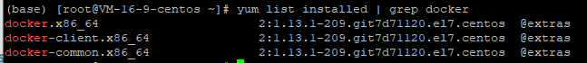

## 简介

### 虚拟化

虚拟化是一种计算机资源管理技术。  
指通过虚拟化技术将一台计算机虚拟为多台逻辑计算机。在一台计算机上同时运行多个逻辑计算机，每个逻辑计算机可运行不同的操作系统，并且应用程序都可以在相互独立的空间内运行而互不影响，从而显著提高计算机的工作效率。  

虚拟化分类（略，因为过于复杂，了解即可）  

优点：一台物理机可以虚拟化多个服务器，让计算机资源利用更充分。  
缺点：
1. 每个虚拟机都会创建一个操作系统，会增加资源的消耗。
2. 环境兼容问题。  

### 容器技术

运行在操作系统之上的虚拟化技术，模拟的运行在一个操作系统上的多个不同进程，封装在容器中。  

docker发布于2013年，基于LXC技术。
LXC是linux Container，是一种内核虚拟化技术。提供轻量级的虚拟化，以便隔离进程和资源。与宿主机使用同一内核，性能损耗小。

docker是开源的应用容器引擎，基于go语言实现。
[docker官网](https://www.docker.com/)
docker技术可以让开发者将开发好的应用和依赖包打包到容器中，以便可以运行在任意linux服务器上，解决开发环境与运维环境不同的问题。  
docker本省不是容器，是管理容器的引擎。  

## 环境搭建

### 安装

docker支持CentOS6及以上版本。  
CentOS7可以使用`yum install docker -y`直接安装。  

### 服务启动关闭等

启动：`systemctl start docker`或者`service docker start`
停止：`systemctl stop docker`或者`service docker stop`
重启：`systemctl restart docker`或者`service docker restart`
查看运行状态：`systemctl status docker`或者`service docker status`

查看docker系统信息：`docker info`
查看docker所有帮助信息：`docker`
查看某个命令帮助信息：`docker commond --help`

### docker运行机制

启动服务-->下载镜像-->启动该镜像得到一个容器-->容器里运行应用

1. 启动服务
2. 下载镜像，如果本地没有对应镜像，则会从镜像仓库下载，[默认仓库](https://hub.docker.com)  
搜索镜像：`docker search tomcat`
下载镜像：`docker pull tomcat`
运行镜像：`docker run tomcat` 后台运行：`docker run -d tomcat`
显示本地已有镜像：`docker images`

