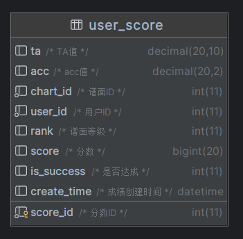
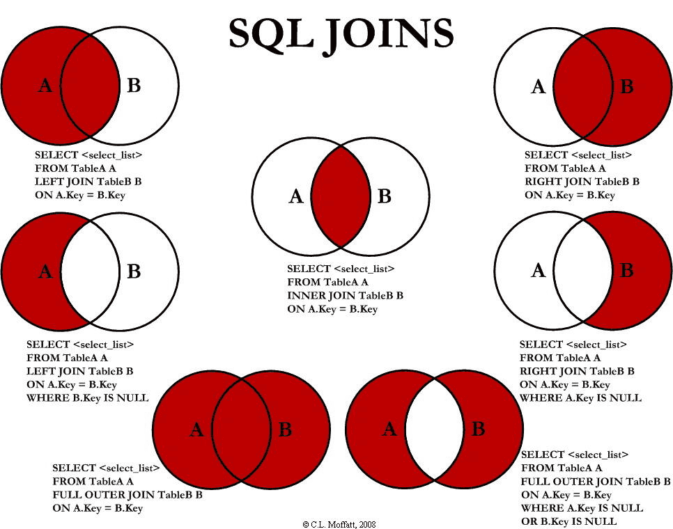

## 需求描述

首先有一张用户分数表：

然后需要实现一个排行榜的查询：
查询**某一谱面**（chart_id）的排行榜，排序规则为**分数降序**，**时间降序**（鼓励用户去挑战理论值，刷新排行榜）
并且每个排行榜中每个用户仅出现一次。（去重，防止出现排行榜全是一个人的情况）

## 实现过程

第一次实现排行榜时，并没有考虑到去重。

~~~sql
select user_id,score,create_time
from user_score
where chart_id = 11
order by score desc ,create_time desc
limit 50
~~~

不出意外，如果同一用户打了多次同一铺面，并且分数排名前50，排行榜上便会有多个该用户。
发现重复问题是因为拿着查询出来的 user_id 去获取用户信息时，数据的数量对不上。

随后我陷入了痛苦的思考 sql 过程中。~~太久没写复杂点的，快忘光了。~~

在求助开发组其他四名成员后，也没有结果。因为大家陷入了激烈的讨论中......（23点55分问的，睡前脑力小练习）
有一个提议： sql 不好写出来，可以将数据查出来，用代码逻辑处理（**遇事不决，业务层拼接**）
这个方案不到实在写不出来，我不会考虑的。

然后突然有一个人说：**ChatGPT 怎么说**
这句话，让我的灵魂仿佛得到了神圣的洗涤。~~还没毕业就要失业了~~
不过不得不说，ChatGPT 强是真的强。在不断的对话引导中，ChatGPT 给出了下面的 sql

~~~sql
SELECT s.user_id, s.score, s.create_time
FROM user_score s
         INNER JOIN (SELECT user_id, chart_id, MAX(score) AS max_score
                     FROM user_score
                     WHERE chart_id = 11
                     GROUP BY user_id, chart_id) t
                    ON s.user_id = t.user_id AND s.chart_id = t.chart_id AND s.score = t.max_score
WHERE s.chart_id = 11
ORDER BY s.score DESC
LIMIT 50;
~~~

当这段代码出来的时候，我的灵魂真的得到了神圣的洗涤。我记起了一个东西 ———— **inner join**
因为是多条件排序，所以 group by 用不了，我甚至找到了 [row_number() over ()](https://www.cnblogs.com/guohu/p/9701146.html) 的用法，但可惜他是 mysql8.0 的函数。服务器 mysql 的版本才5.7.25
当然，上面那段代码还是有些许问题的。**他的时间没有去重**，即同一用户同一分数出现多次，并且上榜，就会重复。（在这里感谢 user_id 为 3177 的用户让我发现了这个 bug，也恭喜他教程这个铺面两次达到理论值（满分））
后续对 ChatGPT 的引导中，ChatGPT说他忘了，**他甚至可以“忘记”。**
此时，已是半夜的 2点18分。虽然那个 sql 是 ChatGPT 0点27分给出来的。

最后在 2点49分，我给出了两次自连接的 sql。但性能不高，只是能用，随后我就眠了。（熬不下去了）

~~~sql
SELECT s.user_id, s.score, s.create_time
FROM user_score s
         INNER JOIN (SELECT user_id, chart_id, MAX(score) AS max_score
                     FROM user_score
                     WHERE chart_id = 11
                     GROUP BY user_id, chart_id) t
                    ON s.user_id = t.user_id AND s.chart_id = t.chart_id AND s.score = t.max_score
         inner join(select user_id, chart_id, max(create_time) as time
                    from user_score
                    where chart_id = 11
                    group by user_id, chart_id) u
                   on s.user_id = u.user_id AND s.chart_id = u.chart_id AND s.create_time = u.time
WHERE s.chart_id = 11
ORDER BY s.score DESC, s.create_time DESC
LIMIT 50;
~~~

然后，另一人给出了一次自连接的 sql，连接越少性能越高。
表中当时的数据量在五万左右。查询耗时在 300ms 多一点，下面的 sql 稍快一些 

~~~sql
SELECT s.user_id, s.score, MAX(s.create_time) AS create_time
FROM user_score s
         INNER JOIN (SELECT user_id, chart_id, MAX(score) AS max_score
                     FROM user_score
                     WHERE chart_id = 11
                     GROUP BY user_id, chart_id) t
                    ON s.user_id = t.user_id AND s.score = t.max_score
WHERE s.chart_id = 11
GROUP BY user_id
ORDER BY score DESC, create_time DESC
LIMIT 50
~~~

此时讨论已经结束，最后一条消息在 3点49分11秒，内容为 **该眠了**

时间来到，第二天。
关于性能问题，有两个解决方案。

第一种是缓存查询结果，每小时或者每天更新一次。但是 **冲完榜要过一段时间才能看到有点打击人（**
所以这个方案被放弃了，实现起来也少许有些麻烦。

第二种是 **loading画的炫酷一点就好了**
这句话，我要裱起来。

> loading画的炫酷一点就好了

到此，sql 的编写就结束了。下面来复习下被我忘却的 **表连接**

## 表连接

先贴个 [SQL 连接(JOIN) | 菜鸟教程](https://www.runoob.com/sql/sql-join.html)

表连接用于将多个表的行结合起来，有4种连接方式。
inner join、full join、left join、right join。

这个来自菜鸟教程的图是真的好，完美解释了用法：

表连接，算是是一种表的乘法。
外连接的话（左连接、右连接、全连接）。根据连接条件，将一条数据变成多个。
比如全连接以主键相等为连接条件的话，结果的行数为参与连接的表的行数的乘积。
内连接的话（只有内连接）。就是根据连接条件取参与连接的表交集。

其他的没什么，学过的看到上面类似集合的图就能想起来用法，没学过的可以看看菜鸟的例子便于理解。
好吧，这里写的确实挺简洁的。主要是恢复下我的记忆，所以不会太详细。