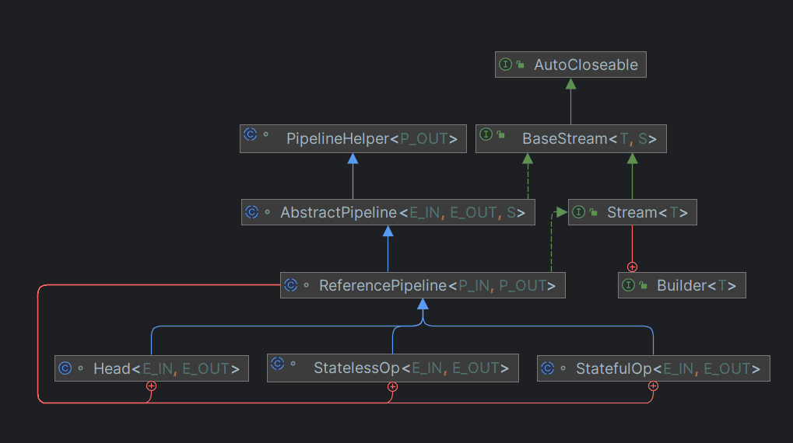

## stream 流的介绍和特点

stream 流不是某种数据结构，也不会保存数据，但是它负责相关计算。
像是一个**高级的迭代器**，只需要指定依次需要执行哪些操作，stream 流便会隐式地遍历并附加执行指定的操作。

stream的使用流程：
1. 创建 stream 流
2. 调用 stream 流的中间方法，对数据进行处理
3. 调用 stream 流的终止方法，对结果进行处理，并结束 stream 流

stream 流提供了**惰性计算**和**并行计算**的能力。
stream 流的实现类似一个双向链表，创建 stream 流实际是创建了这个双向链表的头节点。
调用中间方法时，stream 流会在链表尾部添加新的节点，并将需要执行的操作（函数）记录下来。（并不会立刻执行，这是惰性计算的原因
调用终止方法时，stream 流会从链表头部开始，依次执行链表中记录的操作，并返回结果。

看了一下 Stream 的源码，它为了应对广泛的使用场景而进行了高度封装，抽象程度很高。
暂时不是我能看懂的。所以就记录下使用，不详细分析源码。~~（看不懂怎么分析啊~~
下面是源码的结构（也许不全吧

在 jdk 源代码的结构中，Stream 只是一个接口，并没有操作的缺省实现。
最主要的实现是 ReferencePipeline，而 ReferencePipeline 继承自 AbstractPipeline ，AbstractPipeline 实现了 BaseStream 接口并实现了它的方法。
但 ReferencePipeline 仍然是一个抽象类，因为它并没有实现所有的抽象方法，比如 AbstractPipeline 中的 opWrapSink。
ReferencePipeline内部定义了三个静态内部类，分别是：Head，StatelessOp，StatefulOp，但只有 Head 不再是抽象类。

**ReferencePipeline 包含了控制数据流入的 Head ，中间操作 StatelessOp（无状态操作），StatefulOp（有状态操作），终止操作 TerminalOp。**

1. 中间操作（Intermediate Operations）包含**无状态操作与有状态操作**：
   1. 无状态（Stateless）操作：每个数据的处理是独立的，不会影响或依赖之前的数据。
   如 `filter()`、`flatMap()`、`flatMapToDouble()`、`flatMapToInt()`、`flatMapToLong()`、`map()`、`mapToDouble()`、`mapToInt()`、`mapToLong()`、`peek()`、`unordered()` 等
   2. 有状态（Stateful）操作：处理时会记录状态，比如处理了几个。后面元素的处理会依赖前面记录的状态，或者拿到所有元素才能继续下去。
   如 `distinct()`、`sorted()`、`sorted(comparator)`、`limit()`、`skip()` 等
2. 终止操作（Terminal Operations）包含**非短路操作与短路操作**：
   1. 非短路操作：处理完所有数据才能得到结果。
   如 `collect()`、`count()`、`forEach()`、`forEachOrdered()`、`max()`、`min()`、`reduce()`、`toArray()`等。
   2. 短路（short-circuiting）操作：拿到符合预期的结果就会停下来，不一定会处理完所有数据。
   如 `anyMatch()`、`allMatch()`、`noneMatch()`、`findFirst()`、`findAny()` 等。

## 创建 stream 流

| 方法                              | 用处                          |
|---------------------------------|-----------------------------|
| stream()                        | 	创建出一个新的stream串行流对象         |
| parallelStream()	               | 创建出一个可并行执行的stream流对象        |
| Stream.of()	                    | 通过给定的一系列元素创建一个新的Stream串行流对象 |
| Arrays.stream() / Stream.of (); | 从数组获取流。                     |

stream 流的创建最后都是通过 StreamSupport 类来实现的。
parallel 参数用来区分串行流和并行流。
~~~java
public final class StreamSupport {
    public static <T> Stream<T> stream(Spliterator<T> spliterator, boolean parallel) {
        Objects.requireNonNull(spliterator);
        return new ReferencePipeline.Head<>(spliterator,
                StreamOpFlag.fromCharacteristics(spliterator), 
                parallel);
    }
}
~~~
ReferencePipeline.Head<>() 方法一直 super 到父类 AbstractPipeline 中的实现，大致看得懂是个双向的链表结构。（也许
~~~java
abstract class AbstractPipeline<E_IN, E_OUT, S extends BaseStream<E_OUT, S>>
        extends PipelineHelper<E_OUT> implements BaseStream<E_OUT, S> {
    AbstractPipeline(Spliterator<?> source,
                     int sourceFlags, boolean parallel) {
        this.previousStage = null;
        this.sourceSpliterator = source;
        this.sourceStage = this;
        this.sourceOrOpFlags = sourceFlags & StreamOpFlag.STREAM_MASK;
        // The following is an optimization of:
        // StreamOpFlag.combineOpFlags(sourceOrOpFlags, StreamOpFlag.INITIAL_OPS_VALUE);
        this.combinedFlags = (~(sourceOrOpFlags << 1)) & StreamOpFlag.INITIAL_OPS_VALUE;
        this.depth = 0;
        this.parallel = parallel;
    }
}
~~~

## 中间操作

中间操作可以有很多，他们的返回值都是一个新的 stream 流对象，可以进行链式调用。
使用 stream 流时原始数据是不会发生改变的。
中间操作是惰性计算的，也就是调用后并不会立刻执行，只有进行终止操作时，这些中间操作才会一起被执行。
**如果没有终止操作，中间操作不会被执行！**
如果遍历没有完成，想要的结果已经获取到了（比如获取第一个值），会停止遍历，然后返回结果。（短路操作？
惰性计算可以显著提高运行效率。

常用的中间操作见下表（列举部分）：

| 中间操作                                         | 用处  |
|----------------------------------------------|-----|
| filter(Predicate<? super T> predicate)       | 过滤  |
| map(Function<? super T, ? extends R> mapper) | 映射  |
| distinct()                                   | 去重  |
| sorted()                                     | 排序  |
| limit(long maxSize)                          | 限制  |
| skip(long n)                                 | 跳过  |

重点记录下映射的用法，映射有两种
1. map 必须是**一对一映射**，将每个元素转换为一个新的元素（可以是一个新的集合）。
2. flatMap 可以是**一对多映射**的，将每个元素转换为一个或多个元素（比 map 多了扁平化处理，将映射后的结果进行合并）。

下面是例子，用来展示 map 和 flatMap 的用法和区别。

~~~java  
public class Main {
    public static void main(String[] args) {
        Stream<String> stringStream = Stream.of("hello", "world", "java", "stream");
        // 将流中每个元素变为大写（一对一
        List<String> stringList1 = stringStream.map(String::toUpperCase).collect(Collectors.toList());
        // 流已经执行过终止操作，再执行其他操作会报错：
        // java.lang.IllegalStateException: stream has already been operated upon or closed
        stringStream = Stream.of("hello", "world", "java", "stream");
        // 将流中每个元素转换为字符数组（一对多
        List<String> stringList2 = stringStream.flatMap(s -> Stream.of(s.split(""))).collect(Collectors.toList());

        System.out.println(stringList1);
        // [HELLO, WORLD, JAVA, STREAM]
        System.out.println(stringList2);
        // [h, e, l, l, o, w, o, r, l, d, j, a, v, a, s, t, r, e, a, m]
    }
}
~~~

> flatmap 操作的时候其实是先每个元素处理并返回一个新的 Stream，然后将多个 Stream 展开合并为了一个完整的新的 Stream
> 即 flatmap 操作分为两步： map 和 flatten （扁平化）

所以 flatmap 可以将 集合中的集合展开，变成一个新的大集合。例子：

~~~java
public class Main {
    public static void main(String[] args) {
        List<List<String>> list = new ArrayList<>();
        list.add(Arrays.asList("hello", "world", "java", "stream"));
        list.add(Arrays.asList("hello", "world", "java", "stream"));

        // 将流中每个元素变为大写（一对一
        List<List<String>> stringList1 = list.stream().map(i -> i.stream().map(String::toUpperCase).toList()).collect(Collectors.toList());
        // 将流中每个元素转换为大写（合并流
        List<String> stringList2 = list.stream().flatMap(s -> s.stream().map(String::toUpperCase)).collect(Collectors.toList());

        System.out.println(stringList1);
        // [[HELLO, WORLD, JAVA, STREAM], [HELLO, WORLD, JAVA, STREAM]]
        System.out.println(stringList2);
        // [HELLO, WORLD, JAVA, STREAM, HELLO, WORLD, JAVA, STREAM]
    }
}

~~~

ReferencePipeline 中 map 的实现，返回了一个无状态操作。（其中的 opWrapSink 看不懂一点，大概是流水线上的一个节点，包裹了我们要执行的操作。 
~~~java
abstract class ReferencePipeline<P_IN, P_OUT>
        extends AbstractPipeline<P_IN, P_OUT, Stream<P_OUT>>
        implements Stream<P_OUT>  {
    @Override
    @SuppressWarnings("unchecked")
    public final <R> Stream<R> map(Function<? super P_OUT, ? extends R> mapper) {
        Objects.requireNonNull(mapper);
        return new StatelessOp<P_OUT, R>(this, StreamShape.REFERENCE,
                                     StreamOpFlag.NOT_SORTED | StreamOpFlag.NOT_DISTINCT) {
            @Override
            Sink<P_OUT> opWrapSink(int flags, Sink<R> sink) {
                return new Sink.ChainedReference<P_OUT, R>(sink) {
                    @Override
                    public void accept(P_OUT u) {
                        downstream.accept(mapper.apply(u));
                    }
                };
            }
        };
    }
}
~~~

这些中间操作（不管是无状态的 filter()，还是有状态的 sorted()）都只是返回了一个包含上一节点引用的中间节点。
像单向链表。就这样把一个个中间操作拼接到了控制数据流入的 Head 后面，但是并没有开始做任何数据处理的动作。（惰性计算

在 StatelessOp 和 StatefulOp 初始化的时候还会将当前节点的引用传递给上一个节点。
下面源码中的 `previousStage.nextStage = this;`
这个时候，这些节点组成了一个双向链表的结构。
~~~java
abstract class AbstractPipeline<E_IN, E_OUT, S extends BaseStream<E_OUT, S>>
        extends PipelineHelper<E_OUT> implements BaseStream<E_OUT, S> {
    AbstractPipeline(AbstractPipeline<?, E_IN, ?> previousStage, int opFlags) {
        if (previousStage.linkedOrConsumed)
            throw new IllegalStateException(MSG_STREAM_LINKED);
        previousStage.linkedOrConsumed = true;
        previousStage.nextStage = this;

        this.previousStage = previousStage;
        this.sourceOrOpFlags = opFlags & StreamOpFlag.OP_MASK;
        this.combinedFlags = StreamOpFlag.combineOpFlags(opFlags, previousStage.combinedFlags);
        this.sourceStage = previousStage.sourceStage;
        if (opIsStateful())
            sourceStage.sourceAnyStateful = true;
        this.depth = previousStage.depth + 1;
    }
}
~~~

其他的中间操作也都差不多，flatMap 会更加复杂一些，就不贴了。

## 终止操作

终止操作会遍历 stream 流，并依次执行其中的中间操作，最后执行终止操作并返回结果。（当然有的终止操作并没有结果

> 执行终止操作后，后续便不能对这个流进行任何操作了。上面中间操作 map 的例子中已经说明，继续操作已被终止或关闭的流会报错。

简单的终止操作有 `count`、`max`、`min`、`findAny`、`findFirst`、`anyMatch`、`allMatch`、`noneMatch` 等方法。
他们之所以简单，是因为返回结果为布尔值、数字或者 Optional 对象。

常用的终止操作 collect，用于将流转换为集合。因为大多数情况，数据处理完要获取一个集合类的结果对象，像是 List 或者 Map 等。
collect 上面中间操作 map 的例子中也有用到，就不再单独举例了。

ReferencePipeline 中 collect 的实现。
if 判断中是并行流的处理（串行的的都没看懂，就不用看并行的了。毕竟涉及多线程的都不会简单。
else 中 container 是流最后计算得到的结果。见下文继续
return 返回结果。使用了 Collectors 收集器，也是 java8 的新特性，比较重要。~~不过我看不懂~~
~~~java
abstract class ReferencePipeline<P_IN, P_OUT>
        extends AbstractPipeline<P_IN, P_OUT, Stream<P_OUT>>
        implements Stream<P_OUT>  {
    @Override
    @SuppressWarnings("unchecked")
    public final <R, A> R collect(Collector<? super P_OUT, A, R> collector) {
        A container;
        if (isParallel()
                && (collector.characteristics().contains(Collector.Characteristics.CONCURRENT))
                && (!isOrdered() || collector.characteristics().contains(Collector.Characteristics.UNORDERED))) {
            container = collector.supplier().get();
            BiConsumer<A, ? super P_OUT> accumulator = collector.accumulator();
            forEach(u -> accumulator.accept(container, u));
        }
        else {
            container = evaluate(ReduceOps.makeRef(collector));
        }
        return collector.characteristics().contains(Collector.Characteristics.IDENTITY_FINISH)
               ? (R) container
               : collector.finisher().apply(container);
    }
}
~~~

ReduceOps.makeRef 接收此 collector 返回了一个 ReduceOp（实现了 TerminalOp 接口）的实例。（ReduceOps.makeRef 源码略
返回的 ReduceOp 实例又被传递给 AbstractPipeline 中的 evaluate() 方法。
在 evaluate 中，调用了 ReduceOp 实例的 evaluateSequential 方法，并将上流水线上最后一个节点的引用和 sourceSpliterator 传递进去。
~~~java
abstract class AbstractPipeline<E_IN, E_OUT, S extends BaseStream<E_OUT, S>>
        extends PipelineHelper<E_OUT> implements BaseStream<E_OUT, S> {
    final <R> R evaluate(TerminalOp<E_OUT, R> terminalOp) {
        assert getOutputShape() == terminalOp.inputShape();
        if (linkedOrConsumed)
            throw new IllegalStateException(MSG_STREAM_LINKED);
        linkedOrConsumed = true;

        return isParallel()
               ? terminalOp.evaluateParallel(this, sourceSpliterator(terminalOp.getOpFlags()))
               : terminalOp.evaluateSequential(this, sourceSpliterator(terminalOp.getOpFlags()));
    }
}
~~~
然后调用 ReduceOp 实例的 makeSink() 方法返回其 makeRef() 方法内部类 ReducingSink 的实例。
接着 ReducingSink 的实例作为参数和 spliterator 一起传入最后一个节点的 wrapAndCopyInto() 方法，返回值是 Sink 。
~~~java
final class ReduceOps {
    private static abstract class ReduceOp<T, R, S extends AccumulatingSink<T, R, S>>
        implements TerminalOp<T, R> {
        @Override
        public <P_IN> R evaluateSequential(PipelineHelper<T> helper,
                                           Spliterator<P_IN> spliterator) {
            return helper.wrapAndCopyInto(makeSink(), spliterator).get();
        }
    }
}
~~~

到这里都是构建最后一个节点的 Sink 。
然后 wrapAndCopyInto 做了两件事 `wrapSink()` 和 `copyInto()`。
~~~java
abstract class AbstractPipeline<E_IN, E_OUT, S extends BaseStream<E_OUT, S>>
        extends PipelineHelper<E_OUT> implements BaseStream<E_OUT, S> {
    @Override
    final <P_IN, S extends Sink<E_OUT>> S wrapAndCopyInto(S sink, Spliterator<P_IN> spliterator) {
        copyInto(wrapSink(Objects.requireNonNull(sink)), spliterator);
        return sink;
    }
}
~~~

wrapSink()
将最后一个节点创建的 Sink 传入，并且看到里面有个 for 循环。
每个节点都记录了上一节点的引用 previousStage 和每一个节点的深度 depth。
所以这个 for 循环是从最后一个节点开始，到第二个节点结束。
每一次循环都是将上一节点的 combinedFlags 和当前的 Sink 包起来生成一个新的 Sink 。
这和前面拼接各个中间操作很类似，只不过拼接的是 Sink 的实现类的实例，方向相反。
~~~java
abstract class AbstractPipeline<E_IN, E_OUT, S extends BaseStream<E_OUT, S>>
        extends PipelineHelper<E_OUT> implements BaseStream<E_OUT, S> {
    @Override
    @SuppressWarnings("unchecked")
    final <P_IN> Sink<P_IN> wrapSink(Sink<E_OUT> sink) {
        Objects.requireNonNull(sink);

        for ( @SuppressWarnings("rawtypes") AbstractPipeline p=AbstractPipeline.this; p.depth > 0; p=p.previousStage) {
            sink = p.opWrapSink(p.previousStage.combinedFlags, sink);
        }
        return (Sink<P_IN>) sink;
    }
}
~~~

copyInto()
到了要真正开始迭代的地方，这个方法接收两个参数 Sink<P_IN> wrappedSink, Spliterator<P_IN> spliterator 。
wrappedSink 对应的是 Head 节点后面的第一个操作节点（它相当于这串 Sink 的头），spliterator 对应着数据源。

回过头看一下 Sink 这个接口，它继承自 Consumer 接口，又定义了begin()、end()、cancellationRequested() 方法。
Sink 直译过来是水槽，如果把数据流比作水，那水槽就是水会流过的地方。
begin() 用于通知水槽的水要过来了，里面会做一些准备工作，同样 end() 是做一些收尾工作。cancellationRequested() 是原来判断是不是可以停下来了。Consumer 里的accept() 是消费数据的地方。
~~~java
abstract class AbstractPipeline<E_IN, E_OUT, S extends BaseStream<E_OUT, S>>
        extends PipelineHelper<E_OUT> implements BaseStream<E_OUT, S> {
    @Override
    final <P_IN> void copyInto(Sink<P_IN> wrappedSink, Spliterator<P_IN> spliterator) {
        Objects.requireNonNull(wrappedSink);

        if (!StreamOpFlag.SHORT_CIRCUIT.isKnown(getStreamAndOpFlags())) {
            wrappedSink.begin(spliterator.getExactSizeIfKnown());
            spliterator.forEachRemaining(wrappedSink);
            wrappedSink.end();
        }
        else {
            copyIntoWithCancel(wrappedSink, spliterator);
        }
    }
}
~~~

有了完整的水槽链，就可以让水流进去了。copyInto() 里做了三个动作:
1. 通知第一个水槽（Sink）水要来了，准备一下。
2. 让水流进水槽（Sink）里。
3. 通知第一个水槽（Sink）水流完了，该收尾了。

最后数据流到终止节点，终止节点将数据收集起来就结束了。
然后就没有然后了，copyInto() 返回类型是 void ，没有返回值。
wrapAndCopyInto() 返回了 TerminalOps 创建的 Sink，这时候它里面已经包含了最终处理的结果。调用它的 get() 方法就获得了最终的结果。

## 关于并行流

Stream 的并行编程，底层是基于 ForkJoinPool 技术来实现的。
ForkJoinPool 是 Java 7 引入的用于并行执行的任务框架，核心思想是将一个大任务拆分成多个小任务（即fork），然后再将多个小任务的处理结果汇总到一个结果上（即join）。
此外，它也提供基本的线程池功能，譬如设置最大并发线程数，关闭线程池等。

可能会存在死锁、线程安全等问题，多线程需要考虑的他应该也都需要考虑。
当然，如果不是很了解多线程。最好还是不要使用。

## 总结

使用也没有写多少，还是想分析源码是怎么实现。但奈何看不太懂，实在是太抽象了。
加之当中对很多场景进行了高度的封装，代码十分的多，还有类型的特化（减少频繁拆装箱操作造成的性能浪费。

大体的实现思路是写出来了。就是双向链表的结构，套了很多封装。

代码是跟着知乎大佬的文章看的，这篇关于源代码分析的部分大多也是知乎大佬文章中的。
那就在下面加粗一下，然后浅浅的佩服下大佬。

## 参考

[全面吃透JAVA Stream流操作，让代码更加的优雅 - 架构悟道 - 博客园 (cnblogs.com)](https://www.cnblogs.com/softwarearch/p/16466235.html)
[Java Stream 源码深入解析 - 掘金 (juejin.cn)](https://juejin.cn/post/7003525665085456392#heading-16)
[Java 8 Stream 流式操作 (wdbyte.com)](https://www.wdbyte.com/2019/11/jdk/jdk8-stream/)
[JAVA Stream简单原理——手写一个Stream流 - 掘金 (juejin.cn)](https://juejin.cn/post/6934510249470590990)
**[原来你是这样的 Stream —— 浅析 Java Stream 实现原理 - 知乎 (zhihu.com)](https://zhuanlan.zhihu.com/p/47478339)**
[用了Stream后，代码反而越写越丑？ - 掘金 (juejin.cn)](https://juejin.cn/post/7002396839928397855)
[Java基础提高之Spliterator - 掘金 (juejin.cn)](https://juejin.cn/post/6844903858137726984)
[Java中的函数式编程（八）流Stream并行编程 - 安员外 - 博客园 (cnblogs.com)](https://www.cnblogs.com/anyuanwai/p/15449206.html)
