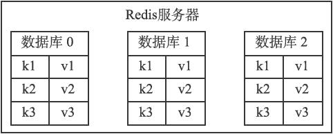

## 第九章 - -数据库

### 服务器中的数据库

Redis服务器将所有数据库都保存在服务器状态redis.h/redisServer结构的db数组中，db数组的每个项都是一个redis.h/redisDb结构，每个redisDb结构代表一个数据库：

~~~c
struct redisServer {
    // ...
    // 一个数组，保存着服务器中的所有数据库
    redisDb *db;
    // ...
};
~~~

在初始化服务器时，程序会根据服务器状态的dbnum属性来决定应该创建多少个数据库：

~~~c
struct redisServer {
    // ...
    // 服务器的数据库数量
    int dbnum;
    // ...
};
~~~

dbnum属性的值由服务器配置的database选项决定，默认情况下，该选项的值为16，所以Redis服务器默认会创建16个数据库。

### 切换数据库

每个Redis客户端都有自己的目标数据库，每当客户端执行数据库写命令或者数据库读命令的时候，目标数据库就会成为这些命令的操作对象。
默认情况下，Redis客户端的目标数据库为0号数据库，但客户端可以通过执行SELECT命令来切换目标数据库。

在服务器内部，客户端状态redisClient结构的db属性记录了客户端当前的目标数据库，这个属性是一个指向redisDb结构的指针：

~~~c
typedef struct redisClient {
    // ...
    // 记录客户端当前正在使用的数据库
    redisDb *db;
    // ...
} redisClient;
~~~

redisClient.db指针指向redisServer.db数组的其中一个元素，而被指向的元素就是客户端的目标数据库。
通过修改redisClient.db指针，让它指向服务器中的不同数据库，从而实现切换目标数据库的功能——这就是SELECT命令的实现原理。

### 数据库键空间

Redis是一个键值对（key-value pair）数据库服务器，服务器中的每个数据库都由一个redis.h/redisDb结构表示。
其中，redisDb结构的dict字典保存了数据库中的所有键值对，我们将这个字典称为键空间（key space）：

~~~c
typedef struct redisDb {
    // ...
    // 数据库键空间，保存着数据库中的所有键值对
    dict *dict;
    // ...
} redisDb;
~~~

键空间和用户所见的数据库是直接对应的：

* 键空间的键也就是数据库的键，每个键都是一个字符串对象。
* 键空间的值也就是数据库的值，每个值可以是字符串对象、列表对象、哈希表对象、集合对象和有序集合对象中的任意一种Redis对象。

因为数据库的键空间是一个字典，所以所有针对数据库的操作，比如添加一个键值对到数据库，或者从数据库中删除一个键值对，又或者在数据库中获取某个键值对等，实际上都是通过对键空间字典进行操作来实现的。
除了这些针对之外，还有很多针对数据库本身的Redis命令，也可以通过对键空间的操作来实现。比如用于清空整个数据库的FLUSHDB命令，就是通过删除键空间中的所有键值对来实现的。

**读写键空间时的维护操作**
当使用Redis命令对数据库进行读写时，服务器不仅会对键空间执行指定的读写操作，还会执行一些额外的维护操作，其中包括：

* 在读取一个键之后（读操作和写操作都要对键进行读取），服务器会根据键是否存在来更新服务器的键空间命中（hit）次数或键空间不命中（miss）次数，这两个值可以在INFO stats命令的keyspace_hits属性和keyspace_misses属性中查看。
* 在读取一个键之后，服务器会更新键的LRU（最后一次使用）时间，这个值可以用于计算键的闲置时间，使用OBJECT idletime命令可以查看键key的闲置时间。
* 如果服务器在读取一个键时发现该键已经过期，那么服务器会先删除这个过期键，然后才执行余下的其他操作。
* 如果有客户端使用WATCH命令监视了某个键，那么服务器在对被监视的键进行修改之后，会将这个键标记为脏（dirty），从而让事务程序注意到这个键已经被修改过。
* 服务器每次修改一个键之后，都会对脏（dirty）键计数器的值增1，这个计数器会触发服务器的持久化以及复制操作。
* 如果服务器开启了数据库通知功能，那么在对键进行修改之后，服务器将按配置发送相应的数据库通知。

### 设置键的生存时间或过期时间

通过EXPIRE命令或者PEXPIRE命令，客户端可以以秒或者毫秒精度为数据库中的某个键设置生存时间（Time To Live，TTL），在经过指定的秒数或者毫秒数之后，服务器就会自动删除生存时间为0的键。

SETEX命令可以在设置一个字符串键的同时为键设置过期时间（只能用于字符串键）。
与EXPIRE命令和PEXPIRE命令类似，客户端可以通过EXPIREAT命令或PEXPIREAT命令，以秒或者毫秒精度给数据库中的某个键设置过期时间（expire time）。
**过期时间是一个UNIX时间戳**，当键的过期时间来临时，服务器就会自动从数据库中删除这个键。

过期时间是一个UNIX时间戳，当键的过期时间来临时，服务器就会自动从数据库中删除这个键。

#### 设置过期时间

Redis有四个不同的命令可以用于设置键的生存时间（键可以存在多久）或过期时间（键什么时候会被删除）：

* `EXPIRE <key> <ttl>`命令用于将键key的生存时间设置为ttl秒。
* `PEXPIRE <key> <ttl>`命令用于将键key的生存时间设置为ttl毫秒。
* `EXPIREAT <key> <timestamp>`命令用于将键key的过期时间设置为timestamp所指定的秒数时间戳。
* `PEXPIREAT <key> <timestamp>`命令用于将键key的过期时间设置为timestamp所指定的毫秒数时间戳。

虽然有多种不同单位和不同形式的设置命令，但实际上EXPIRE、PEXPIRE、EXPIREAT三个命令都是使用PEXPIREAT命令来实现的：无论客户端执行的是以上四个命令中的哪一个，经过转换之后，最终的执行效果都和执行PEXPIREAT命令一样。

#### 保存过期时间

redisDb结构的expires字典保存了数据库中所有键的过期时间，我们称这个字典为过期字典：

* 过期字典的键是一个指针，这个指针指向键空间中的某个键对象（也即是某个数据库键）。
* 过期字典的值是一个long long类型的整数，这个整数保存了键所指向的数据库键的过期时间——一个毫秒精度的UNIX时间戳。

~~~c
typedef struct redisDb {
    // ...
    // 过期字典，保存着键的过期时间
    dict *expires;
    // ...
} redisDb;
~~~

以下是PEXPIREAT命令的伪代码定义：

~~~python
def PEXPIREAT(key, expire_time_in_ms):
    # 如果给定的键不存在于键空间，那么不能设置过期时间
    if key not in redisDb.dict:
        return 0
    # 在过期字典中关联键和过期时间
    redisDb.expires[key] = expire_time_in_ms
    # 过期时间设置成功
    return 1
~~~

#### 移除过期时间

PERSIST命令可以移除一个键的过期时间。
PERSIST命令就是PEXPIREAT命令的反操作：PERSIST命令在过期字典中查找给定的键，并解除键和值（过期时间）在过期字典中的关联。

以下是PERSIST命令的伪代码定义：

~~~python
def PERSIST(key):
    # 如果键不存在，或者键没有设置过期时间，那么直接返回
    if key not in redisDb.expires:
        return 0
    # 移除过期字典中给定键的键值对关联
    redisDb.expires.remove(key)
    # 键的过期时间移除成功
    return 1
~~~

#### 计算并返回剩余生存时间

TTL命令以秒为单位返回键的剩余生存时间，而PTTL命令则以毫秒为单位返回键的剩余生存时间。

TTL和PTTL两个命令都是通过计算键的过期时间和当前时间之间的差来实现的，以下是这两个命令的伪代码实现：

~~~python
def PTTL(key):
    # 键不存在于数据库
    if key not in redisDb.dict:
        return -2
    # 尝试取得键的过期时间
    # 如果键没有设置过期时间，那么 expire_time_in_ms 将为 None
    expire_time_in_ms = redisDb.expires.get(key)
    # 键没有设置过期时间
    if expire_time_in_ms is None:
        return -1
    # 获得当前时间
    now_ms = get_current_unix_timestamp_in_ms()
    # 过期时间减去当前时间，得出的差就是键的剩余生存时间
    return (expire_time_in_ms - now_ms)

def TTL(key):
    # 获取以毫秒为单位的剩余生存时间
    ttl_in_ms = PTTL(key)
    if ttl_in_ms < 0:
        # 处理返回值为-2和-1的情况
        return ttl_in_ms
    else:
        # 将毫秒转换为秒
        return ms_to_sec(ttl_in_ms)
~~~

#### 过期键的判定

通过过期字典，程序可以用以下步骤检查一个给定键是否过期：

1. 检查给定键是否存在于过期字典：如果存在，那么取得键的过期时间。
2. 检查当前UNIX时间戳是否大于键的过期时间：如果是的话，那么键已经过期；否则的话，键未过期。

可以用伪代码来描述这一过程：

~~~python
def is_expired(key):
    # 取得键的过期时间
    expire_time_in_ms = redisDb.expires.get(key)
    # 键没有设置过期时间
    if expire_time_in_ms is None:
        return False
    # 取得当前时间的UNIX时间戳
    now_ms = get_current_unix_timestamp_in_ms()
    # 检查当前时间是否大于键的过期时间
    if now_ms > expire_time_in_ms:
        # 是，键已经过期
        return True
    else:
        # 否，键未过期
        return False
~~~

实现过期键判定的另一种方法是使用TTL命令或者PTTL命令，比如说，如果对某个键执行TTL命令，并且命令返回的值大于等于0，那么说明该键未过期。
在实际中，Redis检查键是否过期的方法和is_expired函数所描述的方法一致，因为直接访问字典比执行一个命令稍微快一些。

### 过期键删除策略

如果一个键过期了，那么它什么时候会被删除呢？

这个问题有三种可能的答案，它们分别代表了三种不同的删除策略：

* 定时删除：在设置键的过期时间的同时，创建一个定时器（timer），让定时器在键的过期时间来临时，立即执行对键的删除操作。
* 惰性删除：放任键过期不管，但是每次从键空间中获取键时，都检查取得的键是否过期，如果过期的话，就删除该键；如果没有过期，就返回该键。
* 定期删除：每隔一段时间，程序就对数据库进行一次检查，删除里面的过期键。至于要删除多少过期键，以及要检查多少个数据库，则由算法决定。

在这三种策略中，第一种和第三种为主动删除策略，而第二种则为被动删除策略。

#### 定时删除

定时删除策略对内存是最友好的：通过使用定时器，定时删除策略可以保证过期键会尽可能快地被删除，并释放过期键所占用的内存。
另一方面，定时删除策略的缺点是，它对CPU时间是最不友好的：在过期键比较多的情况下，删除过期键这一行为可能会占用相当一部分CPU时间，在内存不紧张但是CPU时间非常紧张的情况下，将CPU时间用在删除和当前任务无关的过期键上，无疑会对服务器的响应时间和吞吐量造成影响。

例如，如果正有大量的命令请求在等待服务器处理，并且服务器当前不缺少内存，那么服务器应该优先将CPU时间用在处理客户端的命令请求上面，而不是用在删除过期键上面。
除此之外，创建一个定时器需要用到Redis服务器中的时间事件，而当前时间事件的实现方式——无序链表，查找一个事件的时间复杂度为O（N）——并不能高效地处理大量时间事件。
因此，要让服务器创建大量的定时器，从而实现定时删除策略，在现阶段来说并不现实。

#### 惰性删除

惰性删除策略对CPU时间来说是最友好的：程序只会在取出键时才对键进行过期检查，这可以保证删除过期键的操作只会在非做不可的情况下进行，并且删除的目标仅限于当前处理的键，这个策略不会在删除其他无关的过期键上花费任何CPU时间。
惰性删除策略的缺点是，它对内存是最不友好的：如果一个键已经过期，而这个键又仍然保留在数据库中，那么只要这个过期键不被删除，它所占用的内存就不会释放。
在使用惰性删除策略时，如果数据库中有非常多的过期键，而这些过期键又恰好没有被访问到的话，那么它们也许永远也不会被删除（除非用户手动执行FLUSHDB），我们甚至可以将这种情况看作是一种内存泄漏——无用的垃圾数据占用了大量的内存，而服务器却不会自己去释放它们，这对于运行状态非常依赖于内存的Redis服务器来说，肯定不是一个好消息。

举个例子，对于一些和时间有关的数据，比如日志（log），在某个时间点之后，对它们的访问就会大大减少，甚至不再访问，如果这类过期数据大量地积压在数据库中，用户以为服务器已经自动将它们删除了，但实际上这些键仍然存在，而且键所占用的内存也没有释放，那么造成的后果肯定是非常严重的。

#### 定期删除

从上面对定时删除和惰性删除的讨论来看，这两种删除方式在单一使用时都有明显的缺陷：

* 惰性删除浪费太多内存，有内存泄漏的危险。
* 定时删除占用太多CPU时间，影响服务器的响应时间和吞吐量。

定期删除策略是前两种策略的一种整合和折中：

* 定期删除策略每隔一段时间执行一次删除过期键操作，并通过限制删除操作执行的时长和频率来减少删除操作对CPU时间的影响。
* 除此之外，通过定期删除过期键，定期删除策略有效地减少了因为过期键而带来的内存浪费。

定期删除策略的难点是确定删除操作执行的时长和频率：

* 如果删除操作执行得太频繁，或者执行的时间太长，定期删除策略就会退化成定时删除策略，以至于将CPU时间过多地消耗在删除过期键上面。
* 如果删除操作执行得太少，或者执行的时间太短，定期删除策略又会和惰性删除策略一样，出现浪费内存的情况。

因此，如果采用定期删除策略的话，服务器必须根据情况，合理地设置删除操作的执行时长和执行频率。
**任何单一的方案都有各自的优势和不足，因此，通常情况都是将不同的方案组合，以尽可能的利用他们的优势，降低劣势。同时可以根据实际业务需要、服务器性能等实际情况进行调整。**

### Redis的过期键删除策略

Redis服务器实际使用的是惰性删除和定期删除两种策略：通过配合使用这两种删除策略，服务器可以很好地在合理使用CPU时间和避免浪费内存空间之间取得平衡。

#### 惰性删除策略的实现

过期键的惰性删除策略由db.c/expireIfNeeded函数实现，所有读写数据库的Redis命令在执行之前都会调用expireIfNeeded函数对输入键进行检查：

* 如果输入键已经过期，那么expireIfNeeded函数将输入键从数据库中删除。
* 如果输入键未过期，那么expireIfNeeded函数不做动作。

expireIfNeeded函数就像一个过滤器，它可以在命令真正执行之前，过滤掉过期的输入键，从而避免命令接触到过期键。

另外，因为每个被访问的键都可能因为过期而被expireIfNeeded函数删除，所以每个命令的实现函数都必须能同时处理键存在以及键不存在这两种情况：

* 当键存在时，命令按照键存在的情况执行。
* 当键不存在或者键因为过期而被expireIfNeeded函数删除时，命令按照键不存在的情况执行。

#### 定期删除策略的实现

过期键的定期删除策略由redis.c/activeExpireCycle函数实现，每当Redis的服务器周期性操作redis.c/serverCron函数执行时，activeExpireCycle函数就会被调用，它在规定的时间内，分多次遍历服务器中的各个数据库，从数据库的expires字典中随机检查一部分键的过期时间，并删除其中的过期键。

整个过程可以用伪代码描述如下：

~~~python
# 默认每次检查的数据库数量
DEFAULT_DB_NUMBERS = 16
# 默认每个数据库检查的键数量
DEFAULT_KEY_NUMBERS = 20
# 全局变量，记录检查进度
current_db = 0

def activeExpireCycle():
    # 初始化要检查的数据库数量
    # 如果服务器的数据库数量比 DEFAULT_DB_NUMBERS 要小
    # 那么以服务器的数据库数量为准
    if server.dbnum < DEFAULT_DB_NUMBERS:
        db_numbers = server.dbnum
    else:
        db_numbers = DEFAULT_DB_NUMBERS
    # 遍历各个数据库
    for i in range(db_numbers):
        # 如果current_db的值等于服务器的数据库数量
        # 这表示检查程序已经遍历了服务器的所有数据库一次
        # 将current_db重置为0，开始新的一轮遍历
        if current_db == server.dbnum:
            current_db = 0
        # 获取当前要处理的数据库
        redisDb = server.db[current_db]
        # 将数据库索引增1，指向下一个要处理的数据库
        current_db += 1
        # 检查数据库键
        for j in range(DEFAULT_KEY_NUMBERS):
            # 如果数据库中没有一个键带有过期时间，那么跳过这个数据库
            if redisDb.expires.size() == 0: break
            # 随机获取一个带有过期时间的键
            key_with_ttl = redisDb.expires.get_random_key()
            # 检查键是否过期，如果过期就删除它
            if is_expired(key_with_ttl):
                delete_key(key_with_ttl)
            # 已达到时间上限，停止处理
            if reach_time_limit(): return
~~~

activeExpireCycle函数的工作模式可以总结如下：

* 函数每次运行时，都从一定数量的数据库中取出一定数量的随机键进行检查，并删除其中的过期键。
* 全局变量current_db会记录当前activeExpireCycle函数检查的进度，并在下一次activeExpireCycle函数调用时，接着上一次的进度进行处理。比如说，如果当前activeExpireCycle函数在遍历10号数据库时返回了，那么下次activeExpireCycle函数执行时，将从11号数据库开始查找并删除过期键。
* 随着activeExpireCycle函数的不断执行，服务器中的所有数据库都会被检查一遍，这时函数将current_db变量重置为0，然后再次开始新一轮的检查工作。

### AOF、RDB和复制功能对过期键的处理

看看过期键对Redis服务器中其他模块的影响，看看RDB持久化功能、AOF持久化功能以及复制功能是如何处理数据库中的过期键的。

#### 生成RDB文件

在执行SAVE命令或者BGSAVE命令创建一个新的RDB文件时，程序会对数据库中的键进行检查，已过期的键不会被保存到新创建的RDB文件中。
数据库中包含过期键不会对生成新的RDB文件造成影响。

#### 载入RDB文件

在启动Redis服务器时，如果服务器开启了RDB功能，那么服务器将对RDB文件进行载入：

* 如果服务器以主服务器模式运行，那么在载入RDB文件时，程序会对文件中保存的键进行检查，未过期的键会被载入到数据库中，而过期键则会被忽略，所以过期键对载入RDB文件的主服务器不会造成影响。
* 如果服务器以从服务器模式运行，那么在载入RDB文件时，文件中保存的所有键，不论是否过期，都会被载入到数据库中。不过，因为主从服务器在进行数据同步的时候，从服务器的数据库就会被清空，所以一般来讲，过期键对载入RDB文件的从服务器也不会造成影响。

#### AOF文件写入

当服务器以AOF持久化模式运行时，如果数据库中的某个键已经过期，但它还没有被惰性删除或者定期删除，那么AOF文件不会因为这个过期键而产生任何影响。
当过期键被惰性删除或者定期删除之后，程序会向AOF文件追加（append）一条DEL命令，来显式地记录该键已被删除。

举个例子，如果客户端使用GET message命令，试图访问过期的message键，那么服务器将执行以下三个动作：

1. 从数据库中删除message键。
2. 追加一条DEL message命令到AOF文件。
3. 向执行GET命令的客户端返回空回复。

#### AOF重写

和生成RDB文件时类似，在执行AOF重写的过程中，程序会对数据库中的键进行检查，已过期的键不会被保存到重写后的AOF文件中。
数据库中包含过期键不会对AOF重写造成影响。

#### 复制

当服务器运行在复制模式下时，从服务器的过期键删除动作由主服务器控制：

* 主服务器在删除一个过期键之后，会显式地向所有从服务器发送一个DEL命令，告知从服务器删除这个过期键。
* 从服务器在执行客户端发送的读命令时，即使碰到过期键也不会将过期键删除，而是继续像处理未过期的键一样来处理过期键。
* 从服务器只有在接到主服务器发来的DEL命令之后，才会删除过期键。

通过由主服务器来控制从服务器统一地删除过期键，可以保证主从服务器数据的一致性，也正是因为这个原因，当一个过期键仍然存在于主服务器的数据库时，这个过期键在从服务器里的复制品也会继续存在。

**在主从复制中，数据一致性至关重要。** 主从服务器常用于读写分离，允许从服务器延迟一定的状态同步来提升读性能。

### 数据库通知

数据库通知是Redis 2.8版本新增加的功能，这个功能可以让客户端通过订阅给定的频道或者模式，来获知数据库中键的变化，以及数据库中命令的执行情况。

关注“某个键执行了什么命令”的通知称为**键空间通知（key-space notification）**，
除此之外，还有另一类称为**键事件通知（key-event notification）** 的通知，它们关注的是“某个命令被什么键执行了”。

服务器配置的 `notify-keyspace-events` 选项决定了服务器所发送通知的类型：

~~~
K     Keyspace events, published with __keyspace@<db>__ prefix.
E     Keyevent events, published with __keyevent@<db>__ prefix.
g     Generic commands (non-type specific) like DEL, EXPIRE, RENAME, ...
$     String commands
l     List commands
s     Set commands
h     Hash commands
z     Sorted set commands
t     Stream commands
d     Module key type events
x     Expired events (events generated every time a key expires)
e     Evicted events (events generated when a key is evicted for maxmemory)
m     Key miss events (events generated when a key that doesn't exist is accessed)
n     New key events (Note: not included in the 'A' class)
A     Alias for "g$lshztxed", so that the "AKE" string means all the events except "m" and "n".
~~~

更多设置信息，可以参考官方文档：[Redis keyspace notifications](https://redis.io/docs/latest/develop/use/keyspace-notifications/)。

#### 发送通知

发送数据库通知的功能是由notify.c/notifyKeyspaceEvent函数实现的： `void notifyKeyspaceEvent(int type,char *event,robj *key,int dbid);`

函数的 type 参数是当前想要发送的通知的类型，程序会根据这个值来判断通知是否就是服务器配置 notify-keyspace-events 选项所选定的通知类型，从而决定是否发送通知。
event、keys 和 dbid 分别是事件的名称、产生事件的键，以及产生事件的数据库号码，函数会根据 type 参数以及这三个参数来构建事件通知的内容，以及接收通知的频道名。
每当一个Redis命令需要发送数据库通知的时候，该命令的实现函数就会调用 notify-KeyspaceEvent 函数，并向函数传递传递该命令所引发的事件的相关信息。

#### 发送通知的实现

以下是notifyKeyspaceEvent函数的伪代码实现：

~~~python
def notifyKeyspaceEvent(type, event, key, dbid):
    # 如果给定的通知不是服务器允许发送的通知，那么直接返回
    if not(server.notify_keyspace_events & type):
        return
    # 发送键空间通知
    if server.notify_keyspace_events & REDIS_NOTIFY_KEYSPACE:
        # 将通知发送给频道__keyspace@<dbid>__:<key>
        # 内容为键所发生的事件 <event>
        # 构建频道名字
        chan = "__keyspace@{dbid}__:{key}".format(dbid=dbid, key=key)
        # 发送通知
        pubsubPublishMessage(chan, event)
    # 发送键事件通知
    if server.notify_keyspace_events & REDIS_NOTIFY_KEYEVENT:
        # 将通知发送给频道__keyevent@<dbid>__:<event>
        # 内容为发生事件的键 <key>
        # 构建频道名字
        chan = "__keyevent@{dbid}__:{event}".format(dbid=dbid,event=event)
        # 发送通知
        pubsubPublishMessage(chan, key)
~~~

notifyKeyspaceEvent 函数执行以下操作：

1. server.notify_keyspace_events 属性就是服务器配置 notify-keyspace-events 选项所设置的值，如果给定的通知类型type不是服务器允许发送的通知类型，那么函数会直接返回，不做任何动作。
2. 如果给定的通知是服务器允许发送的通知，那么下一步函数会检测服务器是否允许发送键空间通知，如果允许的话，程序就会构建并发送事件通知。
3. 最后，函数检测服务器是否允许发送键事件通知，如果允许的话，程序就会构建并发送事件通知。

另外，pubsubPublishMessage 函数是 PUBLISH 命令的实现函数，执行这个函数等同于执行PUBLISH命令，订阅数据库通知的客户端收到的信息就是由这个函数发出的。

## RDB持久化

Redis是一个键值对数据库服务器，服务器中通常包含着任意个非空数据库，而每个非空数据库中又可以包含任意个键值对，为了方便起见，我们将服务器中的非空数据库以及它们的键值对统称为数据库状态。

下面展示了一个包含三个非空数据库的Redis服务器，这三个数据库以及数据库中的键值对就是该服务器的数据库状态。

因为Redis是内存数据库，它将自己的数据库状态储存在内存里面，所以如果不想办法将储存在内存中的数据库状态保存到磁盘里面，那么一旦服务器进程退出，服务器中的数据库状态也会消失不见。
为了解决这个问题，Redis提供了RDB持久化功能，这个功能可以将Redis在内存中的数据库状态保存到磁盘里面，避免数据意外丢失。

RDB持久化既可以手动执行，也可以根据服务器配置选项定期执行，该功能可以将某个时间点上的数据库状态保存到一个RDB文件中。
RDB持久化功能所生成的RDB文件是一个经过压缩的二进制文件，通过该文件可以还原生成RDB文件时的数据库状态。

因为RDB文件是保存在硬盘里面的，所以即使Redis服务器进程退出，甚至运行Redis服务器的计算机停机，但只要RDB文件仍然存在，Redis服务器就可以用它来还原数据库状态。

### RDB文件的创建与载入

有两个Redis命令可以用于生成RDB文件，一个是SAVE，另一个是BGSAVE。

**SAVE命令会阻塞Redis服务器进程，直到RDB文件创建完毕为止**，在服务器进程阻塞期间，服务器不能处理任何命令请求。
和SAVE命令直接阻塞服务器进程的做法不同，**BGSAVE命令会派生出一个子进程，然后由子进程负责创建RDB文件，服务器进程（父进程）继续处理命令请求。**

创建RDB文件的实际工作由rdb.c/rdbSave函数完成，SAVE命令和BGSAVE命令会以不同的方式调用这个函数，通过以下伪代码可以明显地看出这两个命令之间的区别：

~~~python
def SAVE():
    # 创建RDB文件
    rdbSave()
    
def BGSAVE():
    # 创建子进程
    pid = fork()
    if pid == 0:
        # 子进程负责创建RDB文件
        rdbSave()
        # 完成之后向父进程发送信号
        signal_parent()
    elif pid > 0:
        # 父进程继续处理命令请求，并通过轮询等待子进程的信号
        handle_request_and_wait_signal()
    else:
        # 处理出错情况
        handle_fork_error()
~~~

和使用SAVE命令或者BGSAVE命令创建RDB文件不同，RDB文件的载入工作是在服务器启动时自动执行的，所以Redis并没有专门用于载入RDB文件的命令，只要Redis服务器在启动时检测到RDB文件存在，它就会自动载入RDB文件。

另外值得一提的是，因为AOF文件的更新频率通常比RDB文件的更新频率高，所以：

* 如果服务器开启了AOF持久化功能，那么服务器会**优先使用AOF文件**来还原数据库状态。
* 只有在AOF持久化功能处于关闭状态时，服务器才会使用RDB文件来还原数据库状态。

#### SAVE命令执行时的服务器状态

前面提到过，当SAVE命令执行时，Redis服务器会被阻塞，所以当SAVE命令正在执行时，客户端发送的所有命令请求都会被拒绝。
只有在服务器执行完SAVE命令、重新开始接受命令请求之后，客户端发送的命令才会被处理。

#### BGSAVE命令执行时的服务器状态

因为 BGSAVE 命令的保存工作是由子进程执行的，所以在子进程创建 RDB 文件的过程中， Redis 服务器仍然可以继续处理客户端的命令请求。
但是，在 BGSAVE 命令执行期间，服务器处理 SAVE 、 BGSAVE 、 BGREWRITEAOF 三个命令的方式会和平时有所不同。

首先，在 BGSAVE 命令执行期间，客户端发送的 SAVE 命令会被服务器拒绝，服务器禁止 SAVE 命令和 BGSAVE 命令同时执行是为了避免父进程（服务器进程）和子进程同时执行两个 rdbSave 调用，防止产生竞争条件。
其次，在 BGSAVE 命令执行期间，客户端发送的 BGSAVE 命令会被服务器拒绝，因为同时执行两个 BGSAVE 命令也会产生竞争条件。
最后， BGREWRITEAOF 和 BGSAVE 两个命令不能同时执行：

* 如果 BGSAVE 命令正在执行，那么客户端发送的 BGREWRITEAOF 命令会被延迟到 BGSAVE 命令执行完毕之后执行。
* 如果 BGREWRITEAOF 命令正在执行，那么客户端发送的 BGSAVE 命令会被服务器拒绝。

因为 BGREWRITEAOF 和 BGSAVE 两个命令的实际工作都由子进程执行，所以这两个命令在操作方面并没有什么冲突的地方。
不能同时执行它们只是一个性能方面的考虑——并发出两个子进程，并且这两个子进程都同时执行大量的磁盘写入操作，这怎么想都不会是一个好主意。

#### RDB文件载入时的服务器状态

**服务器在载入RDB文件期间，会一直处于阻塞状态，直到载入工作完成为止。**

### 自动间隔性保存

SAVE命令由服务器进程执行保存工作，BGSAVE命令则由子进程执行保存工作，所以SAVE命令会阻塞服务器，而BGSAVE命令则不会。

因为BGSAVE命令可以在不阻塞服务器进程的情况下执行，所以Redis允许用户通过设置服务器配置的save选项，让服务器每隔一段时间自动执行一次BGSAVE命令。
用户可以通过save选项设置多个保存条件，但只要其中任意一个条件被满足，服务器就会执行BGSAVE命令。

#### 设置保存条件

当Redis服务器启动时，用户可以通过指定配置文件或者传入启动参数的方式设置save选项，如果用户没有主动设置save选项，那么服务器会为save选项设置默认条件：

~~~
save 900 1
save 300 10
save 60 10000
~~~

* 服务器在900秒之内，对数据库进行了至少1次修改。
* 服务器在300秒之内，对数据库进行了至少10次修改。
* 服务器在60秒之内，对数据库进行了至少10000次修改。

接着，服务器程序会根据save选项所设置的保存条件，设置服务器状态redisServer结构的saveparams属性：

~~~c
struct redisServer {
    // ...
    // 记录了保存条件的数组
    struct saveparam *saveparams;
    // ...
};
~~~

saveparams属性是一个数组，数组中的每个元素都是一个saveparam结构，每个saveparam结构都保存了一个save选项设置的保存条件：

~~~c
struct saveparam {
    // 秒数
    time_t seconds;
    // 修改数
    int changes;
};
~~~

#### dirty 计数器和 lastsave 属性

除了 saveparams 数组之外，服务器状态还维持着一个 dirty 计数器，以及一个 lastsave 属性：

* dirty 计数器记录距离上一次成功执行 SAVE 命令或者 BGSAVE 命令之后，服务器对数据库状态（服务器中的所有数据库）进行了多少次修改（包括写入、删除、更新等操作）。
* lastsave 属性是一个 UNIX 时间戳，记录了服务器上一次成功执行 SAVE 命令或者 BGSAVE 命令的时间。

~~~c
struct redisServer {
    // ...
    // 修改计数器
    long long dirty;
    // 上一次执行保存的时间
    time_t lastsave;
    // ...
};
~~~

当服务器成功执行一个数据库修改命令之后，程序就会对dirty计数器进行更新：命令修改了多少次数据库，dirty计数器的值就增加多少。

#### 检查保存条件是否满足

Redis的服务器周期性操作函数serverCron默认每隔100毫秒就会执行一次，该函数用于对正在运行的服务器进行维护，它的其中一项工作就是检查save选项所设置的保存条件是否已经满足，如果满足的话，就执行BGSAVE命令。

以下伪代码展示了serverCron函数检查保存条件的过程：

~~~python

def serverCron():
    # ...
    # 遍历所有保存条件
    for saveparam in server.saveparams:
        # 计算距离上次执行保存操作有多少秒
        save_interval = unixtime_now()-server.lastsave
        # 如果数据库状态的修改次数超过条件所设置的次数
        # 并且距离上次保存的时间超过条件所设置的时间
        # 那么执行保存操作
        if server.dirty >= saveparam.changes and save_interval > saveparam.seconds:
            BGSAVE()
    # ...
~~~

程序会遍历并检查saveparams数组中的所有保存条件，只要有任意一个条件被满足，那么服务器就会执行BGSAVE命令。

