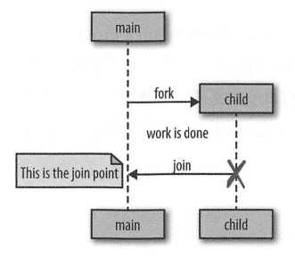

## 第三章 - Go语言并发组件

这章介绍Go中的特性，以及它如何支持并发。（终于到实际使用了

### goroutine

goroutine是Go语言程序中最基本的组织单位之一。
每个Go语言程序都至少有一个goroutine:main goroutine，它在进程开始时自动创建并启动。
几乎在所有的项目中，你迟早会使用goroutine来解决Go语言编程遇到的问题。所以，它们是什么？

简单地说，goroutine是一个并发的函数（记住：不一定是并行的），与其他代码一起运行。
你可以简单地在一个函数之前添加go关键字来触发：`go sum()`
同样可以作为匿名函数使用！这里有一个例子和前面的例子一样。
然而，我们不是创建一个基于函数的goroutine,而是创建一个基于匿名函数 goroutine:`go func() { // ... }()`

下面的内容来看看 goroutine 是如何工作的？它们是OS线程吗？绿色线程？我们能创造多少个 goroutine？

Go语言中的goroutine是独一无二的（尽管其他的一些语言有类似的并发原语)。
它们不是OS线程，也不是绿色线程（由语言运行时管理的线程），它们是一个更高级别的抽象，称为协程。
**协程是一种非抢占式的简单并发子goroutine(函数、闭包或方法)，也就是说，它们不能被中断。** 取而代之的是，协程有多个点，允许暂停或重新进入。

goroutine的独特之处在于它们与Go语言的运行时的深度集成。goroutine没有定义自己的暂停方法或再运行点。
**Go语言的运行时会观察goroutine的运行时行为，并在它们阻塞时自动挂起它们，然后在它们不被阻塞时恢复它们。**
**在某种程度上，这使它们成为可抢占的，但只是在goroutine被阻塞的情况。** 在运行时和goroutine的逻辑之间，是一种优雅的伙伴关系。
因此，goroutine可以被认为是一种特殊类型的协程。

协程和goroutine都是隐式并发结构，但并发并不是协程的属性：必须同时托管多个协程，并给每个协程一个执行的机会。否则，它们就不会并发！
请注意，这并不意味着协程是隐式并行的。当然有可能有几个协程按顺序并行执行的假象，事实上，这种情况一直在发生。

Go语言的主机托管机制是一个名为M:N调度器的实现，这意味着它将M个绿色线程映射到N个OS线程。然后将goroutine安排在绿色线程上。
当我们的goroutine数量超过可用的绿色线程时，调度程序将处理分布在可用线程上的goroutine,并确保当这些goroutine被阻塞时，其他的goroutine可以运行。
这里只介绍Go语言的并发模型，细节在后续章节中。

Go语言遵循一个称为ork-join的并发模型。
fork这个词指的是在程序中的任意一点，它可以将执行的子分支与共父节点同时运行。
jon这个词指的是，在将来某个时候，这些并发的执行分支将会合并在一起。

Go语言是如何执行fork的，执行的子线程是goroutine。
让我们回到简单的goroutine例子：

~~~go
package main

import "fmt"

func main() {
	sayHello := func() {
		fmt.Println("hello")
	}
	go sayHello()
	//继续执行自己的逻辑
}
~~~

在这里，sayHello函数将在goroutine上运行，而程序的其余部分将继续执行。
在本例中，没有join点。执行sayHello的goroutine将在未来的某个不确定的时间退出，而程序的其余部分将会继续执行。

但是，这个例子有一个问题：正如上面所写的程序，它不确定sayHello函数是否会运行。
goroutine将会被创建，并计划在Go语言运行时执行，但是它实际上可能没有机会在main goroutine退出之前运行。

实际上，因为我们省略了min函数的其余部分，为了简单起见，当运行这个小示例时，几乎可以肯定的是，程序将在goroutine被系统调用之前完成执行。
因此，你不会看到“hello'”这个词被打印到stdout。你可以在创建goroutine之后执行time.Sleep,但是要记住，这实际上并没有创建一个join点，只有一个竞争条件。
如果回顾第1章，你增加了goroutine在程序退出前执行的概率，但你并不能保证一定会执行。**join点是保证程序正确性和消除竞争条件的关键。**

为了创建一个join点，你必须同步main goroutine和sayHello goroutine。
这可以通过多种方式实现，这里使用：sync.Waitgroup。
下面是一个正确的例子：

~~~go
package main

import (
	"fmt"
	"sync"
)

func main() {
	var wg sync.WaitGroup
	sayHello := func() {
		defer wg.Done()
		fmt.Println("hello")
	}
	wg.Add(1)
	go sayHello()
	wg.Wait() // 这就是连接点的使用方式
}
~~~

输出如下： `hello`

这个例子将决定main goroutine,直到goroutine托管sayHello函数为止。
我们在示例中使用了许多匿名函数来创建快速goroutine样例。让我们把注意力转移到闭包上。
闭包可以从创建它们的作用域中获取变量。如果你在goroutine中运行一个闭包，那么闭包是在这些变量的副本上运行，还是原值的引用上运行？
让我们试试看：

~~~go
package main

import (
	"fmt"
	"sync"
)

func main() {
	var wg sync.WaitGroup
	salutation := "hello"
	wg.Add(1)
	go func() {
		defer wg.Done()
		salutation = "welcome" // 尝试修改 salutation 变量
	}()
	wg.Wait()
	fmt.Println(salutation)
}
~~~

运行结果：`welcome`
事实证明，goroutine在它们所创建的相同地址空间内执行，因此我们的程序打印出“welcome”这个词。
让我们再看一个例子。你认为这个程序会输出什么？

~~~go
package main

import (
	"fmt"
	"sync"
)

func main() {
	var wg sync.WaitGroup
	for _, salutation := range []string{"hello", "greetings", "good day"} {
		wg.Add(1)
		go func() {
			defer wg.Done()
			fmt.Println(salutation) // 引用了字符串类型的切片作为创建循环变量的salutation值
		}()
		wg.Wait()
	}
}
~~~

答案比大多数人想象的要复杂得多，而且是为数不多的令人惊讶的事情之一。
大多数人直觉上认为这将会不确定顺序地打印出“hello”“greetings”和“good day”,但看看它做了什么：

~~~
good day
good day
good day
~~~

这里真的是这样吗？在我电脑上的输出是符合大多数人的直觉的：会以不确定的顺序打印出“hello”“greetings”和“good day”。
为什么呢？查了资料后发现，这是循环迭代器变量引用的问题：[常见错误](https://go.dev/wiki/CommonMistakes) [For 语句](https://go.dev/ref/spec#For_statements)
在1.22及后不会出现循环迭代器变量引用的问题。每个循环迭代器变量都是一个新的副本，所以上面程序的输出会是：

~~~
hello
greetings
good day
~~~

并且是乱序的（每次输出都不一致），下面的讨论在1.22之前，1.22及后不会出现。
在上面的示例中，goroutine正在运行一个闭包，**该闭包使用变量salutation时，字符串的迭代已经结束。**
当我们循环迭代时，salutation被分配到slice literal中的下一个字符串值。因为计划中的goroutine可能在未来的任何时间点运行，它不确定在goroutine中会打印出什么值。
在性能比较好的机器上，在goroutine开始之前循环有很高的概率会退出。这意味着变量的salutation值不在范围之内。然后会发生什么呢？
goroutine还能引用一些已经超出范围的东西吗？goroutine不会访问那些可能被垃圾回收的内存吗？
这是一个关于如何管理内存的有趣的点。Go语言运行时会足够小心地将对变量salutation值的引用仍然保留，由内存转移到堆，以便goroutine可以继续访问它。

通常在我的计算机上，在任何goroutine开始运行之前，循环就会退出，所以salutation会被转移到堆中，在我的字符串切片中引用最后一个值“good day”。
所以我通常会看到三次“good day”。编写这个循环的正确方法是将salutation的副本传递到闭包中，这样当goroutine运行时，它将从循环的迭代中操作数据：

~~~go
package main

import (
	"fmt"
	"sync"
)

func main() {
	var wg sync.WaitGroup
	for _, salutations := range []string{"hello", "greetings", "good day"} {
		wg.Add(1)
		go func(salutations string) {
			defer wg.Done()
			fmt.Println(salutations)
		}(salutations)
	}
	wg.Wait()
}
~~~

当然，在1.22及以后的版本是不需要这么写的。

这些goroutine在相同的地址空间中运行，并且只有简单的宿主函数，所有使用goroutine编写非并发代码是非常自然的。
Go语言的编译器很好地处理了内存中的变量，这样goroutine就不会意外地访问被释放的内存，这使得开发人员可以专注于他们的问题空间而不是内存管理。
然而，这不是一张空白支票。

由于多个goroutine可以在同一个地址空间上运行，所以我们仍然需要担心同步问题。
正如我们已经讨论过的，我们可以选择同步访问goroutine访问的共享内存，或者可以使用CSP原语通过通信来共享内存。

goroutine的另一个好处是它们非常轻。下面是“Go语言FAQ”的摘录：
> 一个新创建的goroutine被赋予了几千字节，这在大部分情况都是足够的。
> 当它不运行时，Go语言运行时就会自动增长（缩小）存储堆栈的内存，允许许多goroutine存在适当的内存中。
> 每个函数调用CPU的开销平均为3个廉价指令。在同一个地址空间中创建成千上万的goroutine是可行的。如果goroutine只是线程，系统的资源消耗会更小。

每个goroutine几千字节，这并没有什么问题！让我们来验证一下。
但是在我们开始之前，我们必须讨论一个关于goroutine有趣的事情：
**GC并没有回收被丢弃的goroutine。**
如果我写如下代码：

~~~go
package main

func main() {
	go func() {
		//将永远阻塞的操作
	}()
	//开始工作
}
~~~

这里的goroutine将一直存在直到进程退出（**协程泄露！**）。在下一个例子中，我们将利用这一点来实际测算goroutine的大小。

在下面的例子中，我们将goroutine不被GC的事实与运行时的自省能力结合起来，并测算在goroutine创建之前和之后分配的内存数量：

~~~go
package main

import (
	"fmt"
	"runtime"
	"sync"
)

func main() {
	memConsumed := func() uint64 {
		runtime.GC()
		var s runtime.MemStats
		runtime.ReadMemStats(&s)
		return s.Sys
	}

	var c <-chan any
	var wg sync.WaitGroup
	noop := func() { wg.Done(); <-c }

	const numGoroutines = 1e6
	wg.Add(numGoroutines)
	before := memConsumed()
	for i := numGoroutines; i > 0; i-- {
		go noop()
	}
	wg.Wait()
	after := memConsumed()
	fmt.Printf("%fkb", float64(after-before)/numGoroutines/1024)
}
~~~

我们需要一个永远不会退出的goroutine.,这样就可以在内存中保留一段时间用于测侧算。
定义了要创建的goroutine的数量。我们将用大数定律，渐渐地接近一个goroutine的大小。
输出结果为：`8.560508kb`，这里go版本为1.22.4。老版本goroutine的大小会更小。

理论上百万个goroutine内存占用只有9G。这也足以说明goroutine的轻量。
**可能会影响性能的是上下文切换，即当一个被托管的并发进程必须保存它的状态以切换到一个不同的运行并发进程时。**
如果我们有太多的并发进程，可能会将所有的CPU时间消耗在它们之间的上下文切换上，而没有资源完成任何真正需要CPU的工作。
在操作系统级别，使用线程可能非常昂贵。OS线程必须保存如寄存器值、查找表和内存映射之类的东西，以便能够在有限的时间内成功地切换回当前线程。
然后，它必须为传入的线程加载相同的信息。

软件中的上下文切换相对来说要廉价得多。
在一个软件定义的调度器下，运行时可以更有选择性地保存数据用于检索，如何持久化，以及何时需要持久化。
让我们来看看在OS线程和goroutine之间切换的上下文的相对性能。
首先，我们将利用Linux的内置基准测试套件来度量在相同核心的两个线程之间发送消息需要多长时间（需要安装perf工具，需要与内核版本匹配：`sudo apt install linux-tools-common linux-tools-generic`）：
`taskset -c 0 perf bench sched pipe -T`

输出如下：

~~~
# Running 'sched/pipe' benchmark:
# Executed 1000000 pipe operations between two threads

     Total time: 5.855 [sec]

       5.855618 usecs/op
         170776 ops/sec
~~~

这个基准实际上度量了在线程上发送和接收消息所需的时间，因此我们将计算结果并将其除以2。
我们用了`2.927μs`来进行上下文切换。这看起来不算太糟，但还是保留判断，直到我们检查goroutine之间的上下文切换。

我们将使用Go语言构建一个类似的基准。下面的示例将创建两个goroutine并在它们之间发送一条消息：

~~~go
package main

import (
	"sync"
	"testing"
)

func BenchmarkContextSwitch(b *testing.B) {
	var wg sync.WaitGroup
	begin := make(chan struct{})
	c := make(chan struct{})
	var token struct{}
	sender := func() {
		defer wg.Done()
		<-begin
		for i := 0; i < b.N; i++ {
			c <- token
		}
	}
	receiver := func() {
		defer wg.Done()
		<-begin
		for i := 0; i < b.N; i++ {
			<-c
		}
	}
	wg.Add(2)
	go sender()
	go receiver()
	b.StartTimer()
	close(begin)
	wg.Wait()
}
~~~

运行结果（`go test -bench=. -cpu=1`）：

~~~
BenchmarkContextSwitch   6329348        218.8 ns/op
PASS
ok   learn 1.582s
~~~

每个上下文切换需要`218.8ns`，2.927μs的7.48%
很难断言goroutine会导致上下文切换过于频繁，但上限可能不会成为使用goroutine的阻碍。

### sync包

**sync包包含对低级别内存访问同步最有用的并发原语**。
如果你使用的语言主要通过内存访问同步来处理并发，那么你可能已经熟悉了这些类型。
Go语言和这些语言之间的区别在于，Go语言已经在内存访问同步原语之上构建了一组新的并发原语，以向你提供一组扩展的工作。
正如我们在第2章“Go语言的并发哲学”中所讨论的，这些操作都有它们的用途，主要是在诸如struct这样的小范围内。由你决定何时进行内存访问同步。
说到这里，让我们开始看一下sync包公开的各种原语。

### WaitGroup

当你不关心并发操作的结果，或者你有其他方法来收集它们的结果时，WaitGroup是等待一组并发操作完成的好方法。
如果这两个条件都不满足，我建议你使用channel和select语句。
下面是一个使用WaitGroup等待goroutine完成的基本例子：

~~~go
package main

import (
	"fmt"
	"sync"
	"time"
)

func main() {
	var wg sync.WaitGroup
	wg.Add(1)
	go func() {
		defer wg.Done()
		fmt.Println("1st goroutine sleeping...")
		time.Sleep(1)
	}()
	wg.Add(1)
	go func() {
		defer wg.Done()
		fmt.Println("2nd goroutine sleeping...")
		time.Sleep(2)
	}()
	wg.Wait()
	fmt.Println("All goroutines completed.")
}
~~~

输出如下：

~~~
2nd goroutine sleeping...
1st goroutine sleeping...
All goroutines completed.
~~~

可以将WaitGroup视为一个并发-安全的计数器：**调用通过传入的整数执行add方法增加计数器的增量，并调用Done方法对计数器进行递减。Wait阻塞，直到计数器为零。**

注意，添加的Add调用是在他们帮助跟踪的goroutine之外完成的。
如果我们不这样做，我们就会引人一种竞争条件，因为在本章前面“goroutines'”中，我们不能保证goroutine何时会被调度，可以在goroutine开始调度前调用Wait方法。
如果将调用Add的方法添加到goroutine的闭包中，那么Wait调用可能会直接返回，而且不会阻塞，因为Add调用不会发生。

### 互斥锁与读写锁

Mutex 是“互斥”的意思，是保护程序中临界区的一种方式。
临界区是你程序中需要独占访问共享资源的区域。
Mutex提供了一种安全的方式来表示对这些共享资源的独占访问。
为了使用一个资源，channel通过通信共享内存，而Mutex通过开发人员的约定同步访问共享内存。
你可以通过使用Mutex对内存进行保护来协调对内存的访问。
这里有一个简单的例子，两个goroutine试图增加和减少一个共同的值，它们使用Mutex互斥锁来同步访问：

~~~go
package main

import (
	"fmt"
	"sync"
)

func main() {
	var count int
	var lock sync.Mutex
	increment := func() {
		lock.Lock()
		defer lock.Unlock()
		count++
		fmt.Printf("Incrementing: %d\n", count)
	}
	decrement := func() {
		lock.Lock()
		defer lock.Unlock()
		count--
		fmt.Printf("Decrementing: %d\n", count)
	}
	// 增量
	var arithmetic sync.WaitGroup
	for i := 0; i <= 5; i++ {
		arithmetic.Add(1)
		go func() {
			defer arithmetic.Done()
			increment()
		}()
	}
	// 减量
	for i := 0; i <= 5; i++ {
		arithmetic.Add(1)
		go func() {
			defer arithmetic.Done()
			decrement()
		}()
	}
	arithmetic.Wait()
	fmt.Println("Arithmetic complete.")
}
~~~

输出如下：

~~~
Incrementing: 1
Decrementing: 0
Decrementing: -1
Incrementing: 0
Decrementing: -1
Decrementing: -2
Incrementing: -1
Incrementing: 0
Arithmetic complete.
~~~

你会注意到，**我们总是在defer语句中调用Unlock。这是一个十分常见的习惯用法，它使用Mutex互斥锁来确保即使出现了panic,调用也总是发生。如果不这样做，可能会导致程序陷人死锁。**
关键部分之所以如此命名，是因为它们反映了程序中的瓶颈。进入和退出一个临界区是有消耗的，所以一般人会尽量减少在临界区的时间。
这样做的一个策略是减少临界区的范围。可能存在需要在多个并发进程之间共享内存的情况，但可能这些进程不是都需要读写此内存。
如果是这样，你可以利用不同类型的互斥对象：sync.RWMutex。

Sync.RWMutex在概念上和互斥是一样的：它守卫着对内存的访问，然而，RWMutex让你对内存有了更多控制。
你可以请求一个锁用于读处理，在这种情况下你将被授予访问权限，除非该锁被用于写处理。
这意味着，任意数量的读消费者可以持有一个读锁，只要没有共他事物持有一个写锁。
这里有一个例子，它演示了一个生产者，它不像代码中创建的众多消费者那样活跃：

~~~go
package main

import (
	"fmt"
	"math"
	"os"
	"sync"
	"text/tabwriter"
	"time"
)

func main() {
	producer := func(wg *sync.WaitGroup, l sync.Locker) { // 第二个参数是 sync.Locker 类型。这个接口有两个方法，Lock和Unlock。go包中有两个实现，sync.Mutex和sync.RWMutex。
		defer wg.Done()
		for i := 5; i > 0; i-- {
			l.Lock()
			l.Unlock()
			time.Sleep(1) // 让 producer 等待，使其比观察者的 goroutine 更不活跃。
		}
	}
	observer := func(wg *sync.WaitGroup, l sync.Locker) {
		defer wg.Done()
		l.Lock()
		defer l.Unlock()
	}
	test := func(count int, mutex, rwMutex sync.Locker) time.Duration {
		var wg sync.WaitGroup
		wg.Add(count + 1)
		beginTestTime := time.Now()
		go producer(&wg, mutex)
		for i := count; i > 0; i-- {
			go observer(&wg, rwMutex)
		}
		wg.Wait()
		return time.Since(beginTestTime)
	}
	tw := tabwriter.NewWriter(os.Stdout, 0, 1, 2, ' ', 0)
	defer tw.Flush()
	var m sync.RWMutex
	fmt.Fprintf(tw, "Readers\tRWMutext\tMutex\n")
	for i := 0; i < 20; i++ {
		count := int(math.Pow(2, float64(i)))
		fmt.Fprintf(
			tw,
			"%d\t%v\t%v\n",
			count,
			test(count, &m, m.RLocker()),
			test(count, &m, &m),
		)
	}
}
~~~

输出如下：

~~~
Readers  RWMutext    Mutex
1        76.0748ms   78.666ms
2        77.9551ms   77.8809ms
4        78.9414ms   77.7889ms
8        61.973ms    78.1634ms
16       77.1572ms   61.3356ms
32       62.9075ms   77.792ms
64       61.6918ms   76.5042ms
128      61.6087ms   77.0605ms
256      62.1438ms   77.894ms
512      62.8352ms   46.7669ms
1024     46.7329ms   47.4825ms
2048     46.5684ms   31.1086ms
4096     47.5138ms   62.2136ms
8192     7.0075ms    38.8685ms
16384    12.4982ms   4.732ms
32768    6.505ms     8.7366ms
65536    14.3337ms   16.2156ms
131072   32.3444ms   35.852ms
262144   58.6523ms   71.3403ms
524288   117.7048ms  147.1611ms
~~~

