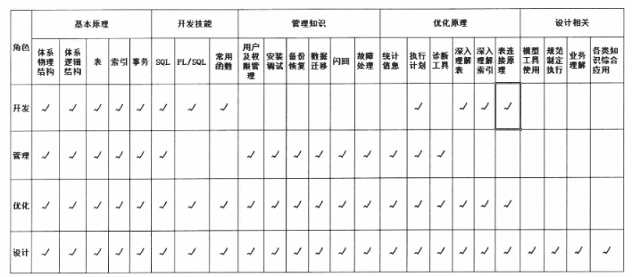

## 前言

由于想深入了解下数据库，包括索引、分区表以及sql优化相关的知识，加上工作使用的是 Oracle 数据库。所以选择这本书开始学习。
最开始看的时候，已经看了四章了。但是不做笔记，总是看了后面忘了前面，所以决定重读并且记笔记。主要及一些重点，方便以后查阅和回忆。
（当然，可能会有很多引用原文的部分，也会有自己的总结。引用的部分就不一一标注了，不过基本也能看出来）

## 省略的第一章 - 意识，少做事从学习开始

这一章的重点就是，**学什么要先了解做什么**。学了没想过怎么用，或者干脆不用，基本上是白学的。
先讲下数据库应用的基本功能，再根据具体的角色（DBA、开发、运维等）看具体该如何使用，根据使用的侧重点不同，而对数据库不同进行深度的学习。
毕竟数据库体系是庞大的，想要全盘掌握不现实，也不必要。按需学习即可。

这里作者是以手机的例子，加以二八现象说明。即百分之二十的功能实现百分之八十的需求，数据库也是一样。
对于开发人员来说，首先应该了解 SQL 的编写，而不是数据库的备份和恢复。而对于运维或者DBA来说，了解数据库的备份和恢复则更为重要。

首先，数据库应用的功能主要分为 数据库开发、数据库管理、数据库优化、数据库设计 四类（当然只是大概）。侧重点如下：

1. 开发：能利用SQL完成数据库的查增删改的基本操作：能用PL/SQL完成及各类逻辑的实现。
2. 管理：能完成数据库的安装、部署、参数调试、备份恢复、数据迁移等系统相关的工作：能完成分配用户、控制权限、表空间划分等管理相关工作：能进行故障定位、问题分析等数据库诊断修复相关工作。
3. 优化：在深入了解数据库的运行原理的基础上，利用各类工具及手段发现并解决数据库存在的性能问题，从而提升数据库运行效率，这个说着轻巧，其实很不容易。
4. 设计：深刻理解业务需求和数据库原理，合理高效地完成数据库模型的建设，设计出各类表及索引等数据库对象，让后续应用开发可以高效稳定。

我的角色目前是开发，后续笔记中也会侧重于开发的内容。除此之外，也会带一些我感兴趣的内容。

## 第二章 - 震惊，体验物理体系之旅

不论什么角色，基础原理都是必学的。首先就是物理体系结构，平时遇到的各种数据库相关问题，很多都可以从中找到解决方法。

1. **Oracle由实例和数据库组成**，我特意用两个虚框标记出来，上半部的直角方框为实例instance,下半部的圆角方框为数据库Database,大家可以看到我在虚线框左上角做的标注。
2. **实例是由一个开辟的共享内存区SGA(System Global Area)和一系列后台进程组成的**，其中**SGA最主要被划分为共享池(shared pool)、数据缓冲区(db cache)和日志缓冲(log buffer)三类**。后台进程包括图2-2中所示的PMON、SMON、LCKn、RECO、CKPT、DBWR、LGWR、ARCH等系列进程。
3. 数据库是由数据文件、参数文件、日志文件、控制文件、归档日志文件等系列文件组成的，其中归档日志最终可能会被转移到新的存储介质中，用于备份恢复使用。大家请注意看图2-2中的圆形虚线框标记部分的一个细节，**PGA(Program Global Area)区，这也是一块开辟出来的内存区，和SGA最明显的差别在于，PGA不是共享内存，是私有不共亨的
   **，S理解为共享的首字母。用户对数据库发起的无论查询还是更新的任何操作，都是在PGA先预处理，然后接下来才进入实例区域，由SGA和系列后台进程共同完成用户发起的请求。
4. PGA起到的其体作用，也就是前面说的预处理，是什么呢？主要有三点：第一，保存用户的连接信息，如会话属性、绑定变量等：第二，保存用户权限等重要信息，当用户进程与数据库建立会话时，系统会将这个用户的相关权限查询出来，然后保存在这个会话区内：第三，当发起的指令需要排序的时候，PGA(Program Global Area)正是这个排序区，如果在内存中可以放下排序的尺寸，就在内存PGA区内完成，如果放不下，超出的部分就在临时表空间中完成排序，也就是在磁盘中完成排序。
5. 我在图中标识了三块区域（大家注意看虚线框的左下角标注），分别是1区圆形虚线框，2区直角方形虚线框，3区圆角方形虚线框。用户的请求发起经历的顺序一般如下：1区→2区→3区：或者1区→2区。

从这个体系结构可以提出一些问题，提问很重要！

1. 为什么会有用户的请求不经过3区数据库的情况，直接从2区实例返回了？
2. 为什么SGA要划分为共享池、数据缓冲区、日志缓冲区，它们的作用分别是什么？
3. 为什么数据量大时排序会导致sql执行非常缓慢？（这个问题从上面的体系结构中显而易见）

### 从普通查询 sql 开始

从简单的查询sql `select object_name from t where object_id=29;` 开始。
当用户发起这个sql指令后，首先会从1区开始做准备。

PGA区域是仅供当前发起用户使用的私有内存空间，这个区域有三个作用，但这里的连接只完成了**用户连接信息的保存和q权限的保存**。只要该session不断开连接，下次便可以直接从PGA中获取，而不用去硬盘中读取数据。
此外，该sql还会匹配成一条唯一的HASH值，然后进入2区域。首先进入SGA区的共享池。
进入共享池后，先查询是否有地方存储过这个sql（HASH值，唯一标识一个sql）。

如果没有，那首先就要查询这个sql语法是否正确（from是否写成form），语义是否正确（字段、表是否存在），是否有权限。都没问题则会生成唯一HASH并保存。
接下来开始解析，看是否有索引，是索引读高效还是全表扫描高效？oracle要做出抉择。

如何做出抉择？将两种方式都估算一下，看那个代价（COST）更低。这里比较并不会真正分别执行两次来比较，具体方法后文会有。将代价更低的执行计划保存起来，并于HASH对应起来。
有了执行计划之后，便来到数据缓冲区来查询数据了。当数据缓冲区找不到需要的数据时，便会去3区的数据库中查找，当然得按照执行计划来，这是圣旨，不可违抗。找到后，回到数据缓冲区返回，找不到，就找不到了。

1. 这里2区中的日志缓冲区并没有说到
2. 3区也只描述了一个数据文件，其他文件并没有被提及
3. 2区中除了SGA，还有很多进程，他们的作用也没有被提及

