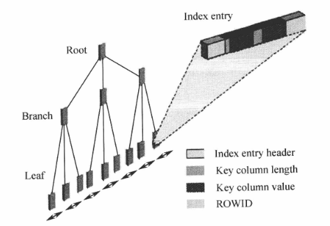
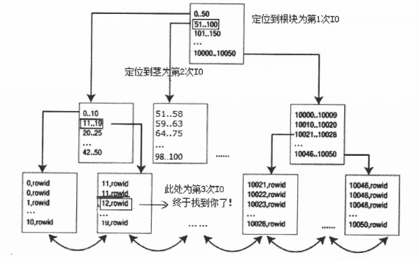
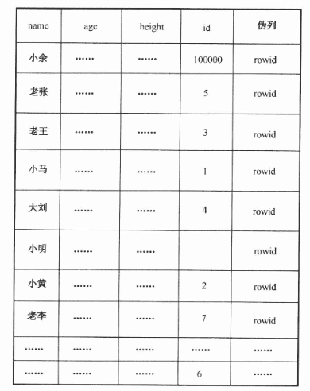
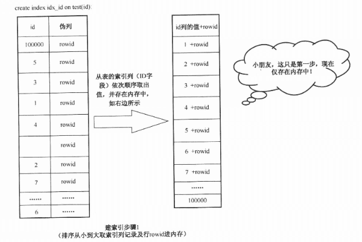
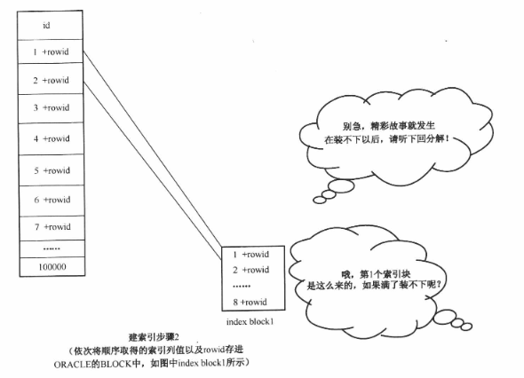
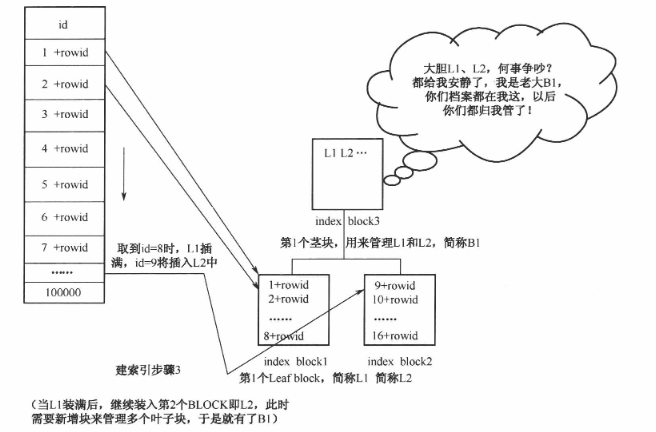
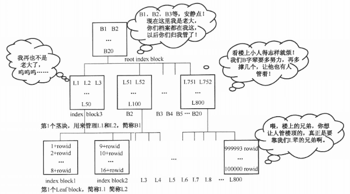
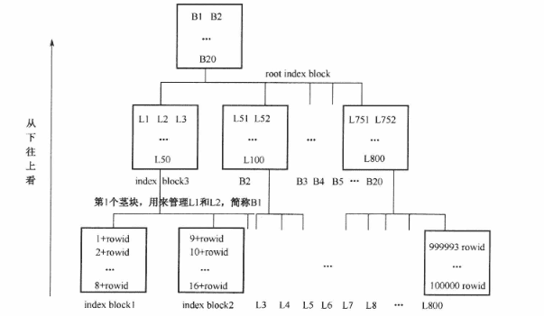
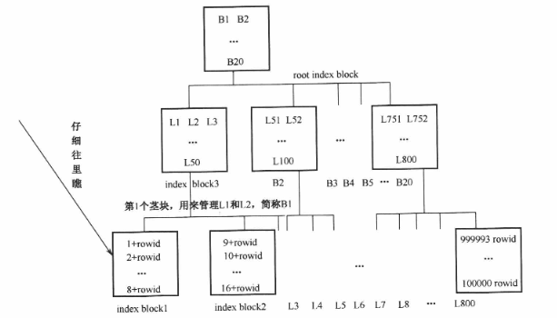
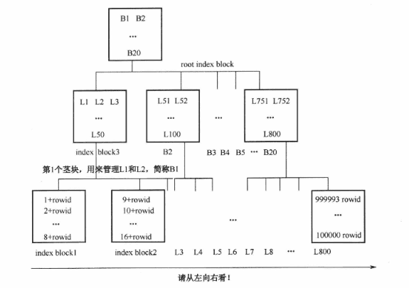

## 第五章 - 惊叹，索引天地妙不可言

### BTREE 索引

#### BTREE 索引结构图

索引和表一样，都是前面描述的逻辑体系结构中的段的一种，当建一个T表，就产生一个T表的表SEGMENT，当在T表的某些列上建索引DXT，就产生一个DXT的索引SEGMENT。
索引是建在表的具体列上，其存在的目的是让表的查询更快，效率更高。表记录丢失关乎生死，而索引丢失只需重建即可，似乎听起来索引只是表的一个附属产品，可有可无。
但索引却是数据库学习中最实用的技术之一。

以上结构图说明索引是由Root(根块)，Branch(茎块)和Leaf(叶子块)三部分组成的。
**其中Leaf(叶子块)主要存储了key column value(索引列具体值)，以及能具体定位到数据块所在位置的rowid(注意区分索引块和数据块)。**
比如：`select * from t where id = 12;` 该test表的记录有10050条，而id=12仅返回1条，test表的id列建了一个索引，索引是如何快速检索到数据的呢，接下来分析这个索引查询示例图

通过分析该图片，可以大致理解，定位到`select * from t where id = 12;`大致只需要3个IO(此处只是举个例子，1万多条记录实际情况可能只需要2个IO,这个和索引的高度有关，后续会深入讨论)。
首先查询定位到索引的根部，这里是第1次IO
接下来根据根块的数据分布，定位到索引的茎部（查询到12的值的大致范围，11..19的部分），这是第2次IO
然后定位到叶子块，找到 id=12 的部分，此处为第3次IO。
假设Oracle在全表扫描记录，遍历所有的数据块，IO的数量必然将大大超过3次。有了这个索引，Oracle只会去扫描部分索引块，而非全部，少做事，必然能大大提升性能。

根据id列上的索引来查询数据只需要访问索引块，不需要访问数据块吗？
显然不是的，这里的语句是`select * from t where id=12`，这个*表示要展现t表的所有字段，显然只访问索引是不可能包含表的所有字段的，因为该索引只是对id列建索引，也就存储了id列的信息而已。
因此上述查询访问完索引块后，必然要再访问数据块，比较快捷的方法是用索引块存储的rowid来快速检索数据块（具体在后续章节会描述）
所以3次IO显然是不对的，理应增加一次从索引块到数据块获取各个列信息的检索动作，至少是4次IO才对。

什么情况下查询可以只访问索引而不访问表呢？
如果查询只检索索引列信息，就可以不访问表了，比如查询改成 `select id from t where id=12` 时就是这种情况。

#### 建立索引的步骤

有一张test表，该表有大致name(varchar22(20),id(number),height(number),age(number)等字段。
当前该表有记录，我们要对test表的id列建索引，`create index idx id on test(id);`

##### 要建索引先排序

未建索引的test表大致记录如下图所示，NULL表示该字段为空值，此外省略号表示略去不显示内容。注意rowid伪列，这个是每一行的唯一标记，每一行的rowid值绝对不重复，可定位到行的记录在数据库中的位置（具体在后续的章节中详细介绍)。

建索引后，先从test表的id列的值顺序取出数据放在内存中（这里需注意，除了id列的值外，还要注意到取该列的值的同时，该行的rowid也被一并取出)，如下图所示。

##### 列值入块成索引

依次将内存中的顺序存放的列的值和对应的rowid存进Oracle空闲的BLOCK中，形成了索引块。

##### 填满一块接一块

随着索引列的值的不断插入，index block1(L1)很快就被插满了，比如接下来取出的id=9的记录无法插入index block1L1)中，就只有插入到新的Oracle块中，index block2(L2)。
与此同时，发生了一件非常重要的事情，就是新写数据到另一个块index block3(B1)，这是为啥呢？ 
原来L1和L2平起平坐，谁都不服谁，打起来了，不得了了，无组织无纪律哪能行，赶紧得有人管啊，于是index block3(B1)就担负起管理的角色，这个BLOCK记录了L1和L2的信息，并不记录具体的索引列的键值，目前只占用了B1一点点空间。
L3用于管理L2和L2的信息，用于快速定位。

##### 同级两块需人管

随着叶子块的不断增加，B1块中虽然仅是存放叶子块的标记，但也挡不住量大，最终也容纳不下了。
怎么办？接着装呗，到下一个块B2块去寻找空间容纳。这时B1和B2也平起平坐了。
这时又需要另一个块来记录B1、B2的信息，最上层的oot根块诞生了。
后续还会出现B3、B4...如果有一天，这些Bn把root块撑满了，root块就不是root块了，他的上面就又有别的块来记录它的信息。

#### 索引结构的三大重要特点

##### 索引高度较低

从下往上看，这个索引树的高度不会很高
最底层的叶子块index block因为装具体的数据，所以比较容易被填满，特别是对长度很长的列建索引时更是如此。
但是第1层之上的第2层的index block就很不容易装满了吧，因为第2层只是装第1层的指针而已，而第3层是装第2层的index block的指针，更不容易了...
因此，这个树如果有很多层，那么表的数据量应该非常大。

~~~oraclesqlplus
-- 查询占用表空间最大的表（排序）
select t.owner,t.segment_name,t.tablespace_name,bytes/1024/1024/1024 as sizes,q.num_rows,t.segment_type
from dba_segments t
         left join dba_tables q
                   on t.segment_name=q.table_name
                       and t.owner=q.owner
where t.segment_type='TABLE'
  and t.tablespace_name='TBS_FCCENTER_DATA'  --需要查看的表空间
order by 4 desc
-- 查询表索引的高度
select index_name,
       blevel,
       leaf_blocks,
       num_rows,
       distinct_keys,
       clustering_factor
from user_ind_statistics
where table_name in( 'T')
order by blevel desc;
~~~

看了下测试环境最大的一张表28G大小，快六百万数据，某列索引才4层。
书中说有500G一张，记录有几百亿条，但是该表上某列索引的高度才不过6层而已。

> BLEVEL=0这个层面表示只有叶子块，第1个索引块还没有装满，无须填入第2个块，所以没有上层块来管理，是1层高。
> 而BLEVEL=1这个层面表示这个阶段已经到第2层了，同理，BLEVEL=2表示已经到第3层，只是还没有将其填满。

##### 索引存储列值

索引存储了表的索引所在列的具体信息，还包含了标记定位行数据在数据库中位置的rowid取值。

##### 索引本身有序

索引是顺序从表里取出数据，再顺序插入到块里形成索引块的，所以说索引块是有序的。

#### 索引高度较低的用处

这里实验省略，语言描述。
对于同样高度索引树的表进行查询，如果返回记录是1条。那么走索引查询的效率是差不多的。
因为索引高度一样，所以产生的IO次数一样。

而在没有索引的情况下，查询则会全表扫描，数据量大的话，会十分缓慢。
索引的这个高度不高的特性给查询带来了巨大的便捷，**但这里的查询只返回1条记录，如果查询返回绝大部分的数据，那用索引反而要慢得多。**
因为通过索引查到一条数据需要多次IO，取决于索引树的高度。通过索引查表的全量数据的话，需要的IO次数是全表扫描的数倍。
同时，全表扫描可以对块进行多块读，进一步提高速度。

表字段数量也会影响查询的效率。
**如果表字段很少，同一个块中所能存放的数据也就越多，全表扫描的逻辑读也不会太多。所以会快。**
**相反，如果表字段很多，同一个块中存放的数据就会越少，全表扫描所需遍历的数据块也会增加，速度也就满下来了。**

---

下面是分区索引的设计误区。
分区表的系分为两中，一种是局部索引，一种是全局索引。
局部索引等同于为每个分区段建分区的索引，从user_segment的数据字典中，可以观察到表有多少个分区，就有多少个分区索引的segment。段的类型为 TABLE PARTITION。每个分区索引也是一个段，每个段的类型为 INDEX PARTITION。
而全局索引，也就是普通索引。仅有一个段，段的类型为 INDEX。

针对分区表的查询逻辑读相比于针对普通表的逻辑读会多好几倍，COST也一样。
因为分区表的索引等同于查询了多个小索引，而小索引虽然体积比整个大索引小很多，但是高度却相差无几。
这就导致单个小索引的查询和全局大索引的查询的IO数量差不多，而分区索引的IO个数还要乘以分区个数，所产生的IO会远大于全局索引产生的IO。
所以分区索引的性能会低。

因此分区表索引的设计是有讲究的，如果设置了分区索引，但是却用不到分区条件，性能将继续下降。
如果建了分区索引，但是又根本无法加上分区字段的条件，那建议不要建分区索引。
但如果查询中使用了分区字段的条件，那么结果就不一样了。只需要遍历其中的几个分区即可，效率也大幅提升。

#### 索引存储列值的用处

##### count(*) 优化

下面介绍索引存储列值及rowid的特性，其实身边最常见的语句性能的提升却往往是基于对这个特点的认识。

`select count(*) from t;` 是否能用到索引？

表的情况和索引情况的差别在于表是把整行的记录依次放进BLOCK形成DATA BLOCK，而索引是把所在列的记录排序后依次放进BLOCK里形成INDEX BLOCK。既然在没有索引的情况下，DATA BLOCK中可以统计出表记录数，那INDEX BLOCK肯定也可以。
方法就是前者汇总各个DATA BLOCK中的行的插入记录数，后者汇总各个INDEX BLOCK中的索引列的插入记录数。
最关键的是，INDEX BLOCK里存放的值是表的特定的索引列，一列或者就几列，所需容纳空间要比存放整行也就是所有列的DATA BLOCK要少得多，所以这个查询用索引会很高效。

但Oracle并不会选择走索引，而是选择了全表扫描。~~（实验略~~
主要原因是**索引不能存储空记录**，这样如果表的索引列有空的记录，那依据索引来统计表的记录数肯定是不对的，所以Oracle才会选择全表扫描的执行计划。
改变一下写法，`select count(*) from t where id is not null;`便可以让Oracle选择走索引。

> **将索引列设为非空**、或者设为主键（主键是非空的），也可以解决这个问题。

什么时候在表的非空列建有索引时，COUNT(*)语句用索引效率不如全表扫描？
如果一张表仅有一个字段，这个索引比表还大（多了rowid)，那从索引中查询，效率会不如全表扫描。

什么时候COUNT(*)查询语句用索引扫描比全表扫描高效很多呢？
表的字段很多，并且字段长度大多都很长，其中有一个非空且长度很短的列建了一个索引，这时索引的体积相对表来说特别小，那索引读效率就高多了。

##### SUM/AVG 优化

`select sum(id) from t;` 是否能用到索引？
是不能的，原因和上面一样，空值的问题。

`select sum(id), avg(id), count(id) from t where id is not null;`只需要一次索引扫描即可完成。

因为一次扫描索引块，可以同时解决三个问题，所以效率与单个分别执行时一样高。
不过列有空值理应不影响在索引中进行SUM和AVG等运算的，这里未指明非空则无法用到索引，其实是不应该的，这是优化器的缺陷。~~不知道新版本有没有优化~~

##### MAX/MIN 优化

`select max(id) from t;` 是否能用到索引？
是可以的。
这个列的属性是否为空不应该影响能否使用索引作为‘瘦表'查询，但是奇怪的是MAX/MIN时无论列是否为空都可以用到索引，而SUM/AVG等聚合查询却必须要列为空方可用到索引。
其实此类语句在运算时有无加上`is not null`的取值都是等价查询的，而COUNT(*)则不一样，有无`is not null`的取值可是不等价的！
~~所以大概是优化器的问题~~

执行计划中走索引的查询方式，索引的扫描方式会有很多种。这里先解释 `INDEX FULL SCAN(MIN/MAX)`
这个`INDEX FULL SCAN (MIN/MAX)`只需要个位数的逻辑读就完成查询的秘密在于，MAX取值只需要往最右边的叶子块看一下，MAX的取值一定在最右边的块上，块里的最后一行就是。
而MIN取值，仅往最左边的块里去望一望即可了，最小值一定在里头，块里的第一行记录就是。
其中既包含了索引可以存储空值的技巧，又结合了索引是有序的技巧。
查询只与索引树的高度有关，无论记录如何增大，查询效率都不会太低。

但是，`select min(id), max(id) from t;`就变成全表扫描了。是null值的问题吗？
`select min(id), max(id) from t where id is not null;` 走索引了，但走的是 `INDEX FAST FULL SCAN`并不是`INDEX FULL SCAN (MIN/MAX)`。
改写成 `select max, min from(select max(object_id)max from t) a, (select min(object_id)min from t) b;` 就可以走`INDEX FULL SCAN (MIN/MAX)`了。虽然这种写法很奇怪。 

##### 索引回表与优化

索引回表读(TABLE ACCESS BY INDEX ROWID)
它表示通过索引访问表中的数据行。当执行计划中出现这种操作时，意味着Oracle使用索引找到特定行的ROWID（行标识符），然后使用这个ROWID直接访问表中的行。

从索引中可以读到索引列的信息，但是不可能读到该列以外的其他列的信息.
当查询是`select * from t where object_id <= 5`时，这个*表示该表所有字段都需要返回。
因此必然是在扫描索引块中定位到具体object_id<=5这部分索引块后，再根据这部分索引块的rowid定位到t表所在的数据块，然后从数据块中获取到其他字段的记录。

**所以只返回需要的字段，而不是使用*。有时可以避免回表读，以提高性能。**

关于TABLE ACCESS BY INDEX ROWID最佳的优化方式是，如果业务允许，可以巧妙地消除这个动作的产生，但是如果存在有些非索引的字段必须展现，可是又不多的情况，该如何优化呢？
前面在业务允许的情况下，可以将`select * from t where object_id <= 5`修正为`select object_id from t where object_id<=5`从而消除回表，提升性能，假如有些字段必须展现，但又不多，该怎么办呢？
比如`select object_id,object_name from t where object_id <= 5`这个写法，非得展现object_name。
可以考虑在object_id和object_name列建组合索引，即可消除回表动作。

> 联合索引（Composite Index 或 Compound Index）是在多个列上创建的索引。它允许根据多个列的组合来对数据进行排序和快速访问。联合索引在Oracle数据库中非常常见，因为它们可以用于多种查询条件，从而提高查询效率。
> 联合索引基于多个列的组合来构建索引树。当创建联合索引时，Oracle会根据索引定义中列的顺序来生成键值。键值由索引定义中的所有列组成，按照定义的顺序进行排序。
> 联合索引的列顺序很重要。Oracle将按照列定义的顺序来构建键值。通常，将查询中最常用的列放在前面可以提高索引的利用率。

建联合索引后，回表的动作TABLE ACCESS BY INDEX ROWID在执行计划中就没有了。
不过这里要注意平衡，·如果联合索引的联合列太多，必然导致索引过大，虽然消减了回表动作，但是索引块变多，在索引中的查询可能就要遍历更多的BLOCK了，所以要全面考虑，联合索引不宜列过多，一般超过3个字段组成的联合索引都是不合适的。

实际上，回表查询的速度也是有差异的，这里引出一个重要概念叫聚合因子。

~~~oraclesqlplus
-- 建立无序的表
drop table t_colocated purge;
create table t_colocated (id number,col2 varchar2(100));
begin
    for i in 1..100000
        loop
            insert into t_colocated(id,col2)
            values (i,rpad(dbms_random.random,95,'*'));
    end loop;
end;
alter table t_colocated add constraint pk_t_colocated primary key(id);
-- 
-- 建立有序的表
drop table t_disorganized purge;
create table t_disorganized as select id,col2 from t_colocated order by col2;
alter table t_disorganized add constraint pk_t_disorg primary key (id);
~~~

两张表中，id一个是按顺序插入的，一个是乱序的。而我们都知道，索引是有排列的，此时id列上的索引存放的数据也是有序的。
表和索引两者的排列顺序相似度很高，就称之为聚合因子比较低。
表和索引两者之间的排列顺序相似度差异明显，就称之为聚合因子比较高。

通过数据字典来判断索引的聚合因子情况

~~~text
SQL> select index_name,blevel,leaf_blocks,num_rows,distinct_keys,clustering_factor from user_ind_statistics where table_name in('T_COLOCATED','T_DISORGANIZED');

INDEX_NAME                                                                                                                           BLEVEL LEAF_BLOCKS   NUM_ROWS DISTINCT_KEYS CLUSTERING_FACTOR
-------------------------------------------------------------------------------------------------------------------------------- ---------- ----------- ---------- ------------- -----------------
PK_T_COLOCATED                                                                                                                            1         208     100000        100000              1469
PK_T_DISORG                                                                                                                               1         208     100000        100000             99940
~~~

这里说明一下CLUSTERING_FACTOR的官方解释：表明有多少临近的索引条目指到不同的数据块。
取值99944接近表记录的100000，说明绝大部分的临近索引条目都指向了不同的数据块。
取值为1469说明总共只有1469个临近的索引条目指到了不同的数据块，总体还算不错。

表的插入顺序和索引列的顺序基本一致，从索引中回表查找数据块将会更容易查找，其实通俗地说就是索引块A里装10行列信息及ROWID,这就可以理解为索引条目。
然后根据索引条目的ROWID找到表记录时，如果聚合因子很小，10行索引条目可以全部在数据块B块中完整地找到。
如果聚合因子很大，或许这10行索引条目对应的数据块的10行记录，分布在10个不同的数据块里。那就要访问了C块，D块，E块等等，回表查询的性能当然就低了。

所以，当某列的读取频率远高于其他列，那就保证表的排列顺序和这列一致，按照这列的顺序，重组一下表记录来优化即可了。

#### 索引有序的用处

##### order by 排序优化

真正决定性能的是COST的高低和真实完成的时间，一般COST越小性能越高，Oracle执行计划的选择就是由COST来决定的。
而时间也是非常简单的衡量的方式，完成时间越短性能越高。
而逻辑读方面，是作为参考，在绝大部分情况下（甚至可以说90%以上的场合），逻辑读越少性能越快，但在这里却不适用了。
排序算法有些特别，内部的机制导致性能和逻辑读关系不是太大，主要是消耗在CPU性能上，开销极大。
此外如果PGA区无法容纳下排序的尺寸而进入磁盘排序，那将成为更大的性能杀手。

**因为索引是有序的，所以排序的查询走索引的话，可以减少排序次数，从而提高性能。**

##### distinct 排重优化

distinct 这个常见的排除重复数据的写法，会用到排序。排过序的数据更容易去重。

从含有distinct的查询语句执行计划中，可以发现以及排序次数是0。
但TempSpe却是有值的。TempSpc是临时表空间。
实际上，DISTINCT是有排序的，只是在 AUTOTRACE 的 SORTS 关键字中不会显现而已。

DISTINCT 会因为排序而影响性能，不过这里要注意一点，DISTINCT采用的是HASH UNIQUE的算法。
其实如果语句修改为`select distinct object id_from t where object_id=2`这样的等值查询而非范围查询时，将产生`SORT UNIQUE NOSORT`的算法。

含有 distinct 的查询语句，走索引查询时，是可以消除其所产生的排序的。 
不过现实中，DISTINCT语句靠索引来优化往往收效是不明显的，因为大多数情况用到DISTINCT都是因为表记录有重复，因此首要的是要考虑为什么重复。

##### 索引全扫与快速扫描

`INDEX FULL SCAN (MIN/MAX)`，是针对最大最小取值的一种特别的索引扫描方式。
`INDEX RANGE SCAN`，是一种针对索引高度较低这个特性实现的一种范围扫描，在返回记录很少时相当高效。

`INDEX FULL SCAN`和`INDEX FAST FULL SCAN`的相同点，都是针对整个索引的全扫描，从头到尾遍历索引，而非局部的INDEX FULL SCAN(MIN/MAX)和INDEX RANGE SCAN。
INDEX FAST FULL SCAN比INDEX FULL SCAN多了一个FAST，所以差别就是索引快速全扫描INDEX FAST FULL SCAN比索引全扫描INDEX FULL SCAN更快。~~好像是废话~~
那么为什么INDEX FAST FULL SCAN会比INDEX FULL SCAN更快，**是因为索引快速全扫描一次读取多个索引块，而索引全扫一次只读取一个块**。
一次读取多个块不容易保证有序，而一次读取一个块可以保证有序，因此在有排序的场合，INDEX FULL SCAN的顺序读可以让排序消除，而INDEX FAST FULL SCAN虽然减少了逻辑读，但是排序这个动作却无法消除。

所以说COUNT(*)和SUM之类的统计根本无须使用排序，一般都走INDEX FAST FULL SCAN，而涉及排序语句时，就要开始权衡利弊，也许使用INDEX FAST FULL SCAN更快，也许使用INDEX FULL SCAN更快，由Oracle的优化器计算出成本来选择。

##### UNION 合并的优化

**UNION 合并后没有重复数据，和 DISTINCT 类似，是有排序操作的。**
**UNION ALL 合并后有重复数据，只是简单的合并，不会有排序操作。**

但是这里的 union 是不能利用索引消除排序的。这是因为 union 操作的是两个不同的结果集的筛选，各自的索引当然没法生效。
在某些业务场景下，两个 union 的表数据不可能出现重复时，使用 union all 而不使用 union，会提高查询效率。

#### 主外键设计

主外键有三大特点：
1. 主键本身是一种索引
2. 可以保证表中主键所在列的唯一性
3. 可以有效地限制外键依赖的表的记录的完整性。

其中前两个特点和`CREATE UNIQUE INDEX`建立的唯一性索引基本相同。

外键建索引后，效率会更高，这和表连接的NESTED LOOPS连接方式有关，在后续表连接章节细说。

**在外键上建索引，还能有效避免锁的竞争。**

主外键最基本的一个功能：**外键所在表的外键列取值必须在主表中的主键列有记录。**
否则会报错：`ORA-02292 integrity constraint (string.string) violated - child record found`
Oracle提供的这些功能保证了多表记录之间记录的制约性。

同样，如果子表中有记录，要删除主表中对应的主键记录，也会报错：`ORA-02292 integrity constraint (string.string) violated - child record found`
级联删除的设置：`ALTER TABLE t_c ADD CONSTRAINT fk_t_c_id FOREIGN KEY (t_id) REFERENCES t (id) ON DELETE CASCADE;`。添加 ON DELETE CASCADE 关键字。
**设置级联删除后，删除主表的记录后，会自动将子表中对应的记录一起删除。慎用。**

如果有一张表的某字段没有重复记录，并且只有一个普通索引，该如何改造为主键？
因为建主键的动作其实就是建了一个唯一性索引，再增加一个约束。
所以 `alter table t add constraint t_id_pk primary key(ID);` 即可。

#### 组合索引设计

**当查询的列在索引或组合索引中时，可以避免回表。**
回表在执行计划中叫 `TABLE ACCESS BY INDEX ROWID`

**当组合列返回的记录比较少时，组合索引的效率会比较高。**
类似 `select * from t where a = 1 and b = 2` 这种情况，如果在a和b字段建联合索引是不可能消除回表的，因为返回的是所有字段。
但是只要 a=1 返回较多， b=2 返回也较多，组合起来返回很少，就适合建联合索引。
但过多的字段建联合索引往往是不可取的，因为这样会导致索引过大，不仅影响了定位数据，更严重影响了更新性能，一般不超过三个字段。

如果 a = 1 and b = 2 的返回和前面的单独 a = 1 或者单独 b = 2 的返回记录数差别不大，那组合索引的快速检索就失去意义了，单独建某列索引更好，因为单独建立的索引体积比组合索引要小，检索的索引块也更少。
但如果不是返回所有的列，就是回表的范畴了。组合索引可能更合适。

---

**在等值查询的情况下，组合索引的列无论哪列在前，性能都一样。**
组合索引在第一字段进行排序，值相同的情况下，对第二个字段进行排序。
等值查询时，组合索引无论哪个在前都是一样的。查询到第一个条件的值后，查询第二个条件的值，因为是确定的值，同时索引是有序的，所以条件的顺序不影响查询效率。

**组合索引的两列，当一列是范围查询，一列是等值查询的情况下，等值查询列在前，范围查询列在后，这样的索引最高效。**
但范围查询不同，范围条件在前时，需要逐个去查符合范围条件的第二个等值条件，它在每个符合范围的值中都是有序的（每个部分都是有序的）
而等值条件在前时，去查询符合等值条件的第二个范围条件，则要更简单。因为它整体是有序的。所以查询效率也更高。

**范围查询改写为in查询，in查询的效率更高。因为in可以看作多个等值查询，定位到记录后可以停止继续搜索。**

**如果单列的查询列和联合索引的前置列一样，那单列可以不建索引，直接利用联合索引来进行检索数据。**

如果单列的取值不多，可能会用到索引，这种扫描被称为跳跃索引，不过应用场景不多。
跳跃索引（Index Skip Scan）是Oracle数据库中的一种特殊的索引访问方式，用于处理包含空值（NULL）的多列索引。跳跃索引可以提高查询性能，尤其是在索引列中存在大量空值的情况下。
跳跃索引的工作原理是让Oracle能够跳过那些不包含有效键值的节点，直接访问包含有效键值的节点。这样可以减少不必要的索引扫描，提高查询性能。

---

不过索引也不是越多越好，虽然可以增加查询效率，减少查询的时间。但会影响更新效率，因为索引的维护需要时间。
特别是大量的无序插入，在索引很多的情况下会十分的慢。
**可以先将索引失效，插入完成后重建索引。可以提升性能。**

1. 对INSERT语句负面影响最大，有百害而无一利，只要有索引，插入就慢，越多越慢！
2. 对DELETE语句来说，有好有坏，在海量数据库定位删除少数记录时，这个条件列是索引列显然是必要的，但是过多列有索引还是会影响明显，因为其他列的索引也要因此被更新。在经常要删除大量记录的时候，危害加剧！
3. 对UPDATE语句的负面影响最小，快速定位少量记录并更新的场景和DELETE类似，但是具体修改某列时却有差别，不会触及其他索引列的维护。

---

除了索引会影响更新语句外，建索引动作也需要谨慎。**建索引会排序，而排序是非常耗CPU的一个动作**，如果在系统繁忙时再增加大量排序，对系统来说无疑是雪上添霜。
另外**建索引的过程会产生锁，而且不是行级锁，是把整个表锁住，任何该表的DML操作都将被阻止。**
建索引是需要把当前索引列的列值都取出来，排序后依次插入块中形成索引块的，加上锁是为了避免此时列值被更新，导致顺序又变化了，影响了建索引的工作。

`alter index index_name monitoring usage;` 对索引进行监控。
`select * from v$object_usage;` 查询监控记录。其中 USED 字段表示索引是否被使用过。
`alter index index_name nomonitoring usage;` 对索引解除监控。
另外，要注意监控也是有代价的。

### 位图索引

`create bitmap index index_name on table_name(field_name);` 创建位图索引。

位图索引（Bitmap Index）是一种用于数据库中的特殊类型的索引结构。
**它主要用于低基数（low cardinality）的列，即那些具有相对较少不同值的列。** 位图索引非常适合于数据仓库环境中的大量读取操作，因为它能够非常高效地处理选择查询。

位图索引的工作原理：
位图索引使用一系列位图来表示数据表中的行。对于每一个不同的值，位图索引都会创建一个位图。位图中的每一位对应数据表中的一行记录，如果该行具有相应的值，则对应的位被设置为1；否则，位被设置为0。

优点：
1. 位图索引非常节省空间，因为只存储0和1，每个值只占用1位。
2. 非常适合范围查询和过滤操作。可以通过位运算快速找到匹配的行。
3. 适合数据仓库中的复杂的、批处理式的查询。

缺点：
1. 更新的成本高。低基数的列意味着包含同一值有大量的行，因此更新的影响很大。会导致锁等问题，影响并发。
2. 不适合高基数的列。对于具有大量不同值的列，位图索引会变得非常大且效率低下。
3. 对于较小的表，位图索引可能不会带来显著的性能提升，反而会增加额外的管理开销。

COUNT(*)的性能，在非空列有BTREE索引的情况下，一般用到该索引性能远高于全表扫描。
不过性能最高的却是列上有位图索引的情况，甚至比用到普通非空列的BTREE索引时的性能又高出一大截。
另外，**位图索引可以存储空值**。

位图索引的适合场景要满足两个条件：**1. 位图索引列大量重复 2. 该表极少更新**

### 函数索引

**对索引列做运算导致索引无法使用。**
比如 `select * from table_name where upper(field_name) = 'T';`
当必须要对索引列做函数运算时，可以创建函数索引。

`create index index_name on table_name(upper(field_name));` 创建函数索引。

函数索引（Function-Based Index）是一种特殊的索引类型，它允许在数据库中创建基于表达式或函数计算结果的索引。函数索引可以提高某些查询的性能，特别是在查询条件中包含复杂的表达式或函数时。
函数索引索的引键是基于表达式的结果，而不是表中的原始列值。当查询包含与函数索引表达式相同的表达式时，Oracle可以使用该索引来加速查询。这可以避免在查询执行时重复计算表达式。

函数索引的性能介于普通索引和全表扫描之间。因此，能用普通索引就用普通索引。尽量避免列运算。

