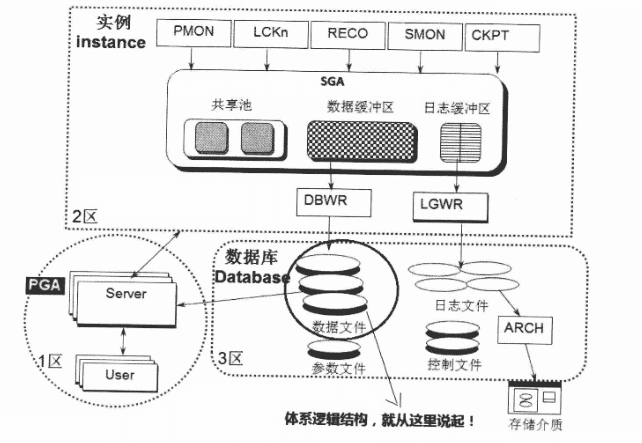

## 第三章 - 神奇，走进逻辑体系世界

### 逻辑体系结构

上一章中讲的Oracle体系的物理结构都是一些看得见摸到着的东西。
登录数据库所在的主机，实实在在地体验了SGA共享内存段是如何被开辟而又如何消亡、后台进程是如何被唤起而又如何退出。
此外也清楚地看到了数据文件、参数文件、控制文件、日志文件、归档文件的大小及位置。
因此物理结构实质上可以理解为我们在物理上可以实实在在看得见的东西。

而这一章说的体系结构的逻辑结构正是从体系物理结构图中的数据文件部分展开描述的。
如下图圆圈标记处所示

这里数据文件是存放数据之处，也是数据库存在的根本！
下面介绍的逻辑结构是：表空间(TABLESPACE)、段(SEGMENT)、区(EXTENT)、块(BLOCK)。
ORACLE SERVER 正是条理地通过表空间以及段、区、块控制磁盘空间的合理高效的使用，看下图

数据库(DATABASE)由若干表空间(TABLESPACE)组成，表空间(TABLESPACE)由若干段(SEGMENT)组成，段(SEGMENT)由若干区(EXTENT)组成，区(EXTENT)又是由Oracle的最小单元块(BLOCK)组成的。
其中表空间又包含系统表空间、回滚段表空间、临时表空间、用户表空间。
除了用户表空间外其他三种表空间有各自特定的用途，不可随意更改和破坏，尤其是系统表空间更是需要小心谨慎保护。

> 块 -> 区 -> 段 -> 表空间 -> 数据库

刚才是从大说到小，现在按照从小到大的方向再将它们描述一遍。
一系列连续的BLOCK组成了EXTENT,一个或多个EXTENT组成了SEGMENT,一个或多个SEGMENT组成了TABLESPACE,而一个或多个TABLESPACE组成了DATABASE(一个DATABASE想存在，至少需要有SYSTEM及UNDO表空间)。

到这里还是十分的抽象，理解不了一点。
比如之前执行的 `update t set object_id=92 where object_id=29;` 这里的t表对应的就是逻辑结构，而数据则是写入数据文件 datafile 里。
面对表操作肯定比面对数据文件直观形象得多，这个表是就从数据文件里直观抽象出来的逻辑结构。

前面说到 Oracle 的逻辑结构从大到小分为表空间、段、区、数据库块这4部分。
上面建的表是和段(SEGMENT)直接对应。但是表并不是只对应一个段，有数据段和索引段。此外，如果表有分区，每个分区又都独立成段。

段(SEGMENT)是由区(EXTENT)组成的，而区又是由一系列数据块(BLOCK)组成的。
那么为什么要存在区呢？块是数据库的最小单位，为什么不直接由块组成段呢？

Oracle的这个区(EXTENT)的设计是为了避免过度扩展。
因为块的尺寸太小了，如果以这个块的尺寸为单位进行扩展，那么拓展会过于频繁，从而影响性能。

#### 块

虽然说**BLOCK是Oracle的最小逻辑数据单位**，但是所有数据在文件系统层面最小物理存储单位是字节，操作系统也有一个类似Oracle的块容量的参数(block size),但是Oracle总是访问整个Oracle BLOCK,而不是按照操作系统的block size来访问的。
一般情况下大多数操作系统OS的块容量为512字节大小或其整数倍，而数据库块一般默认设置为8KB,除此之外也有系统将其设置为2KB、4KB、16KB、32KB、64KB等其他大小。
但是数据库的BLOCK一般要设置为操作系统OS块容量的整数倍，这样可以减少IO操作。

这个很好理解，和操作系统内存管理的分页有些类似。
比如IO的大小设置为512字节(0.5KB),本来如果DB的BLOCK设置为1KB正好是其2倍。但是设置为0.8KB,这时由于操作系统的单个块大小为0.5KB,只有2个操作系统块才可容纳下，于是就动用了2个OS块去容纳，相当于占用了1KB大小的OS空间，浪费了0.2KB。

Oracle的数据库块并不是简单地往里插数据，插满了装不下了就插入另一个数据块这么简单，而是额外提供了一定的管理功能。
数据库的组成分为数据块头（包括标准内容和可变内容）(common and variable header)、表目录区(tabledirectory)、行目录区(row directory)、可用空间区(free space)、行数据区(row data)这5个部分，如下图：

1. 数据块头(header)中包含了此数据块的概要信息，例如块地址(block address)及此数据块所属的段(segment)的类型（比如到底是表还是索引）。
2. 表目录存放了块中行数据所在的表的信息。
3. 行目录存放了插入的行的地址。
4. 可用空间区就是块中的空余空间.这个空余的多少由Oracle的PCTFREE参数设置，如果是1O,表示该块将会空余10%左右的空间。此外如果是表或者索引块，该区域还会存储事务条目，大致有23字节左右开销。至于为什么要有空余，后面会有解释。
5. 行数据区域就是存储具体的行的信息或者索引的信息，这部分占用了数据块绝大部分的空间。

这里数据块头(data block header)、表目录区(table directory)、行目录区(row directory)被统称为管理开销(overhead),其中有些开销的容量是固定的，而有些开销的总容量是可变的。
数据块中固定及可变管理开销的容量平均在84到107字节(byte)之间。

#### 段

一些连续的数据块(data block)组合在一起，就形成了区(EXTENT)。
**EXTENT是Oracle数据库分配空间的最小单位**，请注意分配这两个字眼。

当某用户创建一张表T时，实质就是建了一个数据段segment T。
在Oracle数据库中，**只要segment创建成功，数据库就一定为其分配了包含若干数据块(data block)的初始数据扩展(initial extent)**,即便此时表中还没数据，但是这些初始数据扩展中的数据块已经为即将插入的数据做好准备了。
接下来T表（也就是SEGMENT T)中开始插入数据，很快初始数据扩展中的数据块都装满了，而且又有新数据插入需要空间，此时Oracle会自动为这个段分配一个新增数据扩展(incremental extent),这个新增数据扩展是一个段中已有数据扩展之后分配的后续数据扩展，容量大于或等于之前的数据扩展。

每个段(segment)的定义中都包含了数据扩展(extent)的存储参数(storage parameter)。存储参数适用于各种类型的段。这个参数控制着Oracle如何为段分配可用空间。
例如，用户可以在CREATE TABLE语句中使用STORAGE子句设定存储参数，决定创建表时为其数据段(data segment)分配多少初始空间，或限定一个表最多可以包含多少数据扩展。
如果用户没有为表设定存储参数，那么表在创建时使用所在表空间(tablespace)的默认存储参数。

在一个本地管理的表空间中（注：还有一种数据字典管理的表空间，因为是一种要被淘汰的技术，这里就不提及了)，其中所分配的数据扩展(extent)的容量既可以是用户设定的固定值，也可以是由系统自动决定的可变值，取决于用户创建tablespace时用UNIFORM指令（固定大小）还是AUTOALLOCATE指令（由系统管理）。
对于固定容量(UNIFORM)的数据扩展，用户可以为数据扩展设定容量（比如100MB、1GB等随你设定)或使用默认大小(1MB)。用户必须确保每个数据扩展的容量至少能包含5个数据库块(database block)。
本地管理(locally managed)的临时表空间(temporary tablespace)在分配数据扩展时只能使用此种方式。
对于由系统管理(AUTOALLOCATE)的数据扩展，就无从插手干预了，Oracle或许一个区申请20M,下一个区忽然申请100M,Oracle在运行过程中自行决定新增数据扩展的最佳容量，我们无从得知规律。不过还是有一个下限的，即区的扩展过程中其最小容量不能低于64KB,假如数据块容量大于等于16KB,这个下限将从64KB转变为1MB。

#### 表空间分类

在 Oracle 数据库中，表空间（Tablespace）是组织和管理数据文件的逻辑容器。表空间是数据库中最大的逻辑存储单元，所有的数据库对象（如表、索引、回滚段等）都存储在表空间中。
Oracle 支持多种类型的表空间，每种类型有不同的用途和特点。

##### 系统表空间

系统表空间是数据库中默认创建的表空间之一，用于存储数据库的数据字典和其他重要元数据。

- 包含数据库的数据字典信息，如表、视图、存储过程等。
- 包含数据库的控制信息。
- 通常不应用于存储用户数据。

##### 临时表空间

临时表空间用于存储临时数据，如排序操作、临时表等。

- 数据是非持久的，会在会话结束或事务提交后自动清除。
- 临时表空间中的数据文件称为临时文件（Temporary Files）。
- 通常用于支持临时表和排序操作。

##### 回滚表空间

回滚表空间用于存储事务回滚所需的信息。

- 用于支持事务的回滚操作。
- 通常包含一个或多个数据文件。

### 逻辑结构初次体会

上面都是概念性的东西，下面开始实操。

#### Block 块

查询数据库的块(BLOCK)大小为8KB,这是Oracle的最小逻辑单位。

~~~text
SQL> show parameters db_block_size;

NAME                                 TYPE        VALUE
------------------------------------ ----------- ------------------------------
db_block_size                        integer     8192
~~~

也可以通过观察表空间视图 dba_tablespaces 的 block_size 值获取。

~~~text
SQL> select block_size from dba_tablespaces where tablespace_name='SYSTEM';

BLOCK_SIZE
----------
      8192
~~~

#### Tablespace 表空间

~~~oraclesqlplus
-- 创建普通数据表空间
CREATE TABLESPACE "test"
    DATAFILE '/opt/oracle/oradata/FREE/test.dbf'
    SIZE 100M -- 数据文件的初始大小
    AUTOEXTEND ON -- 允许数据文件自动扩展

-- 创建临时表空间
CREATE TEMPORARY TABLESPACE test_temp
    TEMPFILE '/opt/oracle/oradata/FREE/test_temp.dbf'
    SIZE 50M
    AUTOEXTEND ON

-- 创建回滚段表空间
CREATE UNDO TABLESPACE test_undo
    DATAFILE '/opt/oracle/oradata/FREE/test_undo.dbf'
    SIZE 100M
    AUTOEXTEND ON

-- 系统表空间
SELECT file_name,
       tablespace_name,
       autoextensible,
       bytes / 1024 / 1024
FROM DBA_DATA_FILES
WHERE TABLESPACE_NAME LIKE 'SYS%'
order by substr(file_name, -12);
~~~

系统表空间查询结果：

| FILE_NAME                             | TABLESPACE_NAME | AUTOEXTENSIBLE | BYTES/1024/1024 |
|---------------------------------------|-----------------|----------------|-----------------|
| /opt/oracle/oradata/FREE/sysaux01.dbf | SYSAUX          | YES            | 1450            |
| /opt/oracle/oradata/FREE/system01.dbf | SYSTEM          | YES            | 1090            |

SYSAUX 表空间用于存储数据库的辅助数据，如索引组织表（Index Organized Tables, IOTs）、LOB 数据、数据字典视图快照等。它是 Oracle 10g 及以后版本引入的表空间，用于减轻 SYSTEM 表空间的压力。

> 系统表空间和用户表空间属于永久保留数据的表空间。

#### User 用户

~~~oraclesqlplus
-- 创建用户
drop user "test" cascade;
create user "test"
    identified by "test_password"
    default tablespace "test"
    temporary tablespace test_temp;
-- 赋权
grant dba to "test";
~~~

上述创建用户的命令会报错：`ORA-65096: 公用用户或角色名称必须以前缀 C## 开头`
这是因为 Oracle Database 12c 引入了一项重要的新特性：多租户架构，其中包括容器数据库（CDB）和可插入数据库（PDB）。这项特性极大地改变了数据库管理的方式，提供了更好的资源隔离、简化了数据库部署和维护，并增强了安全性。
在书中并未这部分，可能作者使用的版本较低。所以这部分是查资料所得。

容器数据库（Container Database, CDB）是一个包含多个可插入数据库（Pluggable Databases, PDBs）的数据库。CDB 包括根容器（Root Container）和种子容器（Seed Container），以及一个或多个可插入数据库。

- **根容器**：CDB 的根容器包含全局数据库对象和管理信息。根容器通常不包含用户数据。
- **种子容器**：CDB 的种子容器是一个特殊的 PDB，用于创建新的 PDB 时作为模板。每个 CDB 都有一个种子容器，通常命名为 `PDB$SEED`。

可插入数据库（Pluggable Database, PDB）是 CDB 中的独立数据库环境，可以像传统的独立数据库一样使用，但它们共享同一套物理文件和资源。每个 PDB 都有自己的表空间、用户、角色、对象等。

- **独立性**：每个 PDB 都是一个完整的数据库环境，拥有自己的表空间、用户、角色和数据。
- **资源隔离**：PDB 之间相互隔离，可以配置资源限制，以防止一个 PDB 影响其他 PDB 的性能。
- **可移植性**：PDB 可以轻松地在不同的 CDB 之间移动，甚至可以在不同的 Oracle 数据库版本之间移动。
- **共享资源**：尽管每个 PDB 都是独立的，但它们共享 CDB 的物理文件和资源，从而减少了管理开销和提高了资源利用率。

使用 CDB 和 PDB 带来的好处

- **简化管理**：通过将多个数据库作为 PDB 放入单个 CDB 中，可以大大简化数据库的管理。例如，补丁更新、备份和恢复等操作只需要在 CDB 层级执行即可。
- **资源隔离**：PDB 之间的资源可以被隔离，从而确保每个 PDB 都有稳定的资源使用环境。
- **安全性增强**：每个 PDB 都可以有自己的安全策略，从而增强了整个系统的安全性。
- **成本节省**：多个 PDB 共享 CDB 的资源，可以减少硬件成本和许可证费用。

下面是相关的 sql 语句。
~~~oraclesqlplus
-- 查看当前容器
show con_name
select sys_context('USERENV','CON_NAME') conname from dual;

-- 查看PDB
select con_id, dbid, name, open_mode from v$pdbs;

-- 新建 PDB (PDB有多种创建方式，这里是通过PDB$SEED创建PDB。此外还有通过PDB创建PDB等多种方式，毕竟PDB是可插拔的，注定它的管理方式是多种多样的。)
-- 其中 oracledb 是可插接式数据库名称，TEST_USER 是创建的该PDB的管理员用户，123456 是密码。file_name_convert 指定了文件名转换规则，用于将种子 PDB (PDB$SEED) 的数据文件路径转换为目标 PDB (oracledb) 的数据文件路径。
create pluggable database oracledb admin user TEST_USER identified by 123456 file_name_convert = ('/opt/oracle/oradata/ORCLCDB/pdbseed','/opt/oracle/oradata/orclcdb/oracledb');

-- 创建完成后的 PDB 数据库还不能直接使用，因为此时他的状态是 MOUNTED。使用下面的sql更改其状态。
alter pluggable database oracledb open;
alter pluggable database all open;

-- 切换容器
alter session set container=PDB$SEED;
alter session set container=oracledb;
~~~

创建完成之后，就可以使用新的用户连接到数据库里。
`jdbc:oracle:thin:@//127.0.0.1:1521/oracledb`

这里简单叙述下 PDB 和 CDB 的概念，和基本的用户创建。下面回到书中，继续体会逻辑结构。

#### EXTENT 区

**Oracle的最小逻辑单位是块(BLOCK),而最小的扩展单位是区(EXTENT).**

~~~oraclesqlplus
-- 创建表 如果没有指定表空间，则使用该用户默认的表空间
drop table t purge;
create table t (id int) tablespace default_dataspace;

-- 查询数据字典获取extent相关信息
select segment_name,
       extent_id,
       tablespace_name,
       bytes/1024/1024,blocks
from user_extents
where segment_name='T';
~~~

插入 2000000 条数据后，有39个区。

| SEGMENT_NAME | EXTENT_ID | TABLESPACE_NAME | BYTES/1024/1024 | BLOCKS |
|--------------|-----------|-----------------|-----------------|--------|
| T            | 0         | SYSTEM          | 0.0625          | 8      |
| T            | 1         | SYSTEM          | 0.0625          | 8      |
| T            | 2         | SYSTEM          | 0.0625          | 8      |
| T            | 3         | SYSTEM          | 0.0625          | 8      |
| T            | 4         | SYSTEM          | 0.0625          | 8      |
| T            | 5         | SYSTEM          | 0.0625          | 8      |
| T            | 6         | SYSTEM          | 0.0625          | 8      |
| T            | 7         | SYSTEM          | 0.0625          | 8      |
| T            | 8         | SYSTEM          | 0.0625          | 8      |
| T            | 9         | SYSTEM          | 0.0625          | 8      |
| T            | 10        | SYSTEM          | 0.0625          | 8      |
| T            | 11        | SYSTEM          | 0.0625          | 8      |
| T            | 12        | SYSTEM          | 0.0625          | 8      |
| T            | 13        | SYSTEM          | 0.0625          | 8      |
| T            | 14        | SYSTEM          | 0.0625          | 8      |
| T            | 15        | SYSTEM          | 0.0625          | 8      |
| T            | 16        | SYSTEM          | 1               | 128    |
| T            | 17        | SYSTEM          | 1               | 128    |
| T            | 18        | SYSTEM          | 1               | 128    |
| T            | 19        | SYSTEM          | 1               | 128    |
| T            | 20        | SYSTEM          | 1               | 128    |
| T            | 21        | SYSTEM          | 1               | 128    |
| T            | 22        | SYSTEM          | 1               | 128    |
| T            | 23        | SYSTEM          | 1               | 128    |
| T            | 24        | SYSTEM          | 1               | 128    |
| T            | 25        | SYSTEM          | 1               | 128    |
| T            | 26        | SYSTEM          | 1               | 128    |
| T            | 27        | SYSTEM          | 1               | 128    |
| T            | 28        | SYSTEM          | 1               | 128    |
| T            | 29        | SYSTEM          | 1               | 128    |
| T            | 30        | SYSTEM          | 1               | 128    |
| T            | 31        | SYSTEM          | 1               | 128    |
| T            | 32        | SYSTEM          | 1               | 128    |
| T            | 33        | SYSTEM          | 1               | 128    |
| T            | 34        | SYSTEM          | 1               | 128    |
| T            | 35        | SYSTEM          | 1               | 128    |
| T            | 36        | SYSTEM          | 1               | 128    |
| T            | 37        | SYSTEM          | 1               | 128    |
| T            | 38        | SYSTEM          | 1               | 128    |

#### SEGMENT 段

观察数据段

~~~oraclesqlplus
-- 查询数据字典获取segment相关信息
select segment_name,
       segment_type,
       tablespace_name,
       blocks,
       extents,bytes/1024/1024
from user_segments
where segment_name ='T';
~~~

| SEGMENT_NAME | SEGMENT_TYPE | TABLESPACE_NAME | BLOCKS | EXTENTS | BYTES/1024/1024 |
|--------------|--------------|-----------------|--------|---------|-----------------|
| T            | TABLE        | SYSTEM          | 3072   | 39      | 24              |

2000000 条数据，占用了24M空间，用了39个区，3072个块。

观察索引段

~~~oraclesqlplus
-- 创建索引
create index idx_id on t(id);
-- 查询数据字典获取segment相关信息
select segment_name,
       segment_type,
       tablespace_name,
       blocks,
       extents,
       bytes/1024/1024
from user_segments
where segment_name ='IDX_ID';
~~~

| SEGMENT_NAME | SEGMENT_TYPE | TABLESPACE_NAME | BLOCKS | EXTENTS | BYTES/1024/1024 |
|--------------|--------------|-----------------|--------|---------|-----------------|
| IDX_ID       | INDEX        | SYSTEM          | 4608   | 51      | 36              |

### 逻辑结构二次体会

#### BLOCK的大小和调整

一般来说，Oracle默认的数据库块大小就是8KB,是在创建数据库时决定的，所以如果想改变块的大小，就必须在建库时指定。
Oracle9i以后的版本中，Oracle支持用户在新建用户表空间时指定块的大小，这意味着数据库有多个表空间，他们各自的BLOCK大小有可能各不相同。
切记只是新建的用户表空间，原有的已经建好的表空间是不可以更改的，系统表空间更不可能更改或调整。

~~~text
SQL> show parameters cache_size

NAME                                 TYPE        VALUE
------------------------------------ ----------- ------------------------------
client_result_cache_size             big integer 0
data_transfer_cache_size             big integer 0
db_16k_cache_size                    big integer 0
db_2k_cache_size                     big integer 0
db_32k_cache_size                    big integer 0
db_4k_cache_size                     big integer 0
db_8k_cache_size                     big integer 0
db_cache_size                        big integer 0
db_flash_cache_size                  big integer 0
db_keep_cache_size                   big integer 0
db_recycle_cache_size                big integer 0
~~~

上面的参数意味着可以设置2KB、4KB、8KB、16KB、32KB的块大小。
如果将 db_16k_cache_size 设置为 1OOMB，就意味着SGA中的 DATA BUFFER 数据缓存区中将会有10OMB的大小让内存块可以以16KB的大小进行访问了，同时也意味着16KB大小的设置从此生效了。
然后建表空间，切记加上 `blocksize 16K` 的关键字即可。这里就不演示了。

#### PCTFREE 参数、调整和生效范围

之前有说 BLOCK 块有一个FREE空间，是由PCTFREE参数决定的，设置这个参数来控制BLOCK保留一些空间。为什么要保留是之前留下的问题。
下面举例子来解答：
假如数据库中有某表T有900行记录，如果一个块最多可以装10行记录，最终需要90个块将T表记录装满。
如果PCTFREE为10，表示会预留10%的空间，那就是每个块都只能装9行数据，最终需要100个块才可以把T表记录装满。
这时做全表扫描的查询，查询T表的所有记录，如果PCTFREE设置为1O，将会遍历100个数据块。如果为0，将遍历90个数据块。
这种情况下，当然是PCTFREE设置为0的效率更高。
但是只有在只读数据库或者说只有插入删除很少更新的数据库环境中，才合适将PCTFREE设置为0。
预留的空间是为了更新操作。

有的表频繁更新，有的表几乎是只读的，从不更新。
所以不同类型的表就应该设置不同的PCTFREE，表在数据库中就是SEGMENT，因此PCTFREE这个参数其实是可以只针对某个具体段的系列区包含的BLOCK生效。
Oracle有一个默认的属性，就是PCTFREE=1O，在整个数据库层面生效。
但是具体到建T表时，可以指定PCTFREE为别的值，比如20，那这个T表或者说SEGMENT T的所有块的属性，就是PCTFREE为20。

#### EXTENT 尺寸与调整

区的大小是可以设置的，之前在区的逻辑结构中可以看到区的大小有时是0.0625MB(扩展8个块)，有时是1MB(128个块)，这是表空间区拓展大小设置的是自动拓展的缘故。
如果想要自定义，可以在创建表空间时添加 `uniform size 1OM` 的关键字，表示扩展是统一尺寸，大小都是1OMB。

### 逻辑结构三次体会

#### 以用和未用表空间情况

查看表空间剩余情况

~~~text
SQL> select tablespace_name,sum(bytes)/1024/1024 from dba_free_space group by tablespace_name;

TABLESPACE_NAME                SUM(BYTES)/1024/1024
------------------------------ --------------------
SYSTEM                                       2.4375
SYSAUX                                      28.3125
UNDOTBS1                                    92.3125
~~~

查看表空间总体空间情况

~~~text
SQL> select tablespace_name,sum(bytes)/1024/1024 from dba_data_files group by tablespace_name;

TABLESPACE_NAME                SUM(BYTES)/1024/1024
------------------------------ --------------------
SYSAUX                                          430
SYSTEM                                          340
UNDOTBS1                                        100
~~~

#### 表空间大小和自动拓展

表空间没有开启自动拓展（AUTOEXTENSIBLE = NO）或者开启了自动拓展但存储空间不够了，此时会报错：**ORA-01654: 索引 XXX 无法通过 128 (在表空间 xxx 中) 扩展**

磁盘还有存储空间，但没有开启自动拓展导致表空间不足。
这时手动添加数据文件可以解决：`ALTER TABLESPACE TBS_UB ADD DATAFILE '/opt/oracle/oradata/FREE/db02.dbf'SIZE 100M;`
或者开启自动拓展，让oracle自己拓展：`alter database datafile '/opt/oracle/oradata/FREE/db02.dbf'autoextend on;`

磁盘不足导致表空间不足的话，可以考虑删除数据（数据是宝贵的，不建议删）或者添加硬件。
`drop tablespace TBS_UB including contents and datafiles;` 其中 including contents and datafiles 表示要删除表空间的数据和对应的数据文件，如果表空间有数据，不增加 including contents 将无法删除成功。

#### 回滚表空间的新建与切换

Oracle数据库建好后，UNDO表空间和TEMP表空间必然是建好了。但是实际情况是，回滚段和表空间都可以新建，并且用户都可以指定新建的空间。

查看数据库当前在用回滚段，数据库当前的回滚表空间名为UNDOTBS1:

~~~text
SQL> show parameters undo

NAME                                 TYPE        VALUE
------------------------------------ ----------- ------------------------------
temp_undo_enabled                    boolean     FALSE
undo_management                      string      AUTO
undo_retention                       integer     900
undo_tablespace                      string      UNDOTBS1
~~~

> 其中 undo_management 的取值为 AUTO 表示是系统自动管理表空间而非手动管理。

查看当前数据库有几个回滚段

~~~text
SQL> select tablespace_name,contents,status from dba_tablespaces where contents='UNDO';

TABLESPACE_NAME                CONTENTS              STATUS
------------------------------ --------------------- ---------
UNDOTBS1                       UNDO                  ONLINE
~~~

查看数据库回滚段的大小

~~~text
SQL> select tablespace_name,sum(bytes)/1024/1024 from dba_data_files where tablespace_name = 'UNDOTBS1' group by tablespace_name;

TABLESPACE_NAME                SUM(BYTES)/1024/1024
------------------------------ --------------------
UNDOTBS1                                        100
~~~

切换回滚段的方法 `alter system set undo_tablespace=undotbs2 scope=both;` 

> 当前使用中的回滚段是无法被删除的
> 回滚表空间是真的可以新建多个，并且自由切换的，但是数据库当前使用的回滚表空间却只能有一个（注：RAC数据库会有多个）

#### 临时表空间的新建和切换

**回滚表空间的特点是，数据库中可以建立多个，但是目前的在用表空间却只能有一个。而临时表空间在数据库中也可以建多个，却可以被同时使用。**

查看临时表空间大小

~~~text
SQL> select tablespace_name,sum(bytes)/1024/1024 from dba_temp_files group by tablespace_name;

TABLESPACE_NAME                SUM(BYTES)/1024/1024
------------------------------ --------------------
TEMP                                             20
~~~

查看用户默认表空间和临时表空间

~~~text
SQL> select DEFAULT_TABLESPACE,TEMPORARY_TABLESPACE,username from dba_users where username='TEST_USER';

DEFAULT_TABLESPACE             TEMPORARY_TABLESPACE           USERNAME
------------------------------ ------------------------------ --------------------------------------------------------------------------------------------------------------------------------
SYSTEM                         TEMP                           TEST_USER
~~~

`alter user TEST_USER temporary tablespace TEMP02;` 指定用户切换临时表空间
`alter database default temporary tablespace TEMP02;` 切换所有用户默认临时表空间

回滚段建多个的目的是可以瘦身，原先的回滚段一直扩展导致空间浪费太多，新建出来的小一点，切换成功后删除原来旧的回滚表空间，磁盘空间就空余出来了。
而临时表空间是为了避免竞争。Oracle可以为每个用户指定不同的临时表空间，每个临时表空间的数据文件都在磁盘的不同位置上，减少了IO竞争。
oracle还可以为统一用户不同session设置不同的临时表空间，进一步减少竞争。

实际上建临时表空间组很简单，只要新建一个临时表空间，然后加上 `tablespace group tmp_group` ,就默认建成了一个名为 tmp_group 的临时表空间组了。例如：
`create tablespace tmp_group01 datafile '/opt/oracle/oradata/FREE/tmp_group01.dbf' size 100M tablespace group tmp_group;`
`create tablespace tmp_group02 datafile '/opt/oracle/oradata/FREE/tmp_group02.dbf' size 100M tablespace group tmp_group;`
`create tablespace tmp_group03 datafile '/opt/oracle/oradata/FREE/tmp_group03.dbf' size 100M tablespace group tmp_group;`

查询临时表空间情况

~~~text
SQL> select * from dba_tablespace_groups;

GROUP_NAME             TABLESPACE_NAME
---------------------- ------------------------------
TMP_GROUP              TMP_GROUP01                  
TMP_GROUP              TMP_GROUP02                  
TMP_GROUP              TMP_GROUP03                  
~~~

指定某表空间移动到临时表空间组 `alter tablespace TMP_GROUP04 tablespace group TMP_GROUP;`
使用 `alter user TEST_USER temporary tablespace TMP_GROUP;` 将用户切换到临时表空间组后。

虽然是同一用户登录的，但不同的SESSION都会自动分配到了不同的临时表空间。
同时，临时表空间组也可以分配多个。

临时表空间组可以往表空间组里不断新增临时表空间，让数据库在运行时自动从临时表空间组中选择各个临时表空间，不只是用户层面，而且是在SESSION层面进行IO均衡负载，极大地提升了数据库的性能。

### END

#### 过度拓展与性能

extent是Oracle数据库扩展的最小单位，而且大小是可以设置的。
如果某表（或者说某段）记录增长特别快，就可以考虑把这个EXTENT的大小设置得大一点，比如initial extent和incremental extent都设置比较大，这样申请扩展的次数就会减少，性能可以提高。

下面来做个实验：
首先建两个表空间，TBS_UB_A_01、TBS_UB_B_01，然后分别在两个表空间上建表。

~~~text
SQL> create tablespace TBS_UB_A datafile '/home/oracle/TBS_UB_A_01.DBF' size 10M autoextend on uniform size 64k;

Tablespace created.

Elapsed: 00:00:00.59
SQL> create tablespace TBS_UB_B datafile '/home/oracle/TBS_UB_B_01.DBF' size 2G;

Tablespace created.

Elapsed: 00:00:07.87
SQL> CREATE TABLE t_a (id int)tablespace TBS_UB_A;

Table created.

Elapsed: 00:00:00.37
SQL> CREATE TABLE t_b (id int)tablespace TBS_UB_B;

Table created.

Elapsed: 00:00:00.01
~~~

上面创建表空间 TBS_UB_A 大小设置的为10M，想要模拟表空间不足，在大量拓展时的性能如何。书上设置的大小为1M。
这里可能由于版本原因，设置1M会报错：`ORA-03214: The specified file size is smaller than the minimum blocks 784.`
表示尝试创建的数据文件的大小小于 Oracle 数据库要求的最小大小。因为 Oracle 数据库需要一定的空间来存储元数据和其他管理信息，即使数据文件为空。
接下来开始做试验，插入200万数据。分别插入两张表，观察耗时和拓展次数。

~~~text
SQL> insert into t_a select rownum from dual connect by level<=2000000;

2000000 rows created.

Elapsed: 00:00:01.47
SQL> insert into t_b select rownum from dual connect by level<=2000000;

2000000 rows created.

Elapsed: 00:00:01.64

SQL> select count(*)from user_extents where segment_name='T_A';

  COUNT(*)
----------
       386

Elapsed: 00:00:00.13
SQL> select count(*)from user_extents where segment_name='T_B';

  COUNT(*)
----------
        40

Elapsed: 00:00:00.13
~~~

这里耗时差不多，但是拓展次数明显表空间小的更多。
这里与书上的结果不一致，可能是因为后续的oracle版本对这方面做了优化。不过不可否认的是，拓展的次数少了，少做事也是书中第一章的核心。

#### PCTFREE 与性能

PCTFREE 参数在 Oracle 数据库中用于控制数据块中可用空间的比例，以便在插入或更新数据时保留一定的空闲空间。
根据数据库对表更新的频繁程度，对表的 PCTFREE 做设置，避免和链式行产生行迁移，影响性能。

在 Oracle 数据库中，行迁移和链式行是与数据块管理和行更新相关的概念。当行更新导致其大小发生变化时，可能会发生这两种情况。

**行迁移** 发生在更新行时，更新后的行大小超过了原来所在的块中的可用空间。当这种情况发生时，Oracle 数据库会尝试将更新后的行迁移到同一个数据块内的其他空闲空间中。如果在同一个数据块内找不到足够的空闲空间，Oracle 会尝试将行迁移到其他数据块中。

- **性能影响**：行迁移可能导致数据块之间的数据碎片化，增加后续操作的 I/O 成本。
- **空间浪费**：如果预留的空间不足以容纳更新后的行，可能会导致空间浪费。

**链式行** 发生在行迁移后仍然无法在一个数据块中容纳更新后的行的情况下。在这种情况下，Oracle 会将行分割成多个片段，并将这些片段分布在不同的数据块中。每个片段都会包含指向下一个片段的指针，形成一个链表。

- **性能影响**：链式行会增加 I/O 成本，因为每次读取或更新行时都需要访问多个数据块。
- **空间浪费**：链式行可能导致更多的空间浪费，因为每个片段都需要额外的空间来存储指向下一个片段的指针。

优化的方法是：
1. **使用 PCTFREE 参数**：通过设置 `PCTFREE` 参数，可以在数据块中预留一定比例的空间，以便在行更新时有足够的空间来容纳更新后的行。
2. **调整数据块大小**：根据数据的特点调整数据块大小，以减少行迁移和链式行的发生。
3. **合理设计表结构**：合理设计表结构，例如使用变长列和定长列的组合，可以减少行大小的变化，从而降低行迁移和链式行的可能性。
4. **定期分析和优化表**：定期执行 `ANALYZE` 和 `OPTIMIZE` 操作可以帮助减少数据碎片化。见文末。

这里不进行实验了，简单描述下。（没有测试表，暂时先这样吧）
当表的字段类型由 varchar2(20) 改为 varchar2(2000)。这时，往表中填满这些字段，便会产生大量的行迁移。
此时，进行查询便会产生大量的逻辑读，导致性能的降低。
因为行迁移会导致数据在数据块间分布不均，造成数据碎片化。行链接也是一样，更新后的行无法在一个数据块中完全容纳，Oracle 会将行分割成多个片段，并将这些片段分布在不同的数据块中。每个片段都会包含指向下一个片段的指针，形成一个链表。
这都意味着在后续的查询或操作中，Oracle 需要从多个数据块中读取数据，增加了逻辑读的次数。
**消除行迁移的一个简单方法就是数据重建。`CREATE TABLE TABLE_NAME_BK AS select * from TABLE_NAME;`**

#### 行迁移与优化

如何发现表存在行迁移？

~~~oraclesqlplus
-- 首先建chained_rows相关表，这是必需的步骤
@?/rdbms/admin/utlchain.sql
-- 以下命令针对T表做分析，将产生行迁移的记录插入到chained_rows表中
analyze table t list chained rows into chained_rows;
-- 通过分析结果可以看到具体哪条记录产生了行迁移
select count(1) from chained_rows where table_name = 'T';
~~~

通过这个方法可以了解到哪些表产生了严重的行迁移，可以适当做出改进。比如重建新表消除行迁移，然后对PCTFREE做适当的调整等。
下面可以对当前用户所有表做分析。

~~~oraclesqlplus
select 'analyze table ' || table_name || ' list chained rows into chained_rows;' from user_tables;
select * from chained_rows;
~~~

[Oracle 官网 CHAINED_ROWS](https://docs.oracle.com/en/database/oracle/oracle-database/19/refrn/CHAINED_ROWS.html)

#### 块的大小与应用

BLOCK除了谈这个PCTFREE属性外，还有本身设置多大的问题。有的系统设置8KB甚至4KB、2KB，而有的系统设置16KB甚至32KB大。
BLOCK是Oracle最小的单位。如果Oracle是单块读，则一次读取一个块，就是一个IO，当然如果是一次读取多个块，那还是算一个IO，这称之为多块读。
这里有一个问题，如果块越大，装的行记录就越多，那所需要的块就越少，换句话说，读取记录产生的IO就越少。那块越大越好吗？显然不可能这么极端。

实际情况是，对于数据仓库OLAP的数据库应用，一般倾向于BLOCK尽量大，而OLTP应用，一般倾向于BLOCK尽量不要太大。
OLAP和OLTP的差别在于，前者一般查询返回大量的数据，而后者查询返回极少量数据。前者一般用户不多，并发不大，后者一般用户很多，并发很大。
因此OLAP系统最多的查询方式应该是全表扫描，而OLTP系统最多的方式应该是索引读。

其中的原理主要是较大的块可以减少IO，同时提高缓存的命中率，可以提升全表扫描的性能。而较小的块每次IO操作涉及的数据量较小，可以降低锁的竞争，提高并发性能，同时较小的数据块也有助于提高索引的性能，因为索引通常涉及到随机访问，较小的数据块可以更快地定位到所需数据。

~~~oraclesqlplus
-- 准备两个表空间，块大小分别为8K和16K
drop tablespace TBS_UB_8K INCLUDING CONTENTS AND DATAFILES;
create tablespace TBS_UB_8K
    blocksize 8K
    datafile '/home/oracle/TBS_UB_8K_01.DBF'size 1G;
drop tablespace TBS_UB_16K INCLUDING CONTENTS AND DATAFILES;
create tablespace TBS_UB_16K
    blocksize 16K
    datafile '/home/oracle/TBS_UB_16k_01.DBF'size 1G;
-- 在两个表空间上分别创建300万数据量的大表，并创建索引。
drop table t_16k purge;
create table t_16k tablespace tbs_ljb_16k as select * from dba_objects;
insert into t_16k select * from t_16k;
-- ...省略插入数据
update t_16k set object_id = rownum;
create index idx_object_id on t_16k (object_id);
commit;
-- ...t_8k 的创建过程同上，略

-- 然后可以比较两个表在全表扫和索引的读下的性能了。
-- 记得查看执行计划。
select count(*) from t_8k;
select count(*) from t_16k;
select * from t_8k where object_id = 29;
select * from t_16k where object_id = 29;
~~~

书上的预期情况是 全表扫描的性能是大块有优势的，索引读的性能是不分上下的（可能块大小差别没那么大）。
最后这里没有实践，不知道Oracle后续版本有没有优化。

## ANALYZE 和 OPTIMIZE

在 Oracle 数据库中，定期执行 `ANALYZE` 和 `OPTIMIZE` 操作可以帮助减少数据碎片化，并保持统计信息的准确性，从而提高查询性能。
可以参考的文章 [Oracle表的分析统计](https://www.cnblogs.com/maruidong/p/6410507.html)
~~这部分好像很复杂啊~~

### ANALYZE 操作

`ANALYZE` 操作用于收集表和索引的统计信息，这些信息用于优化器制定执行计划。通过定期执行 `ANALYZE`，可以确保优化器拥有最新的统计数据，从而选择最优的查询执行计划。

~~~oraclesqlplus
-- 分析表
ANALYZE TABLE mytable COMPUTE STATISTICS;

-- 分析索引
ANALYZE INDEX myindex COMPUTE STATISTICS;
~~~

### OPTIMIZE 操作

`OPTIMIZE` 操作用于重新组织索引，减少碎片并提高索引的效率。对于 B 树索引，`OPTIMIZE` 操作会压缩索引，减少索引占用的空间并提高查询性能。

~~~oraclesqlplus
-- 优化索引
ALTER INDEX myindex REBUILD;
~~~

### 注意事项

- **性能影响**：执行 `ANALYZE` 和 `OPTIMIZE` 操作可能会对数据库性能产生影响，尤其是在大型表和索引上。因此，通常建议在非高峰时段执行这些操作。
- **资源消耗**：这些操作可能会消耗较多的 CPU 和 I/O 资源。在执行之前，请确保有足够的资源可用。
- **备份**：在执行 `REBUILD` 操作之前，建议先备份索引，以防万一出现问题。

- **定期执行**：根据表的使用频率和数据变化情况，定期执行 `ANALYZE` 和 `OPTIMIZE` 操作。
- **数据大量更新后**：在对表进行了大量插入、删除或更新操作后，执行 `ANALYZE` 和 `OPTIMIZE` 可以帮助减少数据碎片化并更新统计信息。

也可以使用 DBMS_STATS 包查看和修改为数据库对象收集的优化器统计信息。
[Oracle 官方文档 DBMS_STATS](https://docs.oracle.com/en/database/oracle/oracle-database/19/arpls/DBMS_STATS.html#GUID-01FAB8ED-E4A3-4C3E-8FE2-88717DCDDA06)

