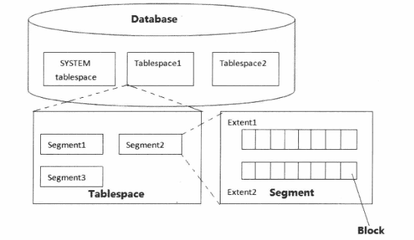

## 第三章 - 神奇，走进逻辑体系世界

### 逻辑体系结构

上一章中讲的Oracle体系的物理结构都是一些看得见摸到着的东西。
登录数据库所在的主机，实实在在地体验了SGA共享内存段是如何被开辟而又如何消亡、后台进程是如何被唤起而又如何退出。
此外也清楚地看到了数据文件、参数文件、控制文件、日志文件、归档文件的大小及位置。
因此物理结构实质上可以理解为我们在物理上可以实实在在看得见的东西。

而这一章说的体系结构的逻辑结构正是从体系物理结构图中的数据文件部分展开描述的。
如下图圆圈标记处所示

这里数据文件是存放数据之处，也是数据库存在的根本！
下面介绍的逻辑结构是：表空间(TABLESPACE)、段(SEGMENT)、区(EXTENT)、块(BLOCK)。
ORACLE SERVER 正是条理地通过表空间以及段、区、块控制磁盘空间的合理高效的使用，看下图

数据库(DATABASE)由若干表空间(TABLESPACE)组成，表空间(TABLESPACE)由若干段(SEGMENT)组成，段(SEGMENT)由若干区(EXTENT)组成，区(EXTENT)又是由Oracle的最小单元块(BLOCK)组成的。
其中表空间又包含系统表空间、回滚段表空间、临时表空间、用户表空间。
除了用户表空间外其他三种表空间有各自特定的用途，不可随意更改和破坏，尤其是系统表空间更是需要小心谨慎保护。

> 块 -> 区 -> 段 -> 表空间 -> 数据库

刚才是从大说到小，现在按照从小到大的方向再将它们描述一遍。
一系列连续的BLOCK组成了EXTENT,一个或多个EXTENT组成了SEGMENT,一个或多个SEGMENT组成了TABLESPACE,而一个或多个TABLESPACE组成了DATABASE(一个DATABASE想存在，至少需要有SYSTEM及UNDO表空间)。

到这里还是十分的抽象，理解不了一点。
比如之前执行的 `update t set object_id=92 where object_id=29;` 这里的t表对应的就是逻辑结构，而数据则是写入数据文件 datafile 里。
面对表操作肯定比面对数据文件直观形象得多，这个表是就从数据文件里直观抽象出来的逻辑结构。

前面说到 Oracle 的逻辑结构从大到小分为表空间、段、区、数据库块这4部分。
上面建的表是和段(SEGMENT)直接对应。但是表并不是只对应一个段，有数据段和索引段。此外，如果表有分区，每个分区又都独立成段。

段(SEGMENT)是由区(EXTENT)组成的，而区又是由一系列数据块(BLOCK)组成的。
那么为什么要存在区呢？块是数据库的最小单位，为什么不直接由块组成段呢？

Oracle的这个区(EXTENT)的设计是为了避免过度扩展。
因为块的尺寸太小了，如果以这个块的尺寸为单位进行扩展，那么拓展会过于频繁，从而影响性能。

#### 块

虽然说**BLOCK是Oracle的最小逻辑数据单位**，但是所有数据在文件系统层面最小物理存储单位是字节，操作系统也有一个类似Oracle的块容量的参数(block size),但是Oracle总是访问整个Oracle BLOCK,而不是按照操作系统的block size来访问的。
一般情况下大多数操作系统OS的块容量为512字节大小或其整数倍，而数据库块一般默认设置为8KB,除此之外也有系统将其设置为2KB、4KB、16KB、32KB、64KB等其他大小。
但是数据库的BLOCK一般要设置为操作系统OS块容量的整数倍，这样可以减少IO操作。

这个很好理解，和操作系统内存管理的分页有些类似。
比如IO的大小设置为512字节(0.5KB),本来如果DB的BLOCK设置为1KB正好是其2倍。但是设置为0.8KB,这时由于操作系统的单个块大小为0.5KB,只有2个操作系统块才可容纳下，于是就动用了2个OS块去容纳，相当于占用了1KB大小的OS空间，浪费了0.2KB。

Oracle的数据库块并不是简单地往里插数据，插满了装不下了就插入另一个数据块这么简单，而是额外提供了一定的管理功能。
数据库的组成分为数据块头（包括标准内容和可变内容）(common and variable header)、表目录区(tabledirectory)、行目录区(row directory)、可用空间区(free space)、行数据区(row data)这5个部分，如下图：

1. 数据块头(header)中包含了此数据块的概要信息，例如块地址(block address)及此数据块所属的段(segment)的类型（比如到底是表还是索引）。
2. 表目录存放了块中行数据所在的表的信息。
3. 行目录存放了插入的行的地址。
4. 可用空间区就是块中的空余空间.这个空余的多少由Oracle的PCTFREE参数设置，如果是1O,表示该块将会空余10%左右的空间。此外如果是表或者索引块，该区域还会存储事务条目，大致有23字节左右开销。至于为什么要有空余，后面会有解释。
5. 行数据区域就是存储具体的行的信息或者索引的信息，这部分占用了数据块绝大部分的空间。

这里数据块头(data block header)、表目录区(table directory)、行目录区(row directory)被统称为管理开销(overhead),其中有些开销的容量是固定的，而有些开销的总容量是可变的。
数据块中固定及可变管理开销的容量平均在84到107字节(byte)之间。

#### 段

一些连续的数据块(data block)组合在一起，就形成了区(EXTENT)。
**EXTENT是Oracle数据库分配空间的最小单位**，请注意分配这两个字眼。

当某用户创建一张表T时，实质就是建了一个数据段segment T。
在Oracle数据库中，**只要segment创建成功，数据库就一定为其分配了包含若干数据块(data block)的初始数据扩展(initial extent)**,即便此时表中还没数据，但是这些初始数据扩展中的数据块已经为即将插入的数据做好准备了。
接下来T表（也就是SEGMENT T)中开始插入数据，很快初始数据扩展中的数据块都装满了，而且又有新数据插入需要空间，此时Oracle会自动为这个段分配一个新增数据扩展(incremental extent),这个新增数据扩展是一个段中已有数据扩展之后分配的后续数据扩展，容量大于或等于之前的数据扩展。

每个段(segment)的定义中都包含了数据扩展(extent)的存储参数(storage parameter)。存储参数适用于各种类型的段。这个参数控制着Oracle如何为段分配可用空间。
例如，用户可以在CREATE TABLE语句中使用STORAGE子句设定存储参数，决定创建表时为其数据段(data segment)分配多少初始空间，或限定一个表最多可以包含多少数据扩展。
如果用户没有为表设定存储参数，那么表在创建时使用所在表空间(tablespace)的默认存储参数。

在一个本地管理的表空间中（注：还有一种数据字典管理的表空间，因为是一种要被淘汰的技术，这里就不提及了)，其中所分配的数据扩展(extent)的容量既可以是用户设定的固定值，也可以是由系统自动决定的可变值，取决于用户创建tablespace时用UNIFORM指令（固定大小）还是AUTOALLOCATE指令（由系统管理）。
对于固定容量(UNIFORM)的数据扩展，用户可以为数据扩展设定容量（比如100MB、1GB等随你设定)或使用默认大小(1MB)。用户必须确保每个数据扩展的容量至少能包含5个数据库块(database block)。
本地管理(locally managed)的临时表空间(temporary tablespace)在分配数据扩展时只能使用此种方式。
对于由系统管理(AUTOALLOCATE)的数据扩展，就无从插手干预了，Oracle或许一个区申请20M,下一个区忽然申请100M,Oracle在运行过程中自行决定新增数据扩展的最佳容量，我们无从得知规律。不过还是有一个下限的，即区的扩展过程中其最小容量不能低于64KB,假如数据块容量大于等于16KB,这个下限将从64KB转变为1MB。

#### 表空间分类

在 Oracle 数据库中，表空间（Tablespace）是组织和管理数据文件的逻辑容器。表空间是数据库中最大的逻辑存储单元，所有的数据库对象（如表、索引、回滚段等）都存储在表空间中。
Oracle 支持多种类型的表空间，每种类型有不同的用途和特点。

##### 系统表空间

系统表空间是数据库中默认创建的表空间之一，用于存储数据库的数据字典和其他重要元数据。

- 包含数据库的数据字典信息，如表、视图、存储过程等。
- 包含数据库的控制信息。
- 通常不应用于存储用户数据。

##### 临时表空间

临时表空间用于存储临时数据，如排序操作、临时表等。

- 数据是非持久的，会在会话结束或事务提交后自动清除。
- 临时表空间中的数据文件称为临时文件（Temporary Files）。
- 通常用于支持临时表和排序操作。

##### 回滚表空间

回滚表空间用于存储事务回滚所需的信息。

- 用于支持事务的回滚操作。
- 通常包含一个或多个数据文件。

### 逻辑结构初次体会

上面都是概念性的东西，下面开始实操。

#### Block 块

查询数据库的块(BLOCK)大小为8KB,这是Oracle的最小逻辑单位。

~~~text
SQL> show parameters db_block_size;

NAME                                 TYPE        VALUE
------------------------------------ ----------- ------------------------------
db_block_size                        integer     8192
~~~

也可以通过观察表空间视图 dba_tablespaces 的 block_size 值获取。

~~~text
SQL> select block_size from dba_tablespaces where tablespace_name='SYSTEM';

BLOCK_SIZE
----------
      8192
~~~

#### Tablespace 表空间

~~~oraclesqlplus
-- 创建普通数据表空间
CREATE TABLESPACE "test"
    DATAFILE '/opt/oracle/oradata/FREE/test.dbf'
    SIZE 100M -- 数据文件的初始大小
    AUTOEXTEND ON
-- 允许数据文件自动扩展

-- 创建临时表空间
CREATE TEMPORARY TABLESPACE test_temp
    TEMPFILE '/opt/oracle/oradata/FREE/test_temp.dbf'
    SIZE 50M
    AUTOEXTEND ON

-- 创建回滚段表空间
CREATE UNDO TABLESPACE test_undo
    DATAFILE '/opt/oracle/oradata/FREE/test_undo.dbf'
    SIZE 100M
    AUTOEXTEND ON

-- 系统表空间
SELECT file_name,
       tablespace_name,
       autoextensible,
       bytes / 1024 / 1024
FROM DBA_DATA_FILES
WHERE TABLESPACE_NAME LIKE 'SYS%'
order by substr(file_name, -12);
~~~

系统表空间查询结果：

| FILE_NAME                             | TABLESPACE_NAME | AUTOEXTENSIBLE | BYTES/1024/1024 |
|---------------------------------------|-----------------|----------------|-----------------|
| /opt/oracle/oradata/FREE/sysaux01.dbf | SYSAUX          | YES            | 1450            |
| /opt/oracle/oradata/FREE/system01.dbf | SYSTEM          | YES            | 1090            |

SYSAUX 表空间用于存储数据库的辅助数据，如索引组织表（Index Organized Tables, IOTs）、LOB 数据、数据字典视图快照等。它是 Oracle 10g 及以后版本引入的表空间，用于减轻 SYSTEM 表空间的压力。

> 系统表空间和用户表空间属于永久保留数据的表空间。

#### User 用户

