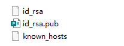
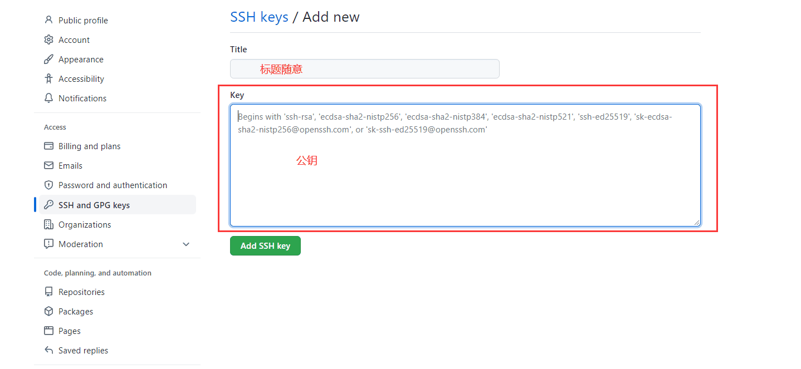

## 安装相关软件
### 安装git
Git是一个开源的分布式版本控制系统，可以有效、高速地处理从很小到非常大的项目版本管理。也是Linus Torvalds为了帮助管理Linux内核开发而开发的一个开放源码的版本控制软件。
~~据说他开发git只花了两周时间，大佬不愧是大佬。~~
[git官网](https://git-scm.com/)
windows：到[git官网](https://gitforwindows.org/)上下载，下载后会有一个Git Bash的命令行工具，用这个工具就可以使用git了。
linux：因为开发git就是为了管理linux内核开发的，所以linux的非常简单，只需要下面这行代码
~~~shell
sudo apt-get install git
~~~
当然你像我一样使用IDE自动安装
安装完成后，可以使用`git --version`查看版本

### 安装nodejs
因为Hexo是基于nodeJS编写的，所以需要安装一下nodejs和里面的npm工具。
windows：到[nodejs下载地址](https://nodejs.org/en/download/)，选择LTS版本（稳定版本）就行了。
linux：使用以下命令
~~~shell
sudo apt-get install nodejs
sudo apt-get install npm
~~~
安装完后，使用`node -v` 和 `npm -v` 查看版本

### 安装hexo
可以参考[官方文档](https://hexo.io/zh-cn/docs/)，真的非常好用
所有必备的应用程序（git和nodejs）安装完成后，即可使用 npm 安装 Hexo。
全局安装
~~~shell
npm install -g hexo-cli
~~~

## 关于github pages
可以参考[官方文档](https://docs.github.com/cn)
### 创建github仓库
新建一个名字为**username.github.io**的仓库
仓库名必须为**username.github.io**，否则不会被github识别。其中username为github账户的用户名。
### 生成ssh添加到github（如果之前没有添加过的话）
在git bash中，配置账户信息
~~~shell
git config --global user.name "yourname"
git config --global user.email "youremail"
~~~
这里的yourname为GitHub用户名，youremail为GitHub的邮箱。~~不要瞎写，不然无法push到github~~

可以查看配置的信息。~~以防写错~~
~~~shell
git config user.name
git config user.email
~~~
然后创建SSH，一路回车。
~~~shell
ssh-keygen -t rsa -C "youremail"
~~~
创建完成后，会生成C:\Users\Username\.ssh文件夹

其中id_rsa是生成的私钥，id_rsa.pub是生成的公钥。将id_rsa.pub用记事本打开，复制其内容，添加到github的设置中。

添加完成后，在gitbash中查看是否添加成功
~~~shell
ssh -T git@github.com
~~~
成功会有 **Hi username/username.github.io! You've successfully authenticated, but GitHub does not provide shell access.** 这句话。

## 关于hexo
### hexo的初始化
前面给的[官方文档](https://hexo.io/zh-cn/docs/)也包含了hexo的配置，以及命令等其他相关的功能。 ~~所以这里就简单写一下。~~
执行下列命令，Hexo将会在当前目录的指定文件夹中新建所需要的文件，请确保指定文件夹为空。
~~~shell
hexo init <folder>
cd <folder>
npm install
~~~
新建完成后，指定文件夹下会生成一些文件，其中：
_config.yml——hexo的配置文件
package.json——应用程序信息
scaffolds——模板文件夹，创建文章时，会根据模板来创建
source——资源文件夹，写的markdown和图片资源什么的都在这
themes——主题文件夹，比如我在使用的butterfly主题就放在这

### 将hexo部署到GitHub
将hexo生成的文章部署到GitHub上
打开hexo配置文件 _config.yml，翻到最后，修改deploy
其中YourgithubName是你的GitHub账户，branch是分支，一般设置为main或者master
~~~yml
deploy:
    type: git
    repo: https://github.com/YourgithubName/YourgithubName.github.io.git
    branch: master
~~~
修改完后，需要先安装deploy-git（部署的命令），这样才能用命令部署到GitHub。
~~~shell
npm install hexo-deployer-git --save
~~~
之后是hexo的部署命令
~~~shell
hexo clean
hexo generate
hexo deploy
~~~
其中 hexo clean 清除了你之前生成的东西。
hexo generate 生成静态文章，可以用 hexo g缩写
hexo deploy 部署文章，可以用hexo d缩写
hexo generate 和 hexo deploy 也可以合并写成 `hexo g -d` 或者 `hexo d -g`

出现 **INFO  Deploy done: git** 时，说明部署成功了。
稍微等一会，便可以在 https://yourname.github.io 这个网站看到你的博客了，其中yourname是github的用户名。
刷新显示404，请不要着急。~~心急吃不了热豆腐~~

到这里，使用hexo在github.io上搭建博客网站就成功了。
就可以开始写博客了。
但，是不是有点单调。所以我们可以使用主题来装饰他，来实现更多的功能。 github官方建议你使用博客生成工具 Jekyll。

## 关于hexo的主题butterfly
可以参考[官方安装文档](https://butterfly.js.org/posts/21cfbf15/)
### 安装butterfly
在hexo的根目录里
github：
~~~shell
git clone -b master https://github.com/jerryc127/hexo-theme-butterfly.git themes/butterfly
~~~
gitee：
~~~shell
git clone -b master https://gitee.com/immyw/hexo-theme-butterfly.git themes/butterfly
~~~
### 应用主题
修改 Hexo 根目录下的 _config.yml，把主题改为butterfly
~~~yml
theme: butterfly
~~~
### 安裝插件
如果你沒有 pug 以及 stylus 的渲染器，請下載安裝：
~~~shell
npm install hexo-renderer-pug hexo-renderer-stylus --save
~~~
### butterfly的相关配置
相关配置请看文档，有详细的解释。在此不作赘述。

## 可能会产生的错误
错误的原因可能很多，解决方法并不一定有用。在这里列出我碰到的问题。
因为github连接不稳定，所以要有耐心。
### OpenSSL SSL_read: Connection was aborted, errno 10053
原因
Git默认限制推送的大小，运行命令更改限制大小
解决方法
~~~shell
git config --global http.postBuffer 524288000
~~~
### Failed to connect to github.com port 443: Timed out
原因
代理的设置问题
解决方法：
进入项目目录中，使用命令行取消代理设置：
~~~shell
git config --global --unset http.proxy
git config --global --unset https.proxy
~~~