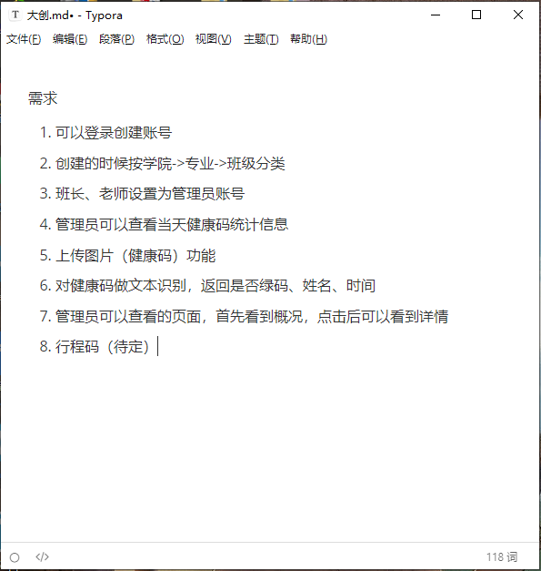
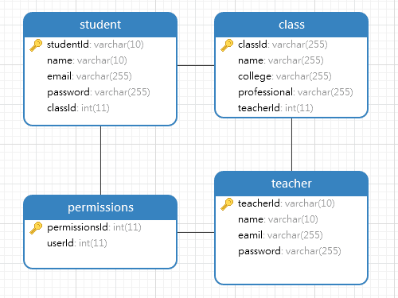

## 关于这个网站

这个网站是大创项目的网站。用于健康码识别，目前什么都没有，只有一个空项目。~~啊，对，没错。~~

### 关于网站的架构

网站前端打算使用vue，前端由[青虬](https://reol077.github.io/)负责编写  
网站后端打算使用springboot，由我负责  
项目核心功能由[顾のEvery Day](https://gufanstudy.github.io/)负责，他也是这个项目的负责人（组长）。 ~~图像识别那块，我暂时还不是很懂啦，反正很厉害就对了~~  
前后端肯定是要分离的，使用ajax，数据格式使用json。 ~~jsp不分离属实痛苦~~  
后端与图像识别的python程序，目前打算使用socket（套接字）进行通信。 ~~目前只是了解过，还需要学习~~  
而且临近期末，springboot暂时还没学完，所以开发进度在七月前估计会很慢。 ~~可能根本没有进度~~  

目前进度：确认大体需求

> 2022-05-21  
> 周六，楼下的广场舞很吵。

### 数据库设计

数据库设计了四张表，老师、学生、权限、班级  
因为需求比较简单，比如权限暂时只有两种——能否查看统计信息，所以并没有采取复杂的角色和权限表。  
同时因为对学院和专业没有什么明确的实际操作，所以写在了班级中，并未单独分表。  
关于学生健康码信息的表，目前计划动态新建表，即每天新建一张表用于存储健康码的相关信息

目前进度：创建数据库，搭建项目基本配置

> 2022-07-05  
> 果然七月前完全没有进度，紧张的期末也终于是结束了。python实训（网课）开始了。  
> ~~（还有几门成绩还不出，是不打算出了吗）~~

## 具体开发过程

### 注册部分（未完成

注册部分使用邮箱进行验证，使用到了springboot自带的mail组件。还挺好用的，和之前使用的javax.mail的大体流程（邮件的设置之类的）是一样的。  
同时也决定使用redis数据库，来解决同一用户使用不同浏览器或设备来进行邮件验证的数据共享问题。比之前采取静态类存取sessionId的方式会好一些。  
最后，在发送邮件的调试过程中，我也决定使用日志来打印一些信息，进行排错，而非System.out.println()。  

目前进度：大概完成了注册的三分之一。

> 2022-07-08  
> 今天也算是见证历史了，日本前首相安倍晋三今天中午遇刺，下午宣布死亡。  
> 考虑以后可以给博客添加上类似历史上的今天这类tips。~~应该会有意义吧~~  

### 老师注册部分（基本完成

注册的流程大概如下：  
1. 发送注册请求
2. 生成验证码，将验证码同用户信息一起写入redis，发送验证邮件
3. 访问验证链接
4. 验证验证码是否正确
   1. 正确则修改redis中的数据，将用户改为在线状态，用户邮箱写入cookie，同时修改它们的生命周期（方便后期登录使用），发送注册成功的邮件，写入数据库
   2. 错误则返回错误信息

redis中缓存的信息也从原来的string改成了hash，因为考虑到登录会使用，所以缓存中用户信息得记录详细。  
关于验证的链接，返回的是html页面，使用的是thymeleaf，其实不太想用的，但总不能返回个json数据吧。因为页面显示完信息后，应该会3s后跳转到首页。比jsp方便了一些吧。（暂时没有好的处理方式  
最后就是关于Controller层和Service层的一些想法。  
业务层应该把这个请求分解成一个个服务，不同的请求也可以重用服务，提高代码的复用性。dao层就只做与数据库的交互。  
对于Controller层和Service层的划分和设计，目前设计的还不是很好。得多写多看吧。  

> 2022-07-10  
> 脑子有点乱，去睡会觉。想把个人介绍写写，但还没想好怎么写。

### 重新设计

想了想，现在的注册虽然完成了，但是过于复杂。在邮件里嵌入链接进行验证是一个不太聪明的行为。  
所以决定重新设计下使用流程：  
1. 注册
   1. 输入图片验证码，发送带有验证码的邮件。  
   2. 同一页面，输入邮件的验证码提交后。即注册完成
2. 登录
   1. 账号，密码，图片验证码。  
   2. 正确则登陆成功
3. 忘记密码
   1. 输入图片验证码，发送带有验证码的邮件。
   2. 同一页面，输入邮件的验证码以及新密码提交后。即重置完成

顺带把接口写好，需要什么，返回什么得提前规划好。

> 2022-07-11
> 脑子不是一般的乱，之前的设计问题很大。虽然也不是不能实现。
> 好的设计会让程序更加简洁高效，接口写了一部分，先实现这部分。

## 接口文档

### 接口说明

### 注册部分

1. 老师注册（发送邮件验证  
   请求地址：/tRegister  
   请求方式：get/post  
   请求参数及返回值说明：
   | | 参数名 | 类型 | 是否必须 | 说明 |
   | --- | ----- | --- | ------- | ----- |
   | 输入参数 | id | string | y | 老师工号 |
   | | email | string | y | 邮箱 |
   | | name | string | y | 姓名 |
   | | password | string | y | 密码 |
   | | emailCode | string | y | 邮箱验证码 |
   | 输出参数 | result | string | y | 操作true/false |
   | | msg | string | y | 错误信息 |  

    JSON返回示例：{"result":"true","msg":""}
2. 学生注册（发送邮件验证  
   请求地址：/sRegister  
   请求方式：get/post  
   请求参数及返回值说明：
   | | 参数名 | 类型 | 是否必须 | 说明 |
   | --- | ----- | --- | ------- | ----- |
   | 输入参数 | id | string | y | 学生学号 |
   | | email | string | y | 邮箱 |
   | | name | string | y | 姓名 |
   | | password | string | y | 密码 |
   | | classId | string | y | 班号 |
   | | emailCode | string | y | 邮箱验证码 |
   | 输出参数 | result | string | y | 操作true/false |
   | | msg | string | y | 错误信息 |

   JSON返回示例：{"result":"true","msg":""}

### 登陆部分

1. 老师登录  
   请求地址：/tLogin  
   请求方式：get/post  
   请求参数及返回值说明：
   | | 参数名 | 类型 | 是否必须 | 说明 |
   | --- | ----- | --- | ------- | ----- |
   | 输入参数 | id | string | y | 老师工号 |
   | | email | string | y | 邮箱 |
   | | password | string | y | 密码 |
   | | code | string | y | 验证码 |
   | | wayToLogin | string | y | 登陆方式 |
   | | user | string | y | 用户（老师/学生） |
   | 输出参数 | result | string | y | 操作true/false |
   | | msg | string | y | 错误信息 |  

    id和email二选其一，通过wayToLogin的值进行区分，取值为id/email
    登录用户通过user区分，取值为student/teacher

### 重置密码

1. 重置（发送验证邮件  
   请求地址：/tReset  
   请求方式：get/post  
   请求参数及返回值说明：
   | | 参数名 | 类型 | 是否必须 | 说明 |
   | --- | ----- | --- | ------- | ----- |
   | 输入参数 | id | string | y | 老师工号 |
   | | newPassword | string | y | 新密码 |
   | | emailCode | string | y | 邮箱验证码 |
   | | user | string | y | 用户（老师/学生） |
   | 输出参数 | result | string | y | 操作true/false |
   | | msg | string | y | 错误信息 |

   JSON返回示例：{"result":"true","msg":""}
   登录用户通过user区分，取值为student/teacher

