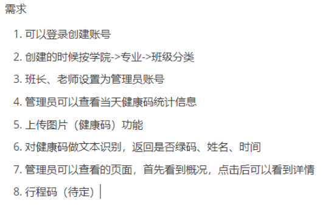

## 关于这个网站

这个网站是大创项目的网站。用于健康码识别，目前什么都没有，只有一个空项目。~~啊，对，没错。~~

### 关于网站的架构

网站前端打算使用vue，前端由[青虬](https://reol077.github.io/)负责编写  
网站后端打算使用springboot，由我负责  
项目核心功能由[顾のEvery Day](https://gufanstudy.github.io/)负责，他也是这个项目的负责人（组长）。 ~~图像识别那块，我暂时还不是很懂啦，反正很厉害就对了~~  
前后端肯定是要分离的，使用ajax，数据格式使用json。 ~~jsp不分离属实痛苦~~  
后端与图像识别的python程序，目前打算使用socket（套接字）进行通信。 ~~目前只是了解过，还需要学习~~  
而且临近期末，springboot暂时还没学完，所以开发进度在七月前估计会很慢。 ~~可能根本没有进度~~  

目前进度：确认大体需求

> 2022-05-21  
> 周六，楼下的广场舞很吵。