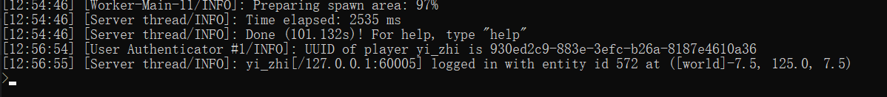
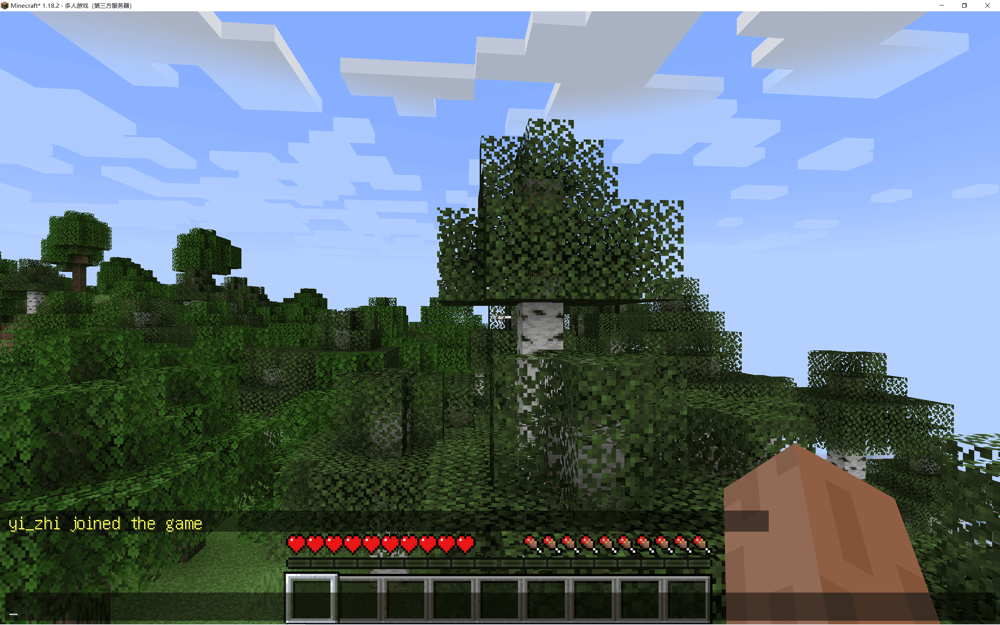

## 前言

首先来简单介绍下 minecraft 的服务端。
服务端主要有 Bukkit、Spigot、Paper、Sponge 等。主要提供接口以供开发插件。
模组加载器主要有 forge、fabric 等。主要也是提供接口以提供额外的功能，主要是兼容各个模组不互相冲突。（该冲突的还是躲不掉的）

插件与模组的主要区别是：
1. 插件是增加游戏内容，而不修改。但模组可以修改游戏内容，增加新的东西（物品/生物等等，但插件做不到）。
2. 插件运行在服务端。模组则是服务端客户端都可以运行。

这里主要内容是搭建，关于插件与模组的编写不做过多介绍（主要我也没怎么写过插件和模组）。
这里贴几个链接：

以下主要是官网，因为 minecraft 的插件和模组官方并不提供，属于第三方社区开发和维护（为爱发电）

[forge 官网](https://files.minecraftforge.net/net/minecraftforge/forge/)
[spigot 与 Bukkit 官网](https://getbukkit.org/)
[Paper 官网](https://papermc.io/)

我认为比较好的教程：
[Bukkit API 教程](https://bdn.tdiant.net/#/README)
[开服教程](https://guide.minecraft.kim/)
[szszss大佬的博客](http://blog.hakugyokurou.net/) 大佬的博客主要有模组与光影的编写教程

## 前期准备

首先得有一个服务端核心文件，上面所说的几个都可以。官网有服务端核心文件的下载链接。
其次就是要注意 minecraft 与 Java 的版本关系。这里不列举了，下载时应该有（也许

服务端核心文件为一个 jar 包。

## 搭建

这里我以 spigot-1.18.2 的核心作为示例。

第一次运行核心 jar 文件
~~~shell
java -jar spigot-1.18.2.jar
~~~
当然，你也可以编写一个启动脚本，以配置启动环境以及更多的启动参数。

第一次运行结束之后，会生成一些文件。
需要修改的是 eula.txt ，同意 MINECRAFT 最终用户许可协议。如下：
~~~txt
eula=true
~~~

其次就是 server.properties 。里面主要是服务器的一些配置项。
包括端口号、正版验证、白名单、连接超时时间等等配置项。
详细配置项可以 Google 一下

修改完成后，第二次运行核心 jar
在经过漫长的世界生成和加载之后，出现 done，便成功启动了。
随后启动对应版本的游戏，在多人游戏中加入服务器即可（默认端口号为 25565）

此时便可以多人游玩了，服务器搭建完成。

## 其他

众所周知，Java 是虚拟机语言，是跨平台的。
所以以上操作在 linux 和 windows 中是完全一样的。当然，建议服务器使用 linux 并且使用 screen 在后台运行。

云服务器注意防火墙给端口放行。

bukkit、spigot 等插件服务端核心会生成 plugins 文件夹，用于存放插件。插件也是以 jar 包形式载入。
forge、fabric 等模组服务端核心会生成 mods 文件夹，用于存放模组资源。模组也是以 jar 包形式载入。
那么，模组与插件可不可以同时存在呢？
答案是可以的，我找到一个项目，提供了几乎与所有插件和模组兼容的服务端核心。
它叫 Mohist 

[Mohist 官网](https://mohistmc.com/)

我下载了 mohist-1.18.2-8-server.jar Forge: 40.2.1 并成功地运行了。
由于我并没有在它的服务端核心上测试运行模组和插件，所以不做过多的评价。

一点点评价就是，我认为可以同时运行插件和模组是很酷的事情。
模组提供更多的可玩性内容，插件提供更多服务器特色的内容。
用于服务器的模组比较常见的有，匠魂、冰与火之歌、拔刀剑、工业、暮色、宝可梦、以及国产模组原初修真等。
用于服务器的插件大多是定制的，像是登录、领地、地皮等功能，个性化程度较高。

## END

祝想要开服的小伙伴成功开服，并长期运营。

[《蓝易云》教程征集](https://fishpi.cn/article/1677580643943)

