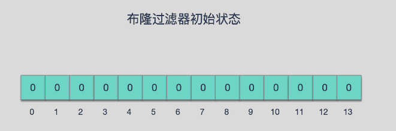
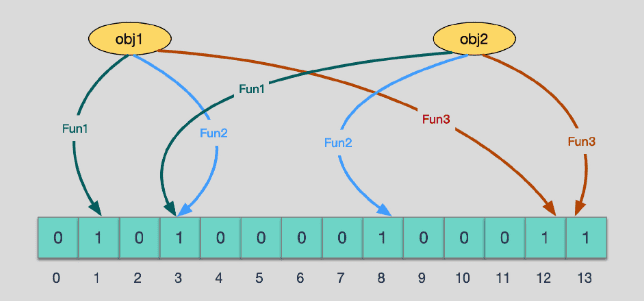

## 介绍

布隆过滤器（Bloom Filter）是1970年由布隆提出的。
它实际上是一个很长的二进制向量和一系列随机映射函数。布隆过滤器可以用于**检索一个元素是否在一个集合中**。
它类似一个hash set，用来判断某个元素（key）是否在某个集合中。但和一般的hash set不同的是，这个算法无需存储key的值，对于每个key，只需要k个比特位，每个存储一个标志，用来判断key是否在集合中。
它的优点是空间效率和查询时间都比一般的算法要好的多。
缺点是有一定的误识别率、无法获取元素本身和删除困难。

他的使用场景：
布隆过滤器可以告诉我们“某个东西一定不存在或可能存在”。即布隆过滤器说不存在即一定不存在，说存在可能不存在（误判）
1. 邮件过滤，使用布隆过滤器来做邮件黑名单过滤
2. 对爬虫网址进行过滤，爬过的不再爬
3. 解决新闻推荐过的不再推荐
总的来说，即用于**黑名单过滤**

## 原理

### 哈希函数

哈希函数的概念是：将任意大小的输入数据转换成特定大小的输出数据的函数，转换后的数据称为哈希值或哈希编码，也叫散列值。
所有散列函数都有如下基本特性：
1. 如果两个散列值是不相同的（根据同一函数），那么这两个散列值的原始输入也是不相同的。这个特性是散列函数具有确定性的结果，具有这种性质的散列函数称为**单向散列函数**。
2. 散列函数的输入和输出不是唯一对应关系的，如果两个散列值相同，两个输入值很可能是相同的，但也可能不同，这种情况称为“**散列碰撞**（collision，哈希碰撞）”。
但是用 hash表存储大数据量时，空间效率还是很低，当只有一个 hash 函数时，还很容易发生哈希碰撞。

### 布隆过滤器数据结构

布隆过滤器由一个固定大小的二进制向量或位图（bitmap）和一系列映射函数组成。
在初始状态下，对于长度为m的位数组，他所有位置都被置为0。
如下图：

当有元素被加入集合时，通过k个映射函数将这个元素映射成位图中的k个点，将它们的值置为1。
假如有两个元素通过三个映射函数，如下图：

当查询某个元素是都存在时，只要通过k个映射函数，看对应位图中的k个点的值是否都为1。
1. 如果这些点有任意一个为0，则元素一定不存在。
2. 如果都是1，则元素**可能存在**。
为什么是可能存在，不是一定存在。是因为映射函数本身是散列函数，散列函数会有碰撞（即使碰撞概率可以很低）。

### 误判率

布隆过滤器的误判是指多个输入经过哈希之后在相同的bit位 置1 了，这样就无法判断究竟是哪个输入产生的，因此误判的根源在于相同的bit位被多次映射且置1。
这种情况也造成了布隆过滤器的删除问题，因为布隆过滤器的每一个bit并不是独占的，很有可能多个元素共享了某一位。如果我们直接删除这一位的话，会影响其他的元素。（比如上图中的第3位）

**布隆过滤器可以添加元素，但不能删除元素。**因为删除元素会导致误判率的增加。

关于误判率的计算（略）
参考[布隆过滤器概念及其公式推导 转载](https://www.cnblogs.com/D-Rui/articles/12848869.html#:~:text=%E5%B8%83%E9%9A%86%E8%BF%87%E6%BB%A4%E5%99%A8%E8%BF%98%E6%8B%A5%E6%9C%89k%E4%B8%AA%E5%93%88%E5%B8%8C%E5%87%BD%E6%95%B0,%EF%BC%8C%E5%BD%93%E4%B8%80%E4%B8%AA%E5%85%83%E7%B4%A0%E5%8A%A0%E5%85%A5%E5%B8%83%E9%9A%86%E8%BF%87%E6%BB%A4%E5%99%A8%E4%B8%AD%E7%9A%84%E6%97%B6%E5%80%99%EF%BC%8C%E4%BC%9A%E4%BD%BF%E7%94%A8k%E4%B8%AA%E5%93%88%E5%B8%8C%E5%87%BD%E6%95%B0%E5%AF%B9%E5%85%B6%E8%BF%9B%E8%A1%8Ck%E6%AC%A1%E8%AE%A1%E7%AE%97%EF%BC%8C%E5%BE%97%E5%88%B0k%E4%B8%AA%E5%93%88%E5%B8%8C%E5%80%BC%EF%BC%8C%E5%B9%B6%E4%B8%94%E6%A0%B9%E6%8D%AE%E5%BE%97%E5%88%B0%E7%9A%84%E5%93%88%E5%B8%8C%E5%80%BC%EF%BC%8C%E5%9C%A8%E7%BB%B4%E6%95%B0%E7%BB%84%E4%B8%AD%E6%8A%8A%E5%AF%B9%E5%BA%94%E4%B8%8B%E6%A0%87%E7%9A%84%E5%80%BC%E7%BD%AE%E4%BD%8D1%E3%80%82)
其中可以根据 样本量和期望的失误率 得出具体需要 多少存储空间和哈希函数的个数
布隆过滤器只与样本量和失误率有关，与单样本大小无关（因为它会经过哈希函数）

## 布隆过滤器的实现

### coding

~~~java
package BloomFilter;

import java.util.BitSet;

/**
 * 布隆过滤器
 */
public class BloomFilter {
    // 长度为10亿的比特位
    private static final int DEFAULT_SIZE = 256 << 22;
    // 使用的哈希函数（8个）
    private static final int[] seeds = {3, 5, 7, 11, 13, 17, 19, 23};
    private static final HashFunction[] functions = new HashFunction[seeds.length];
    // 初始化布隆过滤器
    private static BitSet bitSet = new BitSet(DEFAULT_SIZE);

    /**
     * 构造函数，初始化哈希函数
     */
    public BloomFilter() {
        for (int i = 0; i < seeds.length; i++) {
            functions[i] = new HashFunction(DEFAULT_SIZE,seeds[i]);
        }
    }

    /**
     * 添加元素
     */
    public void add(String value){
        if (value!=null){
            for(HashFunction f : functions){
                bitSet.set(f.hash(value),true);
            }
        }
    }

    /**
     * 判断元素是否存在
     */
    public boolean contains(String value){
        if (value==null){
            return false;
        }
        boolean result = true;
        // 遍历所有哈希结果对应比特位，有一个返回false即break（不存在）
        for(HashFunction f :functions){
            result = bitSet.get(f.hash(value));
            if (!result){
                break;
            }
        }
        return result;
    }
}

/**
 * 哈希函数
 */
class HashFunction {

    private final int size;
    private final int seed;

    public HashFunction(int size, int seed) {
        this.size = size;
        this.seed = seed;
    }

    /**
     * 使用加法哈希算法
     */
    public int hash(String value) {
        int result = 0;
        int len = value.length();
        for (int i = 0; i < len; i++) {
            result = seed * result + value.charAt(i);
        }
        return (size - 1) & result;
    }
}
~~~

测试：
~~~java
import BloomFilter.BloomFilter;
import org.junit.Test;

public class BloomFilterTest {
    @Test
    public void bloomFilter() {
        BloomFilter bloomFilter = new BloomFilter();
        for (int i = 0; i < 100000; i++) {
            bloomFilter.add(String.valueOf(i));
        }
        System.out.println(bloomFilter.contains("1"));
        System.out.println(bloomFilter.contains("2"));
        System.out.println(bloomFilter.contains("3"));
        System.out.println(bloomFilter.contains("100001"));
    }
}
~~~

运行结果：
~~~text
true
true
true
false

~~~

### Guava 中的 BloomFilter

依赖：
~~~xml
<dependency>
    <groupId>com.google.guava</groupId>
    <artifactId>guava</artifactId>
    <version>31.0.1-jre</version>
</dependency>
~~~

使用：
~~~java
    @Test
    public void test() {
    
        BloomFilter<Integer> bloomFilter = BloomFilter.create(Funnels.integerFunnel(), 100000, 0.0001);
        for (int i = 0; i < 100000; i++) {
            bloomFilter.put(i);
        }
        System.out.println(bloomFilter.mightContain(1));
        System.out.println(bloomFilter.mightContain(2));
        System.out.println(bloomFilter.mightContain(3));
        System.out.println(bloomFilter.mightContain(100001));
    }
~~~

运行结果：
~~~text
true
true
true
false

~~~

## 总结

关于哈希函数有空再仔细研究研究（咕咕咕）

参考文章：
[布隆过滤器(Bloom Filter)详解](https://www.cnblogs.com/liyulong1982/p/6013002.html)
[十分钟理解布隆过滤器](https://www.cnblogs.com/caicz/p/16710090.html)
[布隆过滤器，这一篇给你讲的明明白白](https://developer.aliyun.com/article/773205)
[布隆过滤器概念及其公式推导 转载](https://www.cnblogs.com/D-Rui/articles/12848869.html#:~:text=%E5%B8%83%E9%9A%86%E8%BF%87%E6%BB%A4%E5%99%A8%E8%BF%98%E6%8B%A5%E6%9C%89k%E4%B8%AA%E5%93%88%E5%B8%8C%E5%87%BD%E6%95%B0,%EF%BC%8C%E5%BD%93%E4%B8%80%E4%B8%AA%E5%85%83%E7%B4%A0%E5%8A%A0%E5%85%A5%E5%B8%83%E9%9A%86%E8%BF%87%E6%BB%A4%E5%99%A8%E4%B8%AD%E7%9A%84%E6%97%B6%E5%80%99%EF%BC%8C%E4%BC%9A%E4%BD%BF%E7%94%A8k%E4%B8%AA%E5%93%88%E5%B8%8C%E5%87%BD%E6%95%B0%E5%AF%B9%E5%85%B6%E8%BF%9B%E8%A1%8Ck%E6%AC%A1%E8%AE%A1%E7%AE%97%EF%BC%8C%E5%BE%97%E5%88%B0k%E4%B8%AA%E5%93%88%E5%B8%8C%E5%80%BC%EF%BC%8C%E5%B9%B6%E4%B8%94%E6%A0%B9%E6%8D%AE%E5%BE%97%E5%88%B0%E7%9A%84%E5%93%88%E5%B8%8C%E5%80%BC%EF%BC%8C%E5%9C%A8%E7%BB%B4%E6%95%B0%E7%BB%84%E4%B8%AD%E6%8A%8A%E5%AF%B9%E5%BA%94%E4%B8%8B%E6%A0%87%E7%9A%84%E5%80%BC%E7%BD%AE%E4%BD%8D1%E3%80%82)