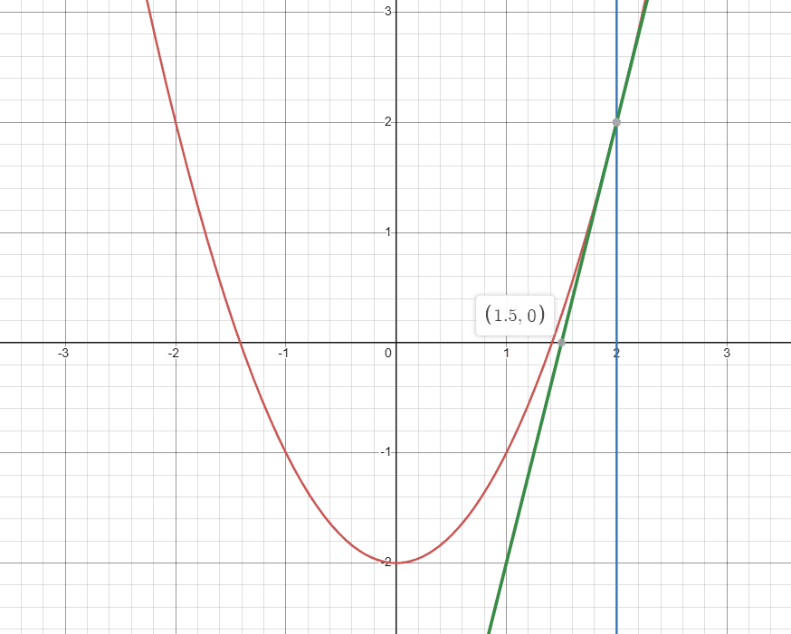
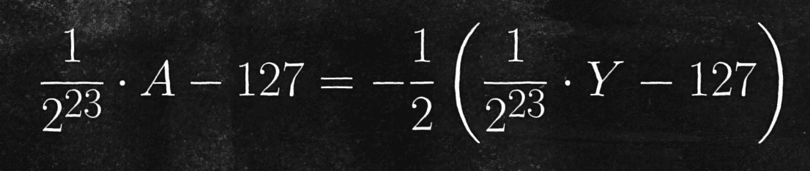

## 介绍

来看段代码，由 格雷格·沃什 所写。注释由 卡马克 所写。
用于快速求平方根倒数。常用于在3D图形编程。
随《雷神之锤3》代码开源以及卡马克注释中优雅的评价而出名。

~~~c
float Q_rsqrt(float number)
{
    long i;
    float x2, y;
    const float threehalfs = 1.5F;
    
    x2 = number * 0.5F;
    y = number;
    i = * ( 1ong * ) &y; // evil floating point bit level hacking
    i = 0x5f3759df - ( i >> 1 ); // what the fuck?
    y = * ( float * ) &i;
    y = y * ( threehalfs - ( x2 * y * y ) ); // 1st iteration
    // y = y * ( threehalfs - ( x2 * y * y ) ); // 2st iteration this can be removed
    return y;
}
~~~

## 如何求平方根

比如求 2 的平方根，要精确到 7 位小数。
把问题转化下，其实是求 y=x^2-2 这个函数与 x 轴的交点。
由于这个函数是条曲线，交点坐标不好求。那么可以用一条直线近似代替曲线，什么样的直线可以呢？
是 **切线**
取 x=2 处的切线（y=4x-6），近似代替曲线。如图：

近似替代后，得到交点坐标为 (1.5,0) 那么 根号2 的一个近似值就是 1.5。那么这个精度还是不够的。

如何解决呢？
答案是取这个点处的切线（y=3x-4.25）继续近似替代。如图：

此时，近似值来到了 1.4166666666666667
在多次这样的操作之后，近似值的精度会越来越高。
第三次近似值：1.4142156862745099       
第四次近似值：1.4142135623746899       
第五次近似值：1.4142135623730951
大概第四次第五次就达到想要的精度了。

这个方法就是 [牛顿法](https://zh.wikipedia.org/zh-tw/%E7%89%9B%E9%A1%BF%E6%B3%95)，被广泛用于近似求解各种方程。
牛顿法的公式可以简化：

手算这么多位的小数肯定会头皮发麻，但计算机不会。而且牛顿法每步迭代公式都一样，给计算机算太合适了。
~~~go
func name() {
	// 初始值
	x := 2.0
	precision := 1e-7 // 预定精度

	// 牛顿法迭代函数
	fx := func(x float64) float64 {
		return x*x - 2
	}

	// 牛顿法迭代公式（导函数）
	dfx := func(x float64) float64 {
		return 2 * x
	}

	// 迭代牛顿法求解根号2
	for {
		xNext := x - fx(x)/dfx(x)
		if math.Abs(x-xNext) < precision {
			break
		}
		x = xNext
	}

	// 输出结果
	fmt.Printf("根号2的近似解:%.7f\n", x)
}
~~~

## 如何优化

上面通过牛顿法虽然可以求出平方根的近似值，但是效率很低。要经过多次迭代。
那么有办法减少迭代次数吗？或者只用一次牛顿法得到足够精确的值吗？
通过观察牛顿法的公式可以发现，减少迭代次数的关键就是**初始值的选择**。

上面的例子中，初始值为 2，迭代了 4 次得到精度为 7 位小数的结果。
但如果初始值选择为 1.414，那么只需要一次牛顿法就可以得到想要的结果。

那么如何得到更加精确的初始值呢？要得到的不就是“更加精确的初始值”吗？

## 如何得到更加精确的初始值

首先，了解下计算机是如何存储浮点数的。
学习过计算机组成原理的应该都知道，[IEEE754](https://zh.wikipedia.org/wiki/IEEE_754)。全称：IEEE二进制浮点数算术标准（ANSI/IEEE Std 754-1985）

32位单精度浮点数存储方法：

1为符号位 8位指数位 23位尾数位

64位双精度浮点数存储方法也类似：
1为符号位 11位指数位 52位尾数位

这里拿32位举例。（当初学计组，拿笔手算浮点数运算可痛苦了
下图是32位浮点数十进制值与二进制值的关系：

那么知道浮点数在计算机底层中是如何存储的之后，就要对上面的公式进行简化。

这里要运用对数的知识。
**对数可以将乘除运算变为加减运算，将幂运算变为乘法运算**。如图：

我们要求的是平方根的倒数，也就是求 a的对数乘以-1/2 ：

那么对数怎么求？这里要分两部分。
将浮点数转十进制的公式带入对数将幂运算转换为乘法运算的公式中。
然后将式子展开（乘法运算转为加减运算）
前面还是对数的形式，后面则可以直接得到结果。

那前面的部分如何处理？
M 是一个23位的2进制尾数，它除以 2^23 一定在 0~1 之间。

我们可以观察下 y=以2为底的log(1+x) 与 y=x 在 0~1之间的函数图像。如图： 

.png)

这里借鉴了牛顿的思维，用直线近似替代曲线。因为 0~1 之间，y=x 与 y=log(1+x) 十分接近，所以用 y=x 近似替代 y=log(1+x)。
这就是上式约等号的由来。

将 2^23分之一 提取出来，得到：

括号里的东西，不正是计算机中二进制存储的值吗？
所以，浮点数y 与 二进制存储的Y 关系：

那么，假设 a 为 y 的平方根倒数：

将 a 和 y 换成二进制形式：

化简得到：

381*2^22 用16进制表示：5f400000

于是出现了让卡马克写下 what the fuck? 注释的语句。
但是在沃什的代码中，这个数字是 5f3759df 
为什么呢？
因为刚才用 y=x 近似替代 y=log(1+x) 时，有些粗糙了。
用 y=x 近似替代，只有在两端的误差比较小。中间误差就大了。
而如果将 y=x 往上移一些，就可以使误差在两端和中间比较平均，整体误差更小。

反应到程序中，就是给 5f400000 加上一个偏移量。
沃什选择了 5f3759df，使用这个值，即使不用牛顿法，平方根倒数的最大误差也只有 5%，将初始值带入，算出的误差不超过2‰。

到这，我们终于得到了精确的初始值。即代码中的 y。

## 代码

最重要的四行，也就是注释开始的后四行。
第一行，将32位浮点数转为长整型，用于二进制计算
第二行，得到初始值（算法最核心的地方）
第三行，将长整型转回32位浮点数
第四行，使用牛顿法迭代一次（注释了一行，是因为迭代一次的精度就已经足够。大佬恐怖如斯）

再次欣赏一下：

~~~c
float Q_rsqrt(float number)
{
    long i;
    float x2, y;
    const float threehalfs = 1.5F;
    
    x2 = number * 0.5F;
    y = number;
    i = * ( 1ong * ) &y; // evil floating point bit level hacking
    i = 0x5f3759df - ( i >> 1 ); // what the fuck?
    y = * ( float * ) &i;
    y = y * ( threehalfs - ( x2 * y * y ) ); // 1st iteration
    // y = y * ( threehalfs - ( x2 * y * y ) ); // 2st iteration this can be removed
    return y;
}
~~~

上面公式太乱没有看懂的话，下面是手写过程：

## 总结

这个算法牛就牛在运用了浮点数在计算机中的存储方法。
还有至今不知道怎么来的”魔法数字“ 5f3759df

参考：
[什么代码让程序员之神感叹“卧槽”？ - bilibili 量子位](https://www.bilibili.com/video/BV18j411i7bp/)