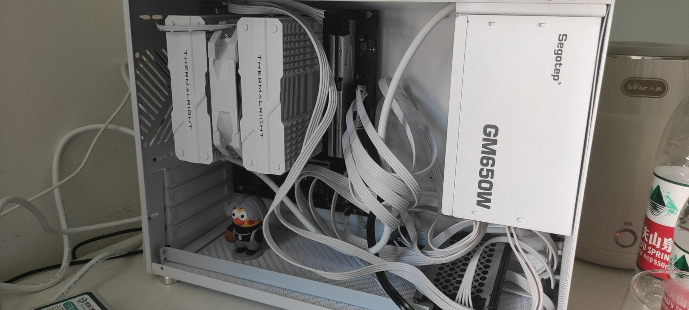

## 起因

现在的笔记本已经快用了四年了。CPU还是 i5-10210U，内存还是加过一根8G内存条的，一共16G。
现在已经完全不够用了。编译启动项目十分的慢，并且时常爆内存。
甚至键盘按键都有几个不灵了，是不是按不出来或者按一下蹦两个。悲

原本打算今年毕业的时候组装一台台式机，CPU线程要多，频率能高就高，其次就是内存要大。（我是真被idea干出内存焦虑了）
并且想开多系统，当服务器 7*24 不关机的。用的时候直接远程。
显卡是无所谓的，能打LOL的水平就够我用了。
虽然也很想要2k60流畅3A的水平。如果我才大一，我一定会搞个好点的显卡，但现在我上班了，电子阳痿了属于是，LOL都不打了。~~工作害人~~

看过很多方案，常见的 i5-12600KF，13600KF，itx到atx。
还有垃圾佬的 e3，e5，x79，x99平台。
再到 AMD 的 epyc。一颗u上万，还能双路，明显不是我能消费的。~~虽然内存上1T看得很爽，谁能拒绝单根64G大容量，主板插满呢~~

最后偶然在图吧评论看到 h系列 es 的 cpu。高性能低功耗，还便宜，谁让是es的u呢。
然后就蹲最近的 Q1HY，虽然没赶上最便宜的时候，但终究是没按耐住。
毕竟es的u应该也不多，买一片少一片吧。虽然现在黄鱼加价卖的也不少，但等热度过去，估计也难买。毕竟es的u，虽然可以看作没质保，但总比黄鱼好点。

过两天等到货就可以装新电脑了，真是不错。

## 配置单

| 配件   | 名称                           | 价格            |
|------|------------------------------|---------------|
| 板U   | 尔英Q1HY matx                  | 1299          |
| 内存   | 银爵 D5 6000 32*2 海力士M-die-C36 | 1248(1199)    |
| 固态   | 致钛TiPlus7100 2TB             | 979(974.19)   |
| 电源   | 鑫谷GM650W冰山版 金牌模组             | 379(363.93)   |
| 散热   | 利民PA120 MINI                 | 169(164)      |
| 无线网卡 | Intel AX210                  | 94(88)        |
| 机箱   | 御猫K2mini                     | 179(173)      |
| 总计   |                              | 4347(4261.12) |

## 组装

配件陆陆续续到了之后，就开始组装了。有一说一，matx的机箱装起来还是有点小的，手伸不进去，螺丝难拧。
还好买的不是itx，不然装机可就太痛苦了。
因为过程中电源和网卡换了，拆装了不下五次。~~下次再装机我肯定格外熟练~~

电源本来是航嘉的WD650K直出，也是没看就买了，那么大个直出。
机箱本来就小，还那么多用不上的线，更不好装。索性就退了重新买了个全模组的。买回来之后好像也就这样。
退货还花了20运费。算是对我粗心的惩罚吧。

网卡也是，买成了Pcie*1的接口的网卡。
买之前还是得看下接口。

没理线，还是乱。matx没地方给我理线、机箱说实话，也选的一般。
特别是它那玻璃侧板，拆下来温度就明显低下来了，不拆就是闷罐。
有个原因可能是，没装风扇。

为什么呢？
原本觉得太热，买了六个风扇，25mm*9cm的，结果太厚了，装不进那个我塞不进手的缝隙。得买15mm的。
一看太贵了，多上几个都赶上我六热管的利民散热器了。
再加上，我把玻璃侧板拆了，温度低了很多。
干脆就都不要了。不管是风扇还是玻璃侧板。也许后面会考虑下亚克力的侧板吧，不过现在就这样吧。

## 超频

谁能想到仅1300的板u还能超频呢？
于是进bios一顿调参。全核5.2G，我是真敢超。
然后时常蓝屏重启。这样不行，对于我不想关机的人来说有点接受不了。
虽然低负载，但还是蓝屏。

全核5.0G。还行，能用。
但当我开始玩死亡搁浅的时候，有点寄。
半个小时温度上来后，就又蓝屏了。那天晚上游戏崩了有四五次。包括游戏本身崩了一次，其他大概率都是超频的问题。

不行，恢复了bios的全部设置。
超频的尽头是默认。
这下不蓝屏了，不过频率低了，性能也就低了。
毕设后端代码原来超频时，编译只需要6s，现在默认需要10s。
不过也满足了，比我的笔记本强太多了。而且主要也便宜。

## End

最后，吐槽下显卡的价格。是真的贵啊。
4060ti得三千多，4060也得两千大几。
也只有等毕业真正上班才能考虑下了，实习的工资考虑不了一点。

最后，放张图吧。乱七八糟的线，能用就行吧。不追求那么多了。

哦，还有块老电脑上拆下来的465G的2.5寸固态硬盘。
不得不说，64G真爽，没有内存不够的问题了，基本想开多少软件就开多少。

