## 设计模式概述

### 产生背景

"设计模式"最初并不是出现在软件设计中，而是被用于建筑领域的设计中。
1977年美国著名建筑大师、加利福尼亚大学伯克利分校环境结构中心主任克里斯守托夫·亚历山大(Christopher Alexander)在他的作《建筑模式语言：城镇、建筑、构造》中描述了一些常见的建筑设计问题，并提出了253种关于对城镇、邻里、住宅、花园和房间等进行设计的基本模式。
1990年软件工程界开始研讨设计模式的话题，后来召开了多次关于设计模式的研讨会。直到1995年，艾瑞克伽马(ErichGamma)、理查德-海尔姆(Richard Helm)、拉尔夫·约翰森(Ralph Johnson)、约翰威利斯迪斯(John Vlissides)等4位作者合作出版了《设计模式：可复用面向对象软件的基础》一书，在此书中收录了23个设计模式，这是设计模式领域里程碑的事件，导致了软件设计模式的突破。这4位作者在软件开发领域里也以他们的"四人组"(Gang of Four,GoF)著称。

### 软件设计模式概念

软件设计模式(Software Design Pattern),又称设计模式，是一套被反复使用、多数人知晓的、经过分类编目的、代码设计经验的总结。它描述了在软件设计过程中的一些不断重复发生的问题，以及该问题的解决方案。也就是说，它是解决特定问题的一系列套路，是前辈们的代码设计经验的总结，具有一定的普遍性，可以反复使用。

### 使用设计模式的必要性

设计模式的本质是面向对设计原则的实际运用，是对类的封装性、继承性和多态性以及类的关联关系和组合关系的充分理解。
正确使用设计模式具有以下优点：
* 使程序设计更加标准化、代码编制更加工程化，使软件开发效率大大提高，从而缩短软件的开发周期。
* 使设计的代码可重用性高、可读性强、可靠性高、灵活性好、可维护性强。

### 设计模式分类

* 创建型模式
用于描述“怎样创建对象”，它的主要特点是“将对象的创建与使用分离”。（四人组）书中提供了单例、原型、工厂方法、抽象工厂、建造者等5种创健型模式。
* 结构型模式
用于描述如何将类或对像按某种布局组成更大的结构，（四人组）书中提供了代理、适配器、桥接、装饰、外观、享元、组合等7种结构型模式。
* 行为型模式
用于描述类或对象之间怎样相互协作共同完成单个对象无法单独完成的任务，以及怎样分配职责。(四人组)书中提供了模板方法、策略、命令、职责链、状态、观察者、中介者、迭代器、访问者、备忘录、解释器等11种行为型模式

## UML

统一建模语言(Unified Modeling Language,UML)是用来设计软件的可视化建模语言。它的特点是简单、统一、图形化、能表达软件设计中的动态与静态信息。
UML从目标系统的不同角度出发，定义了用例图、类图、对象图、状态图、活动图、时序图、协作图、构件图、部署图等9种图。

### 类图概述

类图(Class diagram)是显示了模型的静态结构，特别是模型中存在的类、类的内部结构以及它们与其他类的关系等。类图不显示暂时性的信息。类图是面向对象建模的主要组成部分。

### 类图的作用

* 在软件工程中，类图是一种静态的结构图，描述了系统的类的集合，类的属性和类之间的关系，可以简化了人们对系统的理解：
* 类图是系统分析和设计阶段的重要产物，是系统编码和测试的重要模型。

### 类图表示法

#### 类的表示方式

UML类图中，类使用包含类名、属性(field)和方法(method)且带有分割线的矩形来表示
属性/方法名前加的加号和减号表示了这个属性/方法的可见性，UML图中表示可见性的符号有三种：
* +:表示 pub1ic
* -:表示 private
* #:表示 protected

属性的完整表示方式是：**可见性 名称：类型[ = 缺省值]**
方法的完整表示方式是：**可见性 名称（参数列表）[ ： 返回类型]**

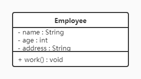

> 中括号中的内容表示是可选的
> 也有将类型放在变量名前面，返回值类型放在方法名前面

比如：
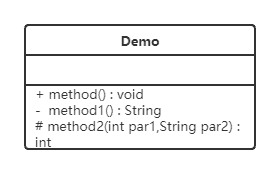

#### 类和类之间的表示方式

##### 关联关系

关联关系是对象之间的一种引用关系，用于表示一类对象与另一类对象之间的联系，如老师和学生、师傅和徒弟、丈夫和妻子等。关联关系是类与类之间最常用的一种关系，分为一般关联关系、聚合关系和组合关系。我们先介绍一般关联。
关联又可以分为单向关联，双向关联，自关联。

1. 单向关联
   
在UML类图中单向关联用一个带箭头的实线表示。
2. 双向关联
   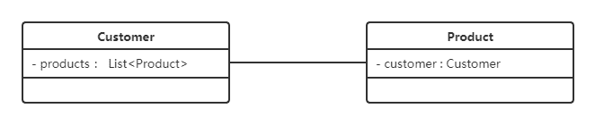
在UML类图中，双向关联用一个不带箭头的直线表示。
3. 自关联
   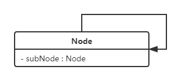
自关联在UML类图中用一个带有箭头且指向自身的线表示。

##### 聚合关系

聚合关系是关联关系的一种，是强关联关系，是整体和部分之间的关系。
聚关系也是通过成员对象来实现的，其中成员对象是整体对象的一部分，但是成员对象可以脱离整体对象而独立存在。
例如，学校与老师的关系，学校包含老师，但如果学校停办了，老师依然存在。
在UML类图中，聚合关系可以用带空心菱形的实线来表示，菱形指向整体。

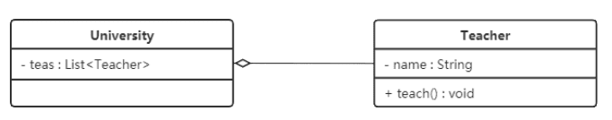

##### 组合关系

组合表示类之间的整体与部分的关系，但它是一种更强烈的聚合关系。
在组合关系中，整体对象可以控制部分对象的生命周期，一旦整体对象不存在，部分对象也将不存在，部分对象不能脱离整体对象而存在。
例如，头和嘴的关系，没有了头，嘴也就不存在了。
在UML类图中，组合关系用带实心菱形的实线来表示，菱形指向整体。

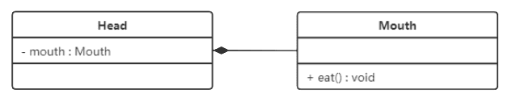

##### 依赖关系

依赖关系是一种使用关系，它是对象之间耦合度最弱的一种关联方式，是临时性的关联。
在代码中，某个类的方法通过局部变量、方法的参数或者对静态方法的调用来访问另一个类（被依赖类）中的某些方法来完成一些职责。
在UML类图中，依赖关系使用带箭头的虚线来表示，箭头从使用类指向被依赖的类。

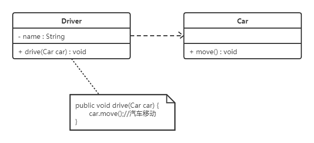

##### 继承关系

继承关系是对象之间耦合度最大的一种关系，表示一股与特殊的关系，是父类与子类之间的关系，是一种继承关系。
在UML类图中，泛化关系用带空心三角箭头的实线来表示，箭头从子类指向父类。
在代码实现时，使用面向对象的继承机制来实现泛化关系。
例如，Student类和Teacher类都是Person类的子类

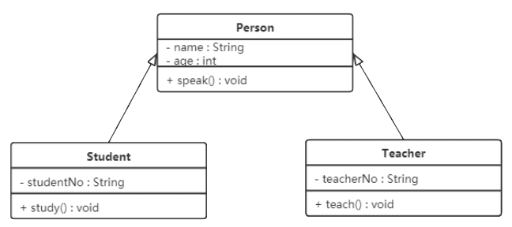

##### 实现关系

实现关系是接口与实现类之间的关系。在这种关系中，类实现了接口，类中的操作实现了接口中所声明的所有的抽象操作。
在UML类图中，实现关系使用带空心三角箭头的虚线来表示，箭头从实现类指向接口。
例如，汽车和船实现了交通工具

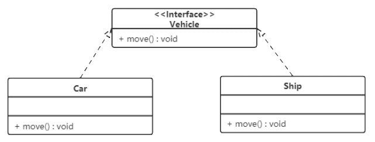

## 软件设计原则

在软件开发中，为了提高软件系统的可维护性和可复用性，增加软件的可扩展性和灵活性。
程序员要尽量根据6条原则来开发程序，从而提高软件开发效率、节约软件开发成本和维护成本。

### 开闭原则（OCP）

**对扩展开放，对修改关闭。**
存程序需要进行拓展的时候，不能去修改原有的代码，实现一个热插拔的效果。简言之，是为了使程序的扩护展性好，易于维护和升级。
想要达到这样的效果，我们需要使用接口和抽象类。
因为抽象灵活性好，适应性广，只要抽象的合理，可以基本保持软件架构的稳定。
而软件中易变的细节可以从抽象派生来的实现类来进行扩展，当软件需要发生变化时，只需要根据需求重新派生一个实现类来扩展就可以了。

例如：
搜狗输入法 的皮肤是输入法背景图片、窗口颜色和声音等元素的组合。
用户可以根据自己的喜爱更换自己的输入法的皮肤，也可以从网上下载新的皮肤。
这些皮肤有共同的特点，可以为其定义一个抽象类（AbstractSkin），而每个具体的皮肤（DefaultSpecificSkin和HeimaSpecificSkin）是其子类。
用户窗体可以根据需要选择或者增加新的主题，而不需要修改原代码，所以它是满足开闭原则的。
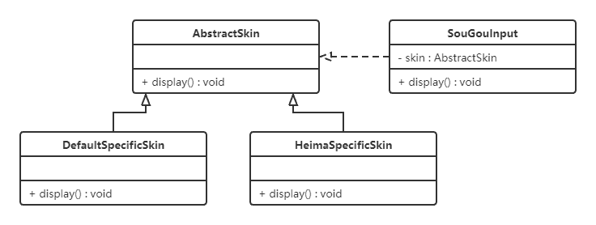

### 里氏替换原则（LSP）

里氏代换原则是面向对象设计的基本原则之一。
里氏代换原则：**任何基类可以出现的地方，子类一定可以出现。** 通俗理解：子类可以扩展父类的功能，但不能改变父类原有的功能
换句话说，子类继承父类时，除添加新的方法完成新增功能外，尽量不要重写父类的方法。
如果通过重写父类的方法来完成新的功能，这样写起来虽然简单，但是整个继承体系的可复用性会比较差，特别是运用多态比较频案时，程序运行出错的概率会非常大，

详细可以参考：[细说 里氏替换原则](https://zhuanlan.zhihu.com/p/268574641)
里氏代换原则**是对开闭原则的补充**。**实现开闭原则的关键步骤就是抽象化**。而基类与子类的继承关系就是抽象化的具体实现，所以**里氏代换原则是对实现抽象化的具体步骤的规范**。

例如：
在数学领域里，正方形毫无疑问是长方形，它是一个长宽相等的长方形。
所以，我们开发的一个与几何图形相关的软件系统，就可以顺理成章的让正方形继承自长方形。
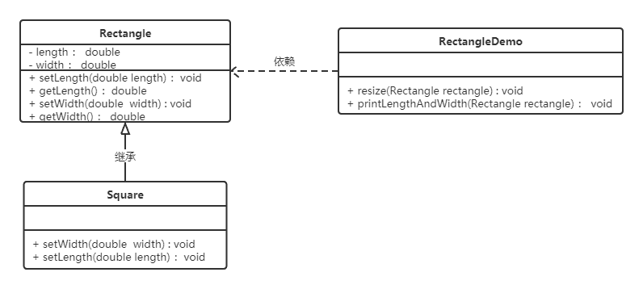
但当需要增加长方形的宽度直至大于长度时（一些新的需要），正方形的代码便会出现问题。
即正方形与长方形的继承关系违反了里氏替换原则，他们之间的继承关系不成立，正方形不是长方形。
改进：
正方形和长方形都继承四边形的接口
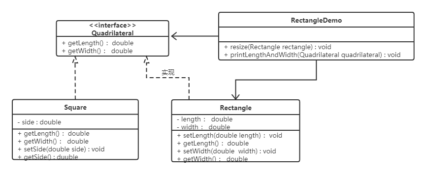

### 依赖倒转原则（DIP）

高层模块不应该依赖低层模块，两者都应该依赖其抽象：抽象不应该依赖细节，细节应该依赖抽象。
简单的说就是要求对抽象进行编程，不要对实现进行编程，这样就降低了客户与实现模块间的耦合。

例如：组装电脑
现要组装一台电脑，需要配件，硬盘，内存条等。只有这些配置都有了，计算机才能正常的运行。选择cpu有很多选择，如Intel，AMD等，硬盘可以选择希捷，西数等，内存条可以选择金士顿，海盗船等。
这时，应该将配件抽象化（接口或抽象类）。否则当配件修改时，电脑部分也需要修改（不符合开闭原则）。

像下图这样设计会导致**配件无法更换**。
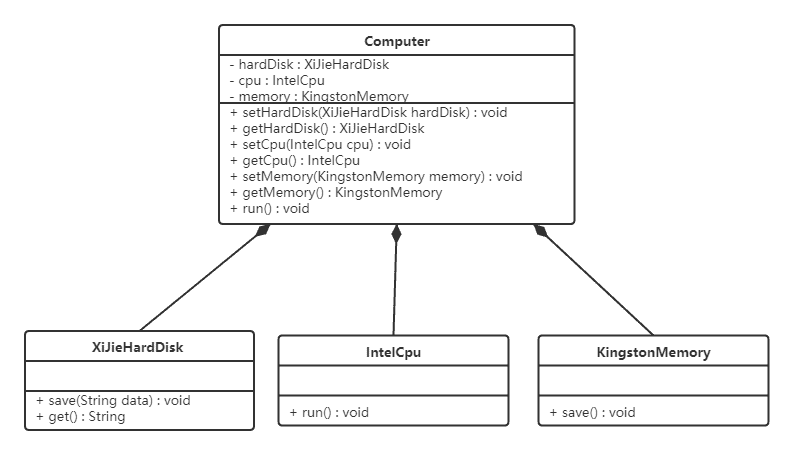
改进：
将需要的配件进行抽象。让电脑类依赖于各个配件的抽象，而不是直接依赖于各个配件的实现。
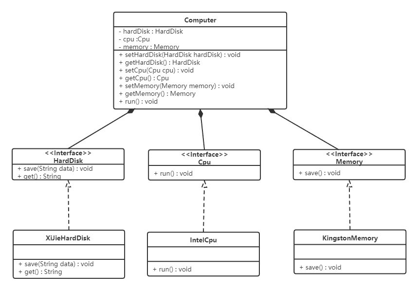

### 接口隔离原则（ISP）

客户不应该被迫依赖于它不使用的方法：一个类对另一个类的依赖应该建立在最小的接口上。
**ISP将大接口拆分为更小更具体的接口**，以便客户取他们需要的。

例如：安全门案例
我们需要创建一个独立品牌的安全门，该安全门具有防火、防水、防盗的功能。可以将防火，防水，防盗功能提取成一个接口，形成一套规范。
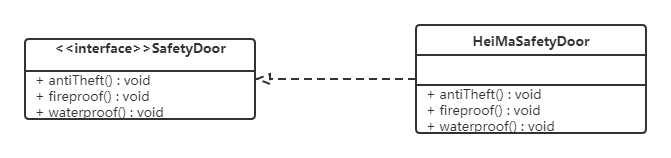
但当我们需要创建另一个安全门，只具有防火和防水功能时。就无法实现了。
改进的方法就是：将防盗、防火、防水提取成的一个接口拆分成三个接口，以便客户只取需要的。
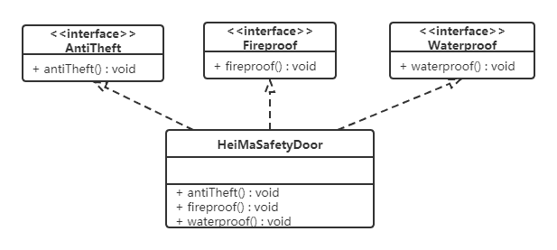

### 迪米特法则（LOD）

迪米特法则（Law of Demeter）又叫作最少知识原则（The Least Knowledge Principle）
一个类对于其他类知道的越少越好，就是说一个对象应当对其他对象有尽可能少的了解。**只和朋友通信，不和陌生人说话。（talk only to your immediate friends）**
其含义是：如果两个软件实体无须直接通信，那么就不应当发生直接的相互调用，可以通过第三方转发该调用。其目的是降低类之间的耦合度，提高模块的相对独立性。
迪米特法则中的“朋友“是指：当前对象本身、当前对象的成员对象、当前对象所创建的对象、当前对象的方法参数等，这些对象同当前对象存在关联、聚合或组合关系，可以直接访问这些对象的方法。

例如：明星与经纪人的关系实例
明星由于全身心投入艺术，所以许多日常事务由经纪人负责处理，如和粉丝的见面会，和媒体公司的业务洽谈等。
这里的经纪人是明星的朋友，而粉丝和媒体公司是陌生人，所以适合使用迪米特法则。
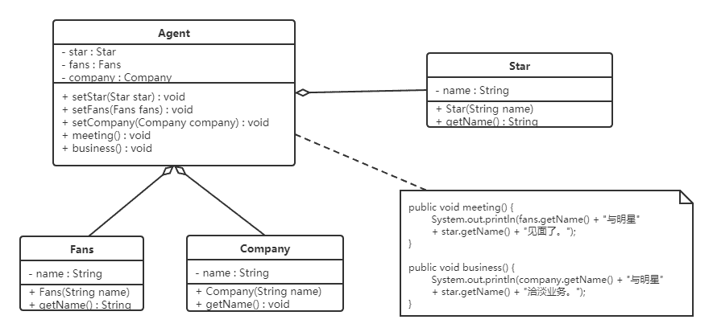

### 合成复用原则（CRP）

合成复用原则是指：尽量先使用组合或者聚合等关联关系来实现，其次才考虑使用继承关系来实现。
通常类的复用分为继承复用和合成复用两种。

继承复用虽然有简单和易实现的优点，但它也存在以下缺点：
1. 继承复用破坏了类的封装性，因为继承会将父类的实现细节暴幕给子类，父类对子类是透明的，所以这种复用又称为“白箱“复用。
2. 子类与父类的耦合度高。父类的实现的任何改变都会导致子类的实现发生变化，这不利于类的扩展与维护。
3. 它限制了复用的灵活性。从父类继承而来的实现是静态的，在编译时已经定义，所以在运行时不可能发生变化。

采用组合或聚合复用时，可以将已有对象纳入新对象中，使之成为新对象的一部分，新对象可以调用已有对象的功能，它有以下优点：
1. 它维持了类的封装性。因为成分对象的内部细节是新对象看不见的，所以这种复用又称为“黑箱“复用。
2. 对象间的桐合度低。可以在类的成员位置声明抽象。
3. 复用的灵活性高。这种复用可以在运行时动态进行，新对象可以动态地引用与成分对象类型相同的对象。

例如：汽车分类管理程序
汽车按“动力源“划分可分为汽油汽车、电动汽车等；按“颜色“划分可分为白色汽车、黑色汽车和红色汽车等。
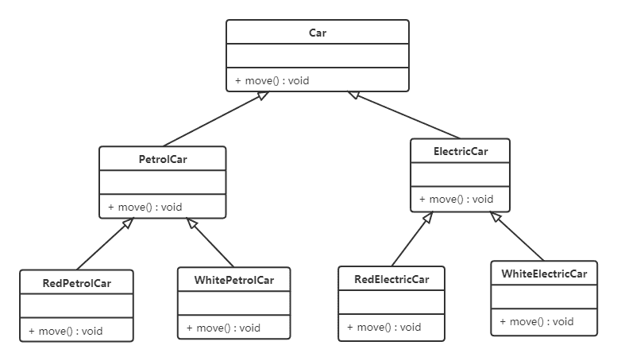
如果同时考虑这两种分类，其组合就很多。
所以可以将颜色以接口的方式实现，汽车类实现颜色接口，在创建汽车时传入颜色对象。可以减少很多子类的产生。
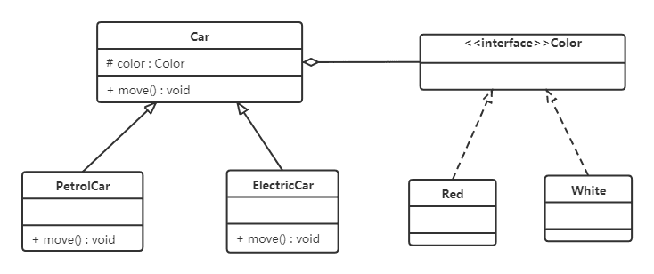

## 创建者模式

创建型模式的主要关注点是“怎样创建对像？”，它的主要特点是“将对象的创建与使用分离”。
这样可以降低系统的糯合度，使用者不需要关注对象的创建细节。
创建型模式分为：
* 单例模式
* 工厂方法模式
* 抽象工程模式
* 原型模式
* 建造者模式

### 单例设计模式

单例模式(Singleton Pattern)是Java中最简单的设计模式之一。这种类型的设计模式属于创建型模式，它提供了一种创建对象的最佳方式。
这种模式涉及到一个单一的类，该类负责创建自己的对象，同时确保只有单个对象被创建。这个类提供了一种访问其唯一的对象的方式，
可以直接访问，不需要实例化该类的对象。

#### 单例模式的结构

单例模式的主要有以下角色：
* 单例类。只能创建一个实例的类
* 访问类。使用单例类

#### 单例模式的实现

> 单例设计模式分类两种：
> * 饿汉式：类加载就会导致该单实例对象被创建
> * 懒汉式：类加载不会导致该单实例对象被创建，而是**首次使用该对象时才会创建**

1. 饿汉式（静态变量）
    ~~~java
    public class Singleton {
        // 私有构造方法
        private Singleton(){}
        // 本类中创建本类对象
        private static Singleton instance = new Singleton();
        // 提供一个公共的访问方式，让外界获取对象
        public static Singleton getInstance(){
            return instance;
        }
    }
    ~~~
   > 该方式中 instance 对象随类加载而创建，如果对象足够大，而且一直没有使用就会造成内存的浪费。
2. 饿汉式（静态代码块）
    ~~~java
    public class Singleton {
        // 私有构造方法
        private Singleton(){}
        // 声明Singleton类型的变量
        private static Singleton instance;
        // 静态代码块中赋值
        static {
            instance = new Singleton();
        }
        // 对外提供获取该对象的方法
        public static Singleton getInstance(){
            return instance;
        }
    }
    ~~~
   > 该方式与上面一样，也是随类加载而创建，也会造成内存的浪费。
3. 懒汉式（线程安全，在方法上加 synchronized 关键字）
   ~~~java
   public class Singleton {
       // 私有构造方法
       private Singleton(){}
       // 声明
       private static Singleton instance;
       // 对外提供访问方式
       public static synchronized Singleton getInstance(){
           if (instance==null){
               instance = new Singleton();
           }
           return instance;
       }
   }
   ~~~
4. 懒汉式（双重检查锁）
   > 上一种方式虽然是线程安全的，但没必要让每个线程必须持有锁才能调用该方法。
   > 因为绝大部分操作都是读操作，读操作是线程安全的。
   > 所以需要调整加锁的时机。
   ~~~java
   /**
    * 懒汉式
    */
   public class Singleton {
       // 私有构造方法
       private Singleton(){}
       // 声明
       private static Singleton instance;
       // 对外提供访问方式
       public static Singleton getInstance(){
           // 第一次判断
           if (instance==null){
               synchronized (Singleton.class){
                   // 第二次判断
                   if (instance == null) {
                       instance = new Singleton();
                   }
               }
           }
           return instance;
       }
   }
   ~~~
   > 双重检查锁是很好的单例实现模式，解决了单例、性能、线程安全的问题。
   > 但上一种实现方式在多线程的情况下，可能会出现空指针的问题，因为JVM在实例化对象时会进行优化和指令重排序的操作。
   > 需要使用 volatile 关键字，volatile 可以保证可见性和有序性。
   > 在上面的代码中，给变量 instance 添加 volatile 关键字即可。
   > 是比较好的实现方式
5. 懒汉式（静态内部类）
   > 静态内部类单例模式中实例由内部类创建。
   > 因为JVM在加载外部类的过程中，不会加载静态内部类，只有内部类的属性/方法被调用时才会被加载并初始化。
   > 静态属性由于被 static 修饰，保证只被实例化一次，并且严格保证实例化顺序。
   ~~~java
   public class Singleton {
       // 私有构造方法
       private Singleton(){}
       // 定义一个静态内部类
       private static class SingletonHolder{
           // 申明并初始化变量
           private static final Singleton INSTANCE = new Singleton();
       }
       // 对外提供访问方式
       public static Singleton getInstance(){
           return SingletonHolder.INSTANCE;
       }
   }
   ~~~
   > 是一种优秀的实现方式，比较常用
   > 在没有加任何锁的情况下，保证了线程安全，并且没有任何性能和空间的浪费。
6. 枚举方式
   > 枚举是线程安全的，并且只会装载一次。
   > 枚举类型是所有单例实现中唯一一种不会被破环的实现模式。
   > 属于饿汉式方式 
   ~~~java
   public enum Singleton {
       INSTANCE
   }
   ~~~

#### 存在的问题

破坏单例模式：使单例类可以创建多个对象，枚举方式除外。有两种方式：序列化和反射。

序列化方式：
~~~java
import java.io.*;

public class demo {
    public static void main(String[] args) throws IOException, ClassNotFoundException {
        writeObjectFile();
        Singleton instance = readObjectFile();
        Singleton instance1 = readObjectFile();
        System.out.println(instance==instance1);
    }

    // 从文件读取数据
    public static Singleton readObjectFile() throws IOException, ClassNotFoundException {
        ObjectInputStream inputStream = new ObjectInputStream(new FileInputStream("./a.txt"));
        Singleton instance = (Singleton) inputStream.readObject();
        inputStream.close();
        return instance;
    }

    // 向文件中写数据
    public static void writeObjectFile() throws IOException {
        Singleton instance = Singleton.getInstance();
        ObjectOutputStream outputStream = new ObjectOutputStream(new FileOutputStream("./a.txt"));
        outputStream.writeObject(instance);
        outputStream.close();
    }
}
~~~

反射模式：
~~~java
import java.lang.reflect.Constructor;
import java.lang.reflect.InvocationTargetException;

public class demo {
    public static void main(String[] args) throws NoSuchMethodException, InvocationTargetException, InstantiationException, IllegalAccessException {
        // 获取字节码对象
        Class<Singleton> c = Singleton.class;
        // 获取无参构造方法
        Constructor<Singleton> constructor = c.getDeclaredConstructor();
        // 取消访问检查
        constructor.setAccessible(true);
        // 创建对象
        Singleton instance = constructor.newInstance();
        Singleton instance1 = constructor.newInstance();
        System.out.println(instance == instance1);
    }
}
~~~

解决方法：

反序列化破坏的解决方式：
在单例类中添加 readResolve() 方法，在反序列化时被反序列化方法调用。
如果定义了这个方法，就返回这个方法的返回值，如果没有定义，则返回new出来的对象。
~~~java
public class Singleton implements Serializable {
    // 私有构造方法
    private Singleton(){}
    // 本类中创建本类对象
    private static Singleton instance = new Singleton();
    // 提供一个公共的访问方式，让外界获取对象
    public static Singleton getInstance(){
        return instance;
    }

    // 当进行反序列化时，会自动调用该方法，将该方法返回值直接返回
    public Object readResolve(){
        return instance;
    }
}
~~~

反射破坏的解决方式：
在单例类的无参构造方法中，判断是否是第一次创建。
~~~java
public class Singleton implements Serializable {
    // 判断是否是第一次访问构造方法
    private static boolean flag = false;

    // 私有构造方法
    private Singleton() {
        synchronized (Singleton.class) {
            if (flag) {
                throw new RuntimeException("不能创建多个对象");
            }
            flag = true;
        }
    }

    // 定义一个静态内部类
    private static class SingletonHolder {
        // 申明并初始化变量
        private static final Singleton INSTANCE = new Singleton();
    }

    // 对外提供访问方式
    public static Singleton getInstance() {
        return Singleton.SingletonHolder.INSTANCE;
    }
}
~~~

关于懒汉式与饿汉式的区别：
饿汉式：在类加载时就已经创建好单例对象，以供使用。
懒汉式：只有在调用 getInstance 方法时才会创建对象。
详细参考：[单例模式中的懒汉模式和饿汉模式是什么？区别又是什么？](https://www.cnblogs.com/cdlyy/p/12846098.html)

#### Runtime 类中单例模式的应用

Runtime 类：
Runtime类封装了运行时的环境。每个 Java 应用程序都有一个 Runtime 类实例，使应用程序能够与其运行的环境相连接。
一般不能实例化一个Runtime对象，应用程序也不能创建自己的 Runtime 类实例，但可以通过 getRuntime 方法获取当前Runtime运行时对象的引用。
一旦得到了一个当前的Runtime对象的引用，就可以调用Runtime对象的方法去控制Java虚拟机的状态和行为。
Runtime 类是饿汉模式

Runtime 部分源码（关于单例模式的部分）：
~~~java
public class Runtime {
    private static final Runtime currentRuntime = new Runtime();

    private static Version version;

    /**
     * Returns the runtime object associated with the current Java application.
     * Most of the methods of class {@code Runtime} are instance
     * methods and must be invoked with respect to the current runtime object.
     *
     * @return  the {@code Runtime} object associated with the current
     *          Java application.
     */
    public static Runtime getRuntime() {
        return currentRuntime;
    }

    /** Don't let anyone else instantiate this class */
    private Runtime() {}
}
~~~

使用 demo。（运行 ipconfig 命令）
~~~java
import java.io.IOException;
import java.io.InputStream;

public class RuntimeDemo {
    public static void main(String[] args) throws IOException {
        // 获取runtime对象
        Runtime runtime = Runtime.getRuntime();
        // 调用runtime的方法exec，参数为一个命令
        Process process = runtime.exec("ipconfig");
        // 调用process对象的获取输入流的方法
        InputStream is = process.getInputStream();
        byte[] arr = new byte[1024*1024*100];
        // 读取数据
        int len = is.read(arr);// 返回读到的字节数
        // 将字节数组转换为字符串输出到控制台
        System.out.println(new String(arr,0,len,"GBK"));
    }
}
~~~

### 工厂模式

需求：设计一个咖啡店点餐系统。
设计一个咖啡类（Coffee），并定义其两个子类（美式咖啡【AmericanCoffee】和拿铁咖啡【LatteCoffee】）；再设计一个咖啡店类（CoffeeStore），咖啡店具有点咖啡的功能。
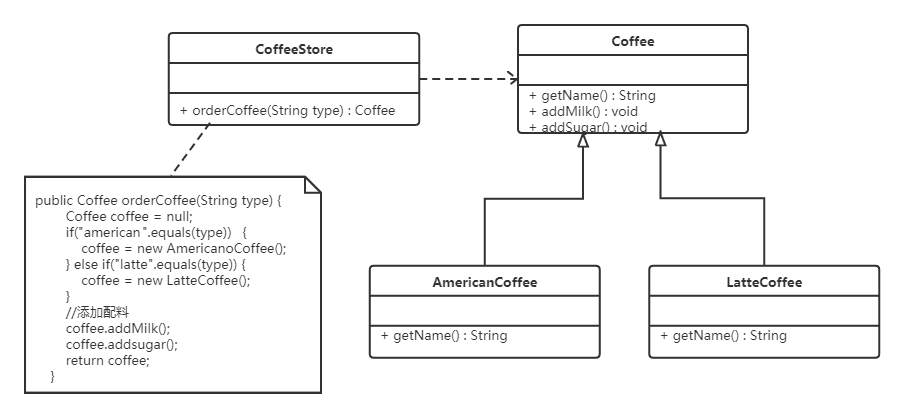

在java中，万物皆对象，这些对象都需要创建，如果创建的时候直接new该对象，就会对该对象耦合严重，假如我们要更换对象，所有new对象的地方都需要修改一遍，这显然违背了软件设计的开闭原则。
如果我们使用工厂来生产对象，我们就只和工厂打交道就可以了，彻底和对象解耦，如果要更换对象，直接在工厂里更换该对象即可，达到了与对象解耦的目的。
所以说，工厂模式最大的优点就是：**解耦**。

#### 简单工厂模式

简单工厂不是一种设计模式，而是更像一种编程习惯。

##### 结构

简单工厂包含如下角色：
* 抽象产品：定义了产品的规范，描述了产品的主要特性和功能。
* 具体产品：实现或者继承抽象产品的子类
* 具体工厂：提供了创建产品的方法，调用者通过该方法来创建产品。

##### 实现
对咖啡店点餐系统的改进：
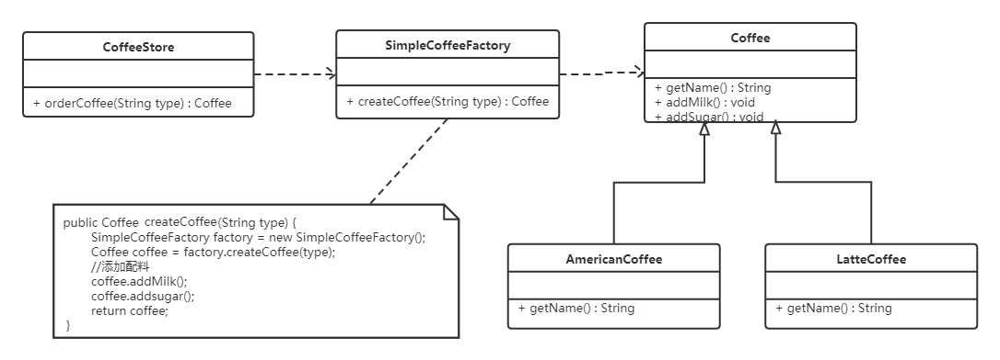
> 工厂（factory）处理创建对象的细节，一旦有了SimpleCoffeeFactory，CoffeeStore类中的orderCoffee()就变成此对象的客户，后期如果需要Coffee对象直接从工厂中获取即可。
这样也就解除了和Coffee实现类的耦合，同时又产生了新的耦合，CoffeeStore对象和SimpleCoffeeFactory工厂对象的耦合，工厂对象和商品对象的耦合。
后期如果再加新品种的咖啡，我们势必要需求修改SimpleCoffeeFactory的代码，违反了开闭原则。
工厂类的客户端可能有很多，比如创建美团外卖等，这样只需要修改工厂类的代码，省去其他的修改操作。

~~~java
public class SimpleCoffeeFactory {

    public Coffee createCoffee(String type) {
        Coffee coffee = null;
        if("americano".equals(type)) {
            coffee = new AmericanoCoffee();
        } else if("latte".equals(type)) {
            coffee = new LatteCoffee();
        }
        return coffee;
    }
}
~~~

##### 优缺点

优点：
封装了创建对象的过程，可以通过参数获取对象。将对象的创建和业务逻辑分开，避免修改客户代码。
如果需要实现新的产品，直接修改工厂类，省去其他修改操作。
缺点：
增加新产品，需要修改工厂类的代码，违反开闭原则。

##### 扩展：静态工厂

即将工厂类中的创建对象的功能定义为静态的。

#### 工厂方法模式

工厂方法模式可以完美解决简单工厂的缺点，完全遵循开闭原侧。

##### 概念
定义一个用于创建对象的接口，让子类决定实例化哪个产品类对象。工厂方法使一个产品类的实例化延迟到其工厂的子类。

##### 结构
工厂方法模式的主要角色：
* 抽象工厂(Abstract Factory):提供了创建产品的接口，调用者通过它访问具体工厂的工厂方法来创建产品。
* 具体工厂(ConcreteFactory):主要是实现抽象工厂中的抽象方法，完成具体产品的创建。
* 抽象产品(Product):定义了产品的规范，描述了产品的主要特性和功能。
* 具体产品(ConcreteProduct):实现了抽象产品角色所定义的接口，由具体工厂来创建，它同具体工厂之间一一对应。

##### 实现

对咖啡店点餐系统的改进：
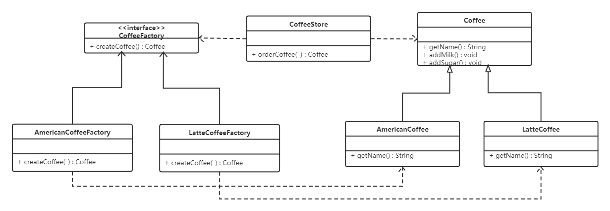
> 要增加产品类时也要相应地增加工厂类，不需要修改工厂类的代码了，这样就解决了简单工厂模式的缺点。
工厂方法模式就是简单工厂模式的进一步抽象（将工厂进行抽象）。由于使用了多态，工厂方法模式保持了简单工厂模式的优点，克服了他的缺点。

抽象工厂：
~~~java
public interface CoffeeFactory {
    Coffee createCoffee();
}
~~~

具体工厂：
~~~java
public class LatteCoffeeFactory implements CoffeeFactory {
    public Coffee createCoffee() {
        return new LatteCoffee();
    }
}

public class AmericanCoffeeFactory implements CoffeeFactory {
    public Coffee createCoffee() {
        return new AmericanCoffee();
    }
}
~~~

咖啡店类：
~~~java
public class CoffeeStore {
    private CoffeeFactory factory;
    
    public CoffeeStore(CoffeeFactory factory) {
        this.factory = factory;
    }
    
    public Coffee orderCoffee(String type) {
        Coffee coffee = factory.createCoffee();
        coffee.addMilk();
        coffee.addsugar();
        return coffee;
    }
}
~~~

##### 优缺点

优点：
* 用户只需要知道具体工厂的名称就可得到所要的产品，无须知道产品的具体创建过程
* 在系统增加新的产品时只需要添加具体产品类和对应的具体工厂类，无须对原工厂进行任何修改，满足开闭原侧；
缺点：
* 每增加一个产品就要增加一个具体产品类和一个对应的具体工厂类，这增加了系统的复杂度。

#### 抽象工厂模式

前面介绍的工厂方法模式中考虑的是一类产品的生产，如畜牧场只养动物、电视机厂只生产电视机等。
这些工厂只生产同种类产品，同种类产品称为同等级产品，也就是说：工厂方法模式只考虑生产同等级的产品，但是在现实生活中许多工厂是综合型的工厂，能生产多等级（种类）的产品，如电器厂既生产电视机又生产洗衣机或空调，大学既有软件专业又有生物专业等。
抽象工厂模式将考虑多等级产品的生产，将同一个具体工所生产的位于不同等级的一组产品称为一个产品族。
比如下图中，横轴是产品等级，也就是同一类产品；纵轴是产品族，也就是同一品牌的产品，同一品牌的产品产自同一个工厂。
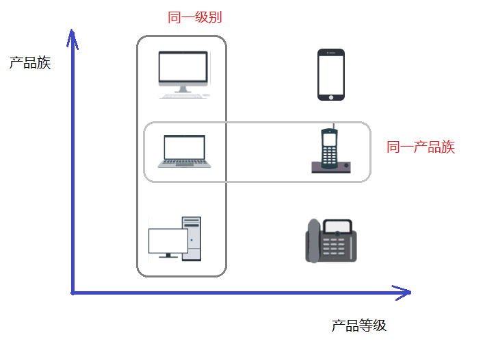

##### 概念

是一种为访问类提供一个创建阻相关或相互依赖对象的接口，且访问类无须指定所要产品的具体类就能得到同族的不同等级的产品的模式结构。
抽象工厂模式是工厂方法模式的升级版本，工厂方法模式只生产一个等级的产品，而抽象工厂模式可生产多个等级的产品。

##### 结构

抽象工厂模式的主要角色如下：
* 抽象工厂(Abstract Factory):提供了创建产品的接口，它包含多个创建产品的方法，可以创建多个不同等级的产品。
* 具体工厂(Concrete Factory):主要是实现抽象工厂中的多个抽象方法，完成具体产品的创建。
* 抽象产品(Product)：定义了产品的规范，描述了产品的主要特性和功能，抽象工厂模式有多个抽象产品。
* 具体产品(ConcreteProduct)：实现了抽象产品角色所定义的接口，由具体工厂来创建，它同具体工厂之间是多对一的关系。

##### 实现

现咖啡店业务发生改变，不仅**要生产咖啡还要生产甜点**，如提拉米苏、抹茶慕斯等，要是按照工厂方法模式，需要定义提拉米苏类、抹茶慕斯类、提拉米苏工厂、抹茶慕斯工厂、甜点工厂类，很容易发生类爆炸情况。
其中拿铁咖啡、美式咖啡是一个产品等级，都是咖啡；提拉米苏、抹茶慕斯也是一个产品等级；
拿铁咖啡和提拉米苏是同一产品族（也就是都属于意大利风味），美式咖啡和抹茶慕斯是同一产品族（也就是都属于美式风味）。
所以这个案例可以使用抽象工厂模式实现。
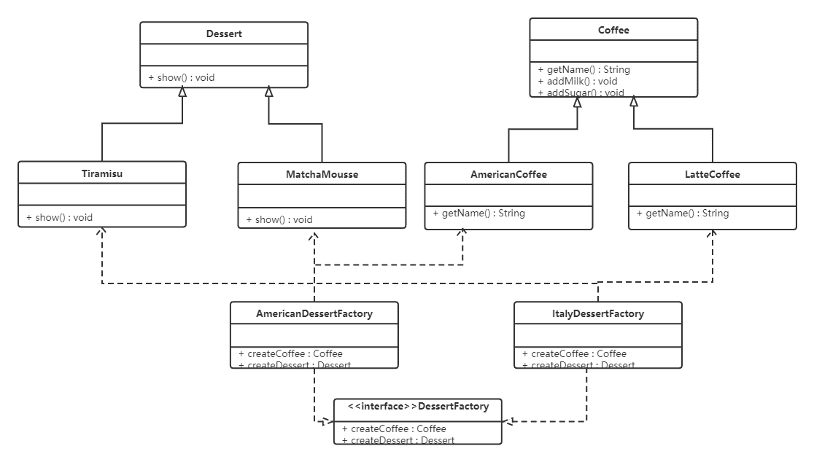
> 如果需要添加一个产品族，只需要再添加一个对应的工厂类即可，不需要修改其他的类。

抽象工厂：
~~~java
public interface DessertFactory {
    Coffee createCoffee();
    Dessert createDessert();
}
~~~

具体工厂：
~~~java
//美式甜点工厂
public class AmericanDessertFactory implements DessertFactory {
    public Coffee createCoffee() {
        return new AmericanCoffee();
    }
    
    public Dessert createDessert() {
        return new MatchaMousse();
    }
}
//意大利风味甜点工厂
public class ItalyDessertFactory implements DessertFactory {
    public Coffee createCoffee() {
        return new LatteCoffee();
    }
    
    public Dessert createDessert() {
        return new Tiramisu();
    }
}
~~~

##### 优缺点

优点：
当一个产品族中的多个对象被设计成一起工作时，它能保证客户端始终只使用同一个产品族中的对象。
缺点：
当产品族中需要增加一个新的产品时，所有的工厂类都需要进行修改。

##### 使用场景

* 当需要创建的对象是一系列相互关联或相互依赖的产品族时，如电器工厂中的电视机、洗衣机、空调等。
* 系统中有多个产品族，但每次只使用其中的某一族产品。如有人只喜欢穿某一个品牌的衣服和鞋。
* 系统中提供了产品的类库，且所有产品的接口相同，客户端不依赖产品实例的创建细节和内部结构。
如：输入法换皮肤，一整套一起换。生成不同操作系统的程序。

#### 模式拓展

**简单工厂 + 配置文件解除耦合**
可以通过工厂模式 + 配置文件的方式解除工厂对象和产品对象的耦合在工厂类中加载配置文件中的全类名，并创建对象进行存储，客户端如果需要对象，直接进行获取即可。

1. 定义配置文件
   ~~~properties
   american=org.example.designPatterns.pattern.factory.configFactory.AmericanCoffee
   latte=org.example.designPatterns.pattern.factory.configFactory.LatteCoffee
   ~~~
2. 改进工厂类
   ~~~java
   import java.io.IOException;
   import java.io.InputStream;
   import java.util.HashMap;
   import java.util.Properties;
   import java.util.Set;
   
   public class CoffeeFactory {
   
       // 加载配置文件，获取配置文件中配置的全类名，并创建该类的对象进行存储
       // 定义容器存储对象
       private static HashMap<String, Coffee> map = new HashMap<>();
   
       // 加载配置文件
       static {
           // 创建Properties对象
           Properties p = new Properties();
           // 调用load方法加载配置文件
           InputStream is = CoffeeFactory.class.getClassLoader().getResourceAsStream("bean.properties");
           try {
               p.load(is);
               // 从p集合中获取全类名，并创建对象
               Set<Object> keys = p.keySet();
               for (Object key : keys) {
                   String className = p.getProperty((String) key);
                   // 通过反射创建对象
                   Class<?> clazz = Class.forName(className);
                   Coffee coffee = (Coffee) clazz.newInstance();
                   // 将名称和对象存储到容器中
                   map.put((String) key, coffee);
               }
           } catch (IOException | IllegalAccessException | InstantiationException | ClassNotFoundException e) {
               throw new RuntimeException(e);
           }
   
   
       }
   
       public static Coffee createCoffee(String name) {
           return map.get(name);
       }
   }
   ~~~

静态成员变量用来存储创建的对象（键存储的是名称，值存储的是对应的对象），而读取配置文件以及创建对象写在静态代码块中，目的就是**只需要执行一次**。

#### JDK中的工厂模式的应用（Collection.iterator）

~~~java
import java.util.LinkedList;
import java.util.List;

public class Main {
    public static void main(String[] args) {
        List<String> list = new LinkedList<>();
        list.add("许嵩");
        list.add("徐良");
        list.add("汪苏泷");
        // 获取迭代器对象
        Iterator<String> iterator = list.iterator();
        // 使用迭代器遍历
        for (String element : list) {
            System.out.println(element);
        }
    }
}
~~~

使用迭代器遍历集合，获取集合中的元素。而单列集合获取迭代器的方法就使用到了工厂方法模式。
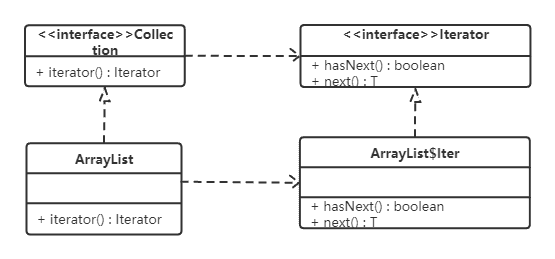

Collection接口是抽象工厂类，ArrayList是具体的工厂类；
Iterator接口是抽象商品类，ArrayList类中的Iter内部类是具体的商品类。
在具体的工厂类中iterator()方法创建具体的商品类的对象。

> 1,DateForamt类中的getInstance()方法使用的是工厂模式；
> 2,Calendar类中的getInstance()方法使用的是工厂模式；

### 原型模式

#### 概述

用一个已经创建的实例作为原型，通过复制该原型对象来创建一个和原型对象相同的新对象。

#### 结构

原型模式包含如下角色：
* 抽象原型类：规定了具体原型对象必须实现的的 clone() 方法。
* 具体原型类：实现抽象原型类的 clone() 方法，它是可被复制的对象。
* 访问类：使用具体原型类中的 clone() 方法来复制新的对象。

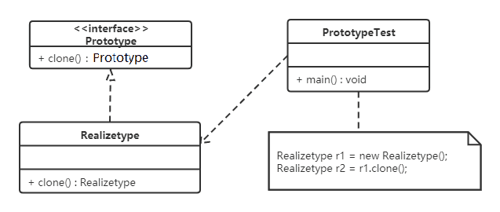

#### 实现

原型模式的克隆分为浅克隆和深克隆。
> 浅克隆：创建一个新对象，新对象的属性和原来对象完全相同，对于非基本类型属性，仍指向原有属性所指向的对象的内存地址。
> 深克隆：创建一个新对象，属性中引用的其他对象也会被克隆，不再指向原有对象地址。

Java中的Object类中提供了 `clone()` 方法来实现浅克隆。 
Cloneable 接口是上面的类图中的抽象原型类，而实现了Cloneable接口的子实现类就是具体的原型类。

Realizetype（具体的原型类）：
~~~java
public class Realizetype implements Cloneable {
    public Realizetype() {
        System.out.println("具体的原型对象创建完成！");
    }
    
    @Override
    protected Realizetype clone() throws CloneNotSupportedException {
        System.out.println("具体原型复制成功！");
        return (Realizetype) super.clone();
    }
}
~~~

PrototypeTest（测试访问类）：
~~~java
public class PrototypeTest {
    public static void main(String[] args) throws CloneNotSupportedException {
        Realizetype r1 = new Realizetype();
        Realizetype r2 = r1.clone();
        System.out.println("对象r1和r2是同一个对象？" + (r1 == r2));
    }
}
~~~

#### 案例

**用原型模式生成“三好学生”奖状**
同一学校的“三好学生”奖状除了获奖人姓名不同，其他都相同，可以使用原型模式复制多个“三好学生”奖状出来，然后在修改奖状上的名字即可。

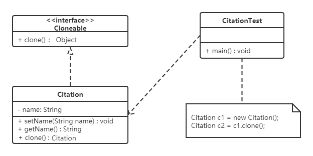

代码如下：

~~~java
//奖状类
public class Citation implements Cloneable {
    private String name;

    public void setName(String name) {
        this.name = name;
    }

    public String getName() {
        return (this.name);
    }

    public void show() {
        System.out.println(name + "同学：在2020学年第一学期中表现优秀，被评为三好学生。特发此状！");
    }

    @Override
    public Citation clone() throws CloneNotSupportedException {
        return (Citation) super.clone();
    }
}

//测试访问类
public class CitationTest {
    public static void main(String[] args) throws CloneNotSupportedException {
        Citation c1 = new Citation();
        c1.setName("张三");

        //复制奖状
        Citation c2 = c1.clone();
        //将奖状的名字修改李四
        c2.setName("李四");

        c1.show();
        c2.show();
    }
}
~~~

#### 使用场景

* 对象的创建非常复杂，可以使用原型模式快捷的创建对象。
* 性能和安全要求比较高。

#### 拓展（深克隆）

因为浅克隆的属性和原来对象完全相同。
对于基本类型：**String、Integer 等包装类都是不可变的对象，当需要修改不可变对象的值时，需要在内存中生成一个新的对象来存放新的值，然后将原来的引用指向新的地址**
对于非基本类型（引用类型）：**克隆的新对象的引用类型的属性仍会指向原来对象引用类型属性的内存地址**

实现深拷贝的两种方式：
1. 实现 Cloneable 接口
2. 实现 Serializable 接口

详细的晚点新写一篇博客

### 建造者模式

#### 概述

将一个复杂对象的构建与表示分离，使得同样的构建过程可以创建不同的表示。

* 分离了部件的构造(由Builder来负责)和装配(由Director负责)。 从而可以构造出复杂的对象。这个模式适用于：**某个对象的构建过程复杂的情况**。
* 由于实现了构建和装配的解耦。不同的构建器，相同的装配，也可以做出不同的对象；相同的构建器，不同的装配顺序也可以做出不同的对象。也就是实现了构建算法、装配算法的解耦，实现了更好的复用。
* 建造者模式可以将部件和其组装过程分开，一步一步创建一个复杂的对象。用户只需要指定复杂对象的类型就可以得到该对象，而无须知道其内部的具体构造细节。

#### 结构

建造者（Builder）模式包含如下角色：
* 抽象建造者类（Builder）：这个接口规定要实现复杂对象的那些部分的创建，并不涉及具体的部件对象的创建。
* 具体建造者类（ConcreteBuilder）：实现 Builder 接口，完成复杂产品的各个部件的具体创建方法。在构造过程完成后，提供产品的实例。
* 产品类（Product）：要创建的复杂对象。
* 指挥者类（Director）：调用具体建造者来创建复杂对象的各个部分，在指导者中不涉及具体产品的信息，只负责保证对象各部分完整创建或按某种顺序创建。

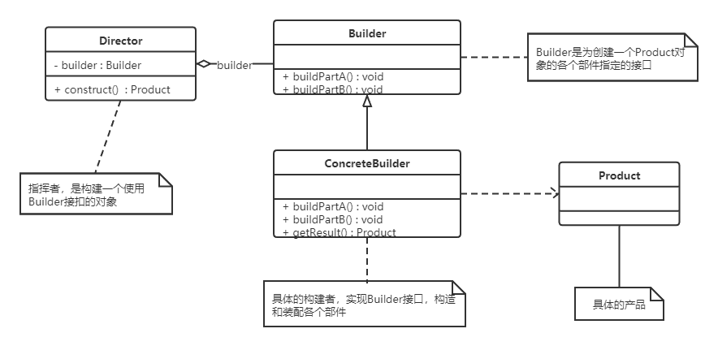

#### 实例

**创建共享单车**
生产自行车是一个复杂的过程，它包含了车架，车座等组件的生产。而车架又有碳纤维，铝合金等材质的，车座有橡胶，真皮等材质。对于自行车的生产就可以使用建造者模式。
这里Bike是产品，包含车架，车座等组件；Builder是抽象建造者，MobikeBuilder和OfoBuilder是具体的建造者；Director是指挥者。类图如下：

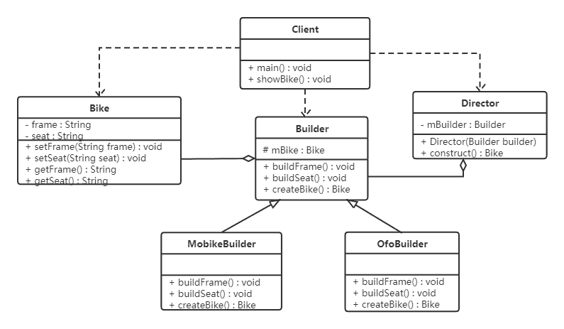

~~~java
//自行车类
public class Bike {
    private String frame;
    private String seat;

    public String getFrame() {
        return frame;
    }

    public void setFrame(String frame) {
        this.frame = frame;
    }

    public String getSeat() {
        return seat;
    }

    public void setSeat(String seat) {
        this.seat = seat;
    }
}

// 抽象 builder 类
public abstract class Builder {

    protected Bike mBike = new Bike();

    public abstract void buildFrame();
    public abstract void buildSeat();
    public abstract Bike createBike();
}

//摩拜单车Builder类
public class MobikeBuilder extends Builder {

    @Override
    public void buildFrame() {
        mBike.setFrame("铝合金车架");
    }

    @Override
    public void buildSeat() {
        mBike.setSeat("真皮车座");
    }

    @Override
    public Bike createBike() {
        return mBike;
    }
}

//ofo单车Builder类
public class OfoBuilder extends Builder {

    @Override
    public void buildFrame() {
        mBike.setFrame("碳纤维车架");
    }

    @Override
    public void buildSeat() {
        mBike.setSeat("橡胶车座");
    }

    @Override
    public Bike createBike() {
        return mBike;
    }
}

//指挥者类
public class Director {
    private Builder mBuilder;

    public Director(Builder builder) {
        mBuilder = builder;
    }

    public Bike construct() {
        mBuilder.buildFrame();
        mBuilder.buildSeat();
        return mBuilder.createBike();
    }
}

//测试类
public class Client {
    public static void main(String[] args) {
        showBike(new OfoBuilder());
        showBike(new MobikeBuilder());
    }
    private static void showBike(Builder builder) {
        Director director = new Director(builder);
        Bike bike = director.construct();
        System.out.println(bike.getFrame());
        System.out.println(bike.getSeat());
    }
}
~~~

上面示例是 Builder模式的常规用法，指挥者类 Director 在建造者模式中具有很重要的作用，它用于指导具体构建者如何构建产品，控制调用先后次序，并向调用者返回完整的产品类，但是有些情况下需要简化系统结构，**可以把指挥者类和抽象建造者进行结合**。
但同时也会也**加重了抽象建造者类的职责**，也不是太符合单一职责原则，如果construct() 过于复杂，建议还是封装到 Director 中。

~~~java
// 抽象 builder 类
public abstract class Builder {

    protected Bike mBike = new Bike();

    public abstract void buildFrame();
    public abstract void buildSeat();
    public abstract Bike createBike();
    
    public Bike construct() {
        this.buildFrame();
        this.BuildSeat();
        return this.createBike();
    }
}
~~~

#### 优缺点

优点：
* 建造者模式的封装性很好。使用建造者模式可以有效的封装变化，在使用建造者模式的场景中，一般产品类和建造者类是比较稳定的，因此，将主要的业务逻辑封装在指挥者类中对整体而言可以取得比较好的稳定性。
* 在建造者模式中，客户端不必知道产品内部组成的细节，将产品本身与产品的创建过程解耦，使得相同的创建过程可以创建不同的产品对象。
* 可以更加精细地控制产品的创建过程 。将复杂产品的创建步骤分解在不同的方法中，使得创建过程更加清晰，也更方便使用程序来控制创建过程。
* 建造者模式很容易进行扩展。如果有新的需求，通过实现一个新的建造者类就可以完成，基本上不用修改之前已经测试通过的代码，因此也就不会对原有功能引入风险。符合开闭原则。
缺点：
* 造者模式所创建的产品一般具有较多的共同点，其组成部分相似，**如果产品之间的差异性很大，则不适合使用建造者模式**，因此其使用范围受到一定的限制。

#### 使用场景

建造者（Builder）模式创建的是复杂对象，其产品的各个部分经常面临着剧烈的变化，但将它们组合在一起的算法却相对稳定，所以它通常在以下场合使用。
* 创建的对象较复杂，由多个部件构成，各部件面临着复杂的变化，但构件间的建造顺序是稳定的。
* 创建复杂对象的算法独立于该对象的组成部分以及它们的装配方式，即产品的构建过程和最终的表示是独立的。

#### 模式扩展

建造者模式除了上面的用途外，在开发中还有一个常用的使用方式，就是当一个类构造器需要传入很多参数时，如果创建这个类的实例，代码可读性会非常差，而且很容易引入错误，此时就可以利用建造者模式进行重构。

重构前代码：
~~~java
public class PhoneBefore {
    private String cpu;
    private String screen;
    private String memory;
    private String mainboard;

    public PhoneBefore(String cpu, String screen, String memory, String mainboard) {
        this.cpu = cpu;
        this.screen = screen;
        this.memory = memory;
        this.mainboard = mainboard;
    }

    public String getCpu() {
        return cpu;
    }

    public void setCpu(String cpu) {
        this.cpu = cpu;
    }

    public String getScreen() {
        return screen;
    }

    public void setScreen(String screen) {
        this.screen = screen;
    }

    public String getMemory() {
        return memory;
    }

    public void setMemory(String memory) {
        this.memory = memory;
    }

    public String getMainboard() {
        return mainboard;
    }

    public void setMainboard(String mainboard) {
        this.mainboard = mainboard;
    }

    @Override
    public String toString() {
        return "PhoneBefore{" +
                "cpu='" + cpu + '\'' +
                ", screen='" + screen + '\'' +
                ", memory='" + memory + '\'' +
                ", mainboard='" + mainboard + '\'' +
                '}';
    }
}
~~~

重构后的代码：
~~~java
public class PhoneAfter {
    private String cpu;
    private String screen;
    private String memory;
    private String mainboard;

    private PhoneAfter(Builder builder) {
        this.cpu = builder.cpu;
        this.screen = builder.screen;
        this.memory = builder.memory;
        this.mainboard = builder.mainboard;
    }

    public static final class Builder{
        private String cpu;
        private String screen;
        private String memory;
        private String mainboard;

        public Builder() {
        }

        public Builder cpu(String val) {
            cpu = val;
            return this;
        }
        public Builder screen(String val) {
            screen = val;
            return this;
        }
        public Builder memory(String val) {
            memory = val;
            return this;
        }
        public Builder mainboard(String val) {
            mainboard = val;
            return this;
        }

        public PhoneAfter build(){
            return new PhoneAfter(this);
        }
    }

    @Override
    public String toString() {
        return "PhoneAfter{" +
                "cpu='" + cpu + '\'' +
                ", screen='" + screen + '\'' +
                ", memory='" + memory + '\'' +
                ", mainboard='" + mainboard + '\'' +
                '}';
    }
}
~~~

测试代码：
~~~java
public class demo {
    public static void main(String[] args) {
        PhoneBefore phoneBefore = new PhoneBefore("intel","华硕","金士顿","三星");
        PhoneAfter phoneAfter = new PhoneAfter.Builder()
                .cpu("intel")
                .mainboard("华硕")
                .memory("金士顿")
                .screen("三星")
                .build();
        System.out.println(phoneBefore);
        System.out.println(phoneAfter);
    }
}
~~~

从测试类的代码中可以看出，重构前的代码创建Phone对象时，如果参数过多，代码的可读性较差且使用成本比较高。
重构后的代码使用起来更加方便，这种方式也叫**链式调用**。

### 创建者模式对比

#### 工厂方法模式VS建造者模式

**工厂方法模式注重的是整体对象的创建方式**；
**而建造者模式注重的是部件构建的过程**，意在通过一步一步地精确构造创建出一个复杂的对象。

我们举个简单例子来说明两者的差异，如要制造一个超人。
如果使用工厂方法模式，直接产生出来的就是一个力大无穷、能够飞翔、内裤外穿的超人；
而如果使用建造者模式，则需要组装手、头、脚、躯干等部分，然后再把内裤外穿，于是一个超人就诞生了。

#### 抽象工厂模式VS建造者模式

**抽象工厂模式实现对产品家族的创建**，一个产品家族是这样的一系列产品：具有不同分类维度的产品组合，采用抽象工厂模式则是不需要关心构建过程，只关心什么产品由什么工厂生产即可。
**建造者模式则是要求按照指定的蓝图建造产品**，它的主要目的是通过组装零配件而产生一个新产品。

如果将抽象工厂模式看成汽车配件生产工厂，生产一个产品族的产品，那么建造者模式就是一个汽车组装工厂，通过对部件的组装可以返回一辆完整的汽车

## 结构型模式

结构型模式描述如何将类或对象按某种布局组成更大的结构。
它分为类结构型模式和对象结构型模式，前者采用继承机制来组织接口和类，后者釆用组合或聚合来组合对象。
由于组合关系或聚合关系比继承关系耦合度低，满足“合成复用原则”，所以对象结构型模式比类结构型模式具有更大的灵活性。

结构型模式分为以下 7 种：
* 代理模式
* 适配器模式
* 装饰者模式
* 桥接模式
* 外观模式
* 组合模式
* 享元模式

### 代理模式

#### 概述

由于某些原因需要给某对象提供一个代理以控制对该对象的访问。这时，访问对象不适合或者不能直接引用目标对象，代理对象作为访问对象和目标对象之间的中介。
Java中的代理按照代理类生成时机不同又分为静态代理和动态代理。
静态代理代理类在编译期就生成，而动态代理代理类则是在Java运行时动态生成。动态代理又有JDK代理和CGLib代理两种。

#### 结构

代理（Proxy）模式分为三种角色：
* 抽象主题（Subject）类： 通过接口或抽象类声明真实主题和代理对象实现的业务方法。
* 真实主题（Real Subject）类： 实现了抽象主题中的具体业务，是代理对象所代表的真实对象，是最终要引用的对象。
* 代理（Proxy）类 ： 提供了与真实主题相同的接口，其内部含有对真实主题的引用，它可以访问、控制或扩展真实主题的功能。

#### 静态代理

例：火车站卖票
如果要买火车票的话，需要去火车站买票，坐车到火车站，排队等一系列的操作，显然比较麻烦。而火车站在多个地方都有代售点，我们去代售点买票就方便很多了。
这个例子其实就是典型的代理模式，火车站是目标对象，代售点是代理对象。类图如下：

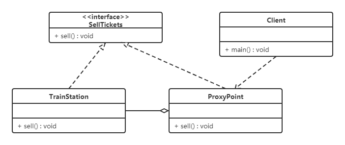

ProxyPoint作为访问对象和目标对象的中介。同时也对sell方法进行了增强（代理点收取一些服务费用）。

~~~java
//卖票接口
public interface SellTickets {
    void sell();
}

//火车站  火车站具有卖票功能，所以需要实现SellTickets接口
public class TrainStation implements SellTickets {

    public void sell() {
        System.out.println("火车站卖票");
    }
}

//代售点
public class ProxyPoint implements SellTickets {

    private TrainStation station = new TrainStation();

    public void sell() {
        System.out.println("代理点收取一些服务费用");
        station.sell();
    }
}

//测试类
public class Client {
    public static void main(String[] args) {
        ProxyPoint pp = new ProxyPoint();
        pp.sell();
    }
}
~~~

#### JDK动态代理

Java中提供了一个动态代理类Proxy。
Proxy并不是我们上述所说的代理对象的类，而是提供了一个创建代理对象的静态方法（newProxyInstance方法）来获取代理对象。

代理工厂：用于获取动态代理对象
~~~java
import java.lang.reflect.InvocationHandler;
import java.lang.reflect.Method;
import java.lang.reflect.Proxy;

// 代理工厂，用来创建代理对象
public class ProxyFactory {

    // 声明目标对象
    private TrainStation station = new TrainStation();

    public SellTickets getProxyObject() {
        //使用Proxy获取代理对象
        /*
            newProxyInstance()方法参数说明：
                ClassLoader loader ： 类加载器，用于加载代理类，使用真实对象的类加载器即可
                Class<?>[] interfaces ： 真实对象所实现的接口，代理模式真实对象和代理对象实现相同的接口
                InvocationHandler h ： 代理对象的调用处理程序
         */
        SellTickets sellTickets = (SellTickets) Proxy.newProxyInstance(
                station.getClass().getClassLoader(),
                station.getClass().getInterfaces(),
                new InvocationHandler() {
                    /*
                        InvocationHandler中invoke方法参数说明：
                            proxy ： 代理对象
                            method ： 对应于在代理对象上调用的接口方法的 Method 实例
                            args ： 代理对象调用接口方法时传递的实际参数
                     */
                    public Object invoke(Object proxy, Method method, Object[] args) throws Throwable {

                        System.out.println("代理点收取一些服务费用(JDK动态代理方式)");
                        //执行真实对象
                        Object result = method.invoke(station, args);
                        return result;
                    }
                });
        return sellTickets;
    }
}
~~~

jdk动态创建的代理类（异常处理等其他无关代码已删除）：
~~~java
//程序运行过程中动态生成的代理类
public final class $Proxy0 extends Proxy implements SellTickets {
    private static Method m3;

    public $Proxy0(InvocationHandler invocationHandler) {
        super(invocationHandler);
    }

    static {
        m3 = Class.forName("com.itheima.proxy.dynamic.jdk.SellTickets").getMethod("sell", new Class[0]);
    }

    public final void sell() {
        this.h.invoke(this, m3, null);
    }
}
~~~

执行流程：
1. 通过代理工厂获取**动态创建的代理类对象**（执行过程中创建的代理类）
2. 调用代理对象的sell()方法
3. 根据多态的特性，执行的是代理类（$Proxy0）中的sell()方法
4. 代理类（$Proxy0）中的sell()方法中又调用了InvocationHandler接口的子实现类对象的invoke方法
5. invoke方法通过反射执行了真实对象所属类(TrainStation)中的sell()方法

#### CGLIB动态代理

如果没有定义SellTickets接口，只定义了TrainStation(火车站类)。很显然JDK代理是无法使用了，**因为JDK动态代理要求必须定义接口，对接口进行代理。**
CGLIB是一个功能强大，高性能的代码生成包。它为没有实现接口的类提供代理，为JDK的动态代理提供了很好的补充。
CGLIB是第三方提供的包，所以需要引入jar包的坐标：

~~~xml
<dependency>
    <groupId>cglib</groupId>
    <artifactId>cglib</artifactId>
    <version>2.2.2</version>
</dependency>
~~~

> cglib 是未维护的，在高版本的jdk中是无法正常运行的。目前看来jdk17是不行的（2022-11-24）
> **在jdk8中是正常运行的**。（果然还得是8）
> 引发错误似乎与增强器有关，在初始化Enhancer类时会出现：java.lang.ExceptionInInitializerError
> 解决办法：
> 1. 使用低版本的jdk，比如jdk8
> 2. 迁移至 ByteBuddy 
> 3. Spring Framework维护了cglib的补丁（包括jdk17的兼容性）。[github地址](https://github.com/spring-projects/spring-framework/tree/main/spring-core/src/main/java/org/springframework/cglib)

代码如下：
~~~java
import net.sf.cglib.proxy.Enhancer;
import net.sf.cglib.proxy.MethodInterceptor;
import net.sf.cglib.proxy.MethodProxy;

import java.lang.reflect.Method;

// 代理对象工厂
public class ProxyFactory implements MethodInterceptor {
    private TrainStation target = new TrainStation();

    public TrainStation getProxyObject() {
        //创建Enhancer对象，类似于JDK动态代理的Proxy类，下一步就是设置几个参数
        Enhancer enhancer = new Enhancer();
        //设置父类的字节码对象
        enhancer.setSuperclass(target.getClass());
        //设置回调函数
        enhancer.setCallback(this);
        //创建代理对象
        TrainStation obj = (TrainStation) enhancer.create();
        return obj;
    }

    /*
        intercept方法参数说明：
            o ： 代理对象
            method ： 真实对象中的方法的Method实例
            args ： 实际参数
            methodProxy ：代理对象中的方法的method实例
     */
    public TrainStation intercept(Object o, Method method, Object[] args, MethodProxy methodProxy) throws Throwable {
        System.out.println("代理点收取一些服务费用(CGLIB动态代理方式)");
        TrainStation result = (TrainStation) methodProxy.invokeSuper(o, args);
        return result;
    }
}
~~~

#### 三种代理的对比

* jdk代理和CGLIB代理
  使用CGLib实现动态代理，CGLib底层采用ASM字节码生成框架，使用字节码技术生成代理类，在JDK1.6之前比使用Java反射效率要高。唯一需要注意的是，CGLib不能对声明为final的类或者方法进行代理，因为**CGLib原理是动态生成被代理类的子类**。
  在JDK1.6、JDK1.7、JDK1.8逐步对JDK动态代理优化之后，在调用次数较少的情况下，JDK代理效率高于CGLib代理效率，只有当进行大量调用的时候，JDK1.6和JDK1.7比CGLib代理效率低一点，但是到JDK1.8的时候，JDK代理效率高于CGLib代理。**所以如果有接口使用JDK动态代理，如果没有接口使用CGLIB代理。**
* 动态代理和静态代理
  动态代理与静态代理相比较，最大的好处是接口中声明的所有方法都被转移到调用处理器一个集中的方法中处理（InvocationHandler.invoke）。这样，在接口方法数量比较多的时候，我们可以进行灵活处理，而不需要像静态代理那样每一个方法进行中转。
  如果接口增加一个方法，静态代理模式除了所有实现类需要实现这个方法外，所有代理类也需要实现此方法。增加了代码维护的复杂度。而动态代理不会出现该问题

#### 优缺点

优点：
* 代理模式在客户端与目标对象之间起到一个中介作用和保护目标对象的作用；
* 代理对象可以扩展目标对象的功能；
* 代理模式能将客户端与目标对象分离，在一定程度上降低了系统的耦合度；

缺点：
* 增加了系统的复杂度；

#### 使用场景

* 远程（Remote）代理
  本地服务通过网络请求远程服务。为了实现本地到远程的通信，我们需要实现网络通信，处理其中可能的异常。
  为良好的代码设计和可维护性，我们将网络通信部分隐藏起来，只暴露给本地服务一个接口，通过该接口即可访问远程服务提供的功能，而不必过多关心通信部分的细节。
  （RPC思想，例如 Dubbo框架）
* 防火墙（Firewall）代理
  当你将浏览器配置成使用代理功能时，防火墙就将你的浏览器的请求转给互联网；当互联网返回响应时，代理服务器再把它转给你的浏览器。
* 保护（Protect or Access）代理
  控制对一个对象的访问，如果需要，可以给不同的用户提供不同级别的使用权限。

### 适配器模式

#### 概述

如果去欧洲国家去旅游的话，他们的插座如下图最左边，是欧洲标准。而我们使用的插头如下图最右边的。
因此我们的笔记本电脑，手机在当地不能直接充电。所以就需要一个插座转换器，转换器第1面插入当地的插座，第2面供我们充电，这样使得我们的插头在当地能使用。
生活中这样的例子很多，手机充电器（将220v转换为5v的电压），读卡器等，其实就是使用到了适配器模式。

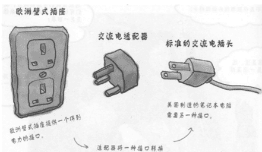

定义：
将一个类的接口转换成客户希望的另外一个接口，使得原本由于接口不兼容而不能一起工作的那些类能一起工作。
适配器模式分为类适配器模式和对象适配器模式，前者类之间的耦合度比后者高，且要求程序员了解现有组件库中的相关组件的内部结构，所以应用相对较少些。

#### 结构

适配器模式（Adapter）包含以下主要角色：
* 目标（Target）接口：当前系统业务所期待的接口，它可以是抽象类或接口。
* 适配者（Adaptee）类：它是被访问和适配的现存组件库中的组件接口。
* 适配器（Adapter）类：它是一个转换器，通过继承或引用适配者的对象，把适配者接口转换成目标接口，让客户按目标接口的格式访问适配者。

#### 类适配器模式

实现方式：定义一个适配器类来实现当前系统的业务接口，同时又继承现有组件库中已经存在的组件。

例：读卡器
现有一台电脑只能读取SD卡，而要读取TF卡中的内容的话就需要使用到适配器模式。创建一个读卡器，将TF卡中的内容读取出来。
类图如下：
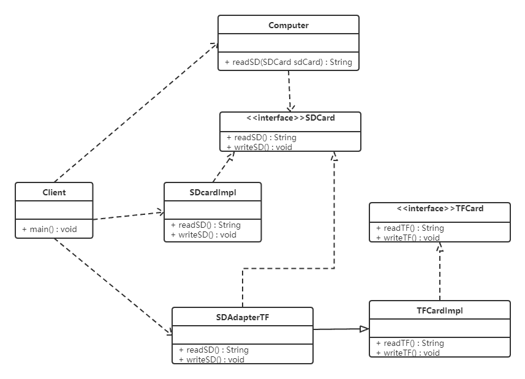

代码如下：
~~~java
//SD卡的接口
public interface SDCard {
    //读取SD卡方法
    String readSD();
    //写入SD卡功能
    void writeSD(String msg);
}

//SD卡实现类
public class SDCardImpl implements SDCard {
    public String readSD() {
        String msg = "sd card read a msg :hello word SD";
        return msg;
    }

    public void writeSD(String msg) {
        System.out.println("sd card write msg : " + msg);
    }
}

//电脑类
public class Computer {

    public String readSD(SDCard sdCard) {
        if(sdCard == null) {
            throw new NullPointerException("sd card null");
        }
        return sdCard.readSD();
    }
}

//TF卡接口
public interface TFCard {
    //读取TF卡方法
    String readTF();
    //写入TF卡功能
    void writeTF(String msg);
}

//TF卡实现类
public class TFCardImpl implements TFCard {

    public String readTF() {
        String msg ="tf card read msg : hello word tf card";
        return msg;
    }

    public void writeTF(String msg) {
        System.out.println("tf card write a msg : " + msg);
    }
}

//定义适配器类（SD兼容TF）
public class SDAdapterTF extends TFCardImpl implements SDCard {

    public String readSD() {
        System.out.println("adapter read tf card ");
        return readTF();
    }

    public void writeSD(String msg) {
        System.out.println("adapter write tf card");
        writeTF(msg);
    }
}

//测试类
public class Client {
    public static void main(String[] args) {
        Computer computer = new Computer();
        SDCard sdCard = new SDCardImpl();
        System.out.println(computer.readSD(sdCard));

        System.out.println("------------");

        SDAdapterTF adapter = new SDAdapterTF();
        System.out.println(computer.readSD(adapter));
    }
}
~~~

类适配器模式违背了合成复用原则。**类适配器是客户类有一个接口规范的情况下可用**，反之不可用。

#### 对象适配器模式

实现方式：对象适配器模式可釆用将现有组件库中已经实现的组件引入适配器类中，该类同时实现当前系统的业务接口。

例：读卡器
我们使用对象适配器模式将读卡器的案例进行改写。类图如下：

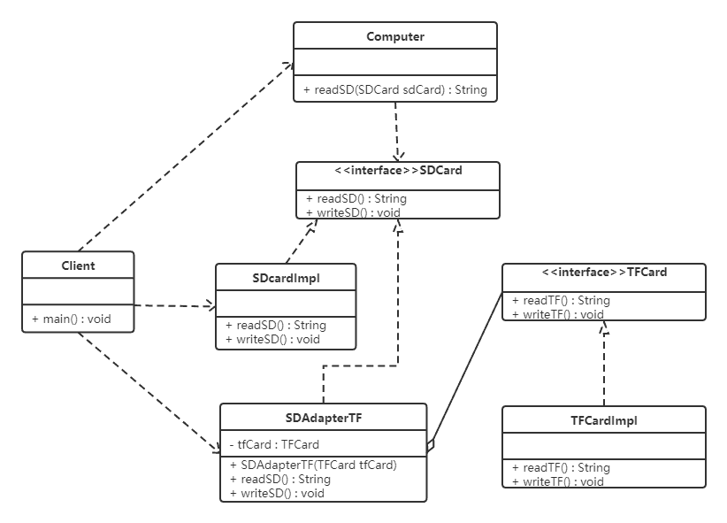

代码如下：
类适配器模式的代码，我们只需要修改适配器类（SDAdapterTF）和测试类。
~~~java
//创建适配器对象（SD兼容TF）
public class SDAdapterTF  implements SDCard {

    private TFCard tfCard;

    public SDAdapterTF(TFCard tfCard) {
        this.tfCard = tfCard;
    }

    public String readSD() {
        System.out.println("adapter read tf card ");
        return tfCard.readTF();
    }

    public void writeSD(String msg) {
        System.out.println("adapter write tf card");
        tfCard.writeTF(msg);
    }
}

//测试类
public class Client {
    public static void main(String[] args) {
        Computer computer = new Computer();
        SDCard sdCard = new SDCardImpl();
        System.out.println(computer.readSD(sdCard));

        System.out.println("------------");

        TFCard tfCard = new TFCardImpl();
        SDAdapterTF adapter = new SDAdapterTF(tfCard);
        System.out.println(computer.readSD(adapter));
    }
}
~~~

> 注意：还有一个适配器模式是接口适配器模式。当不希望实现一个接口中所有的方法时，可以创建一个抽象类Adapter ，实现所有方法。而此时我们只需要继承该抽象类即可。

#### 应用场景

* 以前开发的系统存在满足新系统功能需求的类，但其接口同新系统的接口不一致。
* 使用第三方提供的组件，但组件接口定义和自己要求的接口定义不同。

主要是接口不同，根据开闭原则，尽可能不要修改之前的系统，而是通过适配器进行新旧系统的对接。

#### 类适配器和对象适配器的区别

* 对象适配器持有目标适配者的对象，是动态的方式；而类适配器通过继承目标适配者类，实现适配，是静态的方式。
* 对象适配器采用动态的方式与目标适配者链结，所以它可以对不同的目标适配者及其子类进行适配。
* **类适配器可以重新定义实现行为（重写覆盖），而对象适配器则比较困难，但添加行为比较方便。**

尽量使用对象适配器
遵循合成复用原则，多合成（接口）/聚合，少继承。

#### JDK中的应用（InputStreamReader）

Reader（字符流）、InputStream（字节流）的适配使用的是InputStreamReader。
InputStreamReader继承自java.io包中的Reader，对他中的抽象的未实现的方法给出实现。如：

~~~java
public int read() throws IOException {
    return sd.read();
}

public int read(char cbuf[], int offset, int length) throws IOException {
    return sd.read(cbuf, offset, length);
}
~~~

如上代码中的sd（StreamDecoder类对象），在Sun的JDK实现中，实际的方法实现是对sun.nio.cs.StreamDecoder类的同名方法的调用封装。类结构图如下：

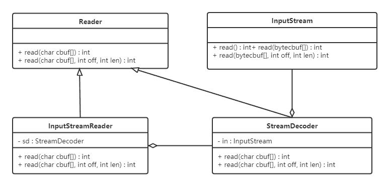

从上图可以看出：
* InputStreamReader是对同样实现了Reader的StreamDecoder的封装。
* StreamDecoder不是Java SE API中的内容，是Sun JDK给出的自身实现。但我们知道他们对构造方法中的字节流类（InputStream）进行封装，并通过该类进行了字节流和字符流之间的解码转换。

结论：
从表层来看，InputStreamReader做了InputStream字节流类到Reader字符流之间的转换。
而从如上Sun JDK中的实现类关系结构中可以看出，是StreamDecoder的设计实现在实际上采用了适配器模式。

### 装饰者模式

#### 概述

我们先来看一个快餐店的例子。
快餐店有炒面、炒饭这些快餐，可以额外附加鸡蛋、火腿、培根这些配菜，当然加配菜需要额外加钱，每个配菜的价钱通常不太一样，那么计算总价就会显得比较麻烦。

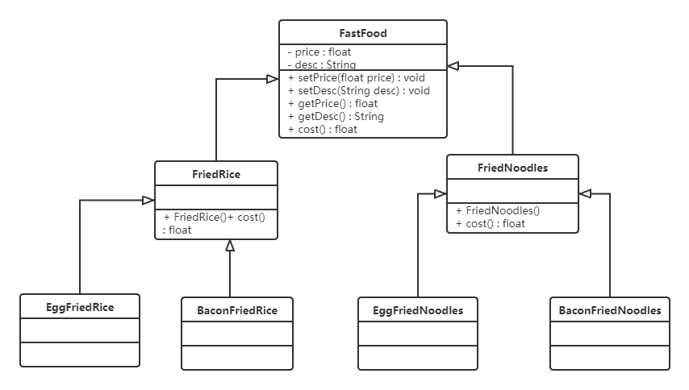

使用继承的方式存在的问题：
* 扩展性不好
  如果要再加一种配料（火腿肠），我们就会发现需要给FriedRice和FriedNoodles分别定义一个子类。如果要新增一个快餐品类（炒河粉）的话，就需要定义更多的子类。
* 产生过多的子类

定义：
指在不改变现有对象结构的情况下，动态地给该对象增加一些职责（即增加其额外功能）的模式。

#### 结构

装饰（Decorator）模式中的角色：
* 抽象构件（Component）角色 ：定义一个抽象接口以规范准备接收附加责任的对象。
* 具体构件（Concrete Component）角色 ：实现抽象构件，通过装饰角色为其添加一些职责。
* 抽象装饰（Decorator）角色 ： 继承或实现抽象构件，并包含具体构件的实例，可以通过其子类扩展具体构件的功能。
* 具体装饰（ConcreteDecorator）角色 ：实现抽象装饰的相关方法，并给具体构件对象添加附加的责任。

#### 案例

我们使用装饰者模式对快餐店案例进行改进，体会装饰者模式的精髓。

类图如下：
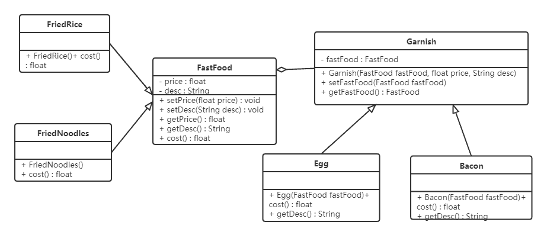

代码如下：
~~~java
//快餐接口
public abstract class FastFood {
    private float price;
    private String desc;

    public FastFood() {
    }

    public FastFood(float price, String desc) {
        this.price = price;
        this.desc = desc;
    }

    public void setPrice(float price) {
        this.price = price;
    }

    public float getPrice() {
        return price;
    }

    public String getDesc() {
        return desc;
    }

    public void setDesc(String desc) {
        this.desc = desc;
    }

    public abstract float cost();  //获取价格
}

//炒饭
public class FriedRice extends FastFood {

    public FriedRice() {
        super(10, "炒饭");
    }

    public float cost() {
        return getPrice();
    }
}

//炒面
public class FriedNoodles extends FastFood {

    public FriedNoodles() {
        super(12, "炒面");
    }

    public float cost() {
        return getPrice();
    }
}

//配料类
public abstract class Garnish extends FastFood {

    private FastFood fastFood;

    public FastFood getFastFood() {
        return fastFood;
    }

    public void setFastFood(FastFood fastFood) {
        this.fastFood = fastFood;
    }

    public Garnish(FastFood fastFood, float price, String desc) {
        super(price,desc);
        this.fastFood = fastFood;
    }
}

//鸡蛋配料
public class Egg extends Garnish {

    public Egg(FastFood fastFood) {
        super(fastFood,1,"鸡蛋");
    }

    public float cost() {
        return getPrice() + getFastFood().getPrice();
    }

    @Override
    public String getDesc() {
        return super.getDesc() + getFastFood().getDesc();
    }
}

//培根配料
public class Bacon extends Garnish {

    public Bacon(FastFood fastFood) {

        super(fastFood,2,"培根");
    }

    @Override
    public float cost() {
        return getPrice() + getFastFood().getPrice();
    }

    @Override
    public String getDesc() {
        return super.getDesc() + getFastFood().getDesc();
    }
}

//测试类
public class Client {
    public static void main(String[] args) {
        //点一份炒饭
        FastFood food = new FriedRice();
        //花费的价格
        System.out.println(food.getDesc() + " " + food.cost() + "元");

        System.out.println("========");
        //点一份加鸡蛋的炒饭
        FastFood food1 = new FriedRice();

        food1 = new Egg(food1);
        //花费的价格
        System.out.println(food1.getDesc() + " " + food1.cost() + "元");

        System.out.println("========");
        //点一份加培根的炒面
        FastFood food2 = new FriedNoodles();
        food2 = new Bacon(food2);
        //花费的价格
        System.out.println(food2.getDesc() + " " + food2.cost() + "元");
    }
}
~~~

好处：
* 饰者模式可以带来比继承更加灵活性的扩展功能，使用更加方便，可以通过组合不同的装饰者对象来获取具有不同行为状态的多样化的结果。装饰者模式比继承更具良好的扩展性，完美地遵循开闭原则，继承是静态的附加责任，装饰者则是动态的附加责任。
* 装饰类和被装饰类可以独立发展，不会相互耦合，**装饰模式是继承的一个替代模式**，装饰模式可以动态扩展一个实现类的功能。

缺点：
* 多层装饰比较复杂，提高了系统的复杂度。不利于我们调试。

#### 使用场景

* 当不能采用继承的方式对系统进行扩充或者采用继承不利于系统扩展和维护时。
  不能采用继承的情况主要有两类：
   * 第一类是系统中存在大量独立的扩展，为支持每一种组合将产生大量的子类，使得子类数目呈爆炸性增长；
   * 第二类是因为类定义不能继承（如final类）
* 在不影响其他对象的情况下，以动态、透明的方式给单个对象添加职责。
* 当对象的功能要求可以动态地添加，也可以再动态地撤销时。

#### JDK中的应用（IO流）

IO流中的包装类使用到了装饰者模式。BufferedInputStream，BufferedOutputStream，BufferedReader，BufferedWriter。
我们以BufferedWriter举例来说明，先看看如何使用BufferedWriter

~~~java
public class Demo {
    public static void main(String[] args) throws Exception{
        //创建BufferedWriter对象
        //创建FileWriter对象
        FileWriter fw = new FileWriter("C:\\Users\\Think\\Desktop\\a.txt");
        BufferedWriter bw = new BufferedWriter(fw);

        //写数据
        bw.write("hello Buffered");

        bw.close();
    }
}
~~~

使用起来感觉确实像是装饰者模式，接下来看它们的结构：

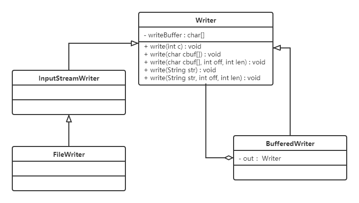

> BufferedWriter使用装饰者模式对Writer子实现类进行了增强，添加了缓冲区，提高了写数据的效率。

#### 代理和装饰者的区别

静态代理和装饰者模式的区别：
* 相同点：
   * 都要实现与目标类相同的业务接口
   * 在两个类中都要声明目标对象
   * 都可以在不修改目标类的前提下增强目标方法
* 不同点：
   * 目的不同
     装饰者是为了增强目标对象
     静态代理是为了保护和隐藏目标对象
   * 获取目标对象构建的地方不同
     **装饰者是由外界传递进来，可以通过构造方法传递
     静态代理是在代理类内部创建，以此来隐藏目标对象**

### 桥接模式

#### 概述

现在有一个需求，需要创建不同的图形，并且每个图形都有可能会有不同的颜色。我们可以利用继承的方式来设计类的关系：

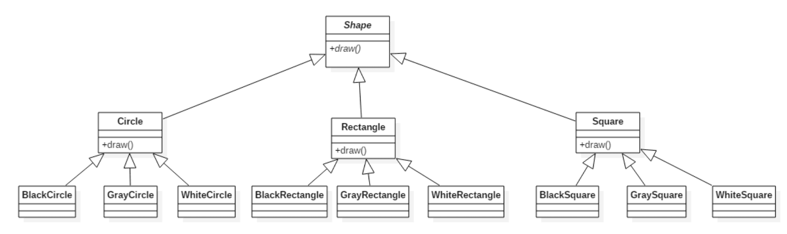

我们可以发现有很多的类，假如我们再增加一个形状或再增加一种颜色，就需要创建更多的类。
试想，在一个有多种可能会变化的维度的系统中，用继承方式会造成类爆炸，扩展起来不灵活。每次在一个维度上新增一个具体实现都要增加多个子类。为了更加灵活的设计系统，我们此时可以考虑使用桥接模式。

定义：
将抽象与实现分离，使它们可以独立变化。它是用组合关系代替继承关系来实现，从而降低了抽象和实现这两个可变维度的耦合度。

#### 结构

桥接（Bridge）模式包含以下主要角色：
* 抽象化（Abstraction）角色 ：定义抽象类，并包含一个对实现化对象的引用。
* 扩展抽象化（Refined  Abstraction）角色 ：是抽象化角色的子类，实现父类中的业务方法，并通过组合关系调用实现化角色中的业务方法。
* 实现化（Implementor）角色 ：定义实现化角色的接口，供扩展抽象化角色调用。
* 具体实现化（Concrete Implementor）角色 ：给出实现化角色接口的具体实现。

#### 案例

例：视频播放器
需要开发一个跨平台视频播放器，可以在不同操作系统平台（如Windows、Mac、Linux等）上播放多种格式的视频文件，常见的视频格式包括RMVB、AVI、WMV等。该播放器包含了两个维度，适合使用桥接模式。

类图如下：
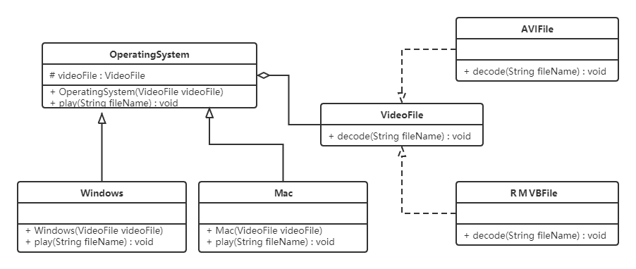

代码如下：

~~~java
//视频文件
public interface VideoFile {
    void decode(String fileName);
}

//avi文件
public class AVIFile implements VideoFile {
    public void decode(String fileName) {
        System.out.println("avi视频文件："+ fileName);
    }
}

//rmvb文件
public class REVBBFile implements VideoFile {

    public void decode(String fileName) {
        System.out.println("rmvb文件：" + fileName);
    }
}

//操作系统版本
public abstract class OperatingSystemVersion {

    protected VideoFile videoFile;

    public OperatingSystemVersion(VideoFile videoFile) {
        this.videoFile = videoFile;
    }

    public abstract void play(String fileName);
}

//Windows版本
public class Windows extends OperatingSystemVersion {

    public Windows(VideoFile videoFile) {
        super(videoFile);
    }

    public void play(String fileName) {
        videoFile.decode(fileName);
    }
}

//mac版本
public class Mac extends OperatingSystemVersion {

    public Mac(VideoFile videoFile) {
        super(videoFile);
    }

    public void play(String fileName) {
		videoFile.decode(fileName);
    }
}

//测试类
public class Client {
    public static void main(String[] args) {
       OperatingSystemVersion os = new Windows(new AVIFile());
        os.play("战狼3");
    }
}
~~~

好处：
* 桥接模式提高了系统的可扩充性，在两个变化维度中任意扩展一个维度，都不需要修改原有系统。
  如：如果现在还有一种视频文件类型wmv，我们只需要再定义一个类实现VideoFile接口即可，其他类不需要发生变化。
* 实现细节对客户透明

#### 使用场景

* 当一个类存在两个独立变化的维度，且这两个维度都需要进行扩展时。
* 当一个系统不希望使用继承或因为多层次继承导致系统类的个数急剧增加时。
* 当一个系统需要在构件的抽象化角色和具体化角色之间增加更多的灵活性时。避免在两个层次之间建立静态的继承联系，通过桥接模式可以使它们在抽象层建立一个关联关系。

### 外观模式

#### 概述

有些人可能炒过股票，但其实大部分人都不太懂，这种没有足够了解证券知识的情况下做股票是很容易亏钱的，刚开始炒股肯定都会想，如果有个懂行的帮帮手就好.
其实基金就是个好帮手，支付宝里就有许多的基金，它将投资者分散的资金集中起来，交由专业的经理人进行管理，投资于股票、债券、外汇等领域，而基金投资的收益归持有者所有，管理机构收取一定比例的托管管理费用。

定义：
又名门面模式，是一种通过为多个复杂的子系统提供一个一致的接口，而使这些子系统更加容易被访问的模式。
该模式对外有一个统一接口，外部应用程序不用关心内部子系统的具体的细节，这样会大大降低应用程序的复杂度，提高了程序的可维护性。

外观（Facade）模式是“迪米特法则”的典型应用

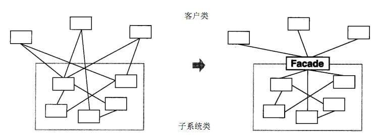

#### 结构

外观（Facade）模式包含以下主要角色：
* 外观（Facade）角色：为多个子系统对外提供一个共同的接口。
* 子系统（Sub System）角色：实现系统的部分功能，客户可以通过外观角色访问它。

#### 案例

例：智能家电控制
小明的爷爷已经60岁了，一个人在家生活：每次都需要打开灯、打开电视、打开空调；睡觉时关闭灯、关闭电视、关闭空调；操作起来都比较麻烦。所以小明给爷爷买了智能音箱，可以通过语音直接控制这些智能家电的开启和关闭。类图如下：

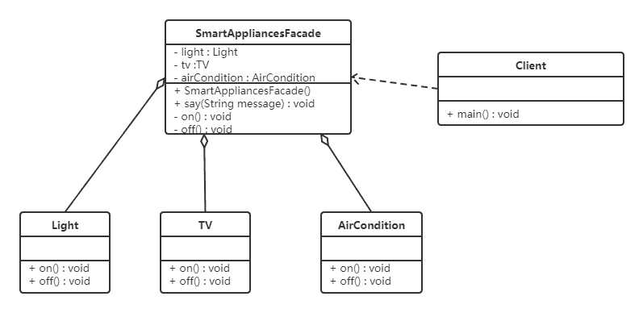

代码如下：
~~~java
//灯类
public class Light {
    public void on() {
        System.out.println("打开了灯....");
    }

    public void off() {
        System.out.println("关闭了灯....");
    }
}

//电视类
public class TV {
    public void on() {
        System.out.println("打开了电视....");
    }

    public void off() {
        System.out.println("关闭了电视....");
    }
}

//控制类
public class AirCondition {
    public void on() {
        System.out.println("打开了空调....");
    }

    public void off() {
        System.out.println("关闭了空调....");
    }
}

//智能音箱
public class SmartAppliancesFacade {

    private Light light;
    private TV tv;
    private AirCondition airCondition;

    public SmartAppliancesFacade() {
        light = new Light();
        tv = new TV();
        airCondition = new AirCondition();
    }

    public void say(String message) {
        if(message.contains("打开")) {
            on();
        } else if(message.contains("关闭")) {
            off();
        } else {
            System.out.println("我还听不懂你说的！！！");
        }
    }

    //起床后一键开电器
    private void on() {
        System.out.println("起床了");
        light.on();
        tv.on();
        airCondition.on();
    }

    //睡觉一键关电器
    private void off() {
        System.out.println("睡觉了");
        light.off();
        tv.off();
        airCondition.off();
    }
}

//测试类
public class Client {
    public static void main(String[] args) {
        //创建外观对象
        SmartAppliancesFacade facade = new SmartAppliancesFacade();
        //客户端直接与外观对象进行交互
        facade.say("打开家电");
        facade.say("关闭家电");
    }
}
~~~

好处：
* 降低了子系统与客户端之间的耦合度，使得子系统的变化不会影响调用它的客户类。
* 对客户屏蔽了子系统组件，减少了客户处理的对象数目，并使得子系统使用起来更加容易。

缺点：
* 不符合开闭原则，修改很麻烦

#### 使用场景

* 对分层结构系统构建时，使用外观模式定义子系统中每层的入口点可以简化子系统之间的依赖关系。
* 当一个复杂系统的子系统很多时，外观模式可以为系统设计一个简单的接口供外界访问。
* 当客户端与多个子系统之间存在很大的联系时，引入外观模式可将它们分离，从而提高子系统的独立性和可移植性。

#### 源码解析

使用tomcat作为web容器时，接收浏览器发送过来的请求，tomcat会将请求信息封装成ServletRequest对象，如下图①处对象。
但是大家想想ServletRequest是一个接口，它还有一个子接口HttpServletRequest，而我们知道该request对象肯定是一个HttpServletRequest对象的子实现类对象，到底是哪个类的对象呢？
可以通过输出request对象，我们就会发现是一个名为RequestFacade的类的对象。

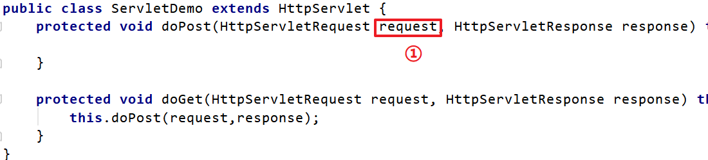

RequestFacade类就使用了外观模式。先看结构图：

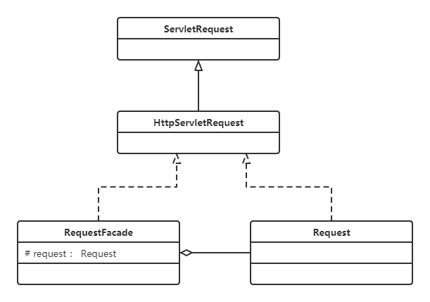

为什么在此处使用外观模式呢？
定义 RequestFacade 类，分别实现 ServletRequest 和 HttpServletRequest ，同时定义私有成员变量 Request ，并且方法的实现调用 Request  的实现。
然后，将 RequestFacade上转为 ServletRequest  传给 servlet 的 service 方法，这样即使在 servlet 中被下转为 RequestFacade ，也不能访问私有成员变量对象中的方法。既用了 Request ，又能防止其中方法被不合理的访问。

### 组合模式

#### 概述

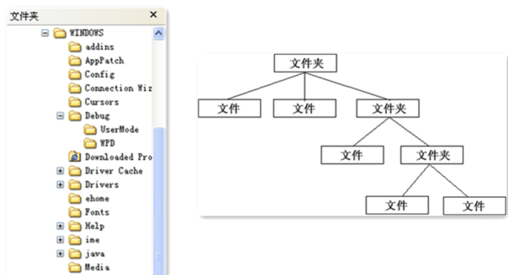

对于这个图片肯定会非常熟悉，上图我们可以看做是一个文件系统，对于这样的结构我们称之为树形结构。
在树形结构中可以通过调用某个方法来遍历整个树，当我们找到某个叶子节点后，就可以对叶子节点进行相关的操作。
可以将这颗树理解成一个大的容器，容器里面包含很多的成员对象，这些成员对象即可是容器对象也可以是叶子对象。
但是由于容器对象和叶子对象在功能上面的区别，使得我们在使用的过程中必须要区分容器对象和叶子对象，但是这样就会给客户带来不必要的麻烦，作为客户而已，它始终希望能够一致地对待容器对象和叶子对象。

定义：
又名部分整体模式，是用于把一组相似的对象当作一个单一的对象。
组合模式依据树形结构来组合对象，用来表示部分以及整体层次。
这种类型的设计模式属于结构型模式，它创建了对象组的树形结构。

#### 结构

组合模式主要包含三种角色：
* 抽象根节点（Component）：定义系统各层次对象的共有方法和属性，可以预先定义一些默认行为和属性。
* 树枝节点（Composite）：定义树枝节点的行为，存储子节点，组合树枝节点和叶子节点形成一个树形结构。
* 叶子节点（Leaf）：叶子节点对象，其下再无分支，是系统层次遍历的最小单位。

### 案例实现

例：软件菜单
如下图，我们在访问别的一些管理系统时，经常可以看到类似的菜单。一个菜单可以包含菜单项（菜单项是指不再包含其他内容的菜单条目），也可以包含带有其他菜单项的菜单。
因此使用组合模式描述菜单就很恰当，我们的需求是针对一个菜单，打印出其包含的所有菜单以及菜单项的名称。

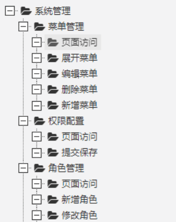

要实现该案例，我们先画出类图：

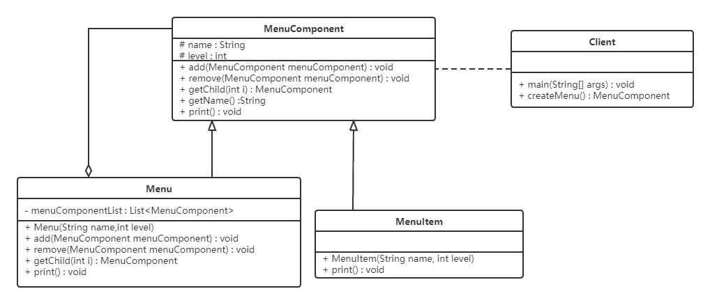

代码实现：
不管是菜单还是菜单项，都应该继承自统一的接口，这里姑且将这个统一的接口称为菜单组件。

~~~java
//菜单组件  不管是菜单还是菜单项，都应该继承该类
public abstract class MenuComponent {

    protected String name;
    protected int level;

    //添加菜单
    public void add(MenuComponent menuComponent){
        throw new UnsupportedOperationException();
    }

    //移除菜单
    public void remove(MenuComponent menuComponent){
        throw new UnsupportedOperationException();
    }

    //获取指定的子菜单
    public MenuComponent getChild(int i){
        throw new UnsupportedOperationException();
    }

    //获取菜单名称
    public String getName(){
        return name;
    }

    public void print(){
        throw new UnsupportedOperationException();
    }
}
~~~

这里的MenuComponent定义为抽象类，因为有一些共有的属性和行为要在该类中实现。
Menu和MenuItem类就可以只覆盖自己感兴趣的方法，而不用搭理不需要或者不感兴趣的方法。
举例来说，Menu类可以包含子菜单，因此需要覆盖add()、remove()、getChild()方法，但是MenuItem就不应该有这些方法。
这里给出的默认实现是抛出异常，你也可以根据自己的需要改写默认实现。

~~~java
public class Menu extends MenuComponent {

    private List<MenuComponent> menuComponentList;

    public Menu(String name,int level){
        this.level = level;
        this.name = name;
        menuComponentList = new ArrayList<MenuComponent>();
    }

    @Override
    public void add(MenuComponent menuComponent) {
        menuComponentList.add(menuComponent);
    }

    @Override
    public void remove(MenuComponent menuComponent) {
        menuComponentList.remove(menuComponent);
    }

    @Override
    public MenuComponent getChild(int i) {
        return menuComponentList.get(i);
    }

    @Override
    public void print() {

        for (int i = 1; i < level; i++) {
            System.out.print("--");
        }
        System.out.println(name);
        for (MenuComponent menuComponent : menuComponentList) {
            menuComponent.print();
        }
    }
}
~~~

Menu类已经实现了除了getName方法的其他所有方法，因为Menu类具有添加菜单，移除菜单和获取子菜单的功能。

~~~java
public class MenuItem extends MenuComponent {

    public MenuItem(String name,int level) {
        this.name = name;
        this.level = level;
    }

    @Override
    public void print() {
        for (int i = 1; i < level; i++) {
            System.out.print("--");
        }
        System.out.println(name);
    }
}
~~~

MenuItem是菜单项，不能再有子菜单，所以添加菜单，移除菜单和获取子菜单的功能并不能实现。

~~~java
public class Client {
    public static void main(String[] args) {
        // 创建菜单树
        MenuComponent menu1 = new Menu("菜单管理",2);
        menu1.add(new MenuItem("页面访问",3));
        menu1.add(new MenuItem("展开菜单",3));
        menu1.add(new MenuItem("编辑菜单",3));
        menu1.add(new MenuItem("删除菜单",3));
        menu1.add(new MenuItem("新增菜单",3));

        MenuComponent menu2 = new Menu("权限管理",2);
        menu2.add(new MenuItem("页面访问",3));
        menu2.add(new MenuItem("提交保存",3));

        MenuComponent menu3 = new Menu("角色管理",2);
        menu3.add(new MenuItem("页面访问",3));
        menu3.add(new MenuItem("新增角色",3));
        menu3.add(new MenuItem("修改角色",3));

        // 创建一级菜单
        MenuComponent component = new Menu("系统管理",1);
        // 将二级菜单添加到一级菜单
        component.add(menu1);
        component.add(menu2);
        component.add(menu3);

        // 打印菜单名称（递归打印）
        component.print();
    }
}
~~~

### 组合模式的分类

在使用组合模式时，根据抽象构件类的定义形式，我们可将组合模式分为**透明组合模式**和**安全组合模式**两种形式。
* 透明组合模式
  * 透明组合模式中，抽象根节点角色中声明了所有用于管理成员对象的方法，比如在示例中 `MenuComponent` 声明了 `add`、`remove` 、`getChild` 方法，这样做的好处是确保所有的构件类都有相同的接口。透明组合模式也是组合模式的标准形式。
  * 透明组合模式的缺点是不够安全，因为叶子对象和容器对象在本质上是有区别的，叶子对象不可能有下一个层次的对象，即不可能包含成员对象，因此为其提供 add()、remove() 等方法是没有意义的，这在编译阶段不会出错，但在运行阶段如果调用这些方法可能会出错（如果没有提供相应的错误处理代码）
* 安全组合模式
  * 在安全组合模式中，在抽象构件角色中没有声明任何用于管理成员对象的方法，而是在树枝节点 `Menu` 类中声明并实现这些方法。安全组合模式的缺点是不够透明，因为叶子构件和容器构件具有不同的方法，且容器构件中那些用于管理成员对象的方法没有在抽象构件类中定义，因此客户端不能完全针对抽象编程，必须有区别地对待叶子构件和容器构件。

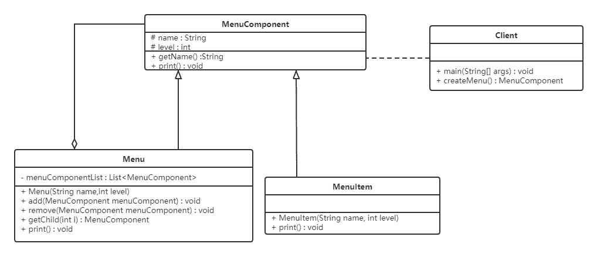

#### 优点

* 组合模式可以清楚地定义分层次的复杂对象，表示对象的全部或部分层次，它让客户端忽略了层次的差异，方便对整个层次结构进行控制。
* 客户端可以一致地使用一个组合结构或其中单个对象，不必关心处理的是单个对象还是整个组合结构，简化了客户端代码。
* 在组合模式中增加新的树枝节点和叶子节点都很方便，无须对现有类库进行任何修改，符合“开闭原则”。
* 组合模式为树形结构的面向对象实现提供了一种灵活的解决方案，通过叶子节点和树枝节点的递归组合，可以形成复杂的树形结构，但对树形结构的控制却非常简单。

#### 使用场景

组合模式正是应树形结构而生，所以组合模式的使用场景就是出现树形结构的地方。
比如：文件目录显示，多级目录呈现等树形结构数据的操作。

### 享元模式

#### 概述

定义：
运用共享技术来有效地支持大量细粒度对象的复用。
它通过共享已经存在的对象来大幅度减少需要创建的对象数量、避免大量相似对象的开销，从而提高系统资源的利用率。

#### 结构

享元（Flyweight ）模式中存在以下两种状态：
1. 内部状态，即不会随着环境的改变而改变的可共享部分。
2. 外部状态，指随环境改变而改变的不可以共享的部分。享元模式的实现要领就是区分应用中的这两种状态，并将外部状态外部化。

享元模式的主要有以下角色：
* 抽象享元角色（Flyweight）：通常是一个接口或抽象类，在抽象享元类中声明了具体享元类公共的方法，这些方法可以向外界提供享元对象的内部数据（内部状态），同时也可以通过这些方法来设置外部数据（外部状态）。
* 具体享元（Concrete Flyweight）角色 ：它实现了抽象享元类，称为享元对象；在具体享元类中为内部状态提供了存储空间。通常我们可以结合单例模式来设计具体享元类，为每一个具体享元类提供唯一的享元对象。
* 非享元（Unsharable Flyweight)角色 ：并不是所有的抽象享元类的子类都需要被共享，不能被共享的子类可设计为非共享具体享元类；当需要一个非共享具体享元类的对象时可以直接通过实例化创建。
* 享元工厂（Flyweight Factory）角色 ：负责创建和管理享元角色。当客户对象请求一个享元对象时，享元工厂检査系统中是否存在符合要求的享元对象，如果存在则提供给客户；如果不存在的话，则创建一个新的享元对象。

#### 案例实现

例：俄罗斯方块
下面的图片是众所周知的俄罗斯方块中的一个个方块，如果在俄罗斯方块这个游戏中，每个不同的方块都是一个实例对象，这些对象就要占用很多的内存空间，下面利用享元模式进行实现。

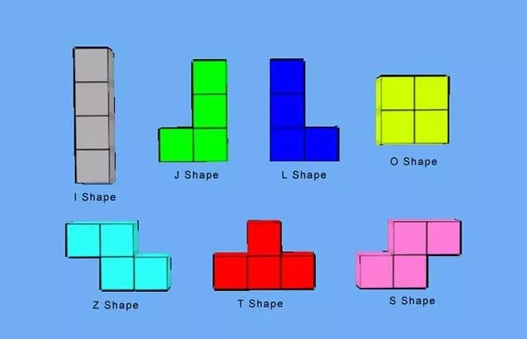

先来看类图：

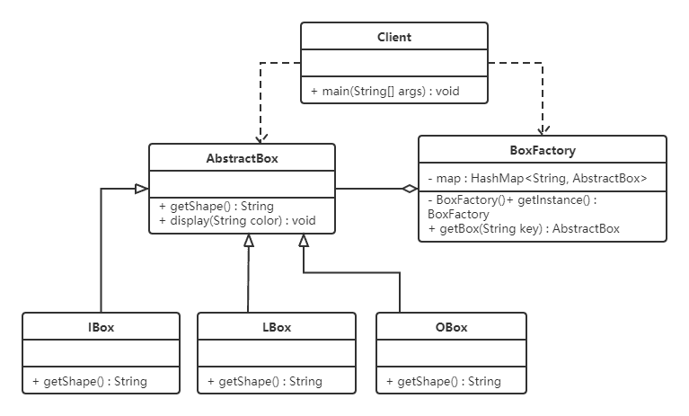

代码如下：
俄罗斯方块有不同的形状，我们可以对这些形状向上抽取出AbstractBox，用来定义共性的属性和行为。

~~~java
public abstract class AbstractBox {
    public abstract String getShape();

    public void display(String color) {
        System.out.println("方块形状：" + this.getShape() + " 颜色：" + color);
    }
}
~~~

接下来就是定义不同的形状了，IBox类、LBox类、OBox类等。

~~~java
public class IBox extends AbstractBox {

    @Override
    public String getShape() {
        return "I";
    }
}

public class LBox extends AbstractBox {

    @Override
    public String getShape() {
        return "L";
    }
}

public class OBox extends AbstractBox {

    @Override
    public String getShape() {
        return "O";
    }
}
~~~

提供了一个工厂类（BoxFactory），用来管理享元对象（也就是AbstractBox子类对象），该工厂类对象只需要一个，所以可以使用单例模式。并给工厂类提供一个获取形状的方法。

~~~java
public class BoxFactory {

    private static HashMap<String, AbstractBox> map;

    private BoxFactory() {
        map = new HashMap<String, AbstractBox>();
        AbstractBox iBox = new IBox();
        AbstractBox lBox = new LBox();
        AbstractBox oBox = new OBox();
        map.put("I", iBox);
        map.put("L", lBox);
        map.put("O", oBox);
    }

    public static final BoxFactory getInstance() {
        return SingletonHolder.INSTANCE;
    }

    private static class SingletonHolder {
        private static final BoxFactory INSTANCE = new BoxFactory();
    }

    public AbstractBox getBox(String key) {
        return map.get(key);
    }
}
~~~

测试类

~~~java
public class demo {
    public static void main(String[] args) {
        // 获取I图形
        AbstractBox box1 = BoxFactory.getInstance().getBox("I");
        box1.display("灰色");

        // 获取:图形
        AbstractBox box2 = BoxFactory.getInstance().getBox("L");
        box2.display("红色");

        // 获取O图形
        AbstractBox box3 = BoxFactory.getInstance().getBox("O");
        box3.display("灰色");

        // 获取O图形
        AbstractBox box4 = BoxFactory.getInstance().getBox("O");
        box4.display("白色");

        System.out.println("两次获取到的O对象是否为同一对象:" + (box3 == box4));
    }
}
~~~

#### 优缺点和使用场景

1，优点
* 极大减少内存中相似或相同对象数量，节约系统资源，提供系统性能
* 享元模式中的外部状态相对独立，且不影响内部状态
2，缺点：
为了使对象可以共享，需要将享元对象的部分状态外部化，分离内部状态和外部状态，使程序逻辑复杂
3，使用场景：
* 一个系统有大量相同或者相似的对象，造成内存的大量耗费。
* 对象的大部分状态都可以外部化，可以将这些外部状态传入对象中。
* 在使用享元模式时需要维护一个存储享元对象的享元池，而这需要耗费一定的系统资源，因此，应当在需要多次重复使用享元对象时才值得使用享元模式。

#### JDK中的应用（Integer类）

Integer类使用了享元模式。我们先看下面的例子：

~~~java
public class Demo {
    public static void main(String[] args) {
        Integer i1 = 127;
        Integer i2 = 127;

        System.out.println("i1和i2对象是否是同一个对象？" + (i1 == i2));

        Integer i3 = 128;
        Integer i4 = 128;

        System.out.println("i3和i4对象是否是同一个对象？" + (i3 == i4));
    }
}
~~~

运行上面代码，结果如下：

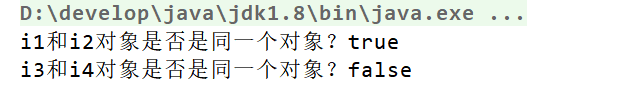

为什么第一个输出语句输出的是true，第二个输出语句输出的是false？通过反编译软件进行反编译，代码如下：

~~~java
public class Demo {
    public static void main(String[] args) {
        Integer i1 = Integer.valueOf((int)127);
        Integer i2 = Integer.valueOf((int)127);
        System.out.println((String)new StringBuilder().append((String)"i1\u548ci2\u5bf9\u8c61\u662f\u5426\u662f\u540c\u4e00\u4e2a\u5bf9\u8c61\uff1f").append((boolean)(i1 == i2)).toString());
        Integer i3 = Integer.valueOf((int)128);
        Integer i4 = Integer.valueOf((int)128);
        System.out.println((String)new StringBuilder().append((String)"i3\u548ci4\u5bf9\u8c61\u662f\u5426\u662f\u540c\u4e00\u4e2a\u5bf9\u8c61\uff1f").append((boolean)(i3 == i4)).toString());
    }
}
~~~

上面代码可以看到，直接给Integer类型的变量赋值基本数据类型数据的操作底层使用的是 `valueOf()` ，所以只需要看该方法即可

~~~java
public final class Integer extends Number implements Comparable<Integer> {
    
	public static Integer valueOf(int i) {
        if (i >= IntegerCache.low && i <= IntegerCache.high)
            return IntegerCache.cache[i + (-IntegerCache.low)];
        return new Integer(i);
    }
    
    private static class IntegerCache {
        static final int low = -128;
        static final int high;
        static final Integer cache[];

        static {
            int h = 127;
            String integerCacheHighPropValue =
                sun.misc.VM.getSavedProperty("java.lang.Integer.IntegerCache.high");
            if (integerCacheHighPropValue != null) {
                try {
                    int i = parseInt(integerCacheHighPropValue);
                    i = Math.max(i, 127);
                    // Maximum array size is Integer.MAX_VALUE
                    h = Math.min(i, Integer.MAX_VALUE - (-low) -1);
                } catch( NumberFormatException nfe) {
                }
            }
            high = h;
            cache = new Integer[(high - low) + 1];
            int j = low;
            for(int k = 0; k < cache.length; k++)
                cache[k] = new Integer(j++);
            // range [-128, 127] must be interned (JLS7 5.1.7)
            assert IntegerCache.high >= 127;
        }

        private IntegerCache() {}
    }
}
~~~

可以看到 `Integer` 默认先创建并缓存 `-128 ~ 127` 之间数的 `Integer` 对象，当调用 `valueOf` 时如果参数在 `-128 ~ 127` 之间则计算下标并从缓存中返回，否则创建一个新的 `Integer` 对象。

