## 第三章 Go 语言内存管理洗髓经

### 内存为什么需要管理

当存储的东⻄越来越多,也就发现物理内存的容量依然不够用,提高对物理内存的利用率和合理地分配内存,管理就变得非常重要了。

1. 操作系统会对内存进行非常详细的管理。
2. 基于操作系统的基础上,不同语言的内存管理机制也应运而生,有一些语言并没有提供自动的内存管理模式,有的语言却提供了自身程序的内存管理模式。

为了降低内存管理的难度,像 C、C++ 这样的编程语言会完全将分配和回收内存的权限交给开发者,而Rust则通过生命周期限定开发者对非法权限内存的访问并以此来自动回收,因而并没有提供自动管理的一套机制。
但是像 Go、Java、Python 这类为了完全让开发者关注代码逻辑本身, 语言层提供了一套管理模式。

在理解 Go 语言层内存管理之前,应该先了解操作系统针对物理内存提供了哪些管理方式。

### 操作系统是如何管理内存的

对计算机来讲内存真正的载体是物理内存条,这个是实打实的物理硬件容量,所以在操作系统中定义的这部分容量叫物理内存。

**物理内存的布局实际上就是一个内存大数组**

每个元素都会对应一个地址,称为物理内存地址。CPU 在运算的过程中,如果需要从内存中取1字节的数据,就需要基于这个数据的物理内存地址去运算,而且物理内存的地址是连续的,可以根据一个基准地址进行偏移来取得相应的连续内存数据。
一个操作系统是不可能只运行一个程序的,这个大数组物理内存势必要被多个程序分成多份,供每个程序使用,但是程序是活的,一个程序可能一会需要 1MB 的内存,一会又需要 1GB 的内存。
操作系统只能取这个程序允许的最大内存极限来将内存分配给这个进程,但这样会导致每个进程都会多要去一部分内存,而这些多要的内存却大概率不会被使用。
当 N 个程序同时使用同一块内存时,产生读写的冲突也在所难免。这样就会导致这些昂贵的 物理内存条,几乎运行不了几个程序,内存的利用率也就提高不上来。

这就引出了操作系统的内存管理方式,操作系统提供了虚拟内存来解决这件事。

#### 虚拟内存

**虚拟内存地址是基于物理内存地址之上凭空而造的一个新的逻辑地址,而操作系统暴露给用户进程的只是虚拟内存地址,操作系统内部会对虚拟内存地址和真实的物理内存地址建立映射关系,来管理地址的分配,从而使物理内存的利用率提高。**

这样用户程序(进程)只能使用虚拟的内存地址获取数据,系统会将这个虚拟地址翻译成实际的物理地址。
这里每个程序统一使用一套连续虚拟地址,例如0x00000000~0xffffffff。从程序的⻆度来看,它觉得自己独享了一整块内存,并且不用考虑访问冲突的问题。系统会将虚拟地址翻译成物理地址,从内存上加载数据。

但如果仅仅把虚拟内存直接理解为地址的映射关系,那就低估虚拟内存的作用了。

虚拟内存的目的是解决以下几件事:

1. **物理内存无法被最大化利用**。此外还实现了“读时共享,写时复制”的机制,“写时复制”(Copy-on-Write)多见于 fork() 子进程或加载动态链接库时。它确实让多个虚拟地址指向同一物理地址,只有在数据被修改时才分配新物理页,极大节省了空间。
2. 程序逻辑内存空间使用独立。**进程隔离**。每个进程都以为自己拥有连续的地址空间,互不干扰,提高了系统的安全性。
3. 内存不够,继续虚拟磁盘空间。**Swap(交换分区)**。虚拟内存将暂时不用的数据置换到磁盘上,让有限的物理内存能运行更大的程序。

#### MMU 内存管理单元

虚拟地址是如何映射到物理内存地址上的呢?
如果采用简单的线性固定映射,物理内存的碎片化将导致无法为每个进程分配连续的地址空间。
为了解决这个问题,操作系统引入了**页表映射机制**,并由硬件层面的 **MMU(Memory Management Unit,内存管理单元)** 负责具体执行。
MMU 集成在 CPU 内部,其核心逻辑如下:

* **地址翻译:** 当 CPU 尝试访问某个虚拟地址时,MMU 会自动截获该地址,并根据操作系统的 **页表(Page Table)** 将其翻译成真实的物理地址。
* **硬件加速:** MMU 内部拥有高速缓存 **TLB(快表)**,能够极大地降低地址转换的延迟。
* **权限检查:** 在映射的同时,MMU 还会检查进程是否有权读、写或执行该段内存,从而保障了系统的安全性。

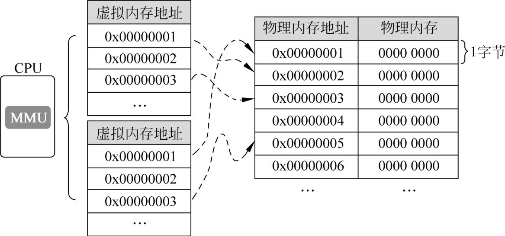

这种设计使得进程可以拥有独立且连续的虚拟空间,而底层的物理内存则可以被离散、动态地高效利用。

#### 虚拟内存本身怎么存放

虚拟内存本身是通过一个叫⻚表(Page Table)的东⻄实现的。

1. ⻚
   ⻚是操作系统中用来描述内存大小的一个单位名称。一个⻚的含义是大小为 4KB(1024×4=4096字节)的内存空间。操作系统对虚拟内存空间是按照这个单位来管理的。
2. ⻚表
   ⻚表实际上就是⻚的集合,即基于⻚的一个数组。⻚只表示内存的大小,而⻚表条目(PTE)才是⻚表数组中的一个元素。

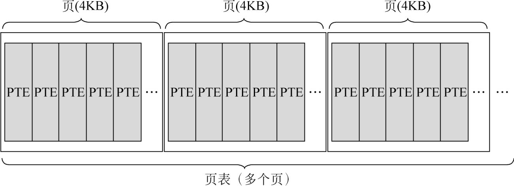

虚拟内存的实现方式,大多数是通过⻚表实现的,实则是一个数组。
操作系统虚拟内存空间被分成一⻚一⻚来管理,每⻚的大小为 4KB(当然这是可以配置的,不同操作系统不一样)。
**磁盘和主内存之间的置换也是以⻚为单位来操作的。4KB 算是通过实践折中出来的通用值,太小了会出现频繁置换,太大了又会浪费内存。**

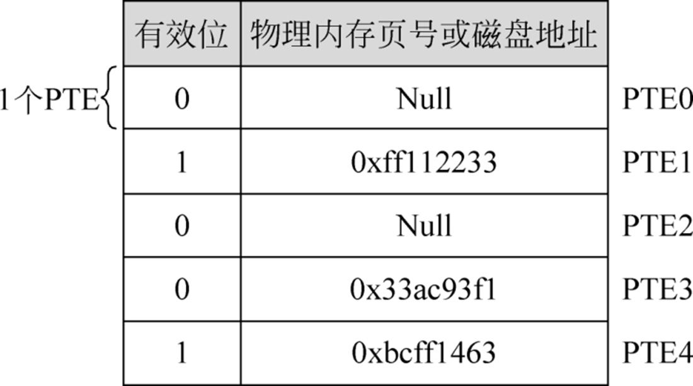

⻚是一次读取的内存单元,但是真正到虚拟内存寻址的是PTE,也就是⻚表中的一个元素。
可以看出每个 PTE 是由一个有效位和一个物理⻚号或者磁盘地址组成,有效位表示当前虚拟⻚是否已经被缓存在主内存中(或者CPU的高速缓存Cache中)。

虚拟⻚为何会有是否已经被缓存在主内存中一说?
虚拟⻚表(简称⻚表)虽然作为虚拟内存与物理内存的映射关系,但是本身也需要存放在某个位置上,所以自身也占用一定内存,所以⻚表本身也被操作系统放在物理内存的指定位置。
CPU 把虚拟地址给 MMU,MMU 去物理内存中查询⻚表,得到实际的物理地址。当然 MMU 不会每次都去查询,它自己也有一份缓存,叫作 快表 Translation Lookaside Buffer(TLB),是为了加速地址翻译。

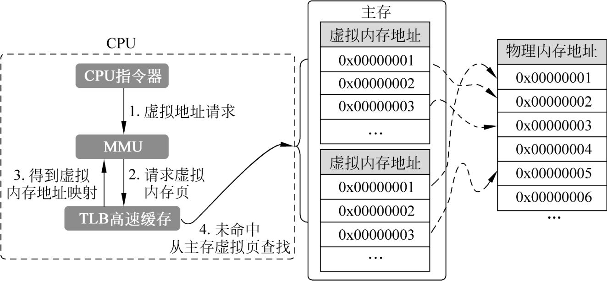

内存访问完整流程:当 CPU 需要读取一个虚拟地址的数据时,遵循以下逻辑路径:

1. **请求阶段**:CPU 发出虚拟地址请求给 **MMU**。
2. **一级缓存查找 (TLB)**:MMU 首先在 **TLB** 中查找。
    * **命中 (Hit)**:直接获取物理地址,返回给 CPU。
    * **缺失 (Miss)**:进入下一步,查询主存页表。
3. **主存查找 (Page Table)**:MMU 访问物理内存中的**页表**。
    * **有效位 = 1**:查询成功,获取物理地址,并更新到 TLB 中备用。
    * **有效位 = 0**:触发 **缺页异常 (Page Fault)**,此时操作系统介入,从磁盘加载数据到内存。

根据 PTE 的状态,虚拟内存空间中的页可以归纳为以下三类:

| 状态                    | 有效位 | 描述                        |
|-----------------------|-----|---------------------------|
| **未分配 (Unallocated)** | 0   | 进程未申请该段地址,不占用内存,也不占用磁盘。   |
| **已分配未缓存 (Uncached)** | 0   | 进程已申请,数据在磁盘上,但尚未加载到物理内存。  |
| **已缓存 (Cached)**      | 1   | 数据已在物理内存中,虚拟地址已映射到具体的物理页。 |

#### CPU 内存访问过程

在访问开始前,CPU 生成的**虚拟地址 (VA)** 被拆分为两个部分:

* **VPN (Virtual Page Number)**:虚拟页号,用于定位页表中的条目(索引)。
* **VPO (Virtual Page Offset)**:虚拟页偏移量,表示数据在页内的具体位置。

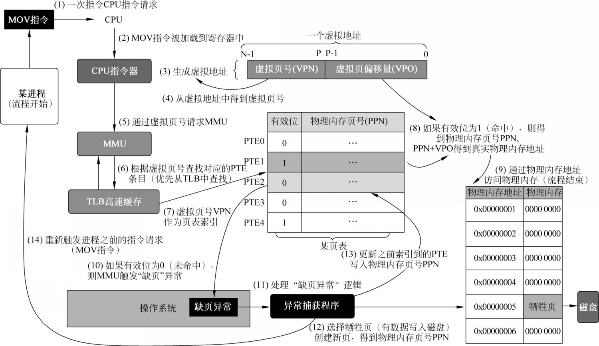

**正常访问流程(命中路径:Steps 1-9)**

这是最快的一条路径,完全由硬件(CPU, MMU, TLB)完成:

1. **指令发出**:CPU 寄存器加载指令,生成虚拟地址。
2. **TLB 快速查找**:MMU 提取 VPN,首先在 **TLB (快表)** 中查询对应的 **PTE (页表项)**。
3. **地址翻译**:
    * MMU 获取 PTE 中的 **PPN (Physical Page Number,物理页号)**。
    * **关键组合逻辑**:物理地址 (直接串联,不需要加法运算)。
4. **内存访问**:CPU 通过生成的物理地址 (PA) 直接访问主存并获取数据。

**异常处理流程(缺页路径:Steps 10-14)**

当 **PTE 有效位为 0** 时,说明数据不在内存中,触发“缺页异常”:

* **触发异常**:MMU 发出异常信号,CPU 挂起当前进程,控制权转交给操作系统的**缺页处理程序**。
* **调入页面**:
    * **选择牺牲页**:如果内存已满,根据算法(如 LRU)选择一个物理页换出到磁盘(若有修改需写回)。
    * **载入数据**:将缺失的数据从磁盘读入选定的物理内存页。
* **更新状态**:更新页表中的 PTE,写入新的 PPN,并将**有效位设为 1**。
* **指令重试**:处理程序返回,CPU **重新执行**刚才出错的指令。由于此时有效位已为 1,将走上述“正常访问流程”并最终命中。

性能核心指标:命中率 (Hit Rate),内存访问的效率极大程度上取决于命中率。

| 场景         | 耗时级别        | 影响因素             |
|------------|-------------|------------------|
| **TLB 命中** | 纳秒 (ns)     | 程序局部性(数据的连续性)    |
| **主存页表命中** | 几十纳秒        | 内存访问延迟           |
| **缺页异常**   | **毫秒 (ms)** | 磁盘 I/O 速度、物理内存容量 |

> 缺页处理涉及磁盘访问,其速度比内存慢 **10,000 倍**以上。如果物理内存不足,系统会频繁在内存与磁盘间交换数据,这种现象称为 **“内存颠簸” (Thrashing)**,会导致程序性能断崖式下跌。

#### 内存的局部性

什么是局部性?

局部性是指程序在执行时,往往倾向于引用最近引用过的数据,或者引用与最近引用过的数据在**空间地址上相邻**的数据。

* **时间局部性 (Temporal Locality)**:如果一个内存位置被引用,那么在不久的将来它很可能再次被引用(例如:循环中的变量 `i`)。
* **空间局部性 (Spatial Locality)**:如果一个内存位置被引用,那么硬件往往预判其附近的内存位置也会被引用(例如:数组的顺序遍历)。

局部性与系统性能的关系

现代计算机体系结构利用局部性特征设计了多级缓存(Cache)和缓冲层:

* **硬件层面**:L1/L2/L3 缓存、TLB(快表)。
* **系统层面**:虚拟内存的分页机制、预读机制。

> 缓存的有效性完全依赖于程序的局部性。局部性越好,缓存命中率越高,程序运行越快;反之则会导致频繁的缺页或缓存失效。
> 所以在设计程序或者业务的时候应该多考虑增强程序局部性的特征,这样的程序执行起来会更快。

---

#### 实验分析:步长 (Step) 对性能的影响

~~~go
package test

import "testing"

func CreateSource(len int) []int {
	nums := make([]int, 0, len)
	for i := 0; i < len; i++ {
		nums = append(nums, i)
	}
	return nums
}

// 遍历数组,将每个值都设置为4,但使用 step 规定每次遍历的跨度
func Loop1(nums []int, step int) {
	l := len(nums)
	for i := 0; i < step; i++ {
		for j := i; j < l; j += step {
			nums[j] = 4 // 访问内存 并写入值
		}
	}
}

// Loop1 step 取1时的等价代码
func Loop2(nums []int) {
	l := len(nums)
	for i := 0; i < l; i++ {
		nums[i] = 4
	}
}

// step 跨度越小,则表示访问 nums 相邻内存的局部性越好,step 越大则相反。

func BenchmarkLoopStep1(b *testing.B) {
	source := CreateSource(10000)
	b.ResetTimer()
	for i := 0; i < b.N; i++ {
		Loop1(source, 1)
	}
}
func BenchmarkLoopStep2(b *testing.B) {
	source := CreateSource(10000)
	b.ResetTimer()
	for i := 0; i < b.N; i++ {
		Loop1(source, 2)
	}
}
func BenchmarkLoopStep4(b *testing.B) {
	source := CreateSource(10000)
	b.ResetTimer()
	for i := 0; i < b.N; i++ {
		Loop1(source, 4)
	}
}
func BenchmarkLoopStep8(b *testing.B) {
	source := CreateSource(10000)
	b.ResetTimer()
	for i := 0; i < b.N; i++ {
		Loop1(source, 8)
	}
}
func BenchmarkLoopStep16(b *testing.B) {
	source := CreateSource(10000)
	b.ResetTimer()
	for i := 0; i < b.N; i++ {
		Loop1(source, 16)
	}
}
~~~

~~~shell
goos: windows
goarch: amd64
pkg: script/test
BenchmarkLoopStep1
BenchmarkLoopStep1-20     	  831439	      1291 ns/op
BenchmarkLoopStep1-20     	  972572	      1225 ns/op
BenchmarkLoopStep1-20     	  974499	      1227 ns/op
BenchmarkLoopStep2
BenchmarkLoopStep2-20     	  557046	      2130 ns/op
BenchmarkLoopStep2-20     	  555843	      2160 ns/op
BenchmarkLoopStep2-20     	  572308	      2096 ns/op
BenchmarkLoopStep4
BenchmarkLoopStep4-20     	  309943	      4200 ns/op
BenchmarkLoopStep4-20     	  293374	      4277 ns/op
BenchmarkLoopStep4-20     	  301840	      4022 ns/op
BenchmarkLoopStep8
BenchmarkLoopStep8-20     	  148774	      7666 ns/op
BenchmarkLoopStep8-20     	  156615	      7872 ns/op
BenchmarkLoopStep8-20     	  155821	      7639 ns/op
BenchmarkLoopStep16
BenchmarkLoopStep16-20    	  118401	     10422 ns/op
BenchmarkLoopStep16-20    	  110496	     10108 ns/op
BenchmarkLoopStep16-20    	  121336	     10222 ns/op
PASS
~~~

1. BenchmarkLoopStep1-20 中的 20 表示 GOMAXPROCS(线程数)为 20,这个在此处不需要过度关心。
2. 831439 表示一共执行了 831439 次,即代码中 b.N 的值,这个值不是固定不变的。实际上是通过循环调用 831439 次 Loop() 函数得到的最后性能结果。
3. 1291 ns/op 表示平均每次执行 Loop() 函数所消耗的时间是 1291 ns。

通过上述结果可以看出,随着 Step 参数的增加,内存访问的局部性就越差,执行 Loop() 的性能也就越差。
如果要设计出一个更加高效的程序,则提高代码的局部性访问是非 常有效的程序性能优化手段之一。

* 当 `Step=1` 时,CPU 加载一个缓存行(通常是 64 字节)时,后续的几个元素已经顺便被加载到了 L1 Cache 中。
* 当 `Step` 很大时,每次访问都可能错过当前缓存行,迫使 CPU 不断从主存甚至触发页表查询来获取数据,极大增加了延迟。

---

**思考题:Go GPM 调度器中的局部性:为什么一个 G (Goroutine) 开辟的子 G 优先放在当前的本地 P 队列中,而不是其他 P 队列?**

这是 **“调度局部性”** 的体现,因为:

1. **数据局部性**:子 G 往往会继承或共享父 G 的数据(闭包捕获、Channel 通讯)。如果它们在同一个 P(即同一个 M/线程)上运行,这些数据更有可能已经存在于该 CPU 的 **L1/L2 缓存**中,避免了跨核心同步的开销。
2. **减少竞争**:每个 P 拥有本地队列,M 访问本地队列不需要加全局锁。如果新 G 总是随机分配,会产生大量的锁竞争和上下文切换。
3. **栈与状态预热**:同一个 P 上的任务切换,可以最大限度地保持 CPU 流水线和分支预测器的“热度”。

**日常开发中如何优化程序性能?**

* **优先使用数组/切片**:它们在物理内存上是连续的,空间局部性最好。尽量避免使用大量指针嵌套的复杂结构(如 `List` 或离散的 `Map` 节点)。
* **顺序读写**:在处理大数据量时,尽量按顺序访问,利用硬件的预取机制。
* **关注缓存行对齐**:在高性能并发编程中,注意防止“伪共享” (False Sharing)。

> **伪共享**是多核编程中一种隐蔽的性能杀手。它发生在多个 CPU 核心同时修改同一个缓存行 (Cache Line) 中的不同变量时。虽然从逻辑上看,多个线程操作的是互相独立的变量,但在底层硬件看来,它们在争夺同一块缓存区域,导致缓存系统不断失效,性能急剧下降。
>
> 为了提高效率,CPU 并不是按字节从内存读取数据的,而是以**缓存行**为单位。在现代 x86 和 ARM 架构中,一个缓存行通常是 **64 字节**。
> 当你读取一个 int64 变量时,CPU 会顺便把它相邻的另外 7 个 int64 变量也加载进缓存行。
> **缓存一致性协议 (MESI)**:如果核心 A 修改了某个缓存行的数据,核心 B 缓存中对应的该行就会被标记为“无效”。核心 B 下次访问时必须重新从主存(或 L3 缓存)加载。
>
> 假设有两个全局变量 A 和 B(例如两个计数器),它们在内存中是紧挨着的,正好被加载到了同一个 64 字节的缓存行中:
> 核心 1 正在频繁修改变量 A。
> 核心 2 正在频繁修改变量 B。
> 由于硬件以缓存行为单位管理一致性,即使核心 2 根本没动过 A,但因为核心 1 修改了该行,核心 2 的整个缓存行都会失效。
> 两个核心就像在玩一场“接力赛”,不断地让对方的缓存失效,迫使数据在核心之间来回“颠簸”(Ping-ponging)。
>
> 真共享:多个线程真的需要访问同一个变量,锁竞争是不可避免的。
> 伪共享:多个线程访问的是**完全无关**的变量,仅仅是因为它们在内存位置上靠得太近,被“误杀”了。

### 如何用 Go 语言实现手动内存管理与内存池设计(简略,不带书中 CGO 代码)

在高性能场景(如网关、游戏服务器)中,Go 原生的 GC(垃圾回收)扫描可能会带来延迟抖动。为了解决这个问题,我们可以手动管理内存。

#### Cgo 与指针逻辑

手动管理的核心是绕过 Go Runtime,直接与内核对话。

* **避开 GC**:利用 `import "C"` 调用 C 的 `malloc`。这部分内存分配在系统堆(System Heap)上,Go 的垃圾回收器完全“看不见”它,因此不会产生扫描开销。
* **指针算术 (Pointer Arithmetic)**:Go 的指针不支持加减运算。为了定位 Buf 内部的具体地址,必须进行类型转换:`目标地址 = unsafe.Pointer(uintptr(基地址)+uintptr(偏移量))`

> 这是所有高性能内存库(包括 Go 源码本身)处理连续内存块偏移的唯一标准方式。

明白,这节内容确实需要适度的深度,因为它不仅是代码实现,更是理解 Go 内存管理(TCMalloc)的**逻辑跳板**。

以下是为您重新整理的 **3.4 节:手动内存管理与内存池设计** 深度精简笔记。我们跳过语法细节,重点拆解**地址运算、状态转换和池化架构**。

#### Buf (内存缓冲单元)

`Buf` 是对原始内存块的封装。它的精髓在于**三个核心索引**对地址空间的划分。

* **`Data`**:`malloc` 申请到的物理内存首地址。
* **`Head`**:有效数据的起始偏移量。
* **`Length`**:有效数据的末尾偏移量(已写入数据的边界)。
* **`Capacity`**:该内存块的最大物理容量上限。

关键内存操作

1. **逻辑弹出 (Pop)**:
   不涉及数据移动。只需 `head += n`。这意味着前 `n` 个字节在逻辑上被“删除了”,极大地提高了处理速度。
2. **内存平移 (Adjust)**:
    * 由于频繁 `Pop`,`head` 会不断右移,导致前端出现大量“过期数据”占据空间。
    * 调用 `memmove`(支持内存重叠的拷贝),将 `[head : length]` 之间的数据整体搬运回 `0` 偏移位置,并将 `head` 重置为 `0`。

> 这是解决内存碎片、提高空间利用率的典型手段。

#### BufPool (内存池管理)

如果每次 `Buf` 申请都找内核要(`malloc`),系统调用的成本太高。

##### 分级管理 (Size-Classing)

内存池不是一个大仓库,而是按规格分成的多个“专柜”:

* **Hash 映射**:使用 `Map[int]*Buf`。Key 是固定规格(如 4KB, 16KB, 64KB),Value 是该规格下**空闲 Buf 的单向链表**。
* **优势**:申请 5KB 时,直接去 16KB 的专柜取,避免了频繁调整内存大小的开销。

##### 借与还 (Alloc & Revert)

1. **Alloc (分配)**:
    * 根据所需大小计算出所属的 Bucket(桶)。
    * 从链表头部摘除一个 Buf (`LIFO` 原则)。如果链表为空,则触发 `malloc` 补充。
2. **Revert (回收)**:
    * 调用 `Clear()`:仅仅是将 `head` 和 `length` 归零,不释放物理内存。
    * **挂回链表**:将 Buf 插回对应 Bucket 链表的头部,等待下一次分配。

#### Zbuf (安全适配层)

为了防止业务代码直接操作指针,最后封一层 `Zbuf`:

* **自动扩容**:写入数据超过当前 Buf 容量时,`Zbuf` 会自动去 `Pool` 换一个更大的 Buf,并完成数据迁移,对用户透明。
* **I/O 绑定**:可以直接将 `Socket` 读取的数据填充进 `Zbuf`。业务层只需面向 `Zbuf` 获取 `[]byte`,无需感知底层是哪块内存、是否来自池子。

### TCMalloc 内存管理

TCMalloc (Thread Cache Malloc) 是 Go 内存管理设计的逻辑蓝图。

#### TCMalloc 核心理念

全局共享内存池的缺陷
传统的内存池(如之前实现的 BufPool)通常是所有线程共享的。

**缺点**:所有线程申请内存都要与全局池交互,为了保证并发安全,必须加**互斥锁**。在高并发下,锁竞争会成为严重的性能瓶颈。

TCMalloc 的改进:ThreadCache
TCMalloc 为每个线程预分配独立缓存。其结构包含三层:

1. **ThreadCache (线程缓存)**:每个线程独立维护,申请内存时无需加锁,性能极高。
2. **CentralCache (中心缓存)**:所有线程共享。当 ThreadCache 内存不足时,从这里补给;内存过多时,退还给这里。由于共享,访问需加锁。
3. **PageHeap (页堆)**:最底层的全局共享缓存,负责中大对象分配及向操作系统申请内存。

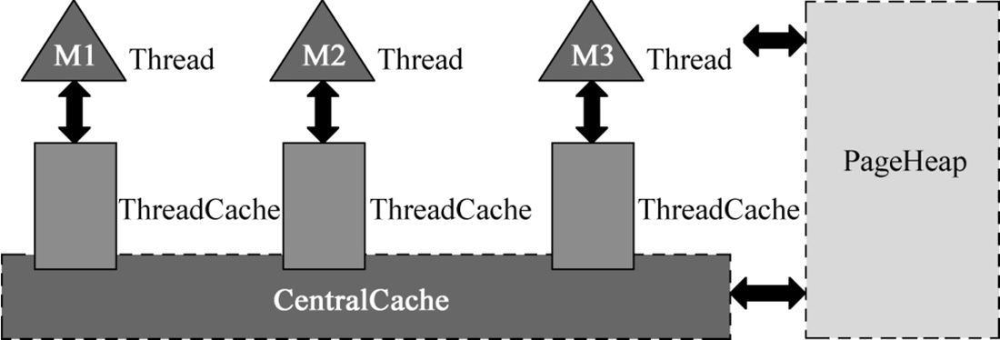

#### TCMalloc 基础结构

在深入流程前,必须理解三个基本名词:

1. **Page (页)**:TCMalloc 的最小存储单元。默认为 **8KB**。整个虚拟内存被划分为数万个同等大小的 Page。
    * **优点**:通过内存地址和固定算法,可以快速算出该地址属于哪个 Page ID。
2. **Span (内存块)**:**多个连续 Page 的集合**。
    * TCMalloc 以 Span 为单位向系统申请内存。
    * Span 记录了起始 Page 编号 (`Start`) 和连续 Page 的数量 (`Length`)。
    * 多个 Span 以**双向链表**形式组织,方便管理。
3. **Size Class (尺寸等级)**:
    * 对于小对象,TCMalloc 将其划分为多个刻度(如 8B, 16B...)。
    * 每个 Size Class 对应一个由多个等空间 Page 组成的 Span。

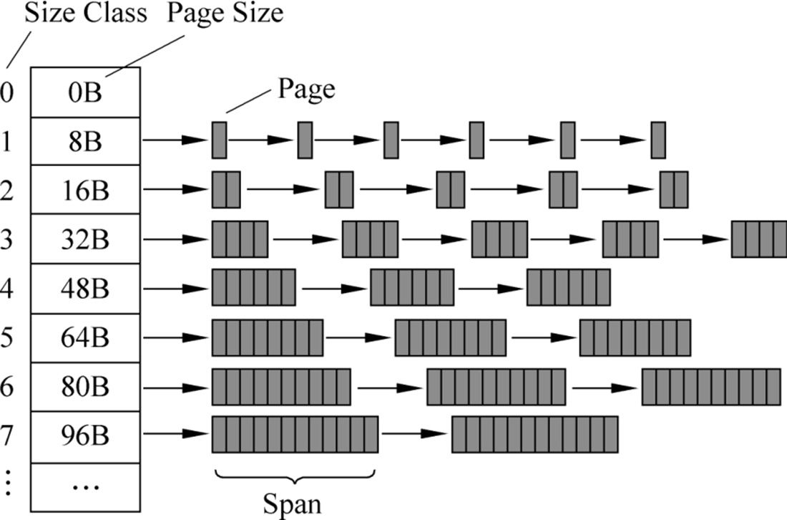

#### TCMalloc 缓存结构

##### ThreadCache

* **结构**:内部为每个 Size Class 维护一个 `FreeList`。
* **分配/回收**:直接从对应的 `FreeList` 返回或插入对象。
* **特性**:无锁操作。只有当 `FreeList` 为空时,才向 CentralCache 申请。

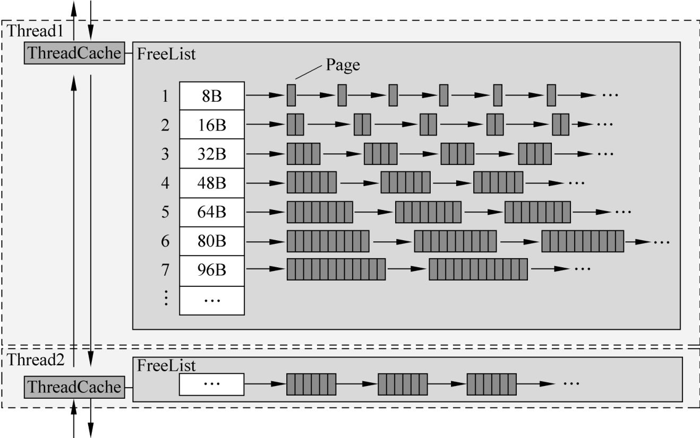

##### CentralCache

* **结构**:维护与 ThreadCache 相同的 Size Class 刻度。
* **职责**:作为 ThreadCache 的二级缓存。
* **特性**:全局共享,访问需加锁。

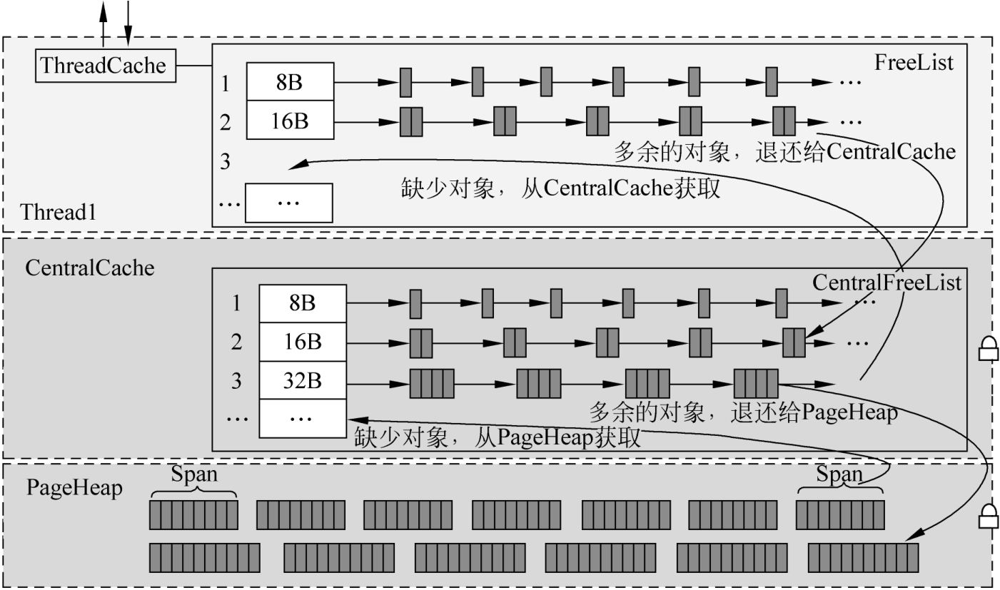

##### PageHeap

* **职责**:CentralCache 的三级缓存,也是中/大对象的分配源。直接衔接操作系统虚拟内存。
* **管理方式**:
* **128 个 Page 以内**:按 Page 刻度(1, 2, 3...128)使用链表缓存。
* **128 个 Page 以上**:使用**有序集合 (Set)** 存放。

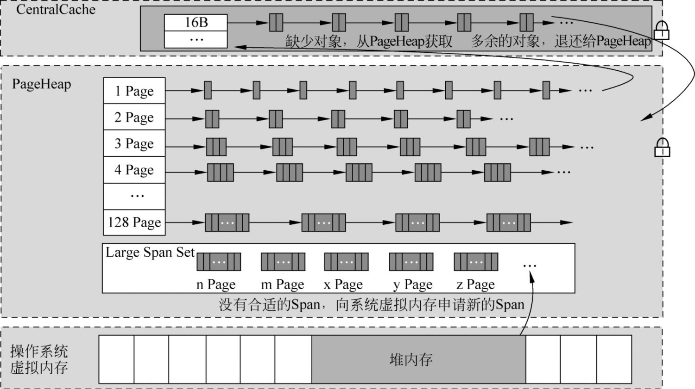

#### 对象分配流程

##### 小对象分配流程 (≤ 256KB)

1. 计算申请内存对应的 `SizeClass`。
2. 访问 `ThreadCache` 的 `FreeList`。
3. **命中**:返回第一个空闲对象,流程结束。
4. **未命中**:加锁请求 `CentralCache`。
5. `CentralCache` 若有空闲,返回一批对象给 `ThreadCache`,并将其中一个返回给线程。
6. `CentralCache` 若无空闲,向 `PageHeap` 申请 Span,拆分成对应规格填入 `CentralFreeList`。

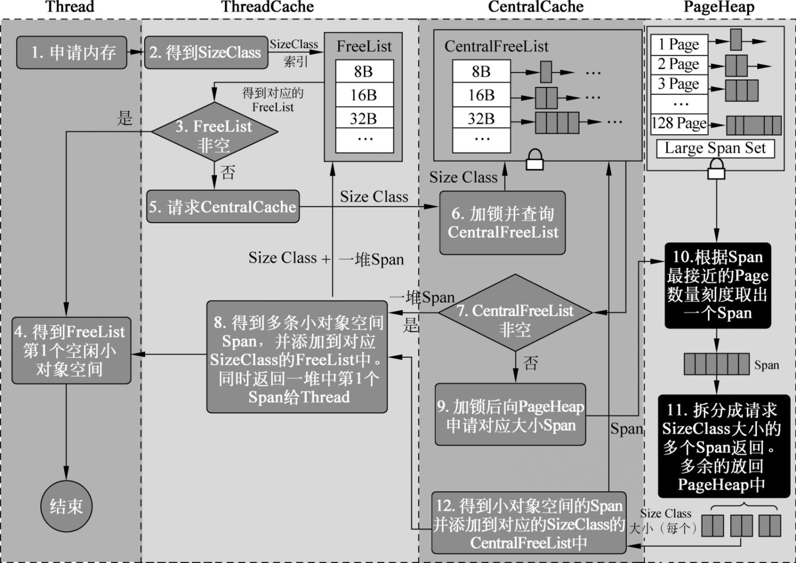

##### 中对象分配流程 (256KB ~ 1MB)

1. 绕过 `ThreadCache` 和 `CentralCache`,直接请求 `PageHeap`。
2. `PageHeap` 在 128 个 Page 以内的**小 Span 链表**中向上取整查找。
3. 若对应的 个 Page 链表为空,则继续向下遍历(最多到 128),找到第一个非空链表。
4. **切分**:将找到的 个 Page 拆分为 (返回用户)和 (退还给 PageHeap 对应链表)。

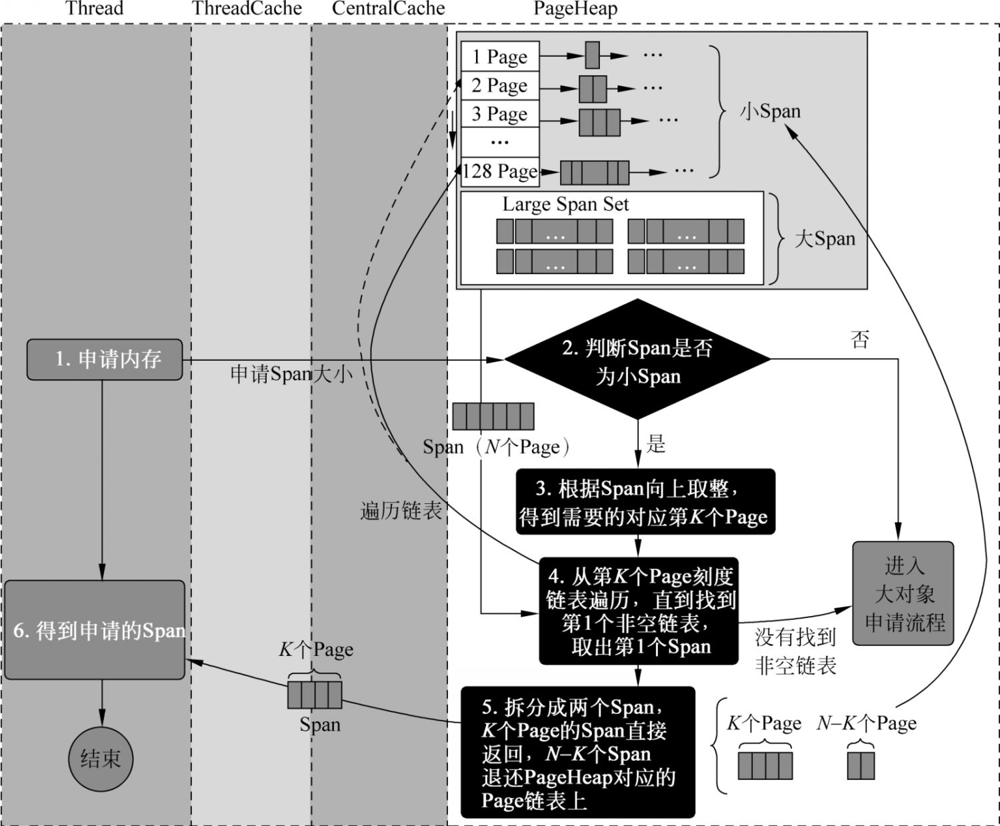

##### 大对象分配流程 (> 1MB)

1. 直接向 `PageHeap` 发起申请。
2. 计算所需 Page 数量 。
3. 在 **Large Span Set** 中通过最佳适配算法找到不小于 的最小 Span 。
4. 若找不到,向系统申请新内存并重试。
5. **切分**:返回 个 Page,剩余的 退还。若 退回 Large Set,否则退回小 Span 链表。

#### 一些问题

##### 中对象和大对象不会在 ThreadCache 和 CentralCache 中缓存吗

在 TCMalloc 的设计中,**ThreadCache 和 CentralCache 仅服务于小对象(≤ 256KB)**。
**小对象靠“缓存”换取并发性能,中大对象靠“页管理”换取空间利用率。**

##### 为什么中/大对象不进 Cache?

1. 内存碎片与利用率
   ThreadCache 和 CentralCache 的核心是 **Size Class(尺寸分级)**。
    * **小对象**:规格固定(如 8B, 16B),在一个 Span 里可以切分出成百上千个小格子。即便某个格子空闲,浪费的空间也极小。
    * **中/大对象**:如果也按固定规格缓存(比如专门开辟一个 1MB 的缓存位),一旦这个位置长期不被使用,就会造成严重的**内部碎片**。对于大额内存,直接按需向 `PageHeap` 申请“页(Page)”级别的内存块(Span)更加灵活高效。
2. 缓存命中率与锁开销
    * **小对象**:申请频率极高。如果每次都找 `PageHeap` 加锁申请,性能会因锁竞争崩溃,所以必须要在 ThreadCache 里搞“私产”。
    * **大对象**:申请频率相对较低。直接去 `PageHeap` 加锁申请带来的性能损耗,相比于其庞大的内存分配动作,是可以接受的。

内存分配路径对比

| 对象类别    | 大小区间 | 第一站                      | 第二站               | 终点站 (数据源)     |
|---------|------|--------------------------|-------------------|---------------|
| **小对象** |      | **ThreadCache** (无锁)     | CentralCache (有锁) | PageHeap (有锁) |
| **中对象** |      | **PageHeap** (小 Span 链表) | -                 | PageHeap / OS |
| **大对象** |      | **PageHeap** (Large Set) | -                 | PageHeap / OS |

##### PageHeap 是如何处理中/大对象的?

由于中/大对象不经过前两层,`PageHeap` 承担了全部的重任,但它的处理逻辑也有精细的区别。

###### 中对象:利用“页刻度”链表

PageHeap 内部维护了 **128 个单向链表**。

* 第 1 个链表挂载 1 个 Page 大小的 Span。
* 第 2 个链表挂载 2 个 Page 大小的 Span。
* ...以此类推,直到 128 个 Page(即 1MB)。

对于中对象,PageHeap 会尝试从最匹配的链表中直接摘取一个 Span。

###### 大对象:利用“有序集合” (Search)

当对象超过 128 个 Page 时,链表就不够用了。

* PageHeap 使用一个 **按 Span 大小排序的集合(如红黑树或 Set)** 来存储这些巨型 Span。
* 申请时,它会执行 **Best-fit(最佳适配)** 算法:在集合里找一个比你需求大、且最接近需求的 Span 进行拆分。

### Go 语言堆内存管理

Go 的内存管理在逻辑上分为三层,与 TCMalloc 极其相似,但与 Go 的调度模型(GPM)进行了深度耦合。

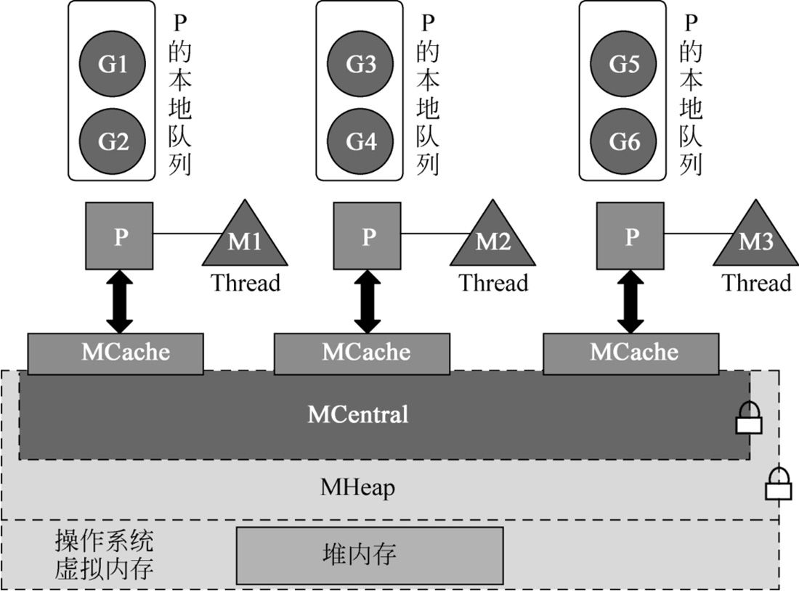

#### 核心概念与单位

Go 延续并细化了 TCMalloc 的 Page、Span 等概念。

1. **Page (页)**:与 TCMalloc 的 Page 一致。Go 与虚拟内存交互的最小单位,固定为 **8KB**。
2. **mSpan**:与 TCMalloc 中的 Span 一致。内存管理的基本单元,由一组**连续的 Page** 组成。
3. **Object (对象)**:
    * **定义**:mSpan 初始化时会被切割成多个 Object。它是内存分配给应用的最终基本单元。
    * **关系**:NumOfObject = mSpanSize / ObjectSize。
      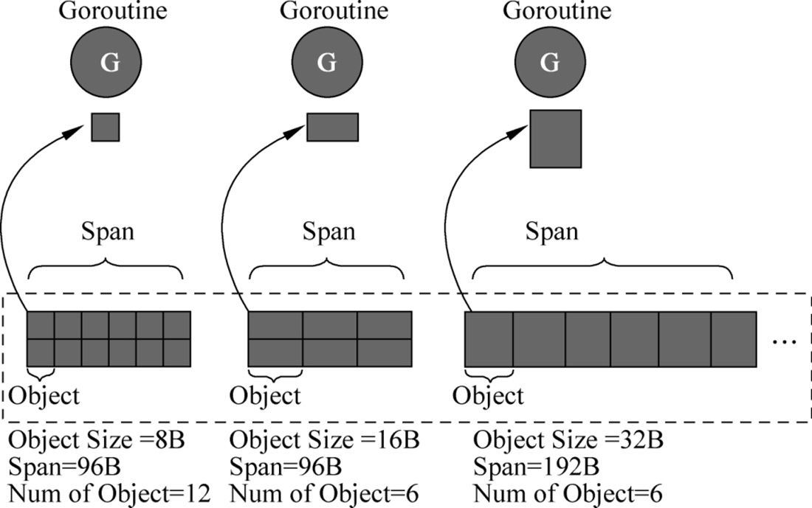
4. **Size Class**:Object 大小的级别(如等级 1 对应 8B,等级 2 对应 16B ...)。
5. **Span Class (Go 额外定义)**:
    * 每个 Size Class 对应两个 Span Class。
      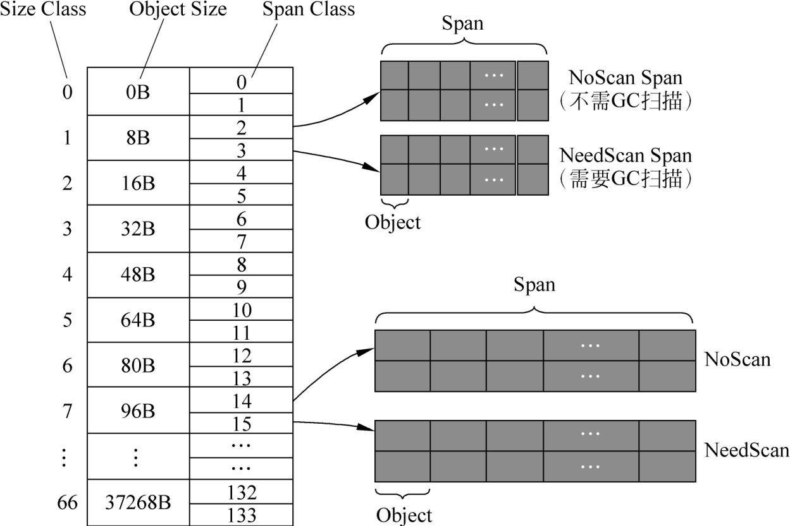
    * **scan**:存放包含指针的对象(GC 需扫描)。
    * **noscan**:存放不含指针的对象(GC 无需扫描,提速)。
    * **计算公式**:`SpanClass = SizeClass << 1 | (noscan ? 1 : 0)`。
6. **Size Class 明细 (66个级别)**:
   Go 固定划分了 66 种规格。其中 **Max Waste (最大浪费比)** 的计算是优化的关键。
    * **浪费来源**:Object 尺寸对齐产生的浪费 + mSpan 末尾无法整除产生的浪费(tail waste)。

Todo

#### MCache (本地缓存)

* **绑定关系**:与 TCMalloc 绑定线程不同,Go 的 MCache 与 **P (Processor)** 绑定。
  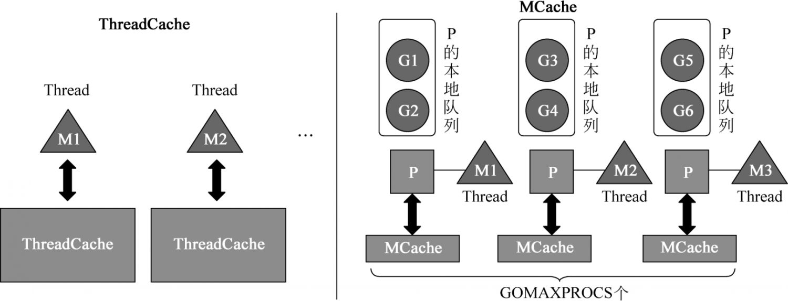
* **无锁分配**:同一时间一个 P 只运行一个 M,因此 Goroutine 在 MCache 申请内存**无须加锁**。
* **内部构造**:包含 134 个 Span Class 对应的 mSpan 指针(67个级别 2)。
  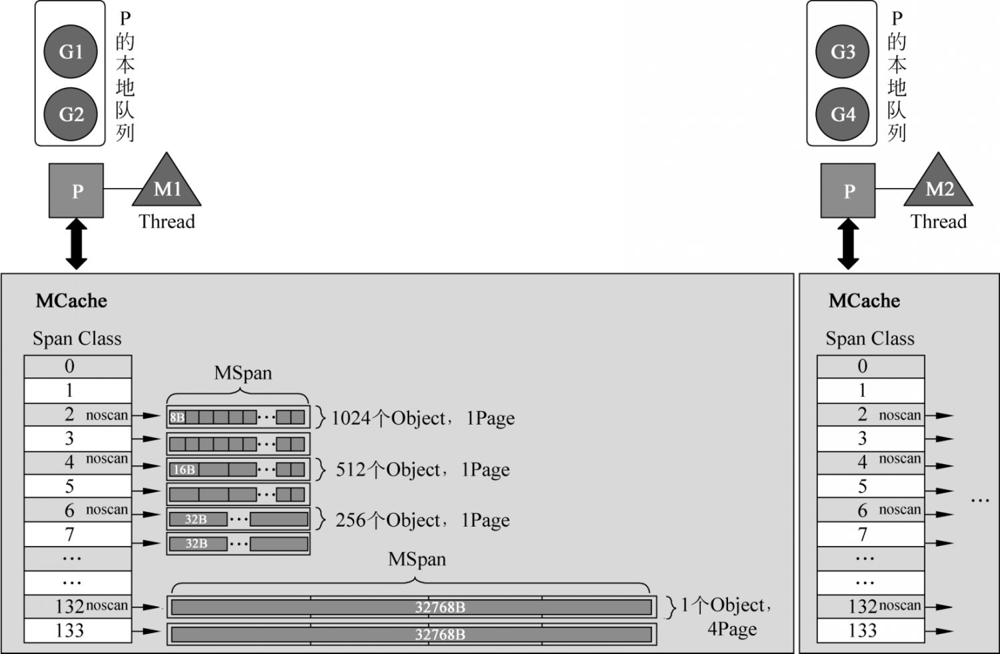
* **ZeroBase**:申请 0 字节内存(如 `struct{}`)时,Go 直接返回 `zerobase` 地址,不走正常分配逻辑。
   ~~~go
   package test
   
   import (
       "fmt"
       "testing"
   )
   
   func TestZeroMalloc(t *testing.T) {
       var (
           a struct{}
           b [0]int
           c [100]struct{}
           d = make([]struct{}, 100)
       )
       fmt.Printf("%p\n", &a)
       fmt.Printf("%p\n", &b)
       fmt.Printf("%p\n", &c[10])
       fmt.Printf("%p\n", &(d[10]))
   }
   ~~~
   ~~~shell
   === RUN   TestZeroMalloc
   0x7ff6b59c7740
   0x7ff6b59c7740
   0x7ff6b59c7740
   0x7ff6b59c7740
   --- PASS: TestZeroMalloc (0.00s)
   PASS
   ~~~

#### MCentral (中心缓存)

* **地位**:所有 P 共享,访问需**加锁**。
* **内存交换单位**:
  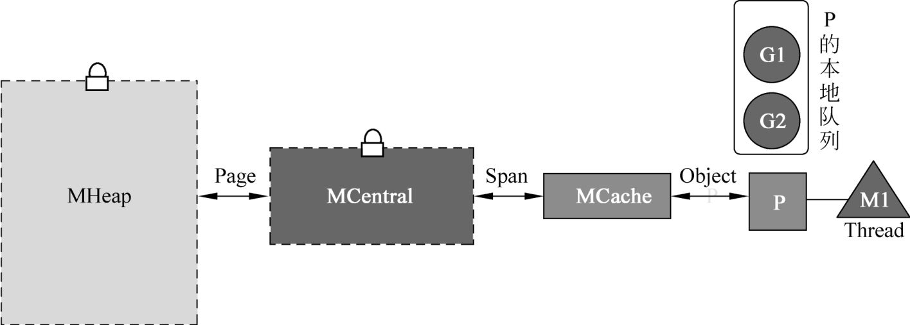
    * 与协程层交换 **Object**。
    * 与 MCache 交换 **mSpan**。
    * 与 MHeap 交换 **Page**。

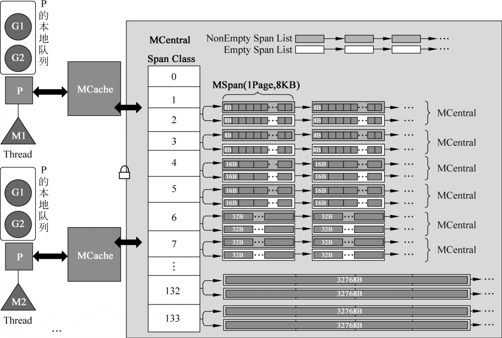

* **内部构造**:每个 Span Class 对应一个 MCentral。
* **NonEmpty (Partial Set)**:有空闲 Object 的 mSpan 集合。
* **Empty (Full Set)**:无空闲 Object 的 mSpan 集合。

#### MHeap (全局堆)

* **地位**:进程全局唯一,访问需**加锁**。
* **管理单位**:**HeapArena**(每个 64MB)。包含 `bitmap`(记录内存使用及 GC 标记情况)和 `ArenaHint`。

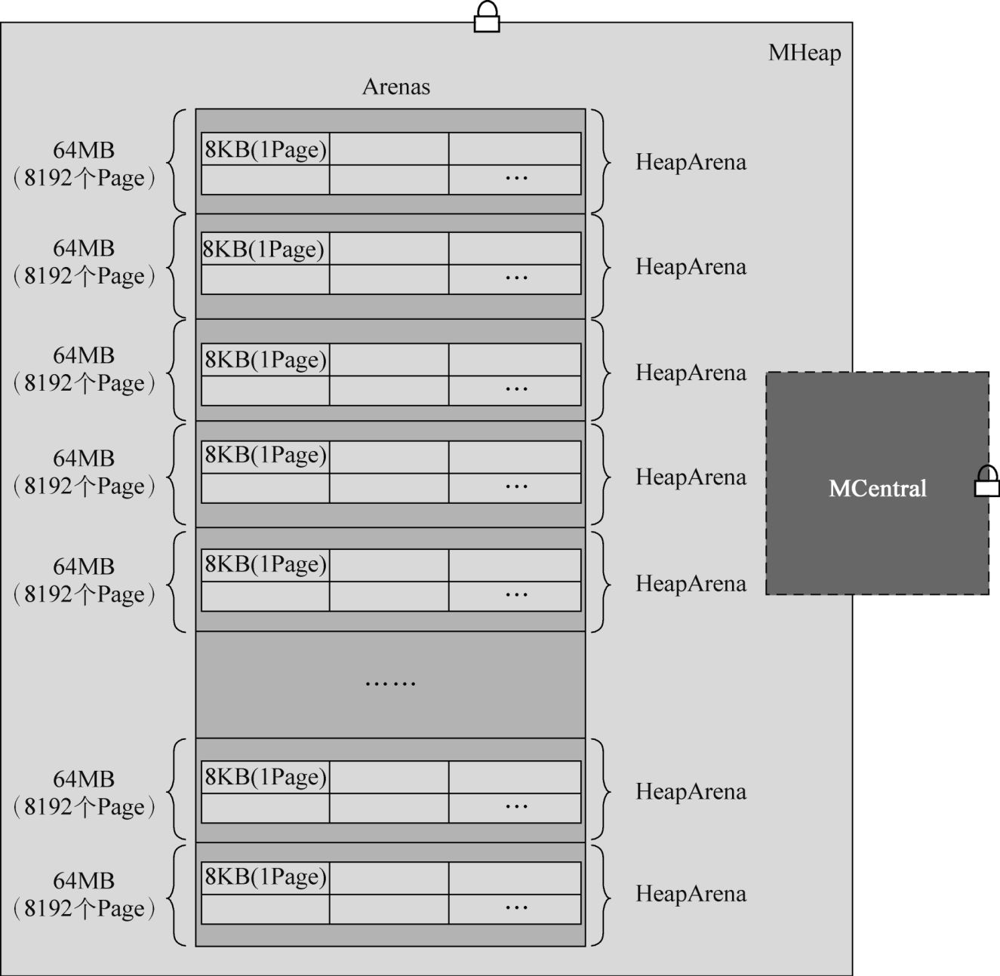
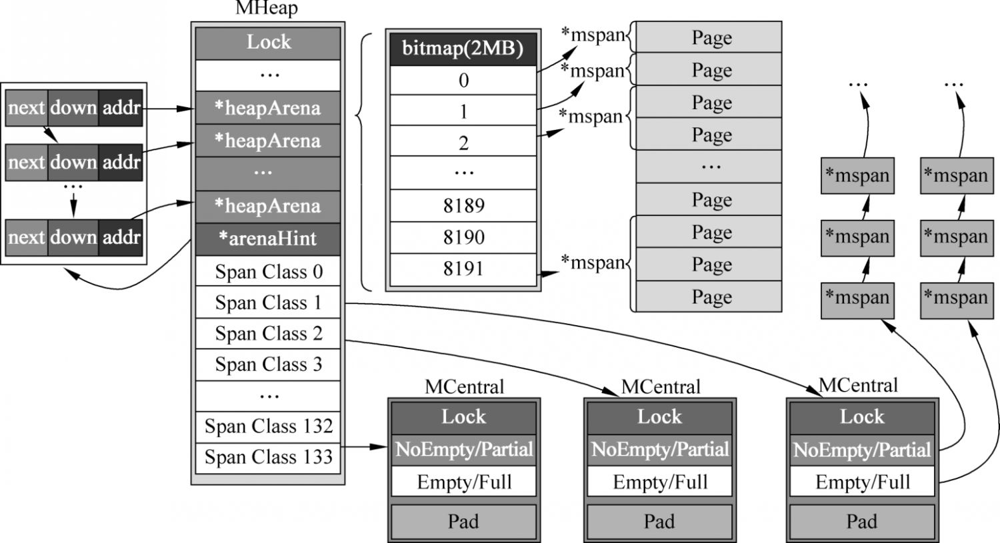

#### 对象分配流程

##### Tiny 微小对象分配流程 ( ≤ 16B )

为了解决极小对象(如 `bool`)频繁申请导致的浪费,Go 引入了 Tiny 分配器。

* **机制**:从 Size Class 2 中取一个 16B 的 Object 作为 Tiny 缓冲区。
* **流程**:
    1. 判断申请是否 小于 16B,且对象不包含指针 **noscan**。
    2. 若 Tiny 空间不足,向 MCache 申请新的 16B Object 置于 Tiny 缓冲区中。
    3. 按字节对齐方式将微小对象塞入 Tiny 空间。

* **收益**:相比传统对齐方式,平均节省约 **20%** 的内存。

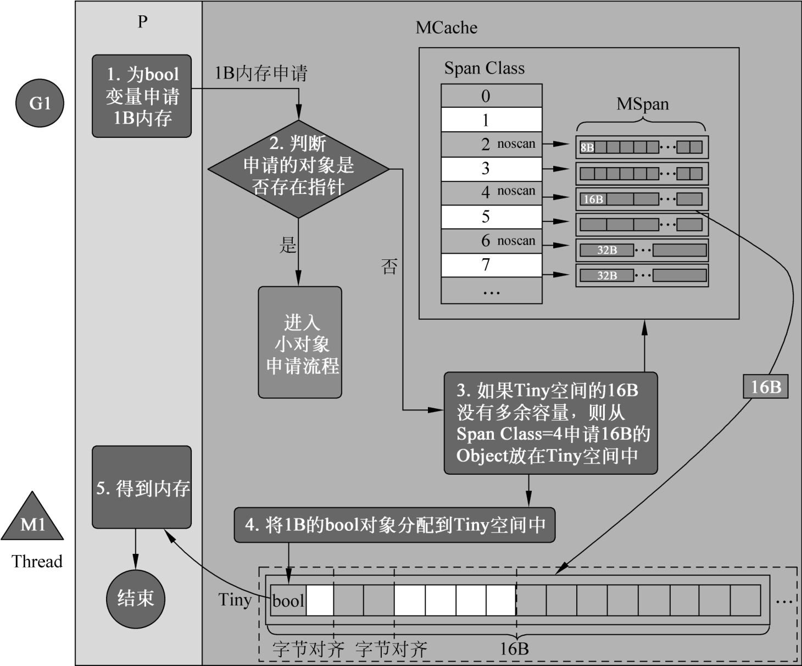

##### 小对象分配流程 ( 16B ~ 32KB )

1. 计算对象 Size,匹配对应的 Size Class。
2. 定位 Span Class(考虑是否有指针)。
3. 尝试从 MCache 提取 Object。
4. 若 MCache 耗尽,向 MCentral 申请一个 mSpan。
5. 若 MCentral 耗尽,向 MHeap 申请 Page 组成新的 mSpan。

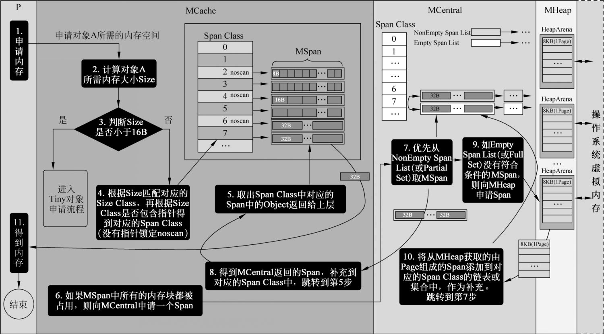

##### 大对象分配流程 ( > 32KB )

大对象不经过 MCache 和 MCentral,直接由 MHeap 分配。

1. 计算所需 Page 数量。
2. 绕过缓存,直接向 **MHeap 的 Arenas** 申请。
3. 若 Arenas 不足,向操作系统(OS)申请新的虚拟内存。

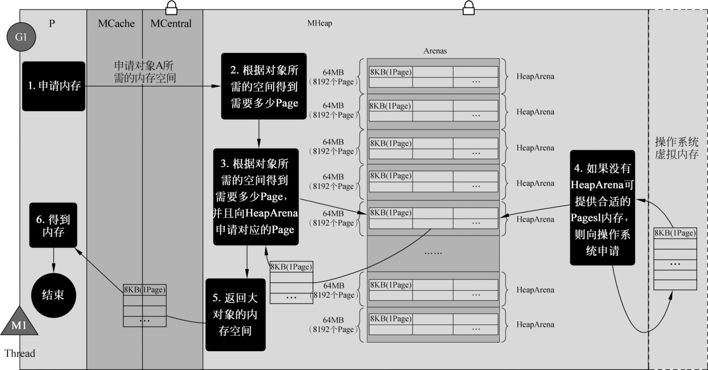

