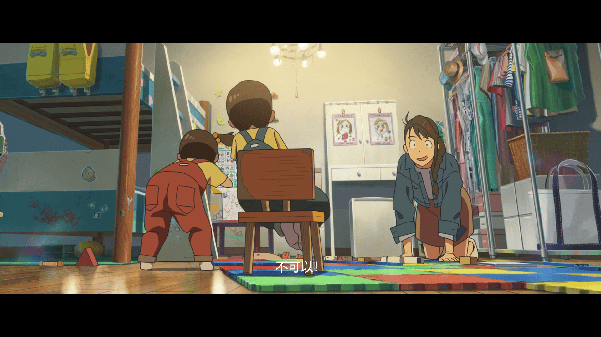
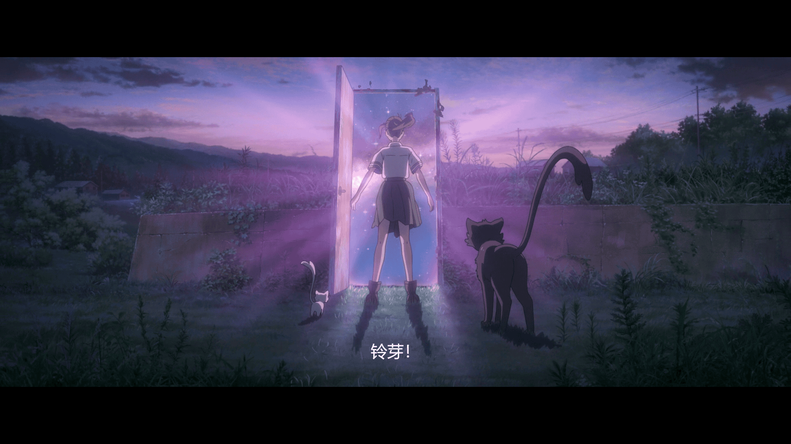

## 电影无关

虽然无关，但是还是要先放个歌

<meting-js
    server="netease"
    type="song"
    id="1984758339">
</meting-js>

上面是原曲，要vip。博客只能听个响，所以放个翻唱版本的。

<meting-js
    server="netease"
    type="song"
    id="2035813839">
</meting-js>

---

以下是无关内容

想不到时隔两天又来写博客了。今天的状态很不错，感觉慢慢地在调整回来了。
vue的大作业也是做完了，部署在了自己的云服务器上，到成绩出来再关掉。
（我估计老师大概率也不会去部署我写的东西，所以干脆给他部署一份。

下午的时候姚xh部署他的vue项目出了个问题。
vue打包文件dist，放在nginx的html后，启动nginx后，初次加载没有问题，但刷新会404。
那个老师半天没讲到重点，一直觉得是没有后端的问题。
我认为前后端分离的应用，页面的路由全部交由前端，后端只负责数据。
所以问题应该在nginx的配置和vue-router的配置。

网上搜到的解决方案:
因为通常vue项目属于单页面开发。所以只有index.html。
解决方案，将访问重定向到index.html这个页面。交由 index.html 去处理对应的路由跳转就好。
[解决 nginx部署vue刷新、访问路由页面404](https://blog.csdn.net/qq_43059674/article/details/110296807)

好，解决完问题。下面是电影时间！

## 电影有关！

新海诚的电影画风我是真喜欢，看的第一部是你的名字还是秒五已经不记得了。
只记得后面去他以前的作品，云之彼端，秒五。秒五应该看了有三遍，平淡或许感触才深吧。

下面是图片

铃芽：让我也坐坐！
草太：不可以！

“这就是我的结束吗？”

铃芽：草太，我能踩在你上面吗？
草太：不要先斩后奏！

“我应该怎么说呢.…无论你现在多么痛彻心扉，这都是成长的必经之路，所以，你不用担心，未来充满着希望，你会遇见自己喜欢的人，也会遇到你喜欢你的人。”
“虽然现在你觉得世界一片黑暗，但是黎明的曙光Q终会到来，你会在阳光之下Q长大成人，我很肯定，未来一定会是这样的，因为那已经是注定好的事了。”
“姐姐...你是谁。”
“我啊...我就是，你的明天。”
“呼...其实呀，我在以前，就已经有了最重要的东西了。”
”我要出发了...！”

